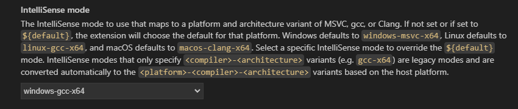

# 1. 下载安装MinGW

这是因为我们需要c++的编译器，如果使用的是vscode，这个软件是一个编辑器，自身没有编译功能，所以我们需要在windows上面安装一个编译器，通用的就是MinGW

参考的文章地址：https://blog.csdn.net/u012294613/article/details/126525424  和 https://zhuanlan.zhihu.com/p/76613134  建议和这两篇文章一起看

下载地址：https://sourceforge.net/projects/mingw-w64/files/mingw-w64/


下载完毕使用管理员身份运行

接下来选择下面的选项，这个是我自己的选项：


个人到这一步由于网络原因可能会卡，可以下载完整的包


之后解压，放到自己的安装目录中


设置环境变量


之后就可以在命令行验证是否成功


# 2. 配置vscode

安装扩展





配置完成后，此时在侧边栏可以发现多了一个.vscode文件夹，并且里面有一个c_cpp_properties.json文件，内容如下，说明上述配置成功。

```json
{
    "configurations": [
        {
            "name": "Win32",
            "includePath": [
                "${workspaceFolder}/**"
            ],
            "defines": [
                "_DEBUG",
                "UNICODE",
                "_UNICODE"
            ],
            //这里是编译器的路径
            "compilerPath": "D:/MinGW/mingw64/bin/g++.exe", 
            "cStandard": "c17",
            "cppStandard": "gnu++14",
            "intelliSenseMode": "windows-gcc-x64"
        }
    ],
    "version": 4
}
```

这个时候运行自己写的cpp文件会发现出现exe文件，位置需要控制一下。所以按照接下来的步骤做：

接下来，创建一个tasks.json文件来告诉VS Code如何构建（编译）程序。该任务将调用g++编译器基于源代码创建可执行文件。 按快捷键Ctrl+Shift+P调出命令面板，输入tasks，选择“Tasks:Configure Default Build Task”：


再选择“C/C++: g++.exe build active file”：


此时会出现一个名为tasks.json的配置文件，内容如下：

```json
{
    // See https://go.microsoft.com/fwlink/?LinkId=733558 
    // for the documentation about the tasks.json format
    "version": "2.0.0",
    "tasks": [
        {
            "type": "shell",
            "label": "g++.exe build active file",//任务的名字，就是刚才在命令面板中选择的时候所看到的，可以自己设置
            "command": "D:/mingw-w64/x86_64-8.1.0-win32-seh-rt_v6-rev0/mingw64/bin/g++.exe",
            "args": [//编译时候的参数
                "-g",//添加gdb调试选项
                "${file}",
                "-o",//指定生成可执行文件的名称
                "${fileDirname}\\${fileBasenameNoExtension}.exe"
            ],
            "options": {
                "cwd": "D:/mingw-w64/x86_64-8.1.0-win32-seh-rt_v6-rev0/mingw64/bin"
            },
            "problemMatcher": [
                "$gcc"
            ],
            "group": {
                "kind": "build",
                "isDefault": true//表示快捷键Ctrl+Shift+B可以运行该任务
            }
        }
    ]
}
```

针对于刚才所说的exe文件我们该怎么做呢？我想把他放到fileEe文件夹下，所以我把

"${fileDirname}\\${fileBasenameNoExtension}.exe"换成了 "${fileDirname}\\fileExe\\${fileBasenameNoExtension}.exe"


但是这是正常的run的配置，如果需要debug的话还要配置一步

这里主要是为了在.vscode文件夹中产生一个launch.json文件，用来配置调试的相关信息。点击菜单栏的*run*-->*Start Debugging*：

选择C++(GDB/LLDB)：就会出现一个文件launch.json  如果没有出现就自己创建一个在./vscode下面

可以选择将下面的内容复制过去，其中一些部分根据含义进行更改。

```json
{
    // Use IntelliSense to learn about possible attributes.
    // Hover to view descriptions of existing attributes.
    // For more information, visit: https://go.microsoft.com/fwlink/?linkid=830387
    "version": "0.2.0",
    "configurations": [

        {
            "name": "(gdb) Launch",
            "preLaunchTask": "g++.exe build active file",//调试前执行的任务，就是之前配置的tasks.json中的label字段
            "type": "cppdbg",//配置类型，只能为cppdbg
            "request": "launch",//请求配置类型，可以为launch（启动）或attach（附加）
            "program": "${fileDirname}\\${fileBasenameNoExtension}.exe",//调试程序的路径名称
            "args": [],//调试传递参数
            "stopAtEntry": false,
            "cwd": "${workspaceFolder}",
            "environment": [],
            "externalConsole": true,//true显示外置的控制台窗口，false显示内置终端
            "MIMode": "gdb",
            "miDebuggerPath": "D:\\mingw-w64\\x86_64-8.1.0-win32-seh-rt_v6-rev0\\mingw64\\bin\\gdb.exe",
            "setupCommands": [
                {
                    "description": "Enable pretty-printing for gdb",
                    "text": "-enable-pretty-printing",
                    "ignoreFailures": true
                }
            ]
        }
    ]
}
```

也可以直接点击Add Configuration按钮自己添加配置


# 3. 给出自己的常用配置

针对c_cpp_properties.json

```json
{
    "configurations": [
        {
            "name": "Win32",
            "includePath": [
                "${workspaceFolder}/**"
            ],
            "defines": [
                "_DEBUG",
                "UNICODE",
                "_UNICODE"
            ],
            "compilerPath": "D:/MinGW/mingw64/bin/g++.exe",
            "cStandard": "c17",
            "cppStandard": "gnu++14",
            "intelliSenseMode": "windows-gcc-x64"
        }
    ],
    "version": 4
}
```


对于tasks.json

```json
{
    "tasks": [
        {
            "type": "cppbuild",
            "label": "C/C++: g++.exe build active file",
            "command": "D:/MinGW/mingw64/bin/g++.exe",
            "args": [
                "-fdiagnostics-color=always",
                "-g",
                "${file}",
                "-o",
                "${fileDirname}\\fileExe\\${fileBasenameNoExtension}.exe"
            ],
            "options": {
                "cwd": "D:/MinGW/mingw64/bin"
            },
            "problemMatcher": [
                "$gcc"
            ],
            "group": {
                "kind": "build",
                "isDefault": true
            },
            "detail": "Task generated by Debugger."
        }
    ],
    "version": "2.0.0"
}
```

对于launch.json 对于这一部分，最好直接点击按钮添加就好了，直接添加gdb launch就行了

```json
{
    "configurations": [
        {
            "name": "(gdb) Launch",
            "type": "cppdbg",
            "request": "launch",
            "program": "enter program name, for example ${workspaceFolder}/a.exe",
            "args": [],
            "stopAtEntry": false,
            "cwd": "${fileDirname}",
            "environment": [],
            "externalConsole": false,
            "MIMode": "gdb",
            "miDebuggerPath": "/path/to/gdb",
            "setupCommands": [
                {
                    "description": "Enable pretty-printing for gdb",
                    "text": "-enable-pretty-printing",
                    "ignoreFailures": true
                },
                {
                    "description": "Set Disassembly Flavor to Intel",
                    "text": "-gdb-set disassembly-flavor intel",
                    "ignoreFailures": true
                }
            ]
        }      
        

    ]
}
```

