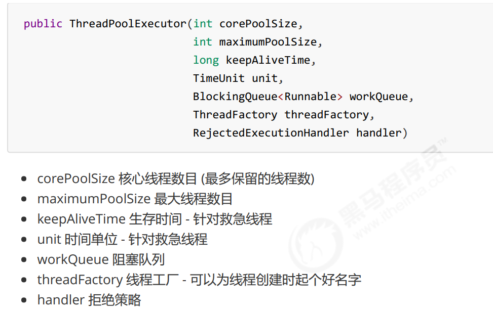

# 一、创建线程对象及常用方法

## 1. 创建线程

### 1.1 继承Thread

```java
// 创建线程对象,可以指定名字，也可以不指定
Thread t = new Thread("name") {
public void run() {
// 要执行的任务
}
};
// 启动线程
t.start();
```

上面是使用了匿名内部类的形式，可以不指定线程名称的。当然也可以继承Thread类来实现线程的创建。

### 1.2 实现runnable接口

```java
Runnable runnable = new Runnable() {
public void run(){
// 要执行的任务
}
};
// 创建线程对象
Thread t = new Thread( runnable );
// 启动线程
t.start();
```

上面使用了接口的形式，runnable接口。注意无法使用callable接口，后面这个接口是给线程池使用的，用thread是无法实现的。

runnable接口本身不会返回值，并且无法被外界捕获异常。但是callable接口都可以。

### 1.3 FutureTask 配合 Thread  

注意，有一个类叫做FutureTask  ，他是可以实现将callable接口传入到FutureTask  类中，然后这个FutureTask  传给thread，那么thread就可以执行了。在FutureTask  内部，是将runnable接口转化为了callable接口进行执行的，当thread调用run方法的时候就会执行FutureTask  内部的run方法，但这个方法内部就是callable接口的call方法。下面是一种实现例子。其实还可以通过Future来进行接受，不过这个时候形式和下面的不一样。直接接收thread返回的值就行了。

```java
// 创建任务对象
FutureTask<Integer> task3 = new FutureTask<>(() -> {
log.debug("hello");
return 100;
});
// 参数1 是任务对象; 参数2 是线程名字，推荐
new Thread(task3, "t3").start();
// 主线程阻塞，同步等待 task 执行完毕的结果
Integer result = task3.get();
log.debug("结果是:{}", result);


```

## 2.  sleep 与 yield  

```
sleep
1. 调用 sleep 会让当前线程从 Running 进入 Timed Waiting 状态（阻塞）
2. 其它线程可以使用 interrupt 方法打断正在睡眠的线程，这时 sleep 方法会抛出 InterruptedException
3. 睡眠结束后的线程未必会立刻得到执行
4. 建议用 TimeUnit 的 sleep 代替 Thread 的 sleep 来获得更好的可读性
yield
1. 调用 yield 会让当前线程从 Running 进入 Runnable 就绪状态，然后调度执行其它线程
2. 具体的实现依赖于操作系统的任务调度器
```

## 3. 线程的join方法

```
1. 这个方法本身是阻塞的，需要等待线程返回结果或者说是运行完毕才能让主线程继续运行下去。
2. 如果有两个线程t1和t2，t1休眠1秒，t2休眠2秒，那么如果同时t1先join，t2后join，当前面的运行完，后面的只需要在休眠一秒就可以。如果二者的join顺序互换，那么当t2运行完，t1是可以立马返回的。因为线程是并行的，是不会妨碍彼此的。
3. join可以指定等待的时间，如果指定需要5s，但是线程t1只用了1s执行完，那么也会立即返回，不会真正的等5s.线程执行结束会导致 join 结束

```

## 4. 常见方法


## 5. 两阶段暂停

后面会有更优秀的实现

```java
public class TwoStageStop {
    public static void main(String[] args) {
        TwoStage t1 = new TwoStage();
        t1.start();
        try {
            Thread.sleep(4500);
            t1.stop();
        } catch (InterruptedException e) {
            throw new RuntimeException(e);
        }

    }
}
class TwoStage {
    private Thread mintorThread;

    public void start(){
        mintorThread = new Thread(()->{
            while (true) {
                Thread cur = Thread.currentThread();
                if (cur.isInterrupted()) {
                    System.out.println("料理后世");
                    break;
                }
                try {
                    Thread.sleep(1000);
                    System.out.println("正在运行！");
                } catch (InterruptedException e) {
                    e.printStackTrace();
                    cur.interrupt();//重置打断标记，因为在睡眠途中被打断会清除打断标记
                }

            }
        },"two");
        mintorThread.start();
    }
    public void stop(){
        mintorThread.interrupt();
    }
}

```

## 6. 守护线程和非守护线程

默认情况下，Java 进程需要等待所有线程都运行结束，才会结束。有一种特殊的线程叫做守护线程，只要其它非守护线程运行结束了，即使守护线程的代码没有执行完，也会强制结束  。

```
log.debug("开始运行...");
Thread t1 = new Thread(() -> {
log.debug("开始运行...");
sleep(2);
log.debug("运行结束...");
}, "daemon");
// 设置该线程为守护线程
t1.setDaemon(true);
t1.start();
sleep(1);
log.debug("运行结束...");
```

运行结果

```
08:26:38.123 [main] c.TestDaemon - 开始运行...
08:26:38.213 [daemon] c.TestDaemon - 开始运行...
08:26:39.215 [main] c.TestDaemon - 运行结束...
```

```
1. 垃圾回收器线程就是一种守护线程
2. Tomcat 中的 Acceptor 和 Poller 线程都是守护线程，所以 Tomcat 接收到 shutdown 命令后，不会等
待它们处理完当前请求
```

# 二、共享模型之管程  


其实管程一般就是指代用synchronized  来实现的。

```
1. 成员变量和静态变量是否线程安全？
    如果它们没有共享，则线程安全
    如果它们被共享了，根据它们的状态是否能够改变，又分两种情况：
        如果只有读操作，则线程安全
        如果有读写操作，则这段代码是临界区，需要考虑线程安全
2. 局部变量是否线程安全？
    局部变量是线程安全的
    但局部变量引用的对象则未必：
        如果该对象没有逃离方法的作用访问，它是线程安全的
        如果该对象逃离方法的作用范围，需要考虑线程安全
```


## 1. 常见线程安全类  


这里说它们是线程安全的是指，多个线程调用它们同一个实例的某个方法时，是线程安全的。  它们的每个方法是原子的，但**注意**它们多个方法的组合不是原子的

## 2. Monitor 原理  

synchronized  关键字会用到Monitor 

每个 Java 对象都可以关联一个 Monitor 对象，如果使用 synchronized 给对象上锁（重量级）之后，该对象头的Mark Word 中就被设置指向 Monitor 对象的指针  


## 3. synchronized 原理进阶  

### 3.1 轻量级锁  、锁膨胀、自旋优化  、偏向锁  

这一点看我的笔记中，黑马给出的并发编程原理那个资料  。<a href="./并发编程_原理.pdf">点击这里</a>直接进入


## 4. wait notify   / park unpark


# 三、共享模型之内存  

## 1. volatile  

保证可见性和有序性，但是无法保证原子性（指令交错，也就是线程之间转换导致的指令交错）

1. 写屏障（sfence）保证在该屏障之前的，对共享变量的改动，都同步到主存当中  
2. 而读屏障（lfence）保证在该屏障之后，对共享变量的读取，加载的是主存中最新数据  

## 2. happens-before  规则

<a href="./并发编程.pdf">点击这里</a>直接进入

## 3. 单例模式的实现方式总结


<a href="./并发编程.pdf">点击这里</a>直接进入

# 四、共享模型之无锁  


## 1. CAS

## 2. 原子整数

```
AtomicBoolean
AtomicInteger
AtomicLong
```


## 3. 原子引用  

```
AtomicReference 
AtomicMarkableReference 有一个标记标着这是否更改过
AtomicStampedReference  有标记记着更改了多少次
```

## 4. 原子数组

```
AtomicIntegerArray
AtomicLongArray
AtomicReferenceArray

```

## 5. 字段更新器  

```
AtomicReferenceFieldUpdater // 域 字段
AtomicIntegerFieldUpdater
AtomicLongFieldUpdater
```

利用字段更新器，可以针对对象的某个域（Field）进行原子操作，只能配合 volatile 修饰的字段使用，否则会出现异常  

## 6. 原子累加器

可以了解伪共享  

```
LongAdder

```

## 7、 Unsafe

这个可以直接操作底层，用C++写的本地方法库。

Unsafe 对象提供了非常底层的，操作内存、线程的方法，Unsafe 对象不能直接调用，只能通过反射获得  

```java
public class UnsafeAccessor {
    static Unsafe unsafe;
    static {
        try {
            Field theUnsafe = Unsafe.class.getDeclaredField("theUnsafe");
            theUnsafe.setAccessible(true);
            unsafe = (Unsafe) theUnsafe.get(null);
        } catch (NoSuchFieldException | IllegalAccessException e) {
        	throw new Error(e);
    	}
    }
    static Unsafe getUnsafe() {
    	return unsafe;
    }
}
```

一般真正使用还需要通过获取成员变量的偏移量来使用。

举个例子

```java
@Data
class Student {
    volatile int id;
    volatile String name;
}


Unsafe unsafe = UnsafeAccessor.getUnsafe();
Field id = Student.class.getDeclaredField("id");
Field name = Student.class.getDeclaredField("name");
// 获得成员变量的偏移量
long idOffset = UnsafeAccessor.unsafe.objectFieldOffset(id);
long nameOffset = UnsafeAccessor.unsafe.objectFieldOffset(name);
Student student = new Student();
// 使用 cas 方法替换成员变量的值
UnsafeAccessor.unsafe.compareAndSwapInt(student, idOffset, 0, 20); // 返回 true
UnsafeAccessor.unsafe.compareAndSwapObject(student, nameOffset, null, "张三"); // 返回 true
System.out.println(student);
```

# 五、共享模型之不可变  

主要是对于一些包装类本身，string就是final修饰的。

# 六、 线程池（重点）

可以自己查看<a href="./并发编程.pdf">点击这里</a>直接进入

## 1. ThreadPoolExecutor  


使用的构造方法




## 2. jdk提供几个写好线程池实现

需要借助Executors创建下面指出的线程池。比如 `Executors.newFixedThreadPool`

### 2.1  newFixedThreadPool  

  


### 2.2 newCachedThreadPool  


### 2.3  newSingleThreadExecutor  


## 3. 调度线程池

简单来说就是在固定的时间调度线程池


## 4. Tomcat 线程池  

内部有一些配置，应该可以更改自身的一些属性，包括线程的数量等。具体的细节直接点击进入了解

<a href="./并发编程.pdf">点击这里</a>直接进入


## 5。 并行计算，使用Fork/Join  

提交给 Fork/Join 线程池的任务需要继承 RecursiveTask（有返回值）或 RecursiveAction（没有返回值）  

具体的例子<a href="./并发编程.pdf">点击这里</a>直接进入

# 七、 JUC

## 1. ReentrantLock  


## 2. 读写锁

### 2.1 ReentrantReadWriteLock  

对于读读来说可以并发，读写写是互斥的。

```
1. 读锁不支持条件变量
2. 重入时升级不支持：即持有读锁的情况下去获取写锁，会导致获取写锁永久等待
3. 重入时降级支持：即持有写锁的情况下去获取读锁是可以的
```


### 2.2  StampedLock  

这个是进一步提升性能给出的一个锁，。主要是通过一个戳来进行解锁。不支持条件变量，不支持可重入。

乐观读，StampedLock 支持 tryOptimisticRead() 方法（乐观读），读取完毕后需要做一次 戳校验 如果校验通过，表示这期间确实没有写操作，数据可以安全使用，如果校验没通过，需要重新获取读锁，保证数据安全。  

他是先通过一个tryOptimisticRead进行一次读，当后面发现这个戳被更改了，那么就会加锁（读锁或者写锁），这个时候其他线程就没有办法进行更改了，可以放心读了，具体的工作过程，可以看例子，具体的例子<a href="./并发编程.pdf">点击这里</a>直接进入

## 3. Semaphore  （信号量）

控制访问共享资源的线程上限

仅仅只需要通过`acquire  `和`release  `进行控制就可以了。

## 4. CountdownLatch  

用来进行线程同步协作，等待所有线程完成倒计时  


## 5. CyclicBarrier  

这个只要是和CountdownLatch  进行对比的。

循环栅栏，用来进行线程协作，等待线程满足某个计数。构造时设置『计数个数』，每个线程执行到某个需要“同步”的时刻调用 await() 方法进行等待，当等待的线程数满足『计数个数』时，继续执行  。

## 6. 线程安全集合类


常见的三种

### 6.1. ConcurrentHashMap  

这个太常见了，可以自己<a href="./并发编程.pdf">点击这里</a>直接进入

### 6.2. LinkedBlockingQueue

本身这个类有一个兄弟实现，**ArrayBlockingQueue  **


###   

### 6.3. ConcurrentLinkedQueue  


