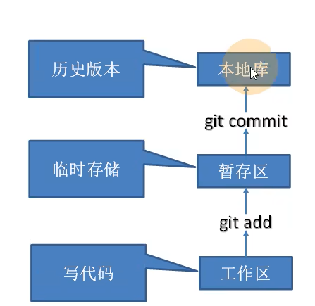
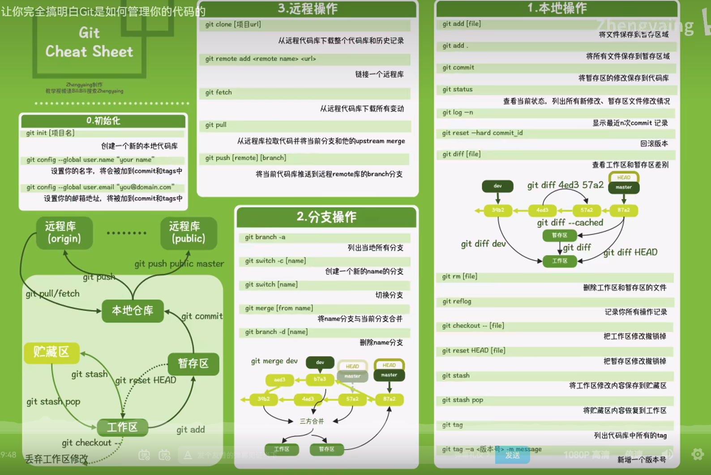
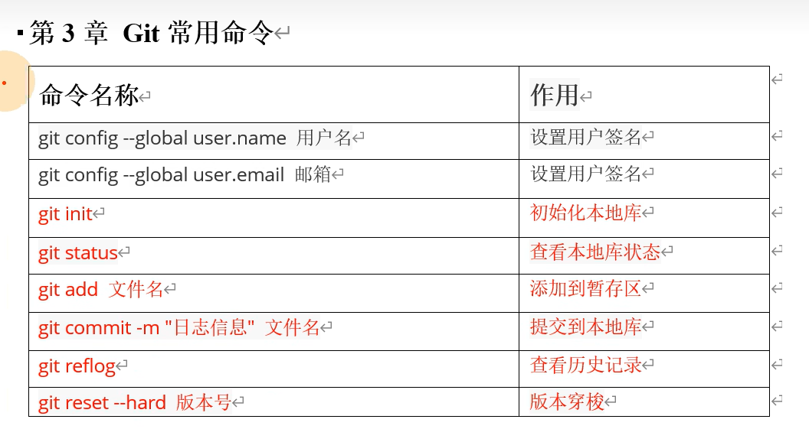
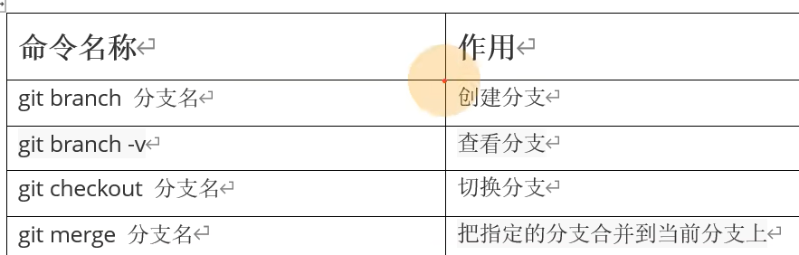
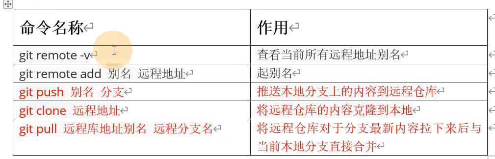
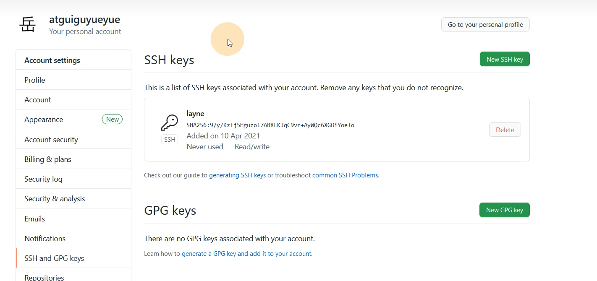

# Git学习笔记  

> ## git 有工作区、暂存区、本地库
> 
> 

> ## git 常用命令
>
> 想要在**暂存区**删除某些文件，使用下面的命令
> ``` git rm --cached 文件名```

 > ## git查看历史版本
 > ```git reflog```
 > ## 查看版本更为具体的信息,会显示作者名·邮箱等
 > ```git log```

 > ## 版本穿梭
 > 1. 通过```git reflog``` 查看每一版的版本号，将版本号复制下来
 > 2. 通过```git reset --hard 版本号```穿梭到想要的版本


> ## 分支常用的命令
> 
> * **删除分支**，使用   ` git branch --delete 分支名` 

> * ### **合并分支** ,假设有1分支和2分支，将2分支合并到1分支，
> 1. *正常合并*， 先将git目录转移1分支，然后使用`git merge 分支2`
> 2. *异常合并*, 继续使用正常合并的代码，但是会产生报错，但是错误的信息会告诉，此刻要进入产生冲突的代码文件内进行手动编写代码，之后重新执行相关的命令，注意commit命令不要带有文件名，带有文件名会报错，只能用`git commit -m '信息 '`，注意，合并是合并到master分支 

-----
> ## 对远程仓库进行操作
> 

## ssh连接仓库，需要使用非对称加密
在git bash中使用下面的代码进行相关的ssh连接
1. `ssh -keygen -t rsa -C 邮箱号`
t指定加密协议为rsa
C描述该ssh连接针对的邮箱账号
2. 来到**C/用户/asus/.shh**文件夹
3. `.pub`是公钥，id_rsa是私钥。打开公钥，加内容复制到相关的账号里面（在账号的设置-SSH and GPG），点击添加公钥（界面如下）

4. 使用ssh相关的地址，继续用git pull 地址 master 进行拉取代码。（个人感觉没有必要使用ssh连接）
----
## 使用IDEA集成Git
1. 注意配置忽略文件（.ignore） **对于该部分内容，一定要搜寻网络怎么配置，这里不作赘述**，然后在git。config中引用这个.ignore文件，引用格式要上网搜索。
2. 将IDEA和git连接起来

3. 上面是通过一次设置，以后就不用配置，但是我们也可以通过每个项目都直接加入一个文件来进行忽略文件，直接新建一个.gitignore文件，然后将相关的忽略代码写进去就行。（**注意，这中配置方式之对于当前的项目有效，并且一定要在第一次push前进行设置，否则就不再有效了**）
[相关具体介绍点击这里](https://cloud.tencent.com/developer/article/1831680)

## 公司一般会用gitlab
具体建立gitlab需要上网自查即可


# 三部曲

```
1. git add .
2. git commit -m "备注"
3. git push origin master
```

更换仓库地址

```
1、git remote rm origin（删除远程地址）

2、git remote add origin [url]（‘[]’内为新的git仓库地址，真实写命令时不要带中括号‘[]’）

更直接的
git remote set-url origin [url]
```

