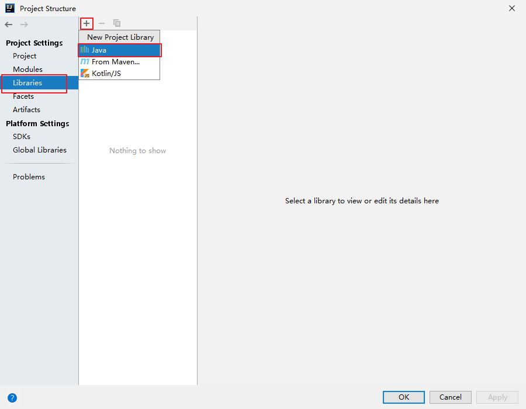
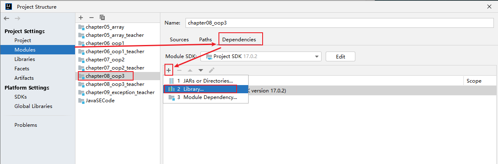
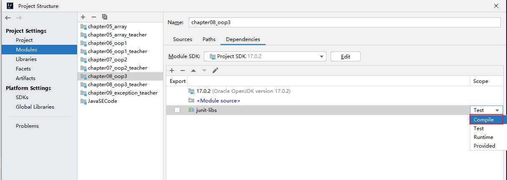

# 语法

> 1. 在java原文件当中最多只能有一个public类，并且该类的名称要与**源文件**一致。

## 注释


- **具体使用：文档注释（Java特有）**

  - 文档注释内容可以被JDK提供的工具 javadoc 所解析，生成一套以网页文件形式体现的该程序的说明文档。

  - 操作方式。比如：

    ```
    javadoc -d mydoc -author -version HelloWorld.java
    
    
    ```
    
    

## 数据类型


## 命名规范


**注意** ：long类型声明赋值的时候一定末尾带有L，对于float类型要带有f。开发过程中会发现float类型精度不高，这个时候要使用BigDecimal类来进行计算  

在**char**类型中可以将数字与符号互通，就像c语言的ascll值一样，但是注意需要用`\u`*(unicode编码格式)*来进行转义，当然也可以使用转移符号`\`

**注意** 逻辑&和短路&&表示的含义不一样

```
语句1&语句2 #当语句1为false时，语句2也会执行；
语句1&&语句2 #当语句1为false时，语句2不会执行；

```

# 面向对象编程


## 成员变量与局部变量


### 成员变量与局部变量的不同


**类中存在属性（变量，全局变量）和方法**；很容易根据以前学习过的内容理解

> 除了固定的重载方法之外，和python一样还有可变个数形参的方法定义
>
> 例如： public void test(int ... nums){}
>
> 这个方法就定义了可变个数的方法 ，但是这种定义与下面的方法定义是相同的
>
> public void test(int[] nums){}
>
> **两种方法都是直接将nums看作数组**
>
> 注意：当定义 public void test(int i, int ... nums){}
>
> **这里要求nums必须放在最后，而且nums在一个函数定义中只能出现一次**

 ## 封装性

主要使用四种修饰符：**private、protected、public、缺省**


**注意** 类只有public和缺省修饰，类内的成员才可以使用四种修饰符

### 构造器

> 定义构造器的格式：
>
> ``` 权限修饰符 类名(形参列表){}```
>
> 定义有参构造器之后，系统的空参构造器将会无效
>
> **可以使用this(形参列表)表示构造器调用，并且要放在首行**
>
> 

## 继承性

**关键字**extends

1. 子类 虽然继承了父类的属性和方法，但是并没有打破封装性。

2. 单继承性，可以多层继承

   ### 方法重写

   1. 父类被重写的方法与子类重写的方法的方法名和形参列表要相同

   2. 子类重写的方法 权限修饰符要不小于父类被重写的方法权限修饰符；**子类无法重写父类中private的方法**

      针对返回值有要求 ：

      > 1. 父类的方法返回值是void，那么子类方法应该保持void
      > 2. 父类的返回值是基本数据类型，子类也必须保持与父类相同
      > 3. 父类的返回值是引用数据类型（比如：类），子类方法返回值可以保持相同或者是子类。

      针对与子类重写方法抛出异常的规定：

      > 子类重写方法抛出的异常应该是父类被重写方法抛出异常的子类或者相同

      ### 关于super与this

      

## 多态

多态性适用于方法，不适用于属性

person pr = new man();

pr.eat（）；

假如person有eat方法，在man类中有eat和sleep方法，在编译时pr是person类型，执行时当作man类型；但是无法调用sleep方法，可以调用eat（）方法，因为这个方法是重写的。多态性调用方法时，只能调用父类和子类共有的方法。但是在内存中是存在着sleep方法的。

**向下转型：**

> 使用关键词**instanceof**

**object类**

> 这个类是所有类的根类
>
> 我们重点掌握这个类的内部方法
>
> 1. **重点方法**：equals、toString
> 2. clone（）、finalize
> 3. 目前不需要关注：grtClass（）/hashCode()/ notify()/ notifyAll()/ wait()/ wait(x)/ wait(x,y)

**equals（）方法**

> 只能使用在引用数据类型；**还要了解equals的内部源码，尤其是他们的写法**
>
>  

**toString方法**

> 原始的方法是返回地址，后面需要根据自己的需求在新的类中重写，这个方法会在输出时自动调用

**static**

> static修饰的变量在内存中只会存在一份，但是可以修改
>
> 
>
> **静态方法内可以使用静态属性和静态方法，但是无法调用实例方法和属性**

## 单例模式

> 1. 饿汉式：线程上安全，但是会有内存的占用增多 
> 2. 懒汉式：线程上是不安全的

## 代码块

> 格式 
>
> ```
> class Person{
> 	static{
> 		//静态代码块
> 	}
> 	{
> 		//非静态代码块
> 	}
> }
> ```
>
> 1. 静态代码块随着类的加载而执行，由于类的加载只有一次，所以静态代码块只会执行一次
>
> 2. 非静态代码块随着对象的创建而执行；对象可以有多个，所以非静态代码块可以执行很多次
>
>    **代码块的执行是早于构造器的，牢记加载时父类先加载，子类后加载**


## 关键字final

> 修饰类表明该类无法被继承，修饰方法表明该方法无法被重写 ；可以修饰成员变量和局部变量，表明无法更改变量的值
>
> final修饰成员变量，变量必须要通过显式赋值、代码块赋值、构造器赋值，三种方式中的一种然后变量就无法更改了。
>
> final修饰局部变量，必须在调用前进行赋值，赋值后就无法进行更改。


## abstract

> 1. 可以修饰类，方法。
>
> 2. 修饰方法时，该类必须为抽象类
>
> 3. 修饰方法时，格式：
>
>    ```
>    权限修饰符 abstract 返回值类型 方法名（）；//不允许有大括号和方法体，子类应该重写该方法
>    ```
>
>     
>
> 4. 子类必须重写父类中所有的抽象方法才可以实例化，否则仍是抽象类
>
> 5. abstract不能修饰私有方法、静态方法、final类、final方法

## interface接口

定义接口格式：

```
interface 名字{
	属性
	方法
}
```

类实现接口：关键词为implements

```
权限修饰符 class 类名 extends 父类  implements 接口名1，接口名2{
	//实现接口中的方法，如果不想实现，权限修饰符要为abstract(即抽象类)
}
```

1. 可以声明

   > 属性：只能使用public static final 修饰
   >
   > 方法：jdk8之前：声明抽象方法，public abstract 修饰；**jdk8可以声明静态方法、默认方法；jdk9可以声明私有方法，这些方法中允许放方法体了**
   >
   > **注意**：1. 接口中声明的静态方法只能通过接口调用，无法通过其实现类进行调用
   >
   > 			2. 默认方法关键词：default
   > 			2. 默认方法是可以通过实现类的对象进行调用的，当然实现类也可以对默认方法进行重写
   > 			2. 类实现了两个接口，两个接口都有同名同参数的默认方法，如果实现类还没有重写该方法，就会出现接口冲突，在这种情况下，实现类应该重写该默认方法
   > 			2. 子类继承了父类并且实现接口，接口和父类有同名同参数方法，子类还没有重写的情况下，父类的方法优先于接口 
   > 			2. 如果子类想要调用实现接口中的方法，比如eat方法，这个方法在接口A中有，在子类中也有，但是希望在子类中调用A中的，可以用A.super.eat();进行调用。
   > 			2. 接口中私有方法就是为了给默认方法提供的，把重复代码提炼出来放到私有方法中

2. 不可以声明

   > 构造器、代码块

3. 接口本身和类一样可以实现继承，并且可以实现多继承

   ```
   interface cc extends aa,bb{
   
   }
   ```

4. 接口本身可以实现多态，类似于类

   ```java
   interface USB{
   	void print();
   }
   class camer implements USB{
   	void print(){
   	
   	}
   }
   
   class computer{
   	void pr(USB usb){
   	
   	}
   }
   
   
   main{
   	computer co = new computer();
   	camer ca = new camer();
   	co.pr(ca);
   }
   //这就是接口的多态性，类似于类的多态性 
   格式为：接口名 变量名 = new 实现类对象；
   
   //还有一种写法，这里传入pr的参数为一个没有名字的类，该类实现了接口USB
   main{
   	computer co = new computer();
   	
   	co.pr(new USB{
           void print{
               方法体
           }
       });
   }
   
   
   ```

   

## 内部类

分类：

1. 成员内部类：直接声明在外部类的里面

    1. 静态成员内部类，用static修饰，和外部了相关联

    2. 非静态成员内部类，不使用static修饰，和对象相关联

       

       

2. 局部内部类：声明在方法、构造器、代码块里面

   	1. 匿名局部内部类
   	1. 非匿名局部内部类

## 枚举类

针对于某个类，其实例对象个数是确定的，就可以考虑从枚举类

关键词：enum，自动继承父类Enum；枚举类本身可以实现接口

### 1.enum关键字声明枚举

```java
【修饰符】 enum 枚举类名{
    常量对象列表
}

【修饰符】 enum 枚举类名{
    常量对象列表;
    
    对象的实例变量列表;
}
```

举例1：

```java
package com.atguigu.enumeration;

public enum Week {
    MONDAY,TUESDAY,WEDNESDAY,THURSDAY,FRIDAY,SATURDAY,SUNDAY;
}
```

```java
public class TestEnum {
	public static void main(String[] args) {
		Season spring = Season.SPRING;
		System.out.println(spring);
	}
}
```

举例2：

```java
public enum SeasonEnum {
    SPRING("春天","春风又绿江南岸"),
    SUMMER("夏天","映日荷花别样红"),
    AUTUMN("秋天","秋水共长天一色"),
    WINTER("冬天","窗含西岭千秋雪");

    private final String seasonName;
    private final String seasonDesc;
    
    private SeasonEnum(String seasonName, String seasonDesc) {
        this.seasonName = seasonName;
        this.seasonDesc = seasonDesc;
    }
    public String getSeasonName() {
        return seasonName;
    }
    public String getSeasonDesc() {
        return seasonDesc;
    }
}

```

###  2. enum中常用方法

```
String toString(): 默认返回的是常量名（对象名），可以继续手动重写该方法！
    
static 枚举类型[] values():返回枚举类型的对象数组。该方法可以很方便地遍历所有的枚举值，是一个静态方法
    
static 枚举类型 valueOf(String name)：可以把一个字符串转为对应的枚举类对象。要求字符串必须是枚举类对象的“名字”。如不是，会有运行时异常：IllegalArgumentException。
    
String name():得到当前枚举常量的名称。建议优先使用toString()。
    
int ordinal():返回当前枚举常量的次序号，默认从0开始
```

## annotation(注解)

使用的关键词： @interface

**元注解：对现有的注解进行解释说明的注解**


## 单元测试

### 1. 引入本地JUnit.jar

第1步：在项目中File-Project Structure中操作：添加Libraries库




其中，junit-libs包内容如下：


第2步：选择要在哪些module中应用JUnit库


第3步：检查是否应用成功


**注意Scope：选择Compile，否则编译时，无法使用JUnit。**

第4步：下次如果有新的模块要使用该libs库，这样操作即可







### 2. 条件


## 包装类


  **注意：基本数据类型转包装类，调用方法valuOf（）；包装类转基本数据类型，调用方法XXXvalue（）**

但是我们一般转换不会用上面的方法，jdk5以后有了新特性：自动装箱、自动拆箱

```
自动装箱
int k =10;
Integer in = k;//这就是自动装箱

//自动拆箱
int m = in;//这就是自动拆箱
```

## String与基本数据类型转换

、

前面的部分忘记知识点补充：三目运算符中会有自动类型提升


# IntelliJ IDEA 常用快捷键一览表

author：尚硅谷-宋红康

***

## 1-IDEA的日常快捷键

### 第1组：通用型

| 说明            | 快捷键           |
| --------------- | ---------------- |
| 复制代码-copy   | ctrl + c         |
| 粘贴-paste      | ctrl + v         |
| 剪切-cut        | ctrl + x         |
| 撤销-undo       | ctrl + z         |
| 反撤销-redo     | ctrl + shift + z |
| 保存-save all   | ctrl + s         |
| 全选-select all | ctrl + a         |

### 第2组：提高编写速度（上）

| 说明                                               | 快捷键           |
| -------------------------------------------------- | ---------------- |
| 智能提示-edit                                      | alt + enter      |
| 提示代码模板-insert live template                  | ctrl+j           |
| 使用xx块环绕-surround with ...                     | ctrl+alt+t       |
| 调出生成getter/setter/构造器等结构-generate ...    | alt+insert       |
| 自动生成返回值变量-introduce variable ...          | ctrl+alt+v       |
| 复制指定行的代码-duplicate line or selection       | ctrl+d           |
| 删除指定行的代码-delete line                       | ctrl+y           |
| 切换到下一行代码空位-start new line                | shift + enter    |
| 切换到上一行代码空位-start new line before current | ctrl +alt+ enter |
| 向上移动代码-move statement up                     | ctrl+shift+↑     |
| 向下移动代码-move statement down                   | ctrl+shift+↓     |
| 向上移动一行-move line up                          | alt+shift+↑      |
| 向下移动一行-move line down                        | alt+shift+↓      |
| 方法的形参列表提醒-parameter info                  | ctrl+p           |

### 第3组：提高编写速度（下）

| 说明                                        | 快捷键       |
| ------------------------------------------- | ------------ |
| 批量修改指定的变量名、方法名、类名等-rename | shift+f6     |
| 抽取代码重构方法-extract method ...         | ctrl+alt+m   |
| 重写父类的方法-override methods ...         | ctrl+o       |
| 实现接口的方法-implements methods ...       | ctrl+i       |
| 选中的结构的大小写的切换-toggle case        | ctrl+shift+u |
| 批量导包-optimize imports                   | ctrl+alt+o   |

### 第4组：类结构、查找和查看源码

| 说明                                                      | 快捷键                          |
| --------------------------------------------------------- | ------------------------------- |
| 如何查看源码-go to class...                               | ctrl + 选中指定的结构 或 ctrl+n |
| 显示当前类结构，支持搜索指定的方法、属性等-file structure | ctrl+f12                        |
| 退回到前一个编辑的页面-back                               | ctrl+alt+←                      |
| 进入到下一个编辑的页面-forward                            | ctrl+alt+→                      |
| 打开的类文件之间切换-select previous/next tab             | alt+←/→                         |
| 光标选中指定的类，查看继承树结构-Type Hierarchy           | ctrl+h                          |
| 查看方法文档-quick documentation                          | ctrl+q                          |
| 类的UML关系图-show uml popup                              | ctrl+alt+u                      |
| 定位某行-go to line/column                                | ctrl+g                          |
| 回溯变量或方法的来源-go to implementation(s)              | ctrl+alt+b                      |
| 折叠方法实现-collapse all                                 | ctrl+shift+ -                   |
| 展开方法实现-expand all                                   | ctrl+shift+ +                   |

### 第5组：查找、替换与关闭

| 说明                                               | 快捷键       |
| -------------------------------------------------- | ------------ |
| 查找指定的结构                                     | ctlr+f       |
| 快速查找：选中的Word快速定位到下一个-find next     | ctrl+l       |
| 查找与替换-replace                                 | ctrl+r       |
| 直接定位到当前行的首位-move caret to line start    | home         |
| 直接定位到当前行的末位 -move caret to line end     | end          |
| 查询当前元素在当前文件中的引用，然后按 F3 可以选择 | ctrl+f7      |
| 全项目搜索文本-find in path ...                    | ctrl+shift+f |
| 关闭当前窗口-close                                 | ctrl+f4      |

### 第6组：调整格式

| 说明                                         | 快捷键           |
| -------------------------------------------- | ---------------- |
| 格式化代码-reformat code                     | ctrl+alt+l       |
| 使用单行注释-comment with line comment       | ctrl + /         |
| 使用/取消多行注释-comment with block comment | ctrl + shift + / |
| 选中数行，整体往后移动-tab                   | tab              |
| 选中数行，整体往前移动-prev tab              | shift + tab      |

## 2-Debug快捷键

| 说明                                                  | 快捷键        |
| ----------------------------------------------------- | ------------- |
| 单步调试（不进入函数内部）- step over                 | F8            |
| 单步调试（进入函数内部）- step into                   | F7            |
| 强制单步调试（进入函数内部） - force step into        | alt+shift+f7  |
| 选择要进入的函数 - smart step into                    | shift + F7    |
| 跳出函数 - step out                                   | shift + F8    |
| 运行到断点 - run to cursor                            | alt + F9      |
| 继续执行，进入下一个断点或执行完程序 - resume program | F9            |
| 停止 - stop                                           | Ctrl+F2       |
| 查看断点 - view breakpoints                           | Ctrl+Shift+F8 |
| 关闭 - close                                          | Ctrl+F4       |

# 异常处理

**注意：异常（Exception）属于代码错误或者未知问题，可以通过处理进行解决；如果是错误（Error），这个不属于异常的范围，无法进行处理**

异常分为编译时异常和运行时异常：

下面是1-2年经常出现的异常：


在catch捕捉异常的时候，如果异常同时存在子类和父类，那么父类应该在子类的下面


finally中的东西是被强制执行的，一般一些资源的关闭会写在这里面。

**通过throws抛出异常，这个是抛给了方法调用者，仍就需要调用者提供解决方案；通过throw手动抛出异常，这个是在方法体中写的，格式为 throw new 异常类对象(信息)；抛出异常不要写到main中，会挂掉虚拟机**


# 多线程

## 2.创建和启动线程

### 2.1 概述

- Java语言的JVM允许程序运行多个线程，使用`java.lang.Thread`类代表**线程**，所有的线程对象都必须是Thread类或其子类的实例。

- Thread类的特性
  - 每个线程都是通过某个特定Thread对象的run()方法来完成操作的，因此把run()方法体称为`线程执行体`。
  - 通过该Thread对象的start()方法来启动这个线程，而非直接调用run()
  - 要想实现多线程，必须在主线程中创建新的线程对象。

### 2.2 方式1：继承Thread类

Java通过继承Thread类来**创建**并**启动多线程**的步骤如下：

1. 定义Thread类的子类，并重写该类的run()方法，该run()方法的方法体就代表了线程需要完成的任务
2. 创建Thread子类的实例，即创建了线程对象
3. 调用线程对象的start()方法来启动该线程

代码如下：

~~~java
package com.atguigu.thread;
//自定义线程类
public class MyThread extends Thread {
    //定义指定线程名称的构造方法
    public MyThread(String name) {
        //调用父类的String参数的构造方法，指定线程的名称
        super(name);
    }
    /**
     * 重写run方法，完成该线程执行的逻辑
     */
    @Override
    public void run() {
        for (int i = 0; i < 10; i++) {
            System.out.println(getName()+"：正在执行！"+i);
        }
    }
}
~~~

测试类：

~~~java
package com.atguigu.thread;

public class TestMyThread {
    public static void main(String[] args) {
        //创建自定义线程对象1
        MyThread mt1 = new MyThread("子线程1");
        //开启子线程1
        mt1.start();
        
        //创建自定义线程对象2
        MyThread mt2 = new MyThread("子线程2");
        //开启子线程2
        mt2.start();
        
        //在主方法中执行for循环
        for (int i = 0; i < 10; i++) {
            System.out.println("main线程！"+i);
        }
    }
}

~~~


> 注意：
>
> 1. 如果自己手动调用run()方法，那么就只是普通方法，没有启动多线程模式。
>
> 2. run()方法由JVM调用，什么时候调用，执行的过程控制都有操作系统的CPU调度决定。
>
> 3. 想要启动多线程，必须调用start方法。
>
> 4. 一个线程对象只能调用一次start()方法启动，如果重复调用了，则将抛出以上的异常“`IllegalThreadStateException`”。

### 2.3 方式2：实现Runnable接口

Java有单继承的限制，当我们无法继承Thread类时，那么该如何做呢？在核心类库中提供了Runnable接口，我们可以实现Runnable接口，重写run()方法，然后再通过Thread类的对象代理启动和执行我们的线程体run()方法

步骤如下：

1. 定义Runnable接口的实现类，并重写该接口的run()方法，该run()方法的方法体同样是该线程的线程执行体。
2. 创建Runnable实现类的实例，并以此实例作为Thread的target参数来创建Thread对象，该Thread对象才是真正
   的线程对象。

3. 调用线程对象的start()方法，启动线程。调用Runnable接口实现类的run方法。

代码如下：

```java
package com.atguigu.thread;

public class MyRunnable implements Runnable {
    @Override
    public void run() {
        for (int i = 0; i < 20; i++) {
            System.out.println(Thread.currentThread().getName() + " " + i);
        }
    }
}
```

测试类：

```java
package com.atguigu.thread;

public class TestMyRunnable {
    public static void main(String[] args) {
        //创建自定义类对象  线程任务对象
        MyRunnable mr = new MyRunnable();
        //创建线程对象
        Thread t = new Thread(mr, "长江");
        t.start();
        for (int i = 0; i < 20; i++) {
            System.out.println("黄河 " + i);
        }
    }
}

//想要实现多线程时，只需要将Thread进行再次实例化，但是MyRunnable是不用再次实例化的
```

 通过实现Runnable接口，使得该类有了多线程类的特征。所有的分线程要执行的代码都在run方法里面。

在启动的多线程的时候，需要先通过Thread类的构造方法Thread(Runnable target) 构造出对象，然后调用Thread对象的start()方法来运行多线程代码。

实际上，所有的多线程代码都是通过运行Thread的start()方法来运行的。因此，不管是继承Thread类还是实现
Runnable接口来实现多线程，最终还是通过Thread的对象的API来控制线程的，熟悉Thread类的API是进行多线程编程的基础。

说明：Runnable对象仅仅作为Thread对象的target，Runnable实现类里包含的run()方法仅作为线程执行体。
而实际的线程对象依然是Thread实例，只是该Thread线程负责执行其target的run()方法。


## 3. Thread类的常用结构

### 3.1 构造器

- public Thread() :分配一个新的线程对象。
- public Thread(String name) :分配一个指定名字的新的线程对象。
- public Thread(Runnable target) :指定创建线程的目标对象，它实现了Runnable接口中的run方法
- public Thread(Runnable target,String name) :分配一个带有指定目标新的线程对象并指定名字。

### 3.2 常用方法系列1

* public void run() :此线程要执行的任务在此处定义代码。
* public void start() :导致此线程开始执行; Java虚拟机调用此线程的run方法。
* public String getName() :获取当前线程名称。
* public void setName(String name)：设置该线程名称。
* public static Thread currentThread() :返回对当前正在执行的线程对象的引用。在Thread子类中就是this，通常用于主线程和Runnable实现类
* public static void sleep(long millis) :使当前正在执行的线程以指定的毫秒数暂停（暂时停止执行）。
* public static void yield()：yield只是让当前线程暂停一下，让系统的线程调度器重新调度一次，希望优先级与当前线程相同或更高的其他线程能够获得执行机会，但是这个不能保证，完全有可能的情况是，当某个线程调用了yield方法暂停之后，线程调度器又将其调度出来重新执行。

### 3.3 常用方法系列2

* public final boolean isAlive()：测试线程是否处于活动状态。如果线程已经启动且尚未终止，则为活动状态。 

* void join() ：等待该线程终止。 

  void join(long millis) ：等待该线程终止的时间最长为 millis 毫秒。如果millis时间到，将不再等待。 

  void join(long millis, int nanos) ：等待该线程终止的时间最长为 millis 毫秒 + nanos 纳秒。 

* public final void stop()：`已过时`，不建议使用。强行结束一个线程的执行，直接进入死亡状态。run()即刻停止，可能会导致一些清理性的工作得不到完成，如文件，数据库等的关闭。同时，会立即释放该线程所持有的所有的锁，导致数据得不到同步的处理，出现数据不一致的问题。

* void suspend() / void resume() : 这两个操作就好比播放器的暂停和恢复。二者必须成对出现，否则非常容易发生死锁。suspend()调用会导致线程暂停，但不会释放任何锁资源，导致其它线程都无法访问被它占用的锁，直到调用resume()。`已过时`，不建议使用。

### 3.4 常用方法系列3

每个线程都有一定的优先级，同优先级线程组成先进先出队列（先到先服务），使用分时调度策略。优先级高的线程采用抢占式策略，获得较多的执行机会。每个线程默认的优先级都与创建它的父线程具有相同的优先级。

- Thread类的三个优先级常量：
  - MAX_PRIORITY（10）：最高优先级 
  - MIN _PRIORITY （1）：最低优先级
  - NORM_PRIORITY （5）：普通优先级，默认情况下main线程具有普通优先级。

* public final int getPriority() ：返回线程优先级 
* public final void setPriority(int newPriority) ：改变线程的优先级，范围在[1,10]之间。


练习：获取main线程对象的名称和优先级。

声明一个匿名内部类继承Thread类，重写run方法，在run方法中获取线程名称和优先级。设置该线程优先级为最高优先级并启动该线程。

```java
	public static void main(String[] args) {
		Thread t = new Thread(){
			public void run(){
				System.out.println(getName() + "的优先级：" + getPriority());
			}
		};
		t.setPriority(Thread.MAX_PRIORITY);
		t.start();
		
		System.out.println(Thread.currentThread().getName() +"的优先级：" + 		                                          Thread.currentThread().getPriority());
	}
```

案例：

- 声明一个匿名内部类继承Thread类，重写run方法，实现打印[1,100]之间的偶数，要求每隔1秒打印1个偶数。

- 声明一个匿名内部类继承Thread类，重写run方法，实现打印[1,100]之间的奇数，
  - 当打印到5时，让奇数线程暂停一下，再继续。
  - 当打印到5时，让奇数线程停下来，让偶数线程执行完再打印。


```java
package com.atguigu.api;

public class TestThreadStateChange {
    public static void main(String[] args) {
        Thread te = new Thread() {
            @Override
            public void run() {
                for (int i = 2; i <= 100; i += 2) {
                    System.out.println("偶数线程：" + i);
                    try {
                        Thread.sleep(1000);
                    } catch (InterruptedException e) {
                        e.printStackTrace();
                    }
                }
            }
        };
        te.start();

        Thread to = new Thread() {
            @Override
            public void run() {
                for (int i = 1; i <= 100; i += 2) {
                    System.out.println("奇数线程：" + i);
                    if (i == 5) {
//                        Thread.yield();
                        try {
                            te.join();
                        } catch (InterruptedException e) {
                            e.printStackTrace();
                        }
                    }

                }
            }
        };
        to.start();
    }
}
```

## 4. 多线程的生命周期

Java语言使用Thread类及其子类的对象来表示线程，在它的一个完整的生命周期中通常要经历如下一些状态：

### 4.1 JDK1.5之前：5种状态

线程的生命周期有五种状态：新建（New）、就绪（Runnable）、运行（Running）、阻塞（Blocked）、死亡（Dead）。CPU需要在多条线程之间切换，于是线程状态会多次在运行、阻塞、就绪之间切换。


**1.新建**

当一个Thread类或其子类的对象被声明并创建时，新生的线程对象处于新建状态。此时它和其他Java对象一样，仅仅由JVM为其分配了内存，并初始化了实例变量的值。此时的线程对象并没有任何线程的动态特征，程序也不会执行它的线程体run()。

**2.就绪**

但是当线程对象调用了start()方法之后，就不一样了，线程就从新建状态转为就绪状态。JVM会为其创建方法调用栈和程序计数器，当然，处于这个状态中的线程并没有开始运行，只是表示已具备了运行的条件，随时可以被调度。至于什么时候被调度，取决于JVM里线程调度器的调度。

> 注意：
>
> 程序只能对新建状态的线程调用start()，并且只能调用一次，如果对非新建状态的线程，如已启动的线程或已死亡的线程调用start()都会报错IllegalThreadStateException异常。

**3.运行**

如果处于就绪状态的线程获得了CPU资源时，开始执行run()方法的线程体代码，则该线程处于运行状态。如果计算机只有一个CPU核心，在任何时刻只有一个线程处于运行状态，如果计算机有多个核心，将会有多个线程并行(Parallel)执行。

当然，美好的时光总是短暂的，而且CPU讲究雨露均沾。对于抢占式策略的系统而言，系统会给每个可执行的线程一个小时间段来处理任务，当该时间用完，系统会剥夺该线程所占用的资源，让其回到就绪状态等待下一次被调度。此时其他线程将获得执行机会，而在选择下一个线程时，系统会适当考虑线程的优先级。

**4.阻塞**

当在运行过程中的线程遇到如下情况时，会让出 CPU 并临时中止自己的执行，进入阻塞状态：

* 线程调用了sleep()方法，主动放弃所占用的CPU资源；
* 线程试图获取一个同步监视器，但该同步监视器正被其他线程持有；
* 线程执行过程中，同步监视器调用了wait()，让它等待某个通知（notify）；
* 线程执行过程中，同步监视器调用了wait(time)
* 线程执行过程中，遇到了其他线程对象的加塞（join）；
* 线程被调用suspend方法被挂起（已过时，因为容易发生死锁）；

当前正在执行的线程被阻塞后，其他线程就有机会执行了。针对如上情况，当发生如下情况时会解除阻塞，让该线程重新进入就绪状态，等待线程调度器再次调度它：

* 线程的sleep()时间到；
* 线程成功获得了同步监视器；
* 线程等到了通知(notify)；
* 线程wait的时间到了
* 加塞的线程结束了；
* 被挂起的线程又被调用了resume恢复方法（已过时，因为容易发生死锁）；

**5.死亡**

线程会以以下三种方式之一结束，结束后的线程就处于死亡状态：

* run()方法执行完成，线程正常结束
* 线程执行过程中抛出了一个未捕获的异常（Exception）或错误（Error）
* 直接调用该线程的stop()来结束该线程（已过时）

在java.lang.Thread.State的枚举类中这样定义：

```java
public enum State {
	NEW,
	RUNNABLE,
	BLOCKED,
	WAITING,
	TIMED_WAITING,
	TERMINATED;
}
```

- `NEW（新建）`：线程刚被创建，但是并未启动。还没调用start方法。

- `RUNNABLE（可运行）`：这里没有区分就绪和运行状态。因为对于Java对象来说，只能标记为可运行，至于什么时候运行，不是JVM来控制的了，是OS来进行调度的，而且时间非常短暂，因此对于Java对象的状态来说，无法区分。

- `Teminated（被终止）`：表明此线程已经结束生命周期，终止运行。

- 重点说明，根据Thread.State的定义，**阻塞状态分为三种**：`BLOCKED`、`WAITING`、`TIMED_WAITING`。
  - `BLOCKED（锁阻塞）`：在API中的介绍为：一个正在阻塞、等待一个监视器锁（锁对象）的线程处于这一状态。只有获得锁对象的线程才能有执行机会。
    - 比如，线程A与线程B代码中使用同一锁，如果线程A获取到锁，线程A进入到Runnable状态，那么线程B就进入到Blocked锁阻塞状态。
  - `TIMED_WAITING（计时等待）`：在API中的介绍为：一个正在限时等待另一个线程执行一个（唤醒）动作的线程处于这一状态。
    - 当前线程执行过程中遇到Thread类的`sleep`或`join`，Object类的`wait`，LockSupport类的`park`方法，并且在调用这些方法时，`设置了时间`，那么当前线程会进入TIMED_WAITING，直到时间到，或被中断。
  - `WAITING（无限等待）`：在API中介绍为：一个正在无限期等待另一个线程执行一个特别的（唤醒）动作的线程处于这一状态。
    - 当前线程执行过程中遇到遇到Object类的`wait`，Thread类的`join`，LockSupport类的`park`方法，并且在调用这些方法时，`没有指定时间`，那么当前线程会进入WAITING状态，直到被唤醒。
      - 通过Object类的wait进入WAITING状态的要有Object的notify/notifyAll唤醒；
      - 通过Condition的await进入WAITING状态的要有Condition的signal方法唤醒；
      - 通过LockSupport类的park方法进入WAITING状态的要有LockSupport类的unpark方法唤醒
      - 通过Thread类的join进入WAITING状态，只有调用join方法的线程对象结束才能让当前线程恢复；

说明：当从WAITING或TIMED_WAITING恢复到Runnable状态时，如果发现当前线程没有得到监视器锁，那么会立刻转入BLOCKED状态。


### 4.2 线程同步问题

**同步代码块**：synchronized 关键字可以用于某个区块前面，表示只对这个区块的资源实行互斥访问。
格式:

```java
synchronized(同步锁){
     需要同步操作的代码
}
```

```
说明：
> 需要被同步的代码，即为操作共享数据的代码。
> 共享数据：即多个线程都需要操作的数据。比如：ticket
> 需要被同步的代码，在被synchronized包裹以后，就使得一个线程在操作这些代码的过程中，其它线程必须等待。
> 同步监视器,俗称锁。哪个线程获取了锁，哪个线程就能执行需要被同步的代码。
> 同步监视器，可以使用任何一个类的对象充当。但是，多个线程必须共用同一个同步监视器。

注意：在实现Runnable接口的方式中，同步监视器可以考虑使用：this。
     在继承Thread类的方式中，同步监视器要慎用this，可以考虑使用：当前类.class。
```

**同步方法：**synchronized 关键字直接修饰方法，表示同一时刻只有一个线程能进入这个方法，其他线程在外面等着。

```java
public synchronized void method(){
    可能会产生线程安全问题的代码
}
```

```
> 如果操作共享数据的代码完整的声明在了一个方法中，那么我们就可以将此方法声明为同步方法即可。
> 非静态的同步方法，默认同步监视器是this
  静态的同步方法，默认同步监视器是当前类本身。
```

当new 新对象的时候可能会出现指令重排，会使用到一个关键字volatile

### 4.3 JDK5.0新特性：Lock(锁)

这是一个和synchronized并列的一种机制

- JDK5.0的新增功能，保证线程的安全。与采用synchronized相比，Lock可提供多种锁方案，更灵活、更强大。Lock通过显式定义同步锁对象来实现同步。同步锁使用Lock对象充当。
- java.util.concurrent.locks.Lock接口是控制多个线程对共享资源进行访问的工具。锁提供了对共享资源的独占访问，每次只能有一个线程对Lock对象加锁，线程开始访问共享资源之前应先获得Lock对象。
- 在实现线程安全的控制中，比较常用的是`ReentrantLock`，可以显式加锁、释放锁。
  - ReentrantLock类实现了 Lock 接口，它拥有与 synchronized 相同的并发性和内存语义，但是添加了类似锁投票、定时锁等候和可中断锁等候的一些特性。此外，它还提供了在激烈争用情况下更佳的性能。
- Lock锁也称同步锁，加锁与释放锁方法，如下：

  * public void lock() :加同步锁。
  * public void unlock() :释放同步锁。
- 代码结构

```java
class A{
    //1. 创建Lock的实例，必须确保多个线程共享同一个Lock实例
	private final ReentrantLock lock = new ReenTrantLock();
	public void m(){
        //2. 调动lock()，实现需共享的代码的锁定
		lock.lock();
		try{
			//保证线程安全的代码;
		}
		finally{
            //3. 调用unlock()，释放共享代码的锁定 
			lock.unlock();  
		}
	}
}

```

> 注意：如果同步代码有异常，要将unlock()写入finally语句块。

举例：

```java
import java.util.concurrent.locks.ReentrantLock;

class Window implements Runnable{
	int ticket = 100;
    //1. 创建Lock的实例，必须确保多个线程共享同一个Lock实例
	private final ReentrantLock lock = new ReentrantLock();
	public void run(){
		
		while(true){
			try{
                //2. 调动lock()，实现需共享的代码的锁定
				lock.lock();
				if(ticket > 0){
					try {
						Thread.sleep(10);
					} catch (InterruptedException e) {
						e.printStackTrace();
					}
					System.out.println(ticket--);
				}else{
					break;
				}
			}finally{
                //3. 调用unlock()，释放共享代码的锁定
				lock.unlock();
			}
		}
	}
}

public class ThreadLock {
	public static void main(String[] args) {
		Window t = new Window();
		Thread t1 = new Thread(t);
		Thread t2 = new Thread(t);
		
		t1.start();
		t2.start();
	}
}
```

**synchronized与Lock的对比**

1. Lock是显式锁（手动开启和关闭锁，别忘记关闭锁），synchronized是隐式锁，出了作用域、遇到异常等自动解锁
2. Lock只有代码块锁，synchronized有代码块锁和方法锁
3. 使用Lock锁，JVM将花费较少的时间来调度线程，性能更好。并且具有更好的扩展性（提供更多的子类），更体现面向对象。
4. （了解）Lock锁可以对读不加锁，对写加锁，synchronized不可以
5. （了解）Lock锁可以有多种获取锁的方式，可以从sleep的线程中抢到锁，synchronized不可以

> 说明：开发建议中处理线程安全问题优先使用顺序为：
>
> •    Lock ----> 同步代码块 ----> 同步方法

### 4.4（ 等待唤醒机制）进程间通信

这是多个线程间的一种`协作机制`。谈到线程我们经常想到的是线程间的`竞争（race）`，比如去争夺锁，但这并不是故事的全部，线程间也会有协作机制。

在一个线程满足某个条件时，就进入等待状态（`wait() / wait(time)`）， 等待其他线程执行完他们的指定代码过后再将其唤醒（`notify()`）;或可以指定wait的时间，等时间到了自动唤醒；在有多个线程进行等待时，如果需要，可以使用 `notifyAll()`来唤醒所有的等待线程。wait/notify 就是线程间的一种协作机制。

```
1.涉及到三个方法的使用：
wait():线程一旦执行此方法，就进入等待状态。同时，会释放对同步监视器的调用
notify():一旦执行此方法，就会唤醒被wait()的线程中优先级最高的那一个线程。（如果被wait()的多个线程的优先级相同，则
         随机唤醒一个）。被唤醒的线程从当初被wait的位置继续执行。被唤醒的线程应该接着之前的代码执行。
notifyAll():一旦执行此方法，就会唤醒所有被wait的线程。被唤醒的线程应该接着之前的代码执行。

2. 注意点：
> 此三个方法的使用，必须是在同步代码块或同步方法中。
  (超纲：Lock需要配合Condition实现线程间的通信)
> 此三个方法的调用者，必须是同步监视器。否则，会报IllegalMonitorStateException异常
> 此三个方法声明在Object类中。

```

> 注意：
>
> 被通知的线程被唤醒后也不一定能立即恢复执行，因为它当初中断的地方是在同步块内，而此刻它已经不持有锁，所以它需要再次尝试去获取锁（很可能面临其它线程的竞争），成功后才能在当初调用 wait 方法之后的地方恢复执行。
>
> 总结如下：
>
> - 如果能获取锁，线程就从 WAITING 状态变成 RUNNABLE（可运行） 状态；
> - 否则，线程就从 WAITING 状态又变成 BLOCKED（等待锁） 状态

```
 wait() 和 sleep()的区别？
 
相同点：一旦执行，当前线程都会进入阻塞状态

不同点：
> 声明的位置：wait():声明在Object类中
            sleep():声明在Thread类中，静态的
> 使用的场景不同：wait():只能使用在同步代码块或同步方法中
               sleep():可以在任何需要使用的场景
> 使用在同步代码块或同步方法中：wait():一旦执行，会释放同步监视器
                          sleep():一旦执行，不会释放同步监视器
> 结束阻塞的方式：wait(): 到达指定时间自动结束阻塞 或 通过被notify唤醒，结束阻塞
               sleep(): 到达指定时间自动结束阻塞
```

**注意**：接下来是自己的理解：

1. wait（）是将当前**调用同步监视器的线程**给置于阻塞态。

2. notify（）是将因为**同步监视器而置于阻塞态**的线程唤醒。

   上面的方法处理的线程要求同步监视器是唯一的并且相同的。那么，这两种方法既可以通过 **监视器.wait()** 调用，也可以在监视器内部的方法中进行调用，比如this.wait()  

### 4.5 新增方式一：实现Callable接口

- 与使用Runnable相比， Callable功能更强大些
  - 相比run()方法，可以有返回值
  - 方法可以抛出异常
  - 支持泛型的返回值（需要借助FutureTask类，获取返回结果）
- Future接口（了解）
  - 可以对具体Runnable、Callable任务的执行结果进行取消、查询是否完成、获取结果等。
  - FutureTask是Futrue接口的唯一的实现类
  - FutureTask 同时实现了Runnable, Future接口。它既可以作为Runnable被线程执行，又可以作为Future得到Callable的返回值
- 缺点：在获取分线程执行结果的时候，当前线程（或是主线程）受阻塞，效率较低。
- 代码举例

```java
/*
 * 创建多线程的方式三：实现Callable （jdk5.0新增的）
 */
//1.创建一个实现Callable的实现类
class NumThread implements Callable {
    //2.实现call方法，将此线程需要执行的操作声明在call()中
    @Override
    public Object call() throws Exception {
        int sum = 0;
        for (int i = 1; i <= 100; i++) {
            if (i % 2 == 0) {
                System.out.println(i);
                sum += i;
            }
        }
        return sum;
    }
}


public class CallableTest {
    public static void main(String[] args) {
        //3.创建Callable接口实现类的对象
        NumThread numThread = new NumThread();

        //4.将此Callable接口实现类的对象作为传递到FutureTask构造器中，创建FutureTask的对象
        FutureTask futureTask = new FutureTask(numThread);
        //5.将FutureTask的对象作为参数传递到Thread类的构造器中，创建Thread对象，并调用start()
        new Thread(futureTask).start();


//      接收返回值
        try {
            //6.获取Callable中call方法的返回值
            //get()返回值即为FutureTask构造器参数Callable实现类重写的call()的返回值。
            Object sum = futureTask.get();
            System.out.println("总和为：" + sum);
        } catch (InterruptedException e) {
            e.printStackTrace();
        } catch (ExecutionException e) {
            e.printStackTrace();
        }
    }

}
```

### 4.6 新增方式二：使用线程池

**现有问题：**

如果并发的线程数量很多，并且每个线程都是执行一个时间很短的任务就结束了，这样频繁创建线程就会大大降低系统的效率，因为频繁创建线程和销毁线程需要时间。

那么有没有一种办法使得线程可以复用，即执行完一个任务，并不被销毁，而是可以继续执行其他的任务？

**思路：**提前创建好多个线程，放入线程池中，使用时直接获取，使用完放回池中。可以避免频繁创建销毁、实现重复利用。类似生活中的公共交通工具。


**好处：**

- 提高响应速度（减少了创建新线程的时间）

- 降低资源消耗（重复利用线程池中线程，不需要每次都创建）

- 便于线程管理
  - corePoolSize：核心池的大小
  - maximumPoolSize：最大线程数
  - keepAliveTime：线程没有任务时最多保持多长时间后会终止
  - …

**线程池相关API**

- JDK5.0之前，我们必须手动自定义线程池。从JDK5.0开始，Java内置线程池相关的API。在java.util.concurrent包下提供了线程池相关API：`ExecutorService` 和 `Executors`。
- `ExecutorService`：真正的线程池接口。常见子类ThreadPoolExecutor
  - `void execute(Runnable command)` ：执行任务/命令，没有返回值，一般用来执行Runnable
  - `<T> Future<T> submit(Callable<T> task)`：执行任务，有返回值，一般又来执行Callable
  - `void shutdown()` ：关闭连接池
- `Executors`：一个线程池的工厂类，通过此类的静态工厂方法可以创建多种类型的线程池对象。
  - `Executors.newCachedThreadPool()`：创建一个可根据需要创建新线程的线程池
  - `Executors.newFixedThreadPool(int nThreads)`; 创建一个可重用固定线程数的线程池
  - `Executors.newSingleThreadExecutor()` ：创建一个只有一个线程的线程池
  - `Executors.newScheduledThreadPool(int corePoolSize)`：创建一个线程池，它可安排在给定延迟后运行命令或者定期地执行。

**代码举例：**

```java
class NumberThread implements Runnable{

    @Override
    public void run() {
        for(int i = 0;i <= 100;i++){
            if(i % 2 == 0){
                System.out.println(Thread.currentThread().getName() + ": " + i);
            }
        }
    }
}

class NumberThread1 implements Runnable{

    @Override
    public void run() {
        for(int i = 0;i <= 100;i++){
            if(i % 2 != 0){
                System.out.println(Thread.currentThread().getName() + ": " + i);
            }
        }
    }
}

class NumberThread2 implements Callable {
    @Override
    public Object call() throws Exception {
        int evenSum = 0;//记录偶数的和
        for(int i = 0;i <= 100;i++){
            if(i % 2 == 0){
                evenSum += i;
            }
        }
        return evenSum;
    }

}

public class ThreadPoolTest {

    public static void main(String[] args) {
        //1. 提供指定线程数量的线程池
        ExecutorService service = Executors.newFixedThreadPool(10);
        ThreadPoolExecutor service1 = (ThreadPoolExecutor) service;
//        //设置线程池的属性
//        System.out.println(service.getClass());//ThreadPoolExecutor
        service1.setMaximumPoolSize(50); //设置线程池中线程数的上限

        //2.执行指定的线程的操作。需要提供实现Runnable接口或Callable接口实现类的对象
        service.execute(new NumberThread());//适合适用于Runnable
        service.execute(new NumberThread1());//适合适用于Runnable

        try {
            Future future = service.submit(new NumberThread2());//适合使用于Callable
            System.out.println("总和为：" + future.get());
        } catch (Exception e) {
            e.printStackTrace();
        }
        //3.关闭连接池
        service.shutdown();
    }

}
```

## String类

```
1. String类的理解(以JDK8为例说明)
1.1 类的声明
public final class String
    implements java.io.Serializable, Comparable<String>, CharSequence

> final:String是不可被继承的
> Serializable:可序列化的接口。凡是实现此接口的类的对象就可以通过网络或本地流进行数据的传输。
> Comparable:凡是实现此接口的类，其对象都可以比较大小。


2. 字符串常量的存储位置
> 字符串常量都存储在字符串常量池(StringTable)中
> 字符串常量池不允许存放两个相同的字符串常量。
> 字符串常量池，在不同的jdk版本中，存放位置不同。
  jdk7之前：字符串常量池存放在方法区
  jdk7及之后：字符串常量池存放在堆空间。
  
  
  
3. String的不可变性的理解
① 当对字符串变量重新赋值时，需要重新指定一个字符串常量的位置进行赋值，不能在原有的位置修改
② 当对现有的字符串进行拼接操作时，需要重新开辟空间保存拼接以后的字符串，不能在原有的位置修改
③ 当调用字符串的replace()替换现有的某个字符时，需要重新开辟空间保存修改以后的字符串，不能在原有的位置修改


4. String实例化的两种方式
第1种方式：String s1 = "hello";
第2种方式：String s2 = new String("hello");

5. String的连接操作:+
情况1：常量 + 常量: 结果仍然存储在字符串常量池中，返回此字面量的地址。注：此时的常量可能是字面量，也可能是final修饰的常量
情况2：常量 + 变量  或  变量 + 变量 ：都会通过new的方式创建一个新的字符串，返回堆空间中此字符串对象的地址
情况3：调用字符串的intern():返回的是字符串常量池中字面量的地址

(了解)情况4：concat(xxx):不管是常量调用此方法，还是变量调用，同样不管参数是常量还是变量，总之，调用完concat()方法
都返回一个新new的对象。
```

​	

```
    （11）boolean contains(xx)：是否包含xx
    （12）int indexOf(xx)：从前往后找当前字符串中xx，即如果有返回第一次出现的下标，要是没有返回-1
    （13）int indexOf(String str, int fromIndex)：返回指定子字符串在此字符串中第一次出现处的索引，从指定的索引开始
    （14）int lastIndexOf(xx)：从后往前找当前字符串中xx，即如果有返回最后一次出现的下标，要是没有返回-1
    （15）int lastIndexOf(String str, int fromIndex)：返回指定子字符串在此字符串中最后一次出现处的索引，从指定的索引开始反向搜索。
    （16）String substring(int beginIndex) ：返回一个新的字符串，它是此字符串的从beginIndex开始截取到最后的一个子字符串。
    （17）String substring(int beginIndex, int endIndex) ：返回一个新字符串，它是此字符串从beginIndex开始截取到endIndex(不包含)的一个子字符串。
	（18）char charAt(index)：返回[index]位置的字符
    （19）char[] toCharArray()： 将此字符串转换为一个新的字符数组返回
    （20）static String valueOf(char[] data)  ：返回指定数组中表示该字符序列的 String
    （21）static String valueOf(char[] data, int offset, int count) ： 返回指定数组中表示该字符序列的 String
    （22）static String copyValueOf(char[] data)： 返回指定数组中表示该字符序列的 String
    （23）static String copyValueOf(char[] data, int offset, int count)：返回指定数组中表示该字符序列的 String
    （24）boolean startsWith(xx)：测试此字符串是否以指定的前缀开始
    （25）boolean startsWith(String prefix, int toffset)：测试此字符串从指定索引开始的子字符串是否以指定前缀开始
    （26）boolean endsWith(xx)：测试此字符串是否以指定的后缀结束
    （27）String replace(char oldChar, char newChar)：返回一个新的字符串，它是通过用 newChar 替换此字符串中出现的所有 oldChar 得到的。 不支持正则。
    （28）String replace(CharSequence target, CharSequence replacement)：使用指定的字面值替换序列替换此字符串所有匹配字面值目标序列的子字符串。
    （29）String replaceAll(String regex, String replacement)：使用给定的 replacement 替换此字符串所有匹配给定的正则表达式的子字符串。
    （30）String replaceFirst(String regex, String replacement)：使用给定的 replacement 替换此字符串匹配给定的正则表达式的第一个子字符串。

```

## StringBuffer StringBuilder

```
1. 三个类的对比:String、StringBuffer、StringBuilder
> String:不可变的字符序列;底层使用char[] （jdk8及之前），底层使用byte[] （jdk9及之后）
> StringBuffer:可变的字符序列;JDK1.0声明，线程安全的，效率低;底层使用char[] （jdk8及之前），底层使用byte[] （jdk9及之后）
> StringBuilder:可变的字符序列;JDK5.0声明，线程不安全的,效率高;底层使用char[] （jdk8及之前），底层使用byte[] （jdk9及之后）


        （1）StringBuffer append(xx)：提供了很多的append()方法，用于进行字符串追加的方式拼接
        （2）StringBuffer delete(int start, int end)：删除[start,end)之间字符
        （3）StringBuffer deleteCharAt(int index)：删除[index]位置字符
        （4）StringBuffer replace(int start, int end, String str)：替换[start,end)范围的字符序列为str
        （5）void setCharAt(int index, char c)：替换[index]位置字符
        （6）char charAt(int index)：查找指定index位置上的字符
        （7）StringBuffer insert(int index, xx)：在[index]位置插入xx
        （8）int length()：返回存储的字符数据的长度
        （9）StringBuffer reverse()：反转
        （1）int indexOf(String str)：在当前字符序列中查询str的第一次出现下标
        （2）int indexOf(String str, int fromIndex)：在当前字符序列[fromIndex,最后]中查询str的第一次出现下标
        （3）int lastIndexOf(String str)：在当前字符序列中查询str的最后一次出现下标
        （4）int lastIndexOf(String str, int fromIndex)：在当前字符序列[fromIndex,最后]中查询str的最后一次出现下标
        （5）String substring(int start)：截取当前字符序列[start,最后]
        （6）String substring(int start, int end)：截取当前字符序列[start,end)
        （7）String toString()：返回此序列中数据的字符串表示形式
        （8）void setLength(int newLength) ：设置当前字符序列长度为newLength
```


## 时间日期api（过时的）

### 1 java.lang.System类的方法

- System类提供的public static long currentTimeMillis()：用来返回当前时间与1970年1月1日0时0分0秒之间以毫秒为单位的时间差。

  - 此方法适于计算时间差。

- 计算世界时间的主要标准有：

  - UTC(Coordinated Universal Time)
  - GMT(Greenwich Mean Time)
  - CST(Central Standard Time)

  > 在国际无线电通信场合，为了统一起见，使用一个统一的时间，称为通用协调时(UTC, Universal Time Coordinated)。UTC与格林尼治平均时(GMT, Greenwich Mean Time)一样，都与英国伦敦的本地时相同。这里，UTC与GMT含义完全相同。 

### 2 java.util.Date

表示特定的瞬间，精确到毫秒。

- 构造器：
  - Date()：使用无参构造器创建的对象可以获取本地当前时间。
  - Date(long 毫秒数)：把该毫秒值换算成日期时间对象
- 常用方法
  - getTime(): 返回自 1970 年 1 月 1 日 00:00:00 GMT 以来此 Date 对象表示的毫秒数。
  - toString(): 把此 Date 对象转换为以下形式的 String： dow mon dd hh:mm:ss zzz yyyy 其中： dow 是一周中的某一天 (Sun, Mon, Tue, Wed, Thu, Fri, Sat)，zzz是时间标准。
  - 其它很多方法都过时了。

### 3 java.text.SimpleDateFormat

- java.text.SimpleDateFormat类是一个不与语言环境有关的方式来格式化和解析日期的具体类。
- 可以进行格式化：日期 --> 文本
- 可以进行解析：文本 --> 日期
- **构造器：**
  - SimpleDateFormat() ：默认的模式和语言环境创建对象
  - public SimpleDateFormat(String pattern)：该构造方法可以用参数pattern指定的格式创建一个对象
- **格式化：**
  - public String format(Date date)：方法格式化时间对象date
- **解析：**
  - public Date parse(String source)：从给定字符串的开始解析文本，以生成一个日期。

## 时间API（先进的）

### 1. 本地日期时间：LocalDate、LocalTime、LocalDateTime

| 方法                                                         | **描述**                                                     |
| ------------------------------------------------------------ | ------------------------------------------------------------ |
| `now() `/ now(ZoneId zone)                                   | 静态方法，根据当前时间创建对象/指定时区的对象                |
| `of(xx,xx,xx,xx,xx,xxx)`                                     | 静态方法，根据指定日期/时间创建对象                          |
| getDayOfMonth()/getDayOfYear()                               | 获得月份天数(1-31) /获得年份天数(1-366)                      |
| getDayOfWeek()                                               | 获得星期几(返回一个 DayOfWeek 枚举值)                        |
| getMonth()                                                   | 获得月份, 返回一个 Month 枚举值                              |
| getMonthValue() / getYear()                                  | 获得月份(1-12) /获得年份                                     |
| getHours()/getMinute()/getSecond()                           | 获得当前对象对应的小时、分钟、秒                             |
| withDayOfMonth()/withDayOfYear()/withMonth()/withYear()      | 将月份天数、年份天数、月份、年份修改为指定的值并返回新的对象 |
| with(TemporalAdjuster  t)                                    | 将当前日期时间设置为校对器指定的日期时间                     |
| plusDays(), plusWeeks(), plusMonths(), plusYears(),plusHours() | 向当前对象添加几天、几周、几个月、几年、几小时               |
| minusMonths() / minusWeeks()/minusDays()/minusYears()/minusHours() | 从当前对象减去几月、几周、几天、几年、几小时                 |
| plus(TemporalAmount t)/minus(TemporalAmount t)               | 添加或减少一个 Duration 或 Period                            |
| isBefore()/isAfter()                                         | 比较两个 LocalDate                                           |
| isLeapYear()                                                 | 判断是否是闰年（在LocalDate类中声明）                        |
| format(DateTimeFormatter  t)                                 | 格式化本地日期、时间，返回一个字符串                         |
| parse(Charsequence text)                                     | 将指定格式的字符串解析为日期、时间                           |

### 2 . 瞬时：Instant

-  Instant：时间线上的一个瞬时点。 这可能被用来记录应用程序中的事件时间戳。
   -  时间戳是指格林威治时间1970年01月01日00时00分00秒(北京时间1970年01月01日08时00分00秒)起至现在的总秒数。
-  `java.time.Instant`表示时间线上的一点，而不需要任何上下文信息，例如，时区。概念上讲，`它只是简单的表示自1970年1月1日0时0分0秒（UTC）开始的秒数。`

| **方法**                        | **描述**                                                     |
| ------------------------------- | ------------------------------------------------------------ |
| `now()`                         | 静态方法，返回默认UTC时区的Instant类的对象                   |
| `ofEpochMilli(long epochMilli)` | 静态方法，返回在1970-01-01 00:00:00基础上加上指定毫秒数之后的Instant类的对象 |
| atOffset(ZoneOffset offset)     | 结合即时的偏移来创建一个 OffsetDateTime                      |
| `toEpochMilli()`                | 返回1970-01-01 00:00:00到当前时间的毫秒数，即为时间戳        |

### 3 日期时间格式化：DateTimeFormatter

该类提供了三种格式化方法：

- (了解)预定义的标准格式。如：ISO_LOCAL_DATE_TIME、ISO_LOCAL_DATE、ISO_LOCAL_TIME


- (了解)本地化相关的格式。如：ofLocalizedDate(FormatStyle.LONG)

  ```java
  // 本地化相关的格式。如：ofLocalizedDateTime()
  // FormatStyle.MEDIUM / FormatStyle.SHORT :适用于LocalDateTime
  				
  // 本地化相关的格式。如：ofLocalizedDate()
  // FormatStyle.FULL / FormatStyle.LONG / FormatStyle.MEDIUM / FormatStyle.SHORT : 适用于LocalDate
  ```

- 自定义的格式。如：ofPattern(“yyyy-MM-dd hh:mm:ss”)

| **方**   **法**                    | **描**   **述**                                     |
| ---------------------------------- | --------------------------------------------------- |
| **ofPattern(String**  **pattern)** | 静态方法，返回一个指定字符串格式的DateTimeFormatter |
| **format(TemporalAccessor** **t)** | 格式化一个日期、时间，返回字符串                    |
| **parse(CharSequence**  **text)**  | 将指定格式的字符序列解析为一个日期、时间            |

### 4  排序

Java实现对象排序的方式有两种：

- 自然排序：java.lang.Comparable
- 定制排序：java.util.Comparator

#### 4.1 自然排序：java.lang.Comparable

- Comparable接口强行对实现它的每个类的对象进行整体排序。这种排序被称为类的自然排序。
- 实现 Comparable 的类必须实现 `compareTo(Object obj) `方法，两个对象即通过 compareTo(Object obj) 方法的返回值来比较大小。如果当前对象this大于形参对象obj，则返回正整数，如果当前对象this小于形参对象obj，则返回负整数，如果当前对象this等于形参对象obj，则返回零。

```java
package java.lang;

public interface Comparable{
    int compareTo(Object obj);
}
```

- 实现Comparable接口的对象列表（和数组）可以通过 Collections.sort 或 Arrays.sort进行自动排序。实现此接口的对象可以用作有序映射中的键或有序集合中的元素，无需指定比较器。
- 对于类 C 的每一个 e1 和 e2 来说，当且仅当 e1.compareTo(e2) == 0 与 e1.equals(e2) 具有相同的 boolean 值时，类 C 的自然排序才叫做与 equals 一致。建议（虽然不是必需的）`最好使自然排序与 equals 一致`。

- Comparable 的典型实现：(`默认都是从小到大排列的`)
  - String：按照字符串中字符的Unicode值进行比较
  - Character：按照字符的Unicode值来进行比较
  - 数值类型对应的包装类以及BigInteger、BigDecimal：按照它们对应的数值大小进行比较
  - Boolean：true 对应的包装类实例大于 false 对应的包装类实例
  - Date、Time等：后面的日期时间比前面的日期时间大

- 代码示例：


```java
package com.atguigu.api;

public class Student implements Comparable {
    private int id;
    private String name;
    private int score;
    private int age;

    public Student(int id, String name, int score, int age) {
        this.id = id;
        this.name = name;
        this.score = score;
        this.age = age;
    }

    public int getId() {
        return id;
    }

    public void setId(int id) {
        this.id = id;
    }

    public String getName() {
        return name;
    }

    public void setName(String name) {
        this.name = name;
    }

    public int getScore() {
        return score;
    }

    public void setScore(int score) {
        this.score = score;
    }

    public int getAge() {
        return age;
    }

    public void setAge(int age) {
        this.age = age;
    }

    @Override
    public String toString() {
        return "Student{" +
                "id=" + id +
                ", name='" + name + '\'' +
                ", score=" + score +
                ", age=" + age +
                '}';
    }

    @Override
    public int compareTo(Object o) {
        //这些需要强制，将o对象向下转型为Student类型的变量，才能调用Student类中的属性
        //默认按照学号比较大小
        Student stu = (Student) o;
        return this.id - stu.id;
    }
}
```

测试类

```java
package com.atguigu.api;

public class TestStudent {
    public static void main(String[] args) {
        Student[] arr = new Student[5];
        arr[0] = new Student(3,"张三",90,23);
        arr[1] = new Student(1,"熊大",100,22);
        arr[2] = new Student(5,"王五",75,25);
        arr[3] = new Student(4,"李四",85,24);
        arr[4] = new Student(2,"熊二",85,18);

        //单独比较两个对象
        System.out.println(arr[0].compareTo(arr[1]));
        System.out.println(arr[1].compareTo(arr[2]));
        System.out.println(arr[2].compareTo(arr[2]));

        System.out.println("所有学生：");
        for (int i = 0; i < arr.length; i++) {
            System.out.println(arr[i]);
        }
        System.out.println("按照学号排序：");
        for (int i = 1; i < arr.length; i++) {
            for (int j = 0; j < arr.length-i; j++) {
                if(arr[j].compareTo(arr[j+1])>0){
                    Student temp = arr[j];
                    arr[j] = arr[j+1];
                    arr[j+1] = temp;
                }
            }
        }
        for (int i = 0; i < arr.length; i++) {
            System.out.println(arr[i]);
        }
    }
}

```

再举例：

```java
public class Student implements Comparable {
    private String name;
    private int score;

    public Student(String name, int score) {
        this.name = name;
        this.score = score;
    }

    public String getName() {
        return name;
    }

    public void setName(String name) {
        this.name = name;
    }

    public int getScore() {
        return score;
    }

    public void setScore(int score) {
        this.score = score;
    }

    @Override
    public String toString() {
        return "Student{" +
                "name='" + name + '\'' +
                ", score=" + score +
                '}';
    }

    @Override
    public int compareTo(Object o) {
        return this.score - ((Student)o).score;
    }
}
```

测试：

```java
@Test
public void test02() {
	Student[] students = new Student[3];
	students[0] = new Student("张三", 96);
	students[1] = new Student("李四", 85);
	students[2] = new Student("王五", 98);

	System.out.println(Arrays.toString(students));
	Arrays.sort(students);
	System.out.println(Arrays.toString(students));
}
```

再举例：

```java
class Goods implements Comparable {
    private String name;
    private double price;

    //按照价格，比较商品的大小
    @Override
    public int compareTo(Object o) {
        if(o instanceof Goods) {
            Goods other = (Goods) o;
            if (this.price > other.price) {
                return 1;
            } else if (this.price < other.price) {
                return -1;
            }
            return 0;
        }
        throw new RuntimeException("输入的数据类型不一致");
    }
    //构造器、getter、setter、toString()方法略
}


```

测试：

```java
public class ComparableTest{
    public static void main(String[] args) {

        Goods[] all = new Goods[4];
        all[0] = new Goods("《红楼梦》", 100);
        all[1] = new Goods("《西游记》", 80);
        all[2] = new Goods("《三国演义》", 140);
        all[3] = new Goods("《水浒传》", 120);

        Arrays.sort(all);

        System.out.println(Arrays.toString(all));

    }

}

```

####  4.2 定制排序：java.util.Comparator

- 思考
  - 当元素的类型没有实现java.lang.Comparable接口而又不方便修改代码（例如：一些第三方的类，你只有.class文件，没有源文件）
  - 如果一个类，实现了Comparable接口，也指定了两个对象的比较大小的规则，但是此时此刻我不想按照它预定义的方法比较大小，但是我又不能随意修改，因为会影响其他地方的使用，怎么办？
- JDK在设计类库之初，也考虑到这种情况，所以又增加了一个java.util.Comparator接口。强行对多个对象进行整体排序的比较。
  - 重写compare(Object o1,Object o2)方法，比较o1和o2的大小：如果方法返回正整数，则表示o1大于o2；如果返回0，表示相等；返回负整数，表示o1小于o2。
  - 可以将 Comparator 传递给 sort 方法（如 Collections.sort 或 Arrays.sort），从而允许在排序顺序上实现精确控制。

```java
package java.util;

public interface Comparator{
    int compare(Object o1,Object o2);
}
```

举例：

```java
package com.atguigu.api;

import java.util.Comparator;
//定义定制比较器类
public class StudentScoreComparator implements Comparator { 
    @Override
    public int compare(Object o1, Object o2) {
        Student s1 = (Student) o1;
        Student s2 = (Student) o2;
        int result = s1.getScore() - s2.getScore();
        return result != 0 ? result : s1.getId() - s2.getId();
    }
}
```

测试类

```java
package com.atguigu.api;

public class TestStudent {
    public static void main(String[] args) {
        Student[] arr = new Student[5];
        arr[0] = new Student(3, "张三", 90, 23);
        arr[1] = new Student(1, "熊大", 100, 22);
        arr[2] = new Student(5, "王五", 75, 25);
        arr[3] = new Student(4, "李四", 85, 24);
        arr[4] = new Student(2, "熊二", 85, 18);


        System.out.println("所有学生：");
        for (int i = 0; i < arr.length; i++) {
            System.out.println(arr[i]);
        }

        System.out.println("按照成绩排序");
        StudentScoreComparator sc = new StudentScoreComparator();
        for (int i = 1; i < arr.length; i++) {
            for (int j = 0; j < arr.length - i; j++) {
                if (sc.compare(arr[j], arr[j + 1]) > 0) {
                    Student temp = arr[j];
                    arr[j] = arr[j + 1];
                    arr[j + 1] = temp;
                }
            }
        }
        for (int i = 0; i < arr.length; i++) {
            System.out.println(arr[i]);
        }
    }
}
```

## 5. 容器

```
1. Java集合框架体系（java.util包下）
java.util.Collection:存储一个一个的数据
    |-----子接口：List:存储有序的、可重复的数据 ("动态"数组)
           |---- ArrayList(主要实现类)、LinkedList、Vector

    |-----子接口：Set:存储无序的、不可重复的数据(高中学习的集合)
           |---- HashSet(主要实现类)、LinkedHashSet、TreeSet


java.util.Map:存储一对一对的数据(key-value键值对，(x1,y1)、(x2,y2) --> y=f(x),类似于高中的函数)
    |---- HashMap(主要实现类)、LinkedHashMap、TreeMap、Hashtable、Properties
```

### 5.1 Collection接口及其实现类

```
1. 常用方法：（Collection中定义了15个抽象方法。这些方法需要大家熟悉！）
add(Object obj)
addAll(Collection coll)
clear()
isEmpty()
size()
contains(Object obj)
containsAll(Collection coll)
retainAll(Collection coll)
remove(Object obj)
removeAll(Collection coll)
hashCode()
equals()
toArray()
*********
iterator()


2. 集合与数组的相互转换：
集合 ---> 数组：toArray()
数组 ---> 集合：调用Arrays的静态方法asList(Object ... objs)

3. 向Collection中添加元素的要求：
  要求元素所属的类一定要重写equals()!

原因：
因为Collection中的相关方法（比如：contains() / remove()）在使用时，要调用元素所在类的equals()。

```

#### 迭代器

```
1. 迭代器(Iterator)的作用？
用来遍历集合元素的。

2. 如何获取迭代器(Iterator)对象？
Iterator iterator = coll.iterator();

3. 如何实现遍历(代码实现)
while(iterator.hasNext()){
    System.out.println(iterator.next()); //next():①指针下移 ② 将下移以后集合位置上的元素返回
}


4. 增强for循环(foreach循环)的使用（jdk5.0新特性）
4.1 作用
用来遍历数组、集合。

4.2 格式：
for(要遍历的集合或数组元素的类型 临时变量 : 要遍历的集合或数组变量){
    操作临时变量的输出
}


4.3 说明：
> 针对于集合来讲，增强for循环的底层仍然使用的是迭代器。
> 增强for循环的执行过程中，是将集合或数组中的元素依次赋值给临时变量，注意，循环体中对临时变量的修改，可能
  不会导致原有集合或数组中元素的修改。
```

#### List接口

```
2. List中的常用方法：

第1波：Collection中声明的15个方法。


第2波：因为List是有序的，进而就有索引，进而就会增加一些针对索引操作的方法。
- 插入元素
  - `void add(int index, Object ele)`:在index位置插入ele元素
  - boolean addAll(int index, Collection eles):从index位置开始将eles中的所有元素添加进来
- 获取元素
  - `Object get(int index)`:获取指定index位置的元素
  - List subList(int fromIndex, int toIndex):返回从fromIndex到toIndex位置的子集合
- 获取元素索引
  - int indexOf(Object obj):返回obj在集合中首次出现的位置
  - int lastIndexOf(Object obj):返回obj在当前集合中末次出现的位置
- 删除和替换元素
  - `Object remove(int index)`:移除指定index位置的元素，并返回此元素
  - `Object set(int index, Object ele)`:设置指定index位置的元素为ele

小结：
    增
        add(Object obj)
        addAll(Collection coll)
    删
        remove(Object obj)
        remove(int index)
    改
        set(int index, Object ele)
    查
        get(int index)
    插
        add(int index, Object ele)
        addAll(int index, Collection eles)
    长度
        size()
    遍历
        iterator() ：使用迭代器进行遍历
        增强for循环
        一般的for循环


3. List及其实现类特点
java.util.Collection:存储一个一个的数据
    |-----子接口：List:存储有序的、可重复的数据 ("动态"数组)
           |---- ArrayList:List的主要实现类；线程不安全的、效率高；底层使用Object[]数组存储
                           在添加数据、查找数据时，效率较高；在插入、删除数据时，效率较低
           |---- LinkedList:底层使用双向链表的方式进行存储；在对集合中的数据进行频繁的删除、插入操作时，建议使用此类
                           在插入、删除数据时，效率较高；在添加数据、查找数据时，效率较低；
           |---- Vector:List的古老实现类；线程安全的、效率低；底层使用Object[]数组存储
```

#### Set接口

```
1. Set及其实现类特点
java.util.Collection:存储一个一个的数据
    |-----子接口：Set:存储无序的、不可重复的数据(高中学习的集合)
           |---- HashSet：主要实现类；底层使用的是HashMap，即使用数组+单向链表+红黑树结构进行存储。（jdk8中）
                |---- LinkedHashSet：是HashSet的子类；在现有的数组+单向链表+红黑树结构的基础上，又添加了
                                     一组双向链表，用于记录添加元素的先后顺序。即：我们可以按照添加元素的顺序
                                     实现遍历。便于频繁的查询操作。
           |---- TreeSet：底层使用红黑树存储。可以按照添加的元素的指定的属性的大小顺序进行遍历。


2. 开发中的使用频率及场景：
> 较List、Map来说，Set使用的频率比较少。
> 用来过滤重复数据

3. Set中常用方法：即为Collection中声明的15个抽象方法。没有新增的方法。

4. Set中无序性、不可重复性的理解（以HashSet及其子类为例说明）

>无序性： != 随机性。
         添加元素的顺序和遍历元素的顺序不一致,是不是就是无序性呢？ No!
         到底什么是无序性？与添加的元素的位置有关，不像ArrayList一样是依次紧密排列的。
         这里是根据添加的元素的哈希值，计算的其在数组中的存储位置。此位置不是依次排列的，表现为无序性。

>不可重复性：添加到Set中的元素是不能相同的。
          比较的标准，需要判断hashCode()得到的哈希值以及equals()得到的boolean型的结果。
          哈希值相同且equals()返回true，则认为元素是相同的。


5. 添加到HashSet/LinkedHashSet中元素的要求:
  要求元素所在的类要重写两个方法：equals() 和 hashCode()。
  同时，要求equals() 和 hashCode()要保持一致性！我们只需要在IDEA中自动生成两个方法的重写即可，即能保证两个方法的一致性。


6. TreeSet的使用
6.1 底层的数据结构：红黑树

6.2 添加数据后的特点：可以按照添加的元素的指定的属性的大小顺序进行遍历。


6.3 向TreeSet中添加的元素的要求：
> 要求添加到TreeSet中的元素必须是同一个类型的对象，否则会报ClassCastException.
> 添加的元素需要考虑排序：① 自然排序 ② 定制排序

6.4 判断数据是否相同的标准
> 不再是考虑hashCode()和equals()方法了，也就意味着添加到TreeSet中的元素所在的类不需要重写hashCode()和equals()方法了
> 比较元素大小的或比较元素是否相等的标准就是考虑自然排序或定制排序中，compareTo()或compare()的返回值。
  如果compareTo()或compare()的返回值为0，则认为两个对象是相等的。由于TreeSet中不能存放相同的元素，则
  后一个相等的元素就不能添加到TreeSet中。
```

### 5.2 Map接口

```
1. Map及其实现类对比
java.util.Map:存储一对一对的数据(key-value键值对，(x1,y1)、(x2,y2) --> y=f(x),类似于高中的函数)
    |---- HashMap:主要实现类;线程不安全的，效率高;可以添加null的key和value值;底层使用数组+单向链表+红黑树结构存储（jdk8）
        |---- LinkedHashMap:是HashMap的子类；在HashMap使用的数据结构的基础上，增加了一对双向链表，用于记录添加的元素的先后顺序，
                            进而我们在遍历元素时，就可以按照添加的顺序显示。
                            开发中，对于频繁的遍历操作，建议使用此类。
    |---- TreeMap:底层使用红黑树存储;可以按照添加的key-value中的key元素的指定的属性的大小顺序进行遍历。需要考虑使用①自然排序 ②定制排序。
    |---- Hashtable:古老实现类;线程安全的，效率低;不可以添加null的key或value值;底层使用数组+单向链表结构存储（jdk8）
        |---- Properties:其key和value都是String类型。常用来处理属性文件。


[面试题] 区别HashMap和Hashtable、区别HashMap和LinkedHashMap、HashMap的底层实现（① new HashMap() ② put(key,value)）


2. HashMap中元素的特点
> HashMap中的所有的key彼此之间是不可重复的、无序的。所有的key就构成一个Set集合。--->key所在的类要重写hashCode()和equals()
> HashMap中的所有的value彼此之间是可重复的、无序的。所有的value就构成一个Collection集合。--->value所在的类要重写equals()
> HashMap中的一个key-value,就构成了一个entry。
> HashMap中的所有的entry彼此之间是不可重复的、无序的。所有的entry就构成了一个Set集合。


3. Map中的常用方法
- 添加、修改操作：
  - Object put(Object key,Object value)：将指定key-value添加到(或修改)当前map对象中
  - void putAll(Map m):将m中的所有key-value对存放到当前map中
- 删除操作：
  - Object remove(Object key)：移除指定key的key-value对，并返回value
  - void clear()：清空当前map中的所有数据
- 元素查询的操作：
  - Object get(Object key)：获取指定key对应的value
  - boolean containsKey(Object key)：是否包含指定的key
  - boolean containsValue(Object value)：是否包含指定的value
  - int size()：返回map中key-value对的个数
  - boolean isEmpty()：判断当前map是否为空
  - boolean equals(Object obj)：判断当前map和参数对象obj是否相等
- 元视图操作的方法：
  - Set keySet()：返回所有key构成的Set集合
  - Collection values()：返回所有value构成的Collection集合
  - Set entrySet()：返回所有key-value对构成的Set集合

小结：
    增：
        put(Object key,Object value)
        putAll(Map m)
    删：
        Object remove(Object key)
    改：
        put(Object key,Object value)
        putAll(Map m)
    查：
        Object get(Object key)
    长度：
        size()
    遍历：
       遍历key集：Set keySet()
       遍历value集：Collection values()
       遍历entry集：Set entrySet()


4. TreeMap的使用
> 底层使用红黑树存储;
> 可以按照添加的key-value中的key元素的指定的属性的大小顺序进行遍历。
> 需要考虑使用①自然排序 ②定制排序。
> 要求:向TreeMap中添加的key必须是同一个类型的对象。


5. Hashtable与Properties的使用
Properties:是Hashtable的子类，其key和value都是String类型的，常用来处理属性文件。
```

### 5.3 collections工具类

```
1. Collections概述
Collections 是一个操作 Set、List 和 Map 等集合的工具类。

2. 常用方法
排序操作：
- reverse(List)：反转 List 中元素的顺序
- shuffle(List)：对 List 集合元素进行随机排序
- sort(List)：根据元素的自然顺序对指定 List 集合元素按升序排序
- sort(List，Comparator)：根据指定的 Comparator 产生的顺序对 List 集合元素进行排序
- swap(List，int， int)：将指定 list 集合中的 i 处元素和 j 处元素进行交换

查找
- Object max(Collection)：根据元素的自然顺序，返回给定集合中的最大元素
- Object max(Collection，Comparator)：根据 Comparator 指定的顺序，返回给定集合中的最大元素
- Object min(Collection)：根据元素的自然顺序，返回给定集合中的最小元素
- Object min(Collection，Comparator)：根据 Comparator 指定的顺序，返回给定集合中的最小元素
- int binarySearch(List list,T key)在List集合中查找某个元素的下标，但是List的元素必须是T或T的子类对象，而且必须是可比较大小的，即支持自然排序的。而且集合也事先必须是有序的，否则结果不确定。
- int binarySearch(List list,T key,Comparator c)在List集合中查找某个元素的下标，但是List的元素必须是T或T的子类对象，而且集合也事先必须是按照c比较器规则进行排序过的，否则结果不确定。
- int frequency(Collection c，Object o)：返回指定集合中指定元素的出现次数

复制、替换
- void copy(List dest,List src)：将src中的内容复制到dest中
- boolean replaceAll(List list，Object oldVal，Object newVal)：使用新值替换 List 对象的所有旧值
- 提供了多个unmodifiableXxx()方法，该方法返回指定 Xxx的不可修改的视图。

添加
- boolean addAll(Collection  c,T... elements)将所有指定元素添加到指定 collection 中。

同步
- Collections 类中提供了多个 synchronizedXxx() 方法，该方法可使将指定集合包装成线程同步的集合，从而可以解决多线程并发访问集合时的线程安全问题


3. 面试题：区分Collection 和 Collections
Collection：集合框架中的用于存储一个一个元素的接口，又分为List和Set等子接口。
Collections：用于操作集合框架的一个工具类。此时的集合框架包括：Set、List、Map
```

# 6. IO流


