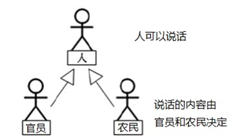
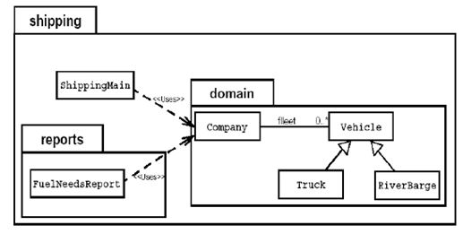
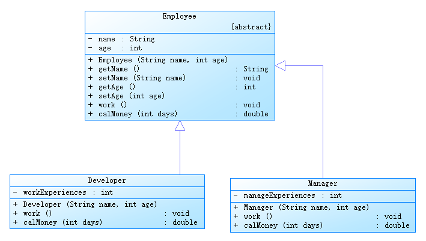
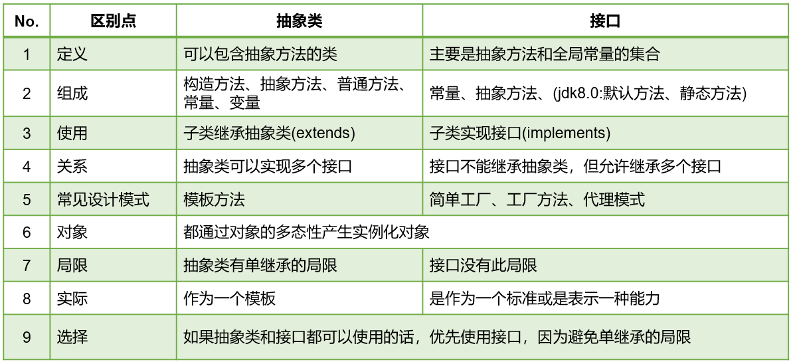
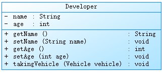
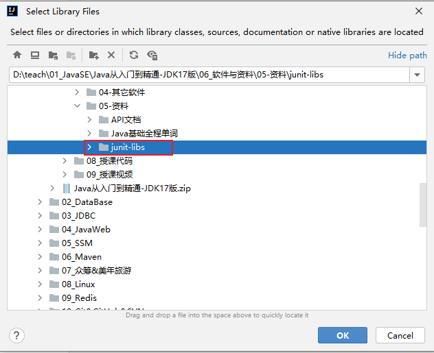
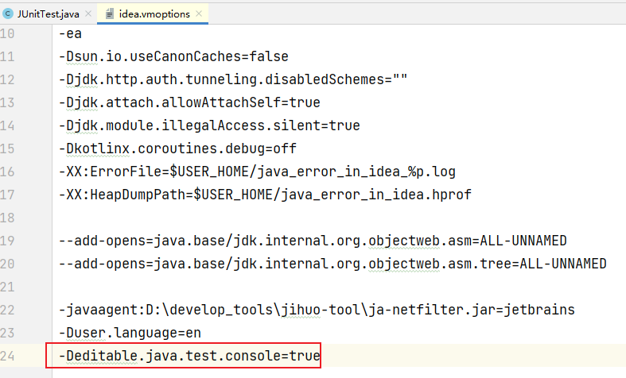

# 第08章_面向对象编程(高级)

讲师：尚硅谷-宋红康（江湖人称：康师傅）

官网：[http://www.atguigu.com](http://www.atguigu.com/)

***

## 本章专题与脉络


## 1. 关键字：static

**回顾类中的实例变量（即非static的成员变量）**

```java
class Circle{
	private double radius;
	public Circle(double radius){
        this.radius=radius;
	}
	public double findArea(){
        return Math.PI*radius*radius;
    }
}
```

创建两个Circle对象：

```java
Circle c1=new Circle(2.0);	//c1.radius=2.0
Circle c2=new Circle(3.0);	//c2.radius=3.0
```

Circle类中的变量radius是一个实例变量(instance variable)，它属于类的每一个对象，c1中的radius变化不会影响c2的radius，反之亦然。

**如果想让一个成员变量被类的所有实例所共享，就用static修饰即可，称为类变量（或类属性）！**

### 1.1 类属性、类方法的设计思想

当我们编写一个类时，其实就是在描述其对象的属性和行为，而并没有产生实质上的对象，只有通过new关键字才会产出对象，这时系统才会分配内存空间给对象，其方法才可以供外部调用。我们有时候希望无论是否产生了对象或无论产生了多少对象的情况下，`某些特定的数据在内存空间里只有一份`。例如，所有的中国人都有个国家名称，每一个中国人都共享这个国家名称，不必在每一个中国人的实例对象中都单独分配一个用于代表国家名称的变量。


此外，在类中声明的实例方法，在类的外面必须要先创建对象，才能调用。但是有些方法的调用者和当前类的对象无关，这样的方法通常被声明为`类方法`，由于不需要创建对象就可以调用类方法，从而简化了方法的调用。

这里的类变量、类方法，只需要使用`static`修饰即可。所以也称为静态变量、静态方法。

### 1.2 static关键字

- 使用范围：
  - 在Java类中，可用static修饰属性、方法、代码块、内部类

- 被修饰后的成员具备以下特点：
  - 随着类的加载而加载
  - 优先于对象存在
  - 修饰的成员，被所有对象所共享
  - 访问权限允许时，可不创建对象，直接被类调用

### 1.3 静态变量

#### 1.3.1 语法格式

使用static修饰的成员变量就是静态变量（或类变量、类属性）

```java
[修饰符] class 类{
	[其他修饰符] static 数据类型 变量名;
}
```

#### 1.3.2 静态变量的特点

- 静态变量的默认值规则和实例变量一样。
- 静态变量值是所有对象共享。

- 静态变量在本类中，可以在任意方法、代码块、构造器中直接使用。
- 如果权限修饰符允许，在其他类中可以通过“`类名.静态变量`”直接访问，也可以通过“`对象.静态变量`”的方式访问（但是更推荐使用类名.静态变量的方式）。
- 静态变量的get/set方法也静态的，当局部变量与静态变量`重名时`，使用“`类名.静态变量`”进行区分。

#### 1.3.3 举例

举例1：

```java
class Chinese{
    //实例变量
    String name;
    int age;
    //类变量
    static String nation;//国籍

    public Chinese() {
    }

    public Chinese(String name, int age) {
        this.name = name;
        this.age = age;
    }

    @Override
    public String toString() {
        return "Chinese{" +
                "name='" + name + '\'' +
                ", age=" + age +
                ", nation='" + nation + '\'' +
                '}';
    }
}
public class StaticTest {
    public static void main(String[] args) {
        Chinese c1 = new Chinese("康师傅",36);
        c1.nation = "中华人民共和国";

        Chinese c2 = new Chinese("老干妈",66);

        System.out.println(c1);
        System.out.println(c2);

        System.out.println(Chinese.nation);
    }
}
```

对应的内存结构：（以经典的JDK6内存解析为例，此时静态变量存储在方法区）


举例2：

```java
package com.atguigu.keyword;

public class Employee {
    private static int total;//这里私有化，在类的外面必须使用get/set方法的方式来访问静态变量
    static String company; //这里缺省权限修饰符，是为了方便类外以“类名.静态变量”的方式访问
    private int id;
    private String name;

    public Employee() {
        total++;
        id = total;//这里使用total静态变量的值为id属性赋值
    }

    public Employee(String name) {
        this();
        this.name = name;
    }

    public void setId(int id) {
        this.id = id;
    }

    public int getId() {
        return id;
    }

    public String getName() {
        return name;
    }

    public void setName(String name) {
        this.name = name;
    }

    public static int getTotal() {
        return total;
    }

    public static void setTotal(int total) {
        Employee.total = total;
    }

    @Override
    public String toString() {
        return "Employee{company = " + company + ",id = " + id + " ,name=" + name +"}";
    }
}
```

```java
package com.atguigu.keyword;

public class TestStaticVariable {
    public static void main(String[] args) {
        //静态变量total的默认值是0
        System.out.println("Employee.total = " + Employee.getTotal());

        Employee e1 = new Employee("张三");
        Employee e2 = new Employee("李四");
        System.out.println(e1);//静态变量company的默认值是null
        System.out.println(e2);//静态变量company的默认值是null
        System.out.println("Employee.total = " + Employee.getTotal());//静态变量total值是2

        Employee.company = "尚硅谷";
        System.out.println(e1);//静态变量company的值是尚硅谷
        System.out.println(e2);//静态变量company的值是尚硅谷

        //只要权限修饰符允许,虽然不推荐，但是也可以通过“对象.静态变量”的形式来访问
        e1.company = "超级尚硅谷";

        System.out.println(e1);//静态变量company的值是超级尚硅谷
        System.out.println(e2);//静态变量company的值是超级尚硅谷
    }
}
```

#### 1.3.4 内存解析


### 1.4 静态方法

#### 1.4.1 语法格式

用static修饰的成员方法就是静态方法。

```java
[修饰符] class 类{
	[其他修饰符] static 返回值类型 方法名(形参列表){
        方法体
    }
}
```

#### 1.4.2 静态方法的特点

- 静态方法在本类的任意方法、代码块、构造器中都可以直接被调用。
- 只要权限修饰符允许，静态方法在其他类中可以通过“类名.静态方法“的方式调用。也可以通过”对象.静态方法“的方式调用（但是更推荐使用类名.静态方法的方式）。
- 在static方法内部只能访问类的static修饰的属性或方法，不能访问类的非static的结构。
- 静态方法可以被子类继承，但不能被子类重写。
- 静态方法的调用都只看编译时类型。
- 因为不需要实例就可以访问static方法，因此static方法内部不能有this，也不能有super。如果有重名问题，使用“类名.”进行区别。

#### 1.4.3 举例

```java
package com.atguigu.keyword;

public class Father {
    public static void method(){
        System.out.println("Father.method");
    }

    public static void fun(){
        System.out.println("Father.fun");
    }
}
```

```java
package com.atguigu.keyword;

public class Son extends Father{
//    @Override //尝试重写静态方法，加上@Override编译报错，去掉Override不报错，但是也不是重写
    public static void fun(){
        System.out.println("Son.fun");
    }
}
```

```java
package com.atguigu.keyword;

public class TestStaticMethod {
    public static void main(String[] args) {
        Father.method();
        Son.method();//继承静态方法

        Father f = new Son();
        f.method();//执行Father类中的method
    }
}
```

### 1.5 练习

笔试题：如下程序执行会不会报错

```java
/**
 * @author 尚硅谷-宋红康
 * @create 14:30
 */
public class StaticTest {
    public static void main(String[] args) {
        Demo test = null;
        test.hello();
    }
}

class Demo{
    public static void hello(){
        System.out.println("hello!");
    }
}
```

练习：

编写一个类实现银行账户的概念，包含的属性有“帐号”、“密码”、“存款余额”、“利率”、“最小余额”，定义封装这些属性的方法。`账号要自动生成。`

编写主类，使用银行账户类，输入、输出3个储户的上述信息。

考虑：哪些属性可以设计成static属性。

## 2. 单例(Singleton)设计模式

### 2.1 设计模式概述

**设计模式**是在大量的`实践中总结`和`理论化`之后优选的代码结构、编程风格、以及解决问题的思考方式。设计模式免去我们自己再思考和摸索。就像是经典的棋谱，不同的棋局，我们用不同的棋谱。"套路"

经典的设计模式共有23种。每个设计模式均是特定环境下特定问题的处理方法。


> 简单工厂模式并不是23中经典模式的一种，是其中工厂方法模式的简化版

> 对软件设计模式的研究造就了一本可能是面向对象设计方面最有影响的书籍：《设计模式》：《Design Patterns: Elements of Reusable Object-Oriented Software》（即后述《设计模式》一书），由 Erich Gamma、Richard Helm、Ralph Johnson 和 John Vlissides 合著（Addison-Wesley，1995）。这几位作者常被称为"四人组（Gang of Four）"，而这本书也就被称为"四人组（或 GoF）"书。

### 2.2 何为单例模式

所谓类的单例设计模式，就是采取一定的方法保证在整个的软件系统中，对某个类**只能存在一个对象实例**，并且该类只提供一个取得其对象实例的方法。

### 2.3 实现思路

如果我们要让类在一个虚拟机中只能产生一个对象，我们首先必须将`类的构造器的访问权限设置为private`，这样，就不能用new操作符在类的外部产生类的对象了，但在类内部仍可以产生该类的对象。因为在类的外部开始还无法得到类的对象，`只能调用该类的某个静态方法`以返回类内部创建的对象，静态方法只能访问类中的静态成员变量，所以，指向类内部产生的`该类对象的变量也必须定义成静态的`。

### 2.4 单例模式的两种实现方式

#### 2.4.1 饿汉式

```java
class Singleton {
    // 1.私有化构造器
    private Singleton() {
    }

    // 2.内部提供一个当前类的实例
    // 4.此实例也必须静态化
    private static Singleton single = new Singleton();

    // 3.提供公共的静态的方法，返回当前类的对象
    public static Singleton getInstance() {
        return single;
    }
}

```

#### 2.4.2 懒汉式

```java
class Singleton {
    // 1.私有化构造器
    private Singleton() {
    }
    // 2.内部提供一个当前类的实例
    // 4.此实例也必须静态化
    private static Singleton single;
    // 3.提供公共的静态的方法，返回当前类的对象
    public static Singleton getInstance() {
        if(single == null) {
            single = new Singleton();
        }
        return single;
    }
}

```

#### 2.4.3 饿汉式 vs 懒汉式

饿汉式：

- 特点：`立即加载`，即在使用类的时候已经将对象创建完毕。
- 优点：实现起来`简单`；没有多线程安全问题。
- 缺点：当类被加载的时候，会初始化static的实例，静态变量被创建并分配内存空间，从这以后，这个static的实例便一直占着这块内存，直到类被卸载时，静态变量被摧毁，并释放所占有的内存。因此在某些特定条件下会`耗费内存`。

懒汉式：

- 特点：`延迟加载`，即在调用静态方法时实例才被创建。
- 优点：实现起来比较简单；当类被加载的时候，static的实例未被创建并分配内存空间，当静态方法第一次被调用时，初始化实例变量，并分配内存，因此在某些特定条件下会`节约内存`。
- 缺点：在多线程环境中，这种实现方法是完全错误的，`线程不安全`，根本不能保证单例的唯一性。
  - 说明：在多线程章节，会将懒汉式改造成线程安全的模式。

### 2.5 单例模式的优点及应用场景

由于单例模式只生成一个实例，减少了`系统性能开销`，当一个对象的产生需要比较多的资源时，如读取配置、产生其他依赖对象时，则可以通过在应用启动时直接产生一个单例对象，然后永久驻留内存的方式来解决。

举例：


**应用场景**

- Windows的Task Manager (任务管理器)就是很典型的单例模式
- Windows的Recycle Bin (回收站)也是典型的单例应用。在整个系统运行过程中，回收站一直维护着仅有的一个实例。
- Application 也是单例的典型应用

- 应用程序的日志应用，一般都使用单例模式实现，这一般是由于共享的日志文件一直处于打开状态，因为只

  能有一个实例去操作，否则内容不好追加。
- 数据库连接池的设计一般也是采用单例模式，因为数据库连接是一种数据库资源。

## 3. 理解main方法的语法

由于JVM需要调用类的main()方法，所以该方法的访问权限必须是public，又因为JVM在执行main()方法时不必创建对象，所以该方法必须是static的，该方法接收一个String类型的数组参数，该数组中保存执行Java命令时传递给所运行的类的参数。 

又因为main() 方法是静态的，我们不能直接访问该类中的非静态成员，必须创建该类的一个实例对象后，才能通过这个对象去访问类中的非静态成员，这种情况，我们在之前的例子中多次碰到。

**命令行参数用法举例**

```java
public class CommandPara {
    public static void main(String[] args) {
        for (int i = 0; i < args.length; i++) {
            System.out.println("args[" + i + "] = " + args[i]);
        }
    }
}

```

```java
//运行程序CommandPara.java
java CommandPara "Tom" "Jerry" "Shkstart"
```

```java
//输出结果
args[0] = Tom
args[1] = Jerry
args[2] = Shkstart

```


IDEA工具：

（1）配置运行参数


（2）运行程序


笔试题：

```java
//此处，Something类的文件名叫OtherThing.java
class Something {
    public static void main(String[] something_to_do) {        
        System.out.println("Do something ...");
    }
}


//上述程序是否可以正常编译、运行？ 

```

## 4. 类的成员之四：代码块

如果成员变量想要初始化的值不是一个硬编码的常量值，而是需要通过复杂的计算或读取文件、或读取运行环境信息等方式才能获取的一些值，该怎么办呢？此时，可以考虑代码块（或初始化块）。

- 代码块(或初始化块)的`作用`：
- 对Java类或对象进行初始化
- 代码块(或初始化块)的`分类`：

  - 一个类中代码块若有修饰符，则只能被static修饰，称为静态代码块(static block)

  -  没有使用static修饰的，为非静态代码块。

### 4.1 静态代码块

如果想要为静态变量初始化，可以直接在静态变量的声明后面直接赋值，也可以使用静态代码块。

#### 4.1.1 语法格式

在代码块的前面加static，就是静态代码块。

```java
【修饰符】 class 类{
	static{
        静态代码块
    }
}
```

#### 4.1.2 静态代码块的特点

1. 可以有输出语句。

  2. 可以对类的属性、类的声明进行初始化操作。

  3. 不可以对非静态的属性初始化。即：不可以调用非静态的属性和方法。

  4. 若有多个静态的代码块，那么按照从上到下的顺序依次执行。

  5. 静态代码块的执行要先于非静态代码块。

  6. 静态代码块随着类的加载而加载，且只执行一次。

```java
package com.atguigu.keyword;

public class Chinese {
//    private static String country = "中国";

    private static String country;
    private String name;

    {
        System.out.println("非静态代码块，country = " + country);
    }

    static {
        country = "中国";
        System.out.println("静态代码块");
    }

    public Chinese(String name) {
        this.name = name;
    }
}
```

```java
package com.atguigu.keyword;

public class TestStaticBlock {
    public static void main(String[] args) {
        Chinese c1 = new Chinese("张三");
        Chinese c2 = new Chinese("李四");
    }
}

```

### 4.2 非静态代码块

#### 4.2.1 语法格式

```java
【修饰符】 class 类{
    {
        非静态代码块
    }
    【修饰符】 构造器名(){
    	// 实例初始化代码
    }
    【修饰符】 构造器名(参数列表){
        // 实例初始化代码
    }
}
```

#### 4.2.2 非静态代码块的作用

和构造器一样，也是用于实例变量的初始化等操作。

#### 4.2.3 非静态代码块的意义

如果多个重载的构造器有公共代码，并且这些代码都是先于构造器其他代码执行的，那么可以将这部分代码抽取到非静态代码块中，减少冗余代码。

#### 4.2.4 非静态代码块的执行特点

1. 可以有输出语句。

  2. 可以对类的属性、类的声明进行初始化操作。

  3. 除了调用非静态的结构外，还可以调用静态的变量或方法。

  4. 若有多个非静态的代码块，那么按照从上到下的顺序依次执行。

  5. 每次创建对象的时候，都会执行一次。且先于构造器执行。

### 4.3 举例

**举例1：**

（1）声明User类，

- 包含属性：username（String类型），password（String类型），registrationTime（long类型），私有化

- 包含get/set方法，其中registrationTime没有set方法

- 包含无参构造，
  - 输出“新用户注册”，
  - registrationTime赋值为当前系统时间，
  - username就默认为当前系统时间值，
  - password默认为“123456”

- 包含有参构造(String username, String password)，
  - 输出“新用户注册”，
  - registrationTime赋值为当前系统时间，
  - username和password由参数赋值

- 包含public String getInfo()方法，返回：“用户名：xx，密码：xx，注册时间：xx”

（2）编写测试类，测试类main方法的代码如下：

```java
    public static void main(String[] args) {
        User u1 = new User();
        System.out.println(u1.getInfo());

        User u2 = new User("song","8888");
        System.out.println(u2.getInfo());
    }
```

如果不用非静态代码块，User类是这样的：

```java
package com.atguigu.block.no;

public class User {
    private String username;
    private String password;
    private long registrationTime;

    public User() {
        System.out.println("新用户注册");
        registrationTime = System.currentTimeMillis();
        username = registrationTime+"";
        password = "123456";
    }

    public User(String username,String password) {
        System.out.println("新用户注册");
        registrationTime = System.currentTimeMillis();
        this.username = username;
        this.password = password;
    }

    public String getUsername() {
        return username;
    }

    public void setUsername(String username) {
        this.username = username;
    }

    public String getPassword() {
        return password;
    }

    public void setPassword(String password) {
        this.password = password;
    }

    public long getRegistrationTime() {
        return registrationTime;
    }
    public String getInfo(){
        return "用户名：" + username + "，密码：" + password + "，注册时间：" + registrationTime;
    }
}
```

如果提取构造器公共代码到非静态代码块，User类是这样的：

```java
package com.atguigu.block.use;

public class User {
    private String username;
    private String password;
    private long registrationTime;

    {
        System.out.println("新用户注册");
        registrationTime = System.currentTimeMillis();
    }

    public User() {
        username = registrationTime+"";
        password = "123456";
    }

    public User(String username, String password) {
        this.username = username;
        this.password = password;
    }

    public String getUsername() {
        return username;
    }

    public void setUsername(String username) {
        this.username = username;
    }

    public String getPassword() {
        return password;
    }

    public void setPassword(String password) {
        this.password = password;
    }

    public long getRegistrationTime() {
        return registrationTime;
    }
    public String getInfo(){
        return "用户名：" + username + "，密码：" + password + "，注册时间：" + registrationTime;
    }
}
```

**举例2：**

```java
private static DataSource dataSource = null;

static{
	InputStream is = null;
	try {
		is = DBCPTest.class.getClassLoader().getResourceAsStream("dbcp.properties");
		Properties pros = new Properties();
		pros.load(is);
		//调用BasicDataSourceFactory的静态方法，获取数据源。
		dataSource = BasicDataSourceFactory.createDataSource(pros);
	} catch (Exception e) {
		e.printStackTrace();
	}finally{
		if(is != null){
			try {
				is.close();
			} catch (IOException e) {
				e.printStackTrace();
			}		
		}		
	}		
}
```

### 4.4 小结：实例变量赋值顺序


### 4.5 练习

练习1：分析加载顺序

```java
class Root{
	static{
		System.out.println("Root的静态初始化块");
	}
	{
		System.out.println("Root的普通初始化块");
	}
	public Root(){
		System.out.println("Root的无参数的构造器");
	}
}
class Mid extends Root{
	static{
		System.out.println("Mid的静态初始化块");
	}
	{
		System.out.println("Mid的普通初始化块");
	}
	public Mid(){
		System.out.println("Mid的无参数的构造器");
	}
	public Mid(String msg){
		//通过this调用同一类中重载的构造器
		this();
		System.out.println("Mid的带参数构造器，其参数值："
			+ msg);
	}
}
class Leaf extends Mid{
	static{
		System.out.println("Leaf的静态初始化块");
	}
	{
		System.out.println("Leaf的普通初始化块");
	}	
	public Leaf(){
		//通过super调用父类中有一个字符串参数的构造器
		super("尚硅谷");
		System.out.println("Leaf的构造器");
	}
}
public class LeafTest{
	public static void main(String[] args){
		new Leaf(); 
		//new Leaf();
	}
}
```

练习2：分析加载顺序

```java
class Father {
	static {
		System.out.println("11111111111");
	}
	{
		System.out.println("22222222222");
	}

	public Father() {
		System.out.println("33333333333");

	}

}

public class Son extends Father {
	static {
		System.out.println("44444444444");
	}
	{
		System.out.println("55555555555");
	}
	public Son() {
		System.out.println("66666666666");
	}


	public static void main(String[] args) { 
		System.out.println("77777777777");
		System.out.println("************************");
		new Son();
		System.out.println("************************");

		new Son();
		System.out.println("************************");
		new Father();
	}

}

```

练习3：

```java
package com.atguigu05.field.interview;

/**
 * @author 尚硅谷-宋红康
 * @create 16:04
 */
public class Test04 {
    public static void main(String[] args) {
        Zi zi = new Zi();
    }
}
class Fu{
    private static int i = getNum("（1）i");
    private int j = getNum("（2）j");
    static{
        print("（3）父类静态代码块");
    }
    {
        print("（4）父类非静态代码块，又称为构造代码块");
    }
    Fu(){
        print("（5）父类构造器");
    }
    public static void print(String str){
        System.out.println(str + "->" + i);
    }
    public static int getNum(String str){
        print(str);
        return ++i;
    }
}
class Zi extends Fu{
    private static int k = getNum("（6）k");
    private int h = getNum("（7）h");
    static{
        print("（8）子类静态代码块");
    }
    {
        print("（9）子类非静态代码块，又称为构造代码块");
    }
    Zi(){
        print("（10）子类构造器");
    }
    public static void print(String str){
        System.out.println(str + "->" + k);
    }
    public static int getNum(String str){
        print(str);
        return ++k;
    }
}

```


## 5. final关键字

### 5.1 final的意义

final：最终的，不可更改的

### 5.2 final的使用

#### 5.2.1 final修饰类

表示这个类不能被继承，没有子类。提高安全性，提高程序的可读性。

例如：String类、System类、StringBuffer类

```java
final class Eunuch{//太监类
	
}
class Son extends Eunuch{//错误
	
}
```

#### 5.2.2 final修饰方法

表示这个方法不能被子类重写。

例如：Object类中的getClass()

```java
class Father{
	public final void method(){
		System.out.println("father");
	}
}
class Son extends Father{
	public void method(){//错误
		System.out.println("son");
	}
}
```

#### 5.2.3 final修饰变量

final修饰某个变量（成员变量或局部变量），一旦赋值，它的值就不能被修改，即常量，常量名建议使用大写字母。

例如：final double MY_PI = 3.14;

> 如果某个成员变量用final修饰后，没有set方法，并且必须初始化（可以显式赋值、或在初始化块赋值、实例变量还可以在构造器中赋值）

- 修饰成员变量

```java
public final class Test {
    public static int totalNumber = 5;
    public final int ID;

    public Test() {
        ID = ++totalNumber; // 可在构造器中给final修饰的“变量”赋值
    }
    public static void main(String[] args) {
        Test t = new Test();
        System.out.println(t.ID);
    }
}

```

- 修饰局部变量：

```java
public class TestFinal {
    public static void main(String[] args){
        final int MIN_SCORE ;
        MIN_SCORE = 0;
        final int MAX_SCORE = 100;
        MAX_SCORE = 200; //非法
    }
}
```

- 错误演示：

```java
class A {
    private final String INFO = "atguigu";  //声明常量

    public void print() {
        //The final field A.INFO cannot be  assigned
        //INFO = "尚硅谷"; 
    }
}

```

### 5.3 笔试题

题1：排错

```java
public class Something {
    public int addOne(final int x) {
        return ++x;
        // return x + 1;
    }
}
```

题2：排错

```java
public class Something {
    public static void main(String[] args) {
        Other o = new Other();
        new Something().addOne(o);
    }
    public void addOne(final Other o) {
        // o = new Other();
        o.i++;
    }
}
class Other {
    public int i;
}

```

## 6. 抽象类与抽象方法(或abstract关键字)

### 6.1 由来

举例1：

随着继承层次中一个个新子类的定义，类变得越来越具体，而父类则更一般，更通用。类的设计应该保证父类和子类能够共享特征。有时将一个父类设计得非常抽象，以至于它没有具体的实例，这样的类叫做抽象类。



举例2：

我们声明一些几何图形类：圆、矩形、三角形类等，发现这些类都有共同特征：求面积、求周长。那么这些共同特征应该抽取到一个共同父类：几何图形类中。但是这些方法在父类中又`无法给出具体的实现`，而是应该交给子类各自具体实现。那么父类在声明这些方法时，`就只有方法签名，没有方法体`，我们把没有方法体的方法称为**抽象方法**。Java语法规定，包含抽象方法的类必须是**抽象类**。

### 6.2 语法格式

* **抽象类**：被abstract修饰的类。
* **抽象方法**：被abstract修饰没有方法体的方法。

抽象类的语法格式

```java
[权限修饰符] abstract class 类名{
    
}
[权限修饰符] abstract class 类名 extends 父类{
    
}
```

抽象方法的语法格式

```java
[其他修饰符] abstract 返回值类型 方法名([形参列表]);
```

> 注意：抽象方法没有方法体


代码举例：

```java
public abstract class Animal {
    public abstract void eat();
}
```

```java
public class Cat extends Animal {
    public void eat (){
      	System.out.println("小猫吃鱼和猫粮"); 
    }
}
```

```java
public class CatTest {
 	 public static void main(String[] args) {
        // 创建子类对象
        Cat c = new Cat(); 
       
        // 调用eat方法
        c.eat();
  	}
}
```

此时的方法重写，是子类对父类抽象方法的完成实现，我们将这种方法重写的操作，也叫做**实现方法**。

### 6.3 使用说明

1. 抽象类**不能创建对象**，如果创建，编译无法通过而报错。只能创建其非抽象子类的对象。

   > 理解：假设创建了抽象类的对象，调用抽象的方法，而抽象方法没有具体的方法体，没有意义。
   >
   > 抽象类是用来被继承的，抽象类的子类必须重写父类的抽象方法，并提供方法体。若没有重写全部的抽象方法，仍为抽象类。

2. 抽象类中，也有构造方法，是供子类创建对象时，初始化父类成员变量使用的。

   > 理解：子类的构造方法中，有默认的super()或手动的super(实参列表)，需要访问父类构造方法。

3. 抽象类中，不一定包含抽象方法，但是有抽象方法的类必定是抽象类。

   > 理解：未包含抽象方法的抽象类，目的就是不想让调用者创建该类对象，通常用于某些特殊的类结构设计。

4. 抽象类的子类，必须重写抽象父类中**所有的**抽象方法，否则，编译无法通过而报错。除非该子类也是抽象类。 

   > 理解：假设不重写所有抽象方法，则类中可能包含抽象方法。那么创建对象后，调用抽象的方法，没有意义。

### 6.4 注意事项

- 不能用abstract修饰变量、代码块、构造器；

- 不能用abstract修饰私有方法、静态方法、final的方法、final的类。

### 6.5 应用举例1



在航运公司系统中，Vehicle类需要定义两个方法分别`计算运输工具的燃料效率`和`行驶距离`。

**问题：**卡车(Truck)和驳船(RiverBarge)的燃料效率和行驶距离的计算方法完全不同。Vehicle类不能提供计算方法，但子类可以。

**解决方案：**Java允许类设计者指定：超类声明一个方法但不提供实现，该方法的实现由子类提供。这样的方法称为抽象方法。有一个或更多抽象方法的类称为抽象类。

```java
//Vehicle是一个抽象类，有两个抽象方法。
public abstract class Vehicle{
	public abstract double calcFuelEfficiency();	//计算燃料效率的抽象方法
	public abstract double calcTripDistance();	//计算行驶距离的抽象方法
}
public class Truck extends Vehicle{
	public double calcFuelEfficiency( )   { //写出计算卡车的燃料效率的具体方法   }
	public double calcTripDistance( )    {  //写出计算卡车行驶距离的具体方法   }
}
public class RiverBarge extends Vehicle{
	 public double calcFuelEfficiency( ) { //写出计算驳船的燃料效率的具体方法  }
	 public double calcTripDistance( )  {  //写出计算驳船行驶距离的具体方法}
}

```

### 6.6 应用举例2：模板方法设计模式(TemplateMethod)

抽象类体现的就是一种模板模式的设计，抽象类作为多个子类的通用模板，子类在抽象类的基础上进行扩展、改造，但子类总体上会保留抽象类的行为方式。

**解决的问题**：

- 当功能内部一部分实现是确定的，另一部分实现是不确定的。这时可以把不确定的部分暴露出去，让子类去实现。

- 换句话说，在软件开发中实现一个算法时，整体步骤很固定、通用，这些步骤已经在父类中写好了。但是某些部分易变，易变部分可以抽象出来，供不同子类实现。这就是一种模板模式。

**类比举例：**英语六级模板


制作月饼的模板：


举例1：

```java
abstract class Template {
    public final void getTime() {
        long start = System.currentTimeMillis();
        code();
        long end = System.currentTimeMillis();
        System.out.println("执行时间是：" + (end - start));
    }

    public abstract void code();
}

class SubTemplate extends Template {
    public void code() {
        for (int i = 0; i < 10000; i++) {
            System.out.println(i);
        }
    }
}

```

举例2：

```java
package com.atguigu.java;
//抽象类的应用：模板方法的设计模式
public class TemplateMethodTest {

	public static void main(String[] args) {
		BankTemplateMethod btm = new DrawMoney();
		btm.process();

		BankTemplateMethod btm2 = new ManageMoney();
		btm2.process();
	}
}
abstract class BankTemplateMethod {
	// 具体方法
	public void takeNumber() {
		System.out.println("取号排队");
	}

	public abstract void transact(); // 办理具体的业务 //钩子方法

	public void evaluate() {
		System.out.println("反馈评分");
	}

	// 模板方法，把基本操作组合到一起，子类一般不能重写
	public final void process() {
		this.takeNumber();

		this.transact();// 像个钩子，具体执行时，挂哪个子类，就执行哪个子类的实现代码

		this.evaluate();
	}
}

class DrawMoney extends BankTemplateMethod {
	public void transact() {
		System.out.println("我要取款！！！");
	}
}

class ManageMoney extends BankTemplateMethod {
	public void transact() {
		System.out.println("我要理财！我这里有2000万美元!!");
	}
}

```

模板方法设计模式是编程中经常用得到的模式。各个框架、类库中都有他的影子，比如常见的有：

- 数据库访问的封装

- Junit单元测试

- JavaWeb的Servlet中关于doGet/doPost方法调用

- Hibernate中模板程序

- Spring中JDBCTemlate、HibernateTemplate等

### 6.7 思考与练习

**思考：**

问题1：为什么抽象类不可以使用final关键字声明？

问题2：一个抽象类中可以定义构造器吗？

问题3：是否可以这样理解：抽象类就是比普通类多定义了抽象方法，除了不能直接进行类的实例化操作之外，并没有任何的不同？

**练习1：**

编写一个Employee类，声明为抽象类，包含如下三个属性：name，id，salary。提供必要的构造器和抽象方法：work()。

对于Manager类来说，他既是员工，还具有奖金(bonus)的属性。

请使用继承的思想，设计CommonEmployee类和Manager类，要求类中提供必要的方法进行属性访问。

**练习2：软件外包公司外派管理**

有一家软件外包公司，可以外派开发人员，该公司有两个角色：普通开发人员Developer和项目经理Manager。他们的关系如下图：



普通开发人员的工作内容是“开发项目”，项目经理的工作内容是“项目管理”。对外的报价是普通开发人员每天500,元，超过60天每天400元。项目经理每天800元，超过60天每天700元。

有一家银行需要1名项目经理、2名开发人员，现场开发90天，计算银行需要付给软件公司的总金额。

提示：创建数组 Employee[] emps = new Employee[3]。其中存储驻场的3名员工。

**练习3：**

创建父类Shape，包含绘制形状的抽象方法draw()。

创建Shape的子类Circle和Rectangle，重写draw()方法，绘制圆形和矩形。

绘制多个圆形和矩形。

**练习4：**

1、声明抽象父类Person，包含抽象方法public abstract void eat();
2、声明子类中国人Chinese，重写抽象方法，打印用筷子吃饭
3、声明子类美国人American，重写抽象方法，打印用刀叉吃饭
4、声明子类印度人Indian，重写抽象方法，打印用手抓饭
5、声明测试类PersonTest，创建Person数组，存储各国人对象，并遍历数组，调用eat()方法

**练习5：工资系统设计**

编写工资系统，实现不同类型员工(多态)的按月发放工资。如果当月出现某个Employee对象的生日，则将该雇员的工资增加100元。

实验说明：

（1）定义一个Employee类，该类包含：

private成员变量name,number,birthday，其中birthday 为MyDate类的对象；

abstract方法earnings()；

toString()方法输出对象的name,number和birthday。

（2）MyDate类包含:

private成员变量year,month,day ；

toDateString()方法返回日期对应的字符串：xxxx年xx月xx日

（3）定义SalariedEmployee类继承Employee类，实现按月计算工资的员工处理。该类包括：private成员变量monthlySalary；

实现父类的抽象方法earnings(),该方法返回monthlySalary值；toString()方法输出员工类型信息及员工的name，number,birthday。

（4）参照SalariedEmployee类定义HourlyEmployee类，实现按小时计算工资的员工处理。该类包括：

private成员变量wage和hour；

实现父类的抽象方法earnings(),该方法返回wage*hour值；

toString()方法输出员工类型信息及员工的name，number,birthday。

（5）定义PayrollSystem类，创建Employee变量数组并初始化，该数组存放各类雇员对象的引用。利用循环结构遍历数组元素，输出各个对象的类型,name,number,birthday,以及该对象生日。当键盘输入本月月份值时，如果本月是某个Employee对象的生日，还要输出增加工资信息。

```java
//提示：
//定义People类型的数组People c1[]=new People[10];
//数组元素赋值
c1[0]=new People("John","0001",20);
c1[1]=new People("Bob","0002",19);
//若People有两个子类Student和Officer，则数组元素赋值时，可以使父类类型的数组元素指向子类。
c1[0]=new Student("John","0001",20,85.0);
c1[1]=new Officer("Bob","0002",19,90.5);

```

## 7. 接口(interface)

### 7.1 类比

生活中大家每天都在用USB接口，那么USB接口与我们今天要学习的接口有什么相同点呢？

 	USB，（Universal Serial Bus，通用串行总线）是Intel公司开发的总线架构，使得在计算机上添加串行设备（鼠标、键盘、打印机、扫描仪、摄像头、充电器、MP3机、手机、数码相机、移动硬盘等）非常容易。

其实，不管是电脑上的USB插口，还是其他设备上的USB插口都只是`遵循了USB规范`的一种具体设备而已。


只要设备遵循USB规范的，那么就可以与电脑互联，并正常通信。至于这个设备、电脑是哪个厂家制造的，内部是如何实现的，我们都无需关心。

Java的软件系统会有很多模块组成，那么各个模块之间也应该采用这种`面向接口`的`低耦合`，为系统提供更好的可扩展性和可维护性。

### 7.2 概述

接口就是规范，定义的是一组规则，体现了现实世界中“如果你是/要...则必须能...”的思想。继承是一个"是不是"的is-a关系，而接口实现则是 "能不能"的`has-a`关系。

* 例如：电脑都预留了可以插入USB设备的USB接口，USB接口具备基本的数据传输的开启功能和关闭功能。你能不能用USB进行连接，或是否具备USB通信功能，就看你能否遵循USB接口规范


- 例如：Java程序是否能够连接使用某种数据库产品，那么要看该数据库产品能否实现Java设计的JDBC规范


> 接口的本质是契约、标准、规范，就像我们的法律一样。制定好后大家都要遵守。
>

### 7.3 定义格式

接口的定义，它与定义类方式相似，但是使用 `interface` 关键字。它也会被编译成.class文件，但一定要明确它并不是类，而是另外一种引用数据类型。

> 引用数据类型：数组，类，枚举，接口，注解。

#### 7.3.1 接口的声明格式

```java
[修饰符] interface 接口名{
    //接口的成员列表：
    // 公共的静态常量
    // 公共的抽象方法
    
    // 公共的默认方法（JDK1.8以上）
    // 公共的静态方法（JDK1.8以上）
    // 私有方法（JDK1.9以上）
}
```

示例代码：

```java
package com.atguigu.interfacetype;

public interface USB3{
    //静态常量
    long MAX_SPEED = 500*1024*1024;//500MB/s

    //抽象方法
    void in();
    void out();

    //默认方法
    default void start(){
        System.out.println("开始");
    }
    default void stop(){
        System.out.println("结束");
    }

    //静态方法
    static void show(){
        System.out.println("USB 3.0可以同步全速地进行读写操作");
    }
}
```

#### 7.3.2 接口的成员说明

**在JDK8.0 之前**，接口中只允许出现：

（1）公共的静态的常量：其中`public static final`可以省略

（2）公共的抽象的方法：其中`public abstract`可以省略

> 理解：接口是从多个相似类中抽象出来的规范，不需要提供具体实现

**在JDK8.0 时**，接口中允许声明`默认方法`和`静态方法`：

（3）公共的默认的方法：其中public 可以省略，建议保留，但是default不能省略

（4）公共的静态的方法：其中public 可以省略，建议保留，但是static不能省略

**在JDK9.0 时**，接口又增加了：

（5）私有方法

除此之外，接口中没有构造器，没有初始化块，因为接口中没有成员变量需要动态初始化。

### 7.4 接口的使用规则

**1、类实现接口（implements）**

接口**不能创建对象**，但是可以被类实现（`implements` ，类似于被继承）。

类与接口的关系为实现关系，即**类实现接口**，该类可以称为接口的实现类。实现的动作类似继承，格式相仿，只是关键字不同，实现使用 ` implements`关键字。

```java
【修饰符】 class 实现类  implements 接口{
	// 重写接口中抽象方法【必须】，当然如果实现类是抽象类，那么可以不重写
  	// 重写接口中默认方法【可选】
}

【修饰符】 class 实现类 extends 父类 implements 接口{
    // 重写接口中抽象方法【必须】，当然如果实现类是抽象类，那么可以不重写
  	// 重写接口中默认方法【可选】
}
```


注意：

1. 如果接口的实现类是非抽象类，那么必须`重写接口中所有抽象方法`。

2. 默认方法可以选择保留，也可以重写。

   > 重写时，default单词就不要再写了，它只用于在接口中表示默认方法，到类中就没有默认方法的概念了

3. 接口中的静态方法不能被继承也不能被重写

举例：

```java
interface USB{		// 
	public void start() ;
	public void stop() ;	
}
class Computer{
	public static void show(USB usb){	
		usb.start() ;
		System.out.println("=========== USB 设备工作 ========") ;
		usb.stop() ;
	}
};
class Flash implements USB{
	public void start(){	// 重写方法
		System.out.println("U盘开始工作。") ;
	}
	public void stop(){		// 重写方法
		System.out.println("U盘停止工作。") ;
	}
};
class Print implements USB{
	public void start(){	// 重写方法
		System.out.println("打印机开始工作。") ;
	}
	public void stop(){		// 重写方法
		System.out.println("打印机停止工作。") ;
	}
};
public class InterfaceDemo{
	public static void main(String args[]){
		Computer.show(new Flash()) ;
		Computer.show(new Print()) ;

		c.show(new USB(){
			public void start(){
				System.out.println("移动硬盘开始运行");
			}
			public void stop(){
				System.out.println("移动硬盘停止运行");
			}
		});
	}
};
```

**2、接口的多实现（implements）**

之前学过，在继承体系中，一个类只能继承一个父类。而对于接口而言，一个类是可以实现多个接口的，这叫做接口的`多实现`。并且，一个类能继承一个父类，同时实现多个接口。

实现格式：

```java
【修饰符】 class 实现类  implements 接口1，接口2，接口3。。。{
	// 重写接口中所有抽象方法【必须】，当然如果实现类是抽象类，那么可以不重写
  	// 重写接口中默认方法【可选】
}

【修饰符】 class 实现类 extends 父类 implements 接口1，接口2，接口3。。。{
    // 重写接口中所有抽象方法【必须】，当然如果实现类是抽象类，那么可以不重写
  	// 重写接口中默认方法【可选】
}
```

> 接口中，有多个抽象方法时，实现类必须重写所有抽象方法。**如果抽象方法有重名的，只需要重写一次**。

举例：


定义多个接口：

```java
package com.atguigu.interfacetype;

public interface A {
    void showA();
}
```

```java
package com.atguigu.interfacetype;

public interface B {
    void showB();
}
```

定义实现类：

```java
package com.atguigu.interfacetype;

public class C implements A,B {
    @Override
    public void showA() {
        System.out.println("showA");
    }

    @Override
    public void showB() {
        System.out.println("showB");
    }
}

```

测试类

```java
package com.atguigu.interfacetype;

public class TestC {
    public static void main(String[] args) {
        C c = new C();
        c.showA();
        c.showB();
    }
}
```

**3、接口的多继承(extends)**

一个接口能继承另一个或者多个接口，接口的继承也使用 `extends` 关键字，子接口继承父接口的方法。

定义父接口：

```java
package com.atguigu.interfacetype;

public interface Chargeable {
    void charge();
    void in();
    void out();
}
```

定义子接口：

```java
package com.atguigu.interfacetype;

public interface UsbC extends Chargeable,USB3 {
    void reverse();
}
```

定义子接口的实现类：

```java
package com.atguigu.interfacetype;

public class TypeCConverter implements UsbC {
    @Override
    public void reverse() {
        System.out.println("正反面都支持");
    }

    @Override
    public void charge() {
        System.out.println("可充电");
    }

    @Override
    public void in() {
        System.out.println("接收数据");
    }

    @Override
    public void out() {
        System.out.println("输出数据");
    }
}
```

>所有父接口的抽象方法都有重写。
>
>方法签名相同的抽象方法只需要实现一次。

**4、接口与实现类对象构成多态引用**

实现类实现接口，类似于子类继承父类，因此，接口类型的变量与实现类的对象之间，也可以构成多态引用。通过接口类型的变量调用方法，最终执行的是你new的实现类对象实现的方法体。

接口的不同实现类：

```java
package com.atguigu.interfacetype;

public class Mouse implements USB3 {
    @Override
    public void out() {
        System.out.println("发送脉冲信号");
    }

    @Override
    public void in() {
        System.out.println("不接收信号");
    }
}
```

```java
package com.atguigu.interfacetype;

public class KeyBoard implements USB3{
    @Override
    public void in() {
        System.out.println("不接收信号");
    }

    @Override
    public void out() {
        System.out.println("发送按键信号");
    }
}

```

测试类

```java
package com.atguigu.interfacetype;

public class TestComputer {
    public static void main(String[] args) {
        Computer computer = new Computer();
        USB3 usb = new Mouse();
        computer.setUsb(usb);
        usb.start();
        usb.out();
        usb.in();
        usb.stop();
        System.out.println("--------------------------");

        usb = new KeyBoard();
        computer.setUsb(usb);
        usb.start();
        usb.out();
        usb.in();
        usb.stop();
        System.out.println("--------------------------");

        usb = new MobileHDD();
        computer.setUsb(usb);
        usb.start();
        usb.out();
        usb.in();
        usb.stop();
    }
}
```

**5、使用接口的静态成员**

接口不能直接创建对象，但是可以通过接口名直接调用接口的静态方法和静态常量。

```java
package com.atguigu.interfacetype;

public class TestUSB3 {
    public static void main(String[] args) {
        //通过“接口名.”调用接口的静态方法 (JDK8.0才能开始使用)
        USB3.show();
        //通过“接口名.”直接使用接口的静态常量
        System.out.println(USB3.MAX_SPEED);
    }
}
```

**6、使用接口的非静态方法**

* 对于接口的静态方法，直接使用“`接口名.`”进行调用即可
  * 也只能使用“接口名."进行调用，不能通过实现类的对象进行调用
* 对于接口的抽象方法、默认方法，只能通过实现类对象才可以调用
  * 接口不能直接创建对象，只能创建实现类的对象

```java
package com.atguigu.interfacetype;

public class TestMobileHDD {
    public static void main(String[] args) {
        //创建实现类对象
        MobileHDD b = new MobileHDD();

        //通过实现类对象调用重写的抽象方法，以及接口的默认方法，如果实现类重写了就执行重写的默认方法，如果没有重写，就执行接口中的默认方法
        b.start();
        b.in();
        b.stop();

        //通过接口名调用接口的静态方法
//        MobileHDD.show();
//        b.show();
        Usb3.show();
    }
}
```

### 7.5 JDK8中相关冲突问题

#### 7.5.1 默认方法冲突问题

**（1）类优先原则**

当一个类，既继承一个父类，又实现若干个接口时，父类中的成员方法与接口中的抽象方法重名，子类就近选择执行父类的成员方法。代码如下：

定义接口：

```java
package com.atguigu.interfacetype;

public interface Friend {
    default void date(){//约会
        System.out.println("吃喝玩乐");
    }
}
```

定义父类：

```java
package com.atguigu.interfacetype;

public class Father {
    public void date(){//约会
        System.out.println("爸爸约吃饭");
    }
}
```

定义子类：

```java
package com.atguigu.interfacetype;

public class Son extends Father implements Friend {
    @Override
    public void date() {
        //(1)不重写默认保留父类的
        //(2)调用父类被重写的
//        super.date();
        //(3)保留父接口的
//        Friend.super.date();
        //(4)完全重写
        System.out.println("跟康师傅学Java");
    }
}
```

定义测试类：

```java
package com.atguigu.interfacetype;

public class TestSon {
    public static void main(String[] args) {
        Son s = new Son();
        s.date();
    }
}
```

**（2）接口冲突（左右为难）**

- 当一个类同时实现了多个父接口，而多个父接口中包含方法签名相同的默认方法时，怎么办呢？


无论你多难抉择，最终都是要做出选择的。

声明接口：

```java
package com.atguigu.interfacetype;

public interface BoyFriend {
    default void date(){//约会
        System.out.println("神秘约会");
    }
}
```

选择保留其中一个，通过“`接口名.super.方法名`"的方法选择保留哪个接口的默认方法。

```java
package com.atguigu.interfacetype;

public class Girl implements Friend,BoyFriend{

    @Override
    public void date() {
        //(1)保留其中一个父接口的
//        Friend.super.date();
//        BoyFriend.super.date();
        //(2)完全重写
        System.out.println("跟康师傅学Java");
    }

}
```

测试类

```java
package com.atguigu.interfacetype;

public class TestGirl {
    public static void main(String[] args) {
        Girl girl = new Girl();
        girl.date();
    }
}
```

- 当一个子接口同时继承了多个接口，而多个父接口中包含方法签名相同的默认方法时，怎么办呢？

另一个父接口：

```java
package com.atguigu.interfacetype;

public interface USB2 {
    //静态常量
    long MAX_SPEED = 60*1024*1024;//60MB/s

    //抽象方法
    void in();
    void out();

    //默认方法
    public default void start(){
        System.out.println("开始");
    }
    public default void stop(){
        System.out.println("结束");
    }

    //静态方法
    public static void show(){
        System.out.println("USB 2.0可以高速地进行读写操作");
    }
}
```

子接口：

```java
package com.atguigu.interfacetype;

public interface USB extends USB2,USB3 {
    @Override
    default void start() {
        System.out.println("Usb.start");
    }

    @Override
    default void stop() {
        System.out.println("Usb.stop");
    }
}

```

> 小贴士：
>
> 子接口重写默认方法时，default关键字可以保留。
>
> 子类重写默认方法时，default关键字不可以保留。

#### 7.5.2 常量冲突问题

- 当子类继承父类又实现父接口，而父类中存在与父接口常量同名的成员变量，并且该成员变量名在子类中仍然可见。
- 当子类同时实现多个接口，而多个接口存在相同同名常量。

此时在子类中想要引用父类或父接口的同名的常量或成员变量时，就会有冲突问题。

父类和父接口：

```java
package com.atguigu.interfacetype;

public class SuperClass {
    int x = 1;
}
```

```java
package com.atguigu.interfacetype;

public interface SuperInterface {
    int x = 2;
    int y = 2;
}
```

```java
package com.atguigu.interfacetype;

public interface MotherInterface {
    int x = 3;
}
```

子类：

```java
package com.atguigu.interfacetype;

public class SubClass extends SuperClass implements SuperInterface,MotherInterface {
    public void method(){
//        System.out.println("x = " + x);//模糊不清
        System.out.println("super.x = " + super.x);
        System.out.println("SuperInterface.x = " + SuperInterface.x);
        System.out.println("MotherInterface.x = " + MotherInterface.x);
        System.out.println("y = " + y);//没有重名问题，可以直接访问
    }
}
```

### 7.6 接口的总结与面试题

- 接口本身不能创建对象，只能创建接口的实现类对象，接口类型的变量可以与实现类对象构成多态引用。
- 声明接口用interface，接口的成员声明有限制：
  - （1）公共的静态常量
  - （2）公共的抽象方法
  - （3）公共的默认方法（JDK8.0 及以上）
  - （4）公共的静态方法（JDK8.0 及以上）
  - （5）私有方法（JDK9.0 及以上）
- 类可以实现接口，关键字是implements，而且支持多实现。如果实现类不是抽象类，就必须实现接口中所有的抽象方法。如果实现类既要继承父类又要实现父接口，那么继承（extends）在前，实现（implements）在后。
- 接口可以继承接口，关键字是extends，而且支持多继承。
- 接口的默认方法可以选择重写或不重写。如果有冲突问题，另行处理。子类重写父接口的默认方法，要去掉default，子接口重写父接口的默认方法，不要去掉default。
- 接口的静态方法不能被继承，也不能被重写。接口的静态方法只能通过“接口名.静态方法名”进行调用。

**面试题**

**1、为什么接口中只能声明公共的静态的常量？**

因为接口是标准规范，那么在规范中需要声明一些底线边界值，当实现者在实现这些规范时，不能去随意修改和触碰这些底线，否则就有“危险”。

例如：USB1.0规范中规定最大传输速率是1.5Mbps，最大输出电流是5V/500mA

​           USB3.0规范中规定最大传输速率是5Gbps(500MB/s)，最大输出电流是5V/900mA

例如：尚硅谷学生行为规范中规定学员，早上8:25之前进班，晚上21:30之后离开等等。

**2、为什么JDK8.0 之后允许接口定义静态方法和默认方法呢？因为它违反了接口作为一个抽象标准定义的概念。**

`静态方法`：因为之前的标准类库设计中，有很多Collection/Colletions或者Path/Paths这样成对的接口和类，后面的类中都是静态方法，而这些静态方法都是为前面的接口服务的，那么这样设计一对API，不如把静态方法直接定义到接口中使用和维护更方便。

`默认方法`：（1）我们要在已有的老版接口中提供新方法时，如果添加抽象方法，就会涉及到原来使用这些接口的类就会有问题，那么为了保持与旧版本代码的兼容性，只能允许在接口中定义默认方法实现。比如：Java8中对Collection、List、Comparator等接口提供了丰富的默认方法。（2）当我们接口的某个抽象方法，在很多实现类中的实现代码是一样的，此时将这个抽象方法设计为默认方法更为合适，那么实现类就可以选择重写，也可以选择不重写。

**3、为什么JDK1.9要允许接口定义私有方法呢？因为我们说接口是规范，规范是需要公开让大家遵守的。**

**私有方法**：因为有了默认方法和静态方法这样具有具体实现的方法，那么就可能出现多个方法由共同的代码可以抽取，而这些共同的代码抽取出来的方法又只希望在接口内部使用，所以就增加了私有方法。

### 7.7 接口与抽象类之间的对比



> 在开发中，常看到一个类不是去继承一个已经实现好的类，而是要么继承抽象类，要么实现接口。

### 7.8 练习

**笔试题：**排错

```java
interface A {
    int x = 0;
}
class B {
    int x = 1;
}
class C extends B implements A {
    public void pX() {
        System.out.println(x);
    }
    public static void main(String[] args) {
        new C().pX();
    }
}

```

**笔试题：**排错

```java
interface Playable {
    void play();
}

interface Bounceable {
    void play();
}

interface Rollable extends Playable, Bounceable {
    Ball ball = new Ball("PingPang");

}

class Ball implements Rollable {
    private String name;

    public String getName() {
        return name;
    }

    public Ball(String name) {
        this.name = name;
    }

    public void play() {
        ball = new Ball("Football");
        System.out.println(ball.getName());
    }
}

```

**练习1：**

定义一个接口用来实现两个对象的比较。

```java
interface CompareObject{
	//若返回值是 0 , 代表相等; 若为正数，代表当前对象大；负数代表当前对象小
	public int compareTo(Object o);  
}
```

定义一个Circle类，声明redius属性，提供getter和setter方法

定义一个ComparableCircle类，继承Circle类并且实现CompareObject接口。在ComparableCircle类中给出接口中方法compareTo的实现体，用来比较两个圆的半径大小。

定义一个测试类InterfaceTest，创建两个ComparableCircle对象，调用compareTo方法比较两个类的半径大小。

思考：参照上述做法定义矩形类Rectangle和ComparableRectangle类，在ComparableRectangle类中给出compareTo方法的实现，比较两个矩形的面积大小。

**练习2：交通工具案例**

阿里的一个工程师，声明的属性和方法如下：



其中，有一个乘坐交通工具的方法takingVehicle()，在此方法中调用交通工具的run()。为了出行方便，他买了一辆捷安特自行车、一辆雅迪电动车和一辆奔驰轿车。这里涉及到的相关类及接口关系如下：


其中，电动车增加动力的方式是充电，轿车增加动力的方式是加油。在具体交通工具的run()中调用其所在类的相关属性信息。

请编写相关代码，并测试。

提示：创建Vehicle[]数组，保存阿里工程师的三辆交通工具，并分别在工程师的takingVehicle()中调用。

## 8. 内部类（InnerClass)

### 8.1 概述

#### 8.1.1 什么是内部类

将一个类A定义在另一个类B里面，里面的那个类A就称为`内部类（InnerClass）`，类B则称为`外部类（OuterClass）`。

#### 8.1.2 为什么要声明内部类呢

具体来说，当一个事物A的内部，还有一个部分需要一个完整的结构B进行描述，而这个内部的完整的结构B又只为外部事物A提供服务，不在其他地方单独使用，那么整个内部的完整结构B最好使用内部类。

总的来说，遵循`高内聚、低耦合`的面向对象开发原则。

#### 8.1.3 内部类的分类

根据内部类声明的位置（如同变量的分类），我们可以分为：


### 8.2 成员内部类

#### 8.2.1 概述

如果成员内部类中不使用外部类的非静态成员，那么通常将内部类声明为静态内部类，否则声明为非静态内部类。

**语法格式：**

```java
[修饰符] class 外部类{
    [其他修饰符] [static] class 内部类{
    }
}
```

**成员内部类的使用特征，概括来讲有如下两种角色：**

- 成员内部类作为`类的成员的角色`：
  - 和外部类不同，Inner class还可以声明为private或protected；
  - 可以调用外部类的结构。（注意：在静态内部类中不能使用外部类的非静态成员）
  - Inner class 可以声明为static的，但此时就不能再使用外层类的非static的成员变量；
- 成员内部类作为`类的角色`：
  - 可以在内部定义属性、方法、构造器等结构
  - 可以继承自己的想要继承的父类，实现自己想要实现的父接口们，和外部类的父类和父接口无关
  - 可以声明为abstract类 ，因此可以被其它的内部类继承
  - 可以声明为final的，表示不能被继承
  - 编译以后生成OuterClass$InnerClass.class字节码文件（也适用于局部内部类）

注意点：

2. 外部类访问成员内部类的成员，需要“内部类.成员”或“内部类对象.成员”的方式

3. 成员内部类可以直接使用外部类的所有成员，包括私有的数据

4. 当想要在外部类的静态成员部分使用内部类时，可以考虑内部类声明为静态的

#### 8.2.2 创建成员内部类对象

- 实例化静态内部类

```
外部类名.静态内部类名 变量 = 外部类名.静态内部类名();
变量.非静态方法();
```

- 实例化非静态内部类

```
外部类名 变量1 = new 外部类();
外部类名.非静态内部类名 变量2 = 变量1.new 非静态内部类名();
变量2.非静态方法();
```

#### 8.2.3 举例

```java
public class TestMemberInnerClass {
    public static void main(String[] args) {
        //创建静态内部类实例，并调用方法
        Outer.StaticInner inner = new Outer.StaticInner();
        inner.inFun();
        //调用静态内部类静态方法
        Outer.StaticInner.inMethod();

        System.out.println("*****************************");
        
        //创建非静态内部类实例（方式1），并调用方法
        Outer outer = new Outer();
        Outer.NoStaticInner inner1 = outer.new NoStaticInner();
        inner1.inFun();

        //创建非静态内部类实例（方式2）
        Outer.NoStaticInner inner2 = outer.getNoStaticInner();
        inner1.inFun();
    }
}
class Outer{
    private static String a = "外部类的静态a";
    private static String b  = "外部类的静态b";
    private String c = "外部类对象的非静态c";
    private String d = "外部类对象的非静态d";

    static class StaticInner{
        private static String a ="静态内部类的静态a";
        private String c = "静态内部类对象的非静态c";
        public static void inMethod(){
            System.out.println("Inner.a = " + a);
            System.out.println("Outer.a = " + Outer.a);
            System.out.println("b = " + b);
        }
        public void inFun(){
            System.out.println("Inner.inFun");
            System.out.println("Outer.a = " + Outer.a);
            System.out.println("Inner.a = " + a);
            System.out.println("b = " + b);
            System.out.println("c = " + c);
//            System.out.println("d = " + d);//不能访问外部类的非静态成员
        }
    }

    class NoStaticInner{
        private String a = "非静态内部类对象的非静态a";
        private String c = "非静态内部类对象的非静态c";

        public void inFun(){
            System.out.println("NoStaticInner.inFun");
            System.out.println("Outer.a = " + Outer.a);
            System.out.println("a = " + a);
            System.out.println("b = " + b);
            System.out.println("Outer.c = " + Outer.this.c);
            System.out.println("c = " + c);
            System.out.println("d = " + d);
        }
    }


    public NoStaticInner getNoStaticInner(){
        return new NoStaticInner();
    }
}
```

### 8.3 局部内部类

#### 8.3.1 非匿名局部内部类

语法格式：

```java
[修饰符] class 外部类{
    [修饰符] 返回值类型  方法名(形参列表){
            [final/abstract] class 内部类{
    	}
    }    
}
```

- 编译后有自己的独立的字节码文件，只不过在内部类名前面冠以外部类名、$符号、编号。
  - 这里有编号是因为同一个外部类中，不同的方法中存在相同名称的局部内部类

* 和成员内部类不同的是，它前面不能有权限修饰符等
* 局部内部类如同局部变量一样，有作用域
* 局部内部类中是否能访问外部类的非静态的成员，取决于所在的方法

举例：

```java
/**
 * ClassName: TestLocalInner
 * @Author 尚硅谷-宋红康
 * @Create 17:19
 * @Version 1.0
 */
public class TestLocalInner {
    public static void main(String[] args) {
        Outer.outMethod();
        System.out.println("-------------------");

        Outer out = new Outer();
        out.outTest();
        System.out.println("-------------------");

        Runner runner = Outer.getRunner();
        runner.run();

    }
}
class Outer{

    public static void outMethod(){
        System.out.println("Outer.outMethod");
        final String c = "局部变量c";
        class Inner{
            public void inMethod(){
                System.out.println("Inner.inMethod");
                System.out.println(c);
            }
        }

        Inner in = new Inner();
        in.inMethod();
    }

    public void outTest(){
        class Inner{
            public void inMethod1(){
                System.out.println("Inner.inMethod1");
            }
        }

        Inner in = new Inner();
        in.inMethod1();
    }

    public static Runner getRunner(){
        class LocalRunner implements Runner{
            @Override
            public void run() {
                System.out.println("LocalRunner.run");
            }
        }
        return new LocalRunner();
    }

}
interface Runner{
    void run();
}
```

#### 8.3.2 匿名内部类

因为考虑到这个子类或实现类是一次性的，那么我们“费尽心机”的给它取名字，就显得多余。那么我们完全可以使用匿名内部类的方式来实现，避免给类命名的问题。

```java
new 父类([实参列表]){
    重写方法...
}
```

```java
new 父接口(){
    重写方法...
}
```

举例1：使用匿名内部类的对象直接调用方法：

```java
interface A{
	void a();
}
public class Test{
    public static void main(String[] args){
    	new A(){
			@Override
			public void a() {
				System.out.println("aaaa");
			}
    	}.a();
    }
}
```

举例2：通过父类或父接口的变量多态引用匿名内部类的对象

```java
interface A{
	void a();
}
public class Test{
    public static void main(String[] args){
    	A obj = new A(){
			@Override
			public void a() {
				System.out.println("aaaa");
			}
    	};
    	obj.a();
    }
}
```

举例3：匿名内部类的对象作为实参

```java
interface A{
	void method();
}
public class Test{
    public static void test(A a){
    	a.method();
    }
    
    public static void main(String[] args){
    	test(new A(){

			@Override
			public void method() {
				System.out.println("aaaa");
			}
    	});
    }   
}
```

### 8.4 练习

练习：判断输出结果为何？

```java
public class Test {
    public Test() {
        Inner s1 = new Inner();
        s1.a = 10;
        Inner s2 = new Inner();
        s2.a = 20;
        Test.Inner s3 = new Test.Inner();
        System.out.println(s3.a);
    }
    class Inner {
        public int a = 5;
    }
    public static void main(String[] args) {
        Test t = new Test();
        Inner r = t.new Inner();
        System.out.println(r.a);
    }
}

```

练习2：

编写一个匿名内部类，它继承Object，并在匿名内部类中，声明一个方法public void test()打印尚硅谷。

请编写代码调用这个方法。

```java
package com.atguigu.test01;

public class Test01 {
	public static void main(String[] args) {
		new Object(){
			public void test(){
				System.out.println("尚硅谷");
			}
		}.test();
	}
}

```

## 9. 枚举类

### 9.1 概述

- 枚举类型本质上也是一种类，只不过是这个类的对象是有限的、固定的几个，不能让用户随意创建。

- 枚举类的例子举不胜举：
  - `星期`：Monday(星期一)......Sunday(星期天)
  - `性别`：Man(男)、Woman(女)
  - `月份`：January(1月)......December(12月)
  - `季节`：Spring(春节)......Winter(冬天)
  - `三原色`：red(红色)、green(绿色)、blue(蓝色)
  - `支付方式`：Cash（现金）、WeChatPay（微信）、Alipay(支付宝)、BankCard(银行卡)、CreditCard(信用卡)
  - `就职状态`：Busy(忙碌)、Free(空闲)、Vocation(休假)、Dimission(离职)
  - `订单状态`：Nonpayment（未付款）、Paid（已付款）、Fulfilled（已配货）、Delivered（已发货）、Checked（已确认收货）、Return（退货）、Exchange（换货）、Cancel（取消）
  - `线程状态`：创建、就绪、运行、阻塞、死亡
- **若枚举只有一个对象, 则可以作为一种单例模式的实现方式。**
- 枚举类的实现：
  - 在JDK5.0 之前，需要程序员自定义枚举类型。
  - 在JDK5.0 之后，Java支持`enum`关键字来快速定义枚举类型。

### 9.2 定义枚举类（JDK5.0 之前）

在JDK5.0 之前如何声明枚举类呢？

* `私有化`类的构造器，保证不能在类的外部创建其对象
* 在类的内部创建枚举类的实例。声明为：`public static final` ，对外暴露这些常量对象
* 对象如果有`实例变量`，应该声明为`private final`（建议，不是必须），并在构造器中初始化

示例代码：

```java
class Season{
    private final String SEASONNAME;//季节的名称
    private final String SEASONDESC;//季节的描述
    private Season(String seasonName,String seasonDesc){
        this.SEASONNAME = seasonName;
        this.SEASONDESC = seasonDesc;
    }
    public static final Season SPRING = new Season("春天", "春暖花开");
    public static final Season SUMMER = new Season("夏天", "夏日炎炎");
    public static final Season AUTUMN = new Season("秋天", "秋高气爽");
    public static final Season WINTER = new Season("冬天", "白雪皑皑");

    @Override
    public String toString() {
        return "Season{" +
                "SEASONNAME='" + SEASONNAME + '\'' +
                ", SEASONDESC='" + SEASONDESC + '\'' +
                '}';
    }
}
class SeasonTest{
    public static void main(String[] args) {
        System.out.println(Season.AUTUMN);
    }
}
```

### 9.3 定义枚举类（JDK5.0 之后）

#### 9.3.1 enum关键字声明枚举

```java
【修饰符】 enum 枚举类名{
    常量对象列表
}

【修饰符】 enum 枚举类名{
    常量对象列表;
    
    对象的实例变量列表;
}
```

举例1：

```java
package com.atguigu.enumeration;

public enum Week {
    MONDAY,TUESDAY,WEDNESDAY,THURSDAY,FRIDAY,SATURDAY,SUNDAY;
}
```

```java
public class TestEnum {
	public static void main(String[] args) {
		Season spring = Season.SPRING;
		System.out.println(spring);
	}
}
```

#### 9.3.2 enum方式定义的要求和特点

* 枚举类的常量对象列表必须在枚举类的首行，因为是常量，所以建议大写。
* 列出的实例系统会自动添加 public static final 修饰。
* 如果常量对象列表后面没有其他代码，那么“；”可以省略，否则不可以省略“；”。
* 编译器给枚举类默认提供的是private的无参构造，如果枚举类需要的是无参构造，就不需要声明，写常量对象列表时也不用加参数
* 如果枚举类需要的是有参构造，需要手动定义，有参构造的private可以省略，调用有参构造的方法就是在常量对象名后面加(实参列表)就可以。
* 枚举类默认继承的是java.lang.Enum类，因此不能再继承其他的类型。
* JDK5.0 之后switch，提供支持枚举类型，case后面可以写枚举常量名，无需添加枚举类作为限定。

举例2：

```java
public enum SeasonEnum {
    SPRING("春天","春风又绿江南岸"),
    SUMMER("夏天","映日荷花别样红"),
    AUTUMN("秋天","秋水共长天一色"),
    WINTER("冬天","窗含西岭千秋雪");

    private final String seasonName;
    private final String seasonDesc;
    
    private SeasonEnum(String seasonName, String seasonDesc) {
        this.seasonName = seasonName;
        this.seasonDesc = seasonDesc;
    }
    public String getSeasonName() {
        return seasonName;
    }
    public String getSeasonDesc() {
        return seasonDesc;
    }
}

```

举例3：

```java
package com.atguigu.enumeration;

public enum Week {
    MONDAY("星期一"),
    TUESDAY("星期二"),
    WEDNESDAY("星期三"),
    THURSDAY("星期四"),
    FRIDAY("星期五"),
    SATURDAY("星期六"),
    SUNDAY("星期日");

    private final String description;

    private Week(String description){
        this.description = description;
    }

    @Override
    public String toString() {
        return super.toString() +":"+ description;
    }
}
```

```java
package com.atguigu.enumeration;

public class TestWeek {
    public static void main(String[] args) {
        Week week = Week.MONDAY;
        System.out.println(week);

        switch (week){
            case MONDAY:
                System.out.println("怀念周末，困意很浓");break;
            case TUESDAY:
                System.out.println("进入学习状态");break;
            case WEDNESDAY:
                System.out.println("死撑");break;
            case THURSDAY:
                System.out.println("小放松");break;
            case FRIDAY:
                System.out.println("又信心满满");break;
            case SATURDAY:
                System.out.println("开始盼周末，无心学习");break;
            case SUNDAY:
                System.out.println("一觉到下午");break;
        }
    }
}
```

> 经验之谈：
>
> 开发中，当需要定义一组常量时，强烈建议使用枚举类。

### 9.4 enum中常用方法

```
String toString(): 默认返回的是常量名（对象名），可以继续手动重写该方法！
    
static 枚举类型[] values():返回枚举类型的对象数组。该方法可以很方便地遍历所有的枚举值，是一个静态方法
    
static 枚举类型 valueOf(String name)：可以把一个字符串转为对应的枚举类对象。要求字符串必须是枚举类对象的“名字”。如不是，会有运行时异常：IllegalArgumentException。
    
String name():得到当前枚举常量的名称。建议优先使用toString()。
    
int ordinal():返回当前枚举常量的次序号，默认从0开始

```

举例：

```java
package com.atguigu.enumeration;

import java.util.Scanner;

public class TestEnumMethod {
    public static void main(String[] args) {
        //values()
        Week[] values = Week.values();
        for (int i = 0; i < values.length; i++) {
            //ordinal()、name()
            System.out.println((values[i].ordinal()+1) + "->" + values[i].name());
        }
        System.out.println("------------------------");

        Scanner input = new Scanner(System.in);
        System.out.print("请输入星期值：");
        int weekValue = input.nextInt();
        Week week = values[weekValue-1];
        //toString()
        System.out.println(week);

        System.out.print("请输入星期名：");
        String weekName = input.next();
        //valueOf()
        week = Week.valueOf(weekName);
        System.out.println(week);

        input.close();
    }
}
```

### 9.5 实现接口的枚举类

- 和普通 Java 类一样，枚举类可以实现一个或多个接口
- 若每个枚举值在调用实现的接口方法呈现相同的行为方式，则只要统一实现该方法即可。
- 若需要每个枚举值在调用实现的接口方法呈现出不同的行为方式，则可以让每个枚举值分别来实现该方法

语法：

```java
//1、枚举类可以像普通的类一样，实现接口，并且可以多个，但要求必须实现里面所有的抽象方法！
enum A implements 接口1，接口2{
	//抽象方法的实现
}

//2、如果枚举类的常量可以继续重写抽象方法!
enum A implements 接口1，接口2{
    常量名1(参数){
        //抽象方法的实现或重写
    },
    常量名2(参数){
        //抽象方法的实现或重写
    },
    //...
}
```

举例：

```java
interface Info{
	void show();
}

//使用enum关键字定义枚举类
enum Season1 implements Info{
	//1. 创建枚举类中的对象,声明在enum枚举类的首位
	SPRING("春天","春暖花开"){
		public void show(){
			System.out.println("春天在哪里？");
		}
	},
	SUMMER("夏天","夏日炎炎"){
		public void show(){
			System.out.println("宁静的夏天");
		}
	},
	AUTUMN("秋天","秋高气爽"){
		public void show(){
			System.out.println("秋天是用来分手的季节");
		}
	},
	WINTER("冬天","白雪皑皑"){
		public void show(){
			System.out.println("2002年的第一场雪");
		}
	};
	
	//2. 声明每个对象拥有的属性:private final修饰
	private final String SEASON_NAME;
	private final String SEASON_DESC;
	
	//3. 私有化类的构造器
	private Season1(String seasonName,String seasonDesc){
		this.SEASON_NAME = seasonName;
		this.SEASON_DESC = seasonDesc;
	}
	
	public String getSEASON_NAME() {
		return SEASON_NAME;
	}

	public String getSEASON_DESC() {
		return SEASON_DESC;
	}
}
```

## 10. 注解(Annotation)

### 10.1 注解概述

#### 10.1.1 什么是注解

注解（Annotation）是从`JDK5.0`开始引入，以“`@注解名`”在代码中存在。例如：

```java
@Override
```

```java
@Deprecated
```

```java
@SuppressWarnings(value=”unchecked”)
```

Annotation 可以像修饰符一样被使用，可用于修饰包、类、构造器、方法、成员变量、参数、局部变量的声明。还可以添加一些参数值，这些信息被保存在 Annotation 的 “name=value” 对中。

注解可以在类编译、运行时进行加载，体现不同的功能。

#### 10.1.2 注解与注释

注解也可以看做是一种注释，通过使用 Annotation，程序员可以在不改变原有逻辑的情况下，在源文件中嵌入一些补充信息。但是，注解，不同于单行注释和多行注释。

- 对于单行注释和多行注释是给程序员看的。
- 而注解是可以被编译器或其他程序读取的。程序还可以根据注解的不同，做出相应的处理。

#### 10.1.3 注解的重要性

在JavaSE中，注解的使用目的比较简单，例如标记过时的功能，忽略警告等。在`JavaEE/Android中注解占据了更重要的角色`，例如用来配置应用程序的任何切面，代替JavaEE旧版中所遗留的`繁冗代码`和`XML配置`等。

未来的开发模式都是基于注解的，JPA是基于注解的，Spring2.5以上都是基于注解的，Hibernate3.x以后也是基于注解的，Struts2有一部分也是基于注解的了。`注解是一种趋势`，一定程度上可以说：`框架 = 注解 + 反射 + 设计模式`。

### 10.2 常见的Annotation作用

**示例1：生成文档相关的注解**

```java
@author 标明开发该类模块的作者，多个作者之间使用,分割
@version 标明该类模块的版本
@see 参考转向，也就是相关主题
@since 从哪个版本开始增加的
@param 对方法中某参数的说明，如果没有参数就不能写
@return 对方法返回值的说明，如果方法的返回值类型是void就不能写
@exception 对方法可能抛出的异常进行说明 ，如果方法没有用throws显式抛出的异常就不能写
```

```java
package com.annotation.javadoc;
/**
 * @author 尚硅谷-宋红康
 * @version 1.0
 * @see Math.java
 */
public class JavadocTest {
	/**
	 * 程序的主方法，程序的入口
	 * @param args String[] 命令行参数
	 */
	public static void main(String[] args) {
	}
	
	/**
	 * 求圆面积的方法
	 * @param radius double 半径值
	 * @return double 圆的面积
	 */
	public static double getArea(double radius){
		return Math.PI * radius * radius;
	}
}

```

**示例2：在编译时进行格式检查(JDK内置的三个基本注解)**

`@Override`: 限定重写父类方法，该注解只能用于方法

`@Deprecated`: 用于表示所修饰的元素(类，方法等)已过时。通常是因为所修饰的结构危险或存在更好的选择

`@SuppressWarnings`: 抑制编译器警告

```java
package com.annotation.javadoc;
 
public class AnnotationTest{
 
	public static void main(String[] args) {
		@SuppressWarnings("unused")
		int a = 10;
	}
	@Deprecated
	public void print(){
		System.out.println("过时的方法");
	}
 
	@Override
	public String toString() {
		return "重写的toString方法()";
	}
}

```

**示例3：跟踪代码依赖性，实现替代配置文件功能**

- Servlet3.0提供了注解(annotation)，使得不再需要在web.xml文件中进行Servlet的部署。

```java
@WebServlet("/login")
public class LoginServlet extends HttpServlet {
    private static final long serialVersionUID = 1L;
    
    protected void doGet(HttpServletRequest request, HttpServletResponse response) { }
    
    protected void doPost(HttpServletRequest request, HttpServletResponse response) {
        doGet(request, response);
	}  
}

```

```xml
 <servlet>
    <servlet-name>LoginServlet</servlet-name>
    <servlet-class>com.servlet.LoginServlet</servlet-class>
  </servlet>
  <servlet-mapping>
    <servlet-name>LoginServlet</servlet-name>
    <url-pattern>/login</url-pattern>
  </servlet-mapping>

```

- Spring框架中关于“事务”的管理

```java
@Transactional(propagation=Propagation.REQUIRES_NEW,isolation=Isolation.READ_COMMITTED,readOnly=false,timeout=3)
public void buyBook(String username, String isbn) {
	//1.查询书的单价
    int price = bookShopDao.findBookPriceByIsbn(isbn);
    //2. 更新库存
    bookShopDao.updateBookStock(isbn);	
    //3. 更新用户的余额
    bookShopDao.updateUserAccount(username, price);
}

```

```xml
<!-- 配置事务属性 -->
<tx:advice transaction-manager="dataSourceTransactionManager" id="txAdvice">
       <tx:attributes>
       <!-- 配置每个方法使用的事务属性 -->
       <tx:method name="buyBook" propagation="REQUIRES_NEW" 
	 isolation="READ_COMMITTED"  read-only="false"  timeout="3" />
       </tx:attributes>
</tx:advice>

```

### 10.3 三个最基本的注解

#### 10.3.1 @Override

- 用于检测被标记的方法为有效的重写方法，如果不是，则报编译错误！


- 只能标记在方法上。


- 它会被编译器程序读取。


#### 10.3.2 @Deprecated

- 用于表示被标记的数据已经过时，不推荐使用。


- 可以用于修饰 属性、方法、构造、类、包、局部变量、参数。


- 它会被编译器程序读取。


#### 10.3.3 @SuppressWarnings

- 抑制编译警告。当我们不希望看到警告信息的时候，可以使用 SuppressWarnings 注解来抑制警告信息


- 可以用于修饰类、属性、方法、构造、局部变量、参数


- 它会被编译器程序读取。

- 可以指定的警告类型有（了解）
  - all，抑制所有警告
  - unchecked，抑制与未检查的作业相关的警告
  - unused，抑制与未用的程式码及停用的程式码相关的警告
  - deprecation，抑制与淘汰的相关警告
  - nls，抑制与非 nls 字串文字相关的警告
  - null，抑制与空值分析相关的警告
  - rawtypes，抑制与使用 raw 类型相关的警告
  - static-access，抑制与静态存取不正确相关的警告
  - static-method，抑制与可能宣告为 static 的方法相关的警告
  - super，抑制与置换方法相关但不含 super 呼叫的警告
  - ...

示例代码：

```java
package com.atguigu.annotation;

import java.util.ArrayList;

public class TestAnnotation {
    @SuppressWarnings("all")
    public static void main(String[] args) {
        int i;

        ArrayList list = new ArrayList();
        list.add("hello");
        list.add(123);
        list.add("world");

        Father f = new Son();
        f.show();
        f.methodOl();
    }
}

class Father{
    @Deprecated
    void show() {
        System.out.println("Father.show");
    }
    void methodOl() {
        System.out.println("Father Method");
    }
}

class Son extends Father{
/*	@Override
	void method01() {
		System.out.println("Son Method");
	}*/
}
```

### 10.4 元注解

JDK1.5在java.lang.annotation包定义了4个标准的meta-annotation类型，它们被用来提供对其它 annotation类型作说明。

（1）**@Target：**用于描述注解的使用范围

* 可以通过枚举类型ElementType的10个常量对象来指定
* TYPE，METHOD，CONSTRUCTOR，PACKAGE.....

（2）**@Retention：**用于描述注解的生命周期

* 可以通过枚举类型RetentionPolicy的3个常量对象来指定
* SOURCE（源代码）、CLASS（字节码）、RUNTIME（运行时）
* `唯有RUNTIME阶段才能被反射读取到`。

（3）**@Documented**：表明这个注解应该被 javadoc工具记录。

（4）**@Inherited：**允许子类继承父类中的注解

示例代码：

```java
package java.lang;

import java.lang.annotation.*;

@Target(ElementType.METHOD)
@Retention(RetentionPolicy.SOURCE)
public @interface Override {
}
```

```java
package java.lang;

import java.lang.annotation.*;
import static java.lang.annotation.ElementType.*;

@Target({TYPE, FIELD, METHOD, PARAMETER, CONSTRUCTOR, LOCAL_VARIABLE})
@Retention(RetentionPolicy.SOURCE)
public @interface SuppressWarnings {
    String[] value();
}
```

```java
package java.lang;

import java.lang.annotation.*;
import static java.lang.annotation.ElementType.*;

@Documented
@Retention(RetentionPolicy.RUNTIME)
@Target(value={CONSTRUCTOR, FIELD, LOCAL_VARIABLE, METHOD, PACKAGE, PARAMETER, TYPE})
public @interface Deprecated {
}
```

> 拓展：元数据
>
> String name = "Tom";

### 10.5 自定义注解的使用

一个完整的注解应该包含三个部分：
（1）声明
（2）使用
（3）读取

#### 10.5.1 声明自定义注解

```java
【元注解】
【修饰符】 @interface 注解名{
    【成员列表】
}
```

* 自定义注解可以通过四个元注解@Retention,@Target，@Inherited,@Documented，分别说明它的声明周期，使用位置，是否被继承，是否被生成到API文档中。
* Annotation 的成员在 Annotation 定义中以无参数有返回值的抽象方法的形式来声明，我们又称为配置参数。返回值类型只能是八种基本数据类型、String类型、Class类型、enum类型、Annotation类型、以上所有类型的数组
* 可以使用 default 关键字为抽象方法指定默认返回值
* 如果定义的注解含有抽象方法，那么使用时必须指定返回值，除非它有默认值。格式是“方法名 = 返回值”，如果只有一个抽象方法需要赋值，且方法名为value，可以省略“value=”，所以如果注解只有一个抽象方法成员，建议使用方法名value。

```java
package com.atguigu.annotation;

import java.lang.annotation.*;

@Inherited
@Target(ElementType.TYPE)
@Retention(RetentionPolicy.RUNTIME)
public @interface Table {
    String value();
}
```

```java
package com.atguigu.annotation;

import java.lang.annotation.*;

@Inherited
@Target(ElementType.FIELD)
@Retention(RetentionPolicy.RUNTIME)
public @interface Column {
    String columnName();
    String columnType();
}
```

#### 10.5.2 使用自定义注解

```java
package com.atguigu.annotation;

@Table("t_stu")
public class Student {
    @Column(columnName = "sid",columnType = "int")
    private int id;
    @Column(columnName = "sname",columnType = "varchar(20)")
    private String name;

    public int getId() {
        return id;
    }

    public void setId(int id) {
        this.id = id;
    }

    public String getName() {
        return name;
    }

    public void setName(String name) {
        this.name = name;
    }

    @Override
    public String toString() {
        return "Student{" +
                "id=" + id +
                ", name='" + name + '\'' +
                '}';
    }
}

```

#### 10.5.3 读取和处理自定义注解

自定义注解必须配上注解的信息处理流程才有意义。

我们自己定义的注解，只能使用反射的代码读取。所以自定义注解的声明周期必须是RetentionPolicy.RUNTIME。

具体的使用见`《尚硅谷_宋红康_第17章_反射机制.md》`。

### 10.6 JUnit单元测试

#### 10.6.1 测试分类

**黑盒测试：**不需要写代码，给输入值，看程序是否能够输出期望的值。 

**白盒测试：**需要写代码的。关注程序具体的执行流程。


#### 10.6.2 JUnit单元测试介绍

JUnit 是由 Erich Gamma 和 Kent Beck 编写的一个测试框架（regression testing framework），供Java开发人员编写单元测试之用。

**JUnit测试是程序员测试，即所谓白盒测试，因为程序员知道被测试的软件如何（How）完成功能和完成什么样（What）的功能。**

要使用JUnit，必须在项目的编译路径中`引入JUnit的库`，即相关的.class文件组成的jar包。jar就是一个压缩包，压缩包都是开发好的第三方（Oracle公司第一方，我们自己第二方，其他都是第三方）工具类，都是以class文件形式存在的。

#### 10.6.3 引入本地JUnit.jar

第1步：在项目中File-Project Structure中操作：添加Libraries库




其中，junit-libs包内容如下：


第2步：选择要在哪些module中应用JUnit库


第3步：检查是否应用成功


**注意Scope：选择Compile，否则编译时，无法使用JUnit。**

第4步：下次如果有新的模块要使用该libs库，这样操作即可


#### 10.6.4 编写和运行@Test单元测试方法

JUnit4版本，要求@Test标记的方法必须满足如下要求：

- 所在的类必须是public的，非抽象的，包含唯一的无参构造器。
- @Test标记的方法本身必须是public，非抽象的，非静态的，void无返回值，()无参数的。

```java
package com.atguigu.junit;

import org.junit.Test;

public class TestJUnit {
    @Test
    public void test01(){
        System.out.println("TestJUnit.test01");
    }

    @Test
    public void test02(){
        System.out.println("TestJUnit.test02");
    }

    @Test
    public void test03(){
        System.out.println("TestJUnit.test03");
    }
}
```


#### 10.6.5 设置执行JUnit用例时支持控制台输入

**1. 设置数据：**

默认情况下，在单元测试方法中使用Scanner时，并不能实现控制台数据的输入。需要做如下设置：

在`idea64.exe.vmoptions配置文件`中加入下面一行设置，重启idea后生效。

```properties
-Deditable.java.test.console=true
```

**2. 配置文件位置：**




添加完成之后，重启IDEA即可。

**3. 如果上述位置设置不成功，需要继续修改如下位置**

修改位置1：IDEA安装目录的bin目录（例如：`D:\develop_tools\IDEA\IntelliJ IDEA 2022.1.2\bin`）下的idea64.exe.vmoptions文件。 

修改位置2：C盘的用户目录`C:\Users\用户名\AppData\Roaming\JetBrains\IntelliJIdea2022.1` 下的idea64.exe.vmoptions`件。

#### 10.6.6 定义test测试方法模板

选中自定义的模板组，点击”+”（1.Live Template）来定义模板。


## 11. 包装类

### 11.1 为什么需要包装类

Java提供了两个类型系统，`基本数据类型`与`引用数据类型`。使用基本数据类型在于效率，然而当要使用只针对对象设计的API或新特性（例如泛型），怎么办呢？例如：

```java
//情况1：方法形参
Object类的equals(Object obj)

//情况2：方法形参
ArrayList类的add(Object obj)
//没有如下的方法：
add(int number)
add(double d)
add(boolean b)

//情况3：泛型
Set<T>
List<T>
Cllection<T>
Map<K,V>
```

### 11.2 有哪些包装类

Java针对八种基本数据类型定义了相应的引用类型：包装类（封装类）。有了类的特点，就可以调用类中的方法，Java才是真正的面向对象。


封装以后的，内存结构对比：

```java
public static void main(String[] args){
	int num = 520;
	Integer obj = new Integer(520);
}
```


### 11.3 自定义包装类

```java
public class MyInteger {
    int value;

    public MyInteger() {
    }

    public MyInteger(int value) {
        this.value = value;
    }

    @Override
    public String toString() {
        return String.valueOf(value);
    }
}

```

### 11.4 包装类与基本数据类型间的转换

#### 11.4.1 装箱

 **装箱：把基本数据类型转为包装类对象**

> 转为包装类的对象，是为了使用专门为对象设计的API和特性

基本数值---->包装对象

```java
Integer obj1 = new Integer(4);//使用构造函数函数
Float f = new Float(“4.56”);
Long l = new Long(“asdf”);  //NumberFormatException

Integer obj2 = Integer.valueOf(4);//使用包装类中的valueOf方法
```

#### 11.4.2 拆箱

**拆箱：把包装类对象拆为基本数据类型**

> 转为基本数据类型，一般是因为需要运算，Java中的大多数运算符是为基本数据类型设计的。比较、算术等

包装对象---->基本数值

```java
Integer obj = new Integer(4);
int num1 = obj.intValue();
```

**自动装箱与拆箱：**

由于我们经常要做基本类型与包装类之间的转换，从`JDK5.0 `开始，基本类型与包装类的装箱、拆箱动作可以自动完成。例如：

```java
Integer i = 4;//自动装箱。相当于Integer i = Integer.valueOf(4);
i = i + 5;//等号右边：将i对象转成基本数值(自动拆箱) i.intValue() + 5;
//加法运算完成后，再次装箱，把基本数值转成对象。
```

> 注意：只能与自己对应的类型之间才能实现自动装箱与拆箱。

```java
Integer i = 1;
Double d = 1;//错误的，1是int类型
```

### 11.5 基本数据类型、包装类与字符串间的转换

**（1）基本数据类型转为字符串**

**方式1：**调用字符串重载的valueOf()方法

```java
int a = 10;
//String str = a;//错误的

String str = String.valueOf(a);
```

**方式2：**更直接的方式

```java
int a = 10;

String str = a + "";
```

**（2）字符串转为基本数据类型**

**方式1：**除了Character类之外，其他所有包装类都具有parseXxx静态方法可以将字符串参数转换为对应的基本类型，例如：

* `public static int parseInt(String s)`：将字符串参数转换为对应的int基本类型。
* `public static long parseLong(String s)`：将字符串参数转换为对应的long基本类型。
* `public static double parseDouble(String s)`：将字符串参数转换为对应的double基本类型。

**方式2：**字符串转为包装类，然后可以自动拆箱为基本数据类型

* ```public static Integer valueOf(String s)```：将字符串参数转换为对应的Integer包装类，然后可以自动拆箱为int基本类型
* ```public static Long valueOf(String s)```：将字符串参数转换为对应的Long包装类，然后可以自动拆箱为long基本类型
* ```public static Double valueOf(String s)```：将字符串参数转换为对应的Double包装类，然后可以自动拆箱为double基本类型

注意:如果字符串参数的内容无法正确转换为对应的基本类型，则会抛出`java.lang.NumberFormatException`异常。

**方式3：**通过包装类的构造器实现

```java
int a = Integer.parseInt("整数的字符串");
double d = Double.parseDouble("小数的字符串");
boolean b = Boolean.parseBoolean("true或false");

int a = Integer.valueOf("整数的字符串");
double d = Double.valueOf("小数的字符串");
boolean b = Boolean.valueOf("true或false");

int i = new Integer(“12”);

```

其他方式小结：


### 11.6 包装类的其它API

#### 11.6.1 数据类型的最大最小值

```java
Integer.MAX_VALUE和Integer.MIN_VALUE
    
Long.MAX_VALUE和Long.MIN_VALUE
    
Double.MAX_VALUE和Double.MIN_VALUE
```

#### 11.6.2 字符转大小写

```java
Character.toUpperCase('x');

Character.toLowerCase('X');
```

#### 11.6.3 整数转进制

```java
Integer.toBinaryString(int i) 
    
Integer.toHexString(int i)
    
Integer.toOctalString(int i)
```

#### 11.6.4 比较的方法

```java
Double.compare(double d1, double d2)
    
Integer.compare(int x, int y) 
```

### 11.7 包装类对象的特点

#### 11.7.1 包装类缓存对象

| 包装类    | 缓存对象    |
| --------- | ----------- |
| Byte      | -128~127    |
| Short     | -128~127    |
| Integer   | -128~127    |
| Long      | -128~127    |
| Float     | 没有        |
| Double    | 没有        |
| Character | 0~127       |
| Boolean   | true和false |

```java
Integer a = 1;
Integer b = 1;
System.out.println(a == b);//true

Integer i = 128;
Integer j = 128;
System.out.println(i == j);//false

Integer m = new Integer(1);//新new的在堆中
Integer n = 1;//这个用的是缓冲的常量对象，在方法区
System.out.println(m == n);//false

Integer x = new Integer(1);//新new的在堆中
Integer y = new Integer(1);//另一个新new的在堆中
System.out.println(x == y);//false
```

```java
Double d1 = 1.0;
Double d2 = 1.0;
System.out.println(d1==d2);//false 比较地址，没有缓存对象，每一个都是新new的
```

#### 11.7.2 类型转换问题

```java
Integer i = 1000;
double j = 1000;
System.out.println(i==j);//true  会先将i自动拆箱为int，然后根据基本数据类型“自动类型转换”规则，转为double比较
```

```java
Integer i = 1000;
int j = 1000;
System.out.println(i==j);//true 会自动拆箱，按照基本数据类型进行比较
```

```java
Integer i = 1;
Double d = 1.0
System.out.println(i==d);//编译报错
```

#### 11.7.3 包装类对象不可变

```java
public class TestExam {
	public static void main(String[] args) {
		int i = 1;
		Integer j = new Integer(2);
		Circle c = new Circle();
		change(i,j,c);
		System.out.println("i = " + i);//1
		System.out.println("j = " + j);//2
		System.out.println("c.radius = " + c.radius);//10.0
	}
	
	/*
	 * 方法的参数传递机制：
	 * （1）基本数据类型：形参的修改完全不影响实参
	 * （2）引用数据类型：通过形参修改对象的属性值，会影响实参的属性值
	 * 这类Integer等包装类对象是“不可变”对象，即一旦修改，就是新对象，和实参就无关了
	 */
	public static void change(int a ,Integer b,Circle c ){
		a += 10;
//		b += 10;//等价于  b = new Integer(b+10);
		c.radius += 10;
		/*c = new Circle();
		c.radius+=10;*/
	}
}
class Circle{
	double radius;
}
```

### 11.8 练习

笔试题：如下两个题目输出结果相同吗？各是什么。

```java
Object o1 = true ? new Integer(1) : new Double(2.0);
System.out.println(o1);//1.0

```

```java
Object o2;
if (true)
    o2 = new Integer(1);
else
    o2 = new Double(2.0);
System.out.println(o2);//1

```

面试题：

```java
public void method1() {
    Integer i = new Integer(1);
    Integer j = new Integer(1);
    System.out.println(i == j);

    Integer m = 1;
    Integer n = 1;
    System.out.println(m == n);//

    Integer x = 128;
    Integer y = 128;
    System.out.println(x == y);//
}

```

练习：

利用Vector代替数组处理：从键盘读入学生成绩（以负数代表输入结束），找出最高分，并输出学生成绩等级。

- 提示：数组一旦创建，长度就固定不变，所以在创建数组前就需要知道它的长度。而向量类java.util.Vector可以根据需要动态伸缩。

- 创建Vector对象：Vector v=new Vector();

- 给向量添加元素：v.addElement(Object obj);  //obj必须是对象

- 取出向量中的元素：Object obj=v.elementAt(0);
  - 注意第一个元素的下标是0，返回值是Object类型的。

- 计算向量的长度：v.size();

- 若与最高分相差10分内：A等；20分内：B等；30分内：C等；其它：D等
