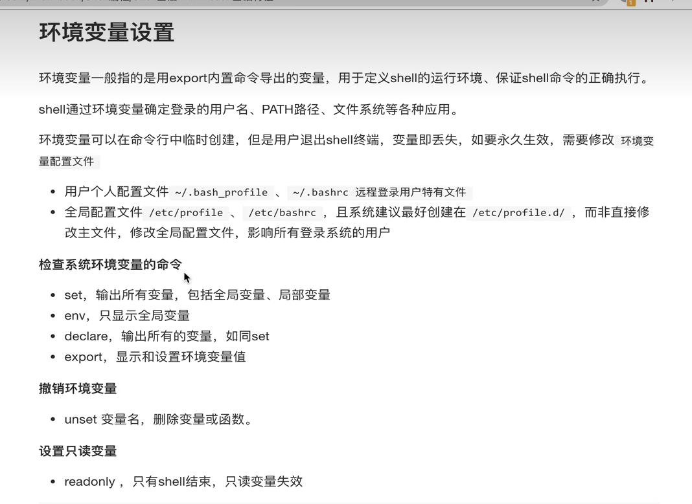
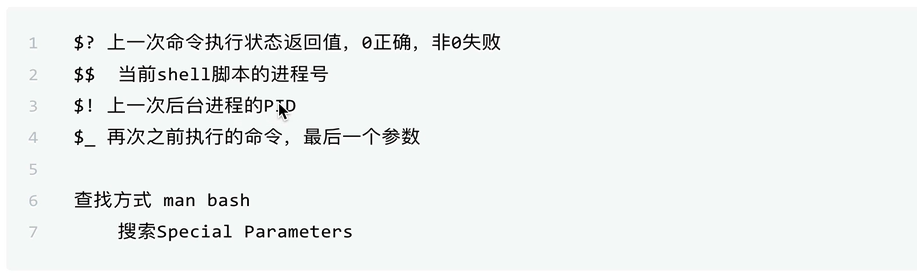
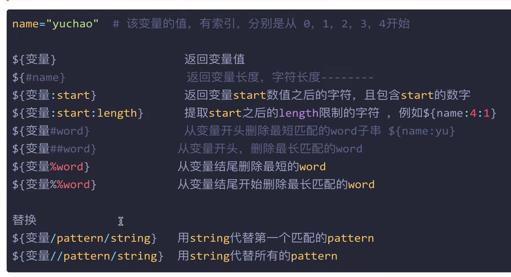

[vim快捷键](https://cloud.tencent.com/developer/article/1672272)

# shell编程笔记

> 1. 对于一个sh文件，别忘了添加**shebang**。
>     `#!/bin/sh`
> 2. 查看历史命令 **history** -c清楚历史   -r恢复历史
> 3. ！历史id 快速执行历史命令
>     ！！执行上次的命令
> 4. 变量和值之间不能有空格，这个和idea中的标准格式有差异，只能name="123"
>     想要输出变量值，就需要$符号，例如echo \$name;**单引号**变量不识别特殊语法，**双引号**变量识别特殊语法  

##  父子shell

```
1. 调用bash解释器来执行脚本，会开启子shell，不会保存脚本中的变量
2. 调用source或者符号. 执行脚本，就不会开启子shell，会保存脚本中的变量
```

---



## 特殊状态变量



  **`$_`**取得的是**上一次命令的最后一个参数**,上面写错了

## shell基本语法




针对于shell脚本的一些其他不理解的内容，需要通过[菜鸟编程](https://www.runoob.com/linux/linux-shell-array.html)来进行了解
