**注意**：redis默认没有密码，并且只能本地连接，想要设置密码并且可以远程连接就需要设置**配置文件** ，关于这一部分可以网上查阅资料或者观看B站进行


# 数据类型

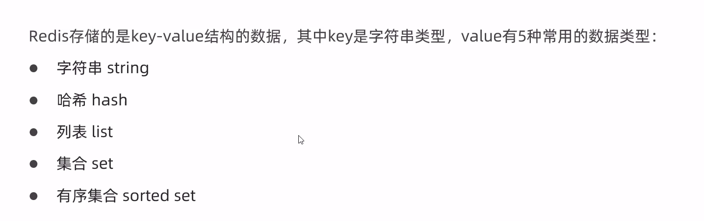

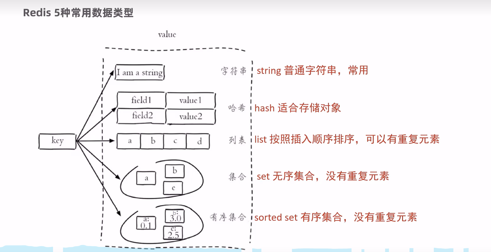

# Redis 常用命令

删除某个key值可以使用del key命令

## 1. 字符串常用命令

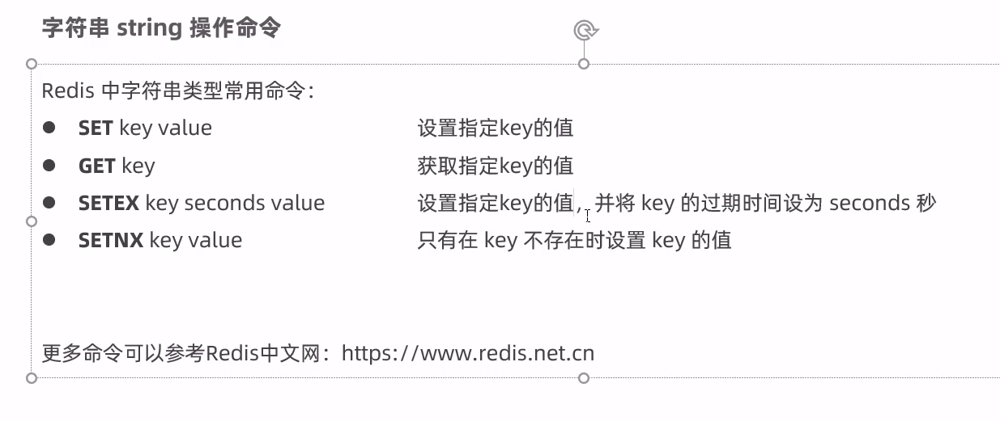

## 2. 哈希常用命令（常用于存储java对象）

因为field可以存储属性，value存储属性值

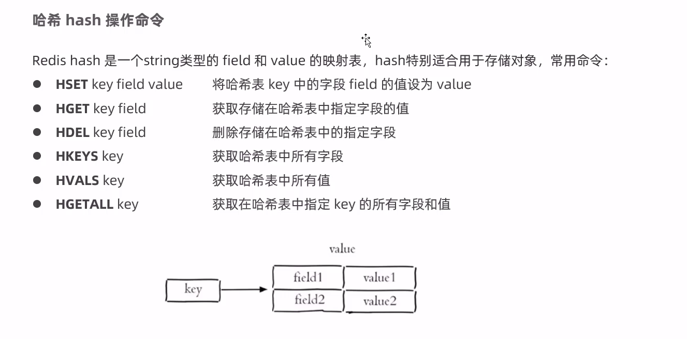

## 3. 列表list常用命令

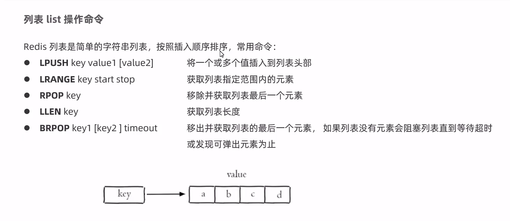

## 4. 集合set常用命令

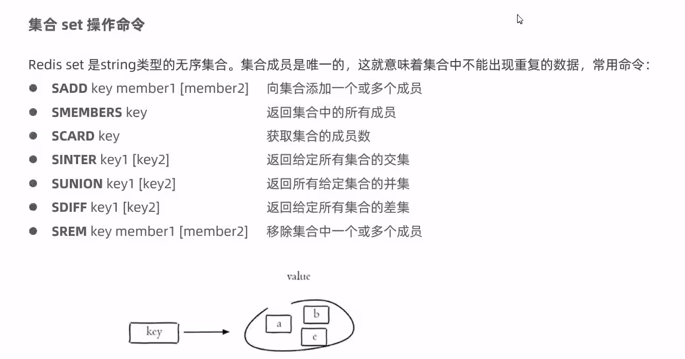

## 5. 通用命令


# java中操作redis

## 1. 使用jedis操作数据库（不常用）

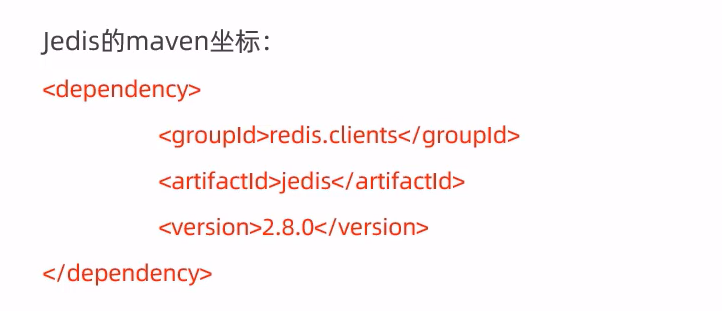

```java
//使用jedis操作redis数据库，需要1.连接数据库,2.操作数据库，3.关闭数据库
Jedis jedis = new Jedis("localhost",6379);
jedis.set("username","xiaoming");
jedis.close();
```

这就可以基本完成操作了

## 2. 使用Spring Data Redis操作（常用）

这个常常用于Spring Boot项目中使用

### 1. 坐标

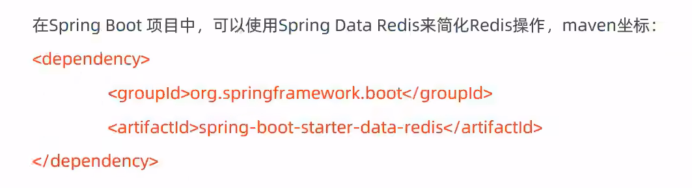


### 2. 配置

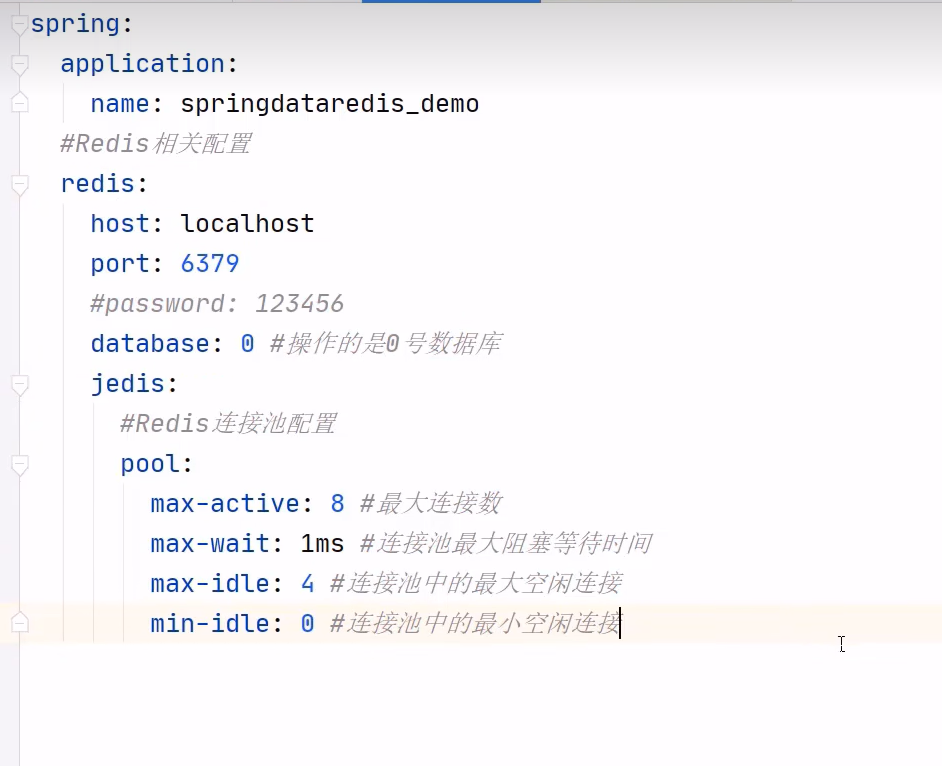

### 3. 更改框架连接redis的序列化器

1. 新建一个配置类

   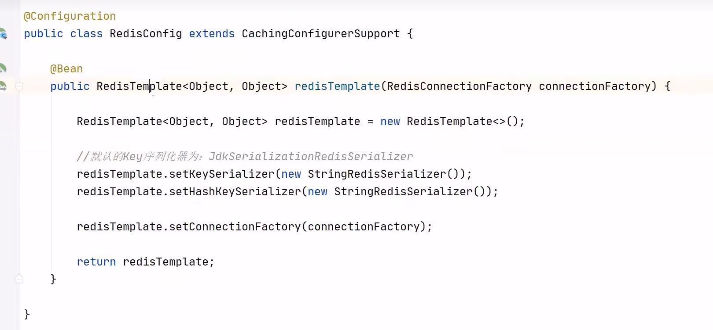

2. value值也会有默认的序列化器，但是一般不会更改，因为java读取的时候会反序列化回来，当然也可以设置更改，但是没有必要


# Spring Cache

主要是通过注解就可以实现缓存功能，不需要再写这么多redis的缓存相关的代码

## 介绍

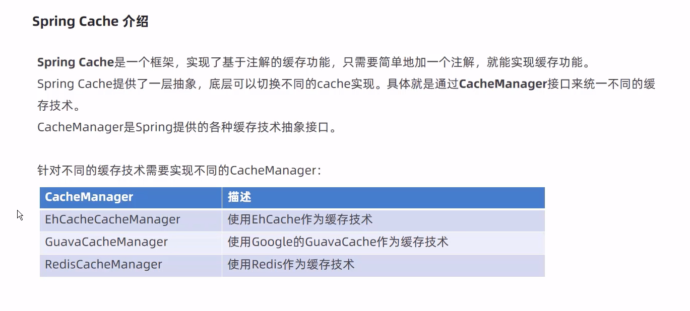

## 常用的注解

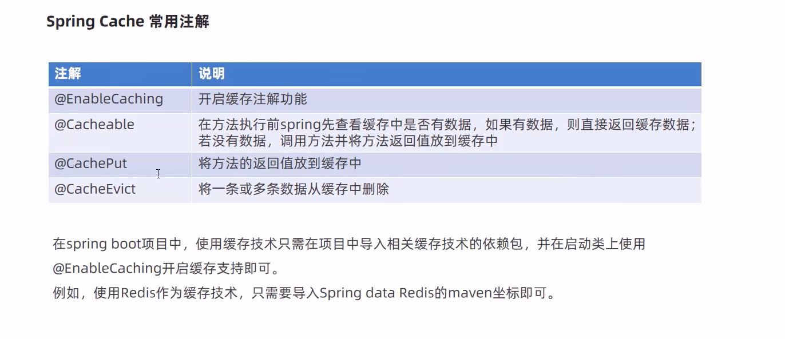

## 使用步骤

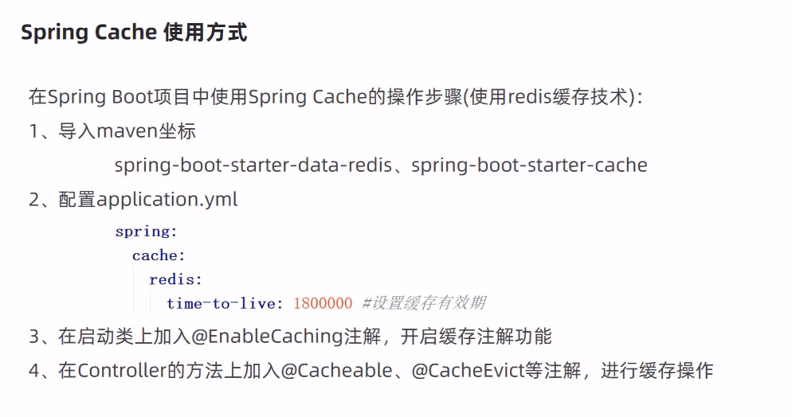


1. 首先需要导入相应的依赖，这些依赖有很多，需要根据自己用到的缓存技术进行添加，可以在网上搜一搜进行添加

2. 启动类需要加入注解@EnableCaching

3. 给需要的方法加入相应的注解，上面常用注解也提到了

   ```java
   @Service
   public class CacheDemoServiceImpl implements CacheDemoService {
   
       @Cacheable(cacheNames = "demoCache", key = "#id")
       @Override
       public Object getFromDB(Integer id) {
           System.out.println("模拟去db查询~~~" + id);
           return "hello cache...";
       }
   }
   
   ```

4. 方法的注解上还需要加入一些参数

   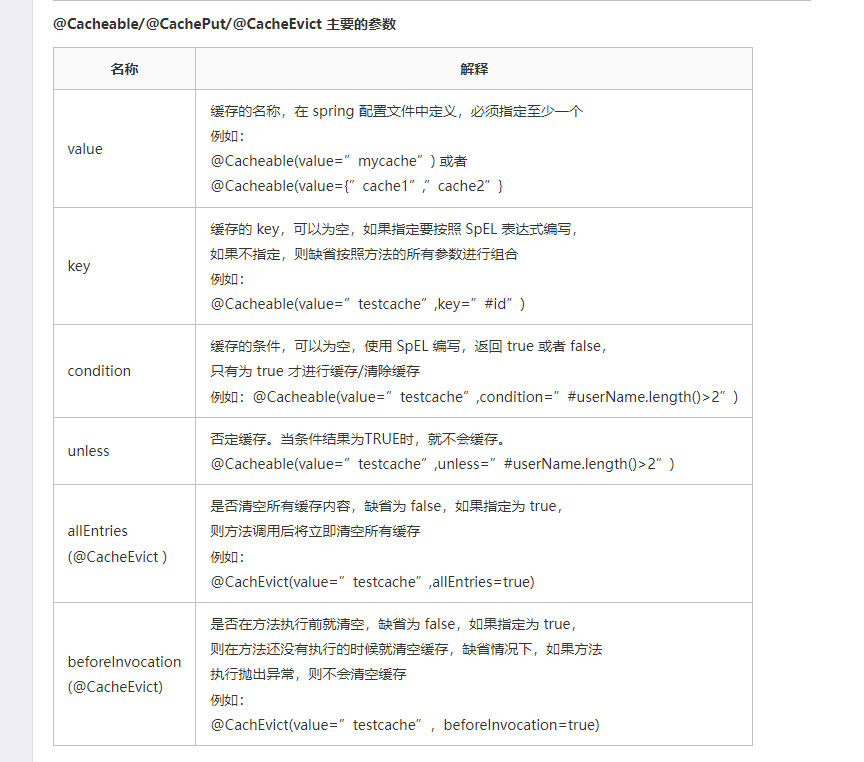

   注意要遵循SPEL上下文数据格式，**#**是不可以省略的

   


# Mysql主从复制机制

这篇学习笔记中主要是将两个服务器上的操作讲述，但是为了便于测试，组要在docker上新建两个mysql进行测试，为了更高的描述这个测试步骤，是需要搜索的，给出一个链接，当需要进行docker内测试时，可以考虑链接博客给出的步骤进行操作：https://learnku.com/articles/30439

 ## 1. 简介

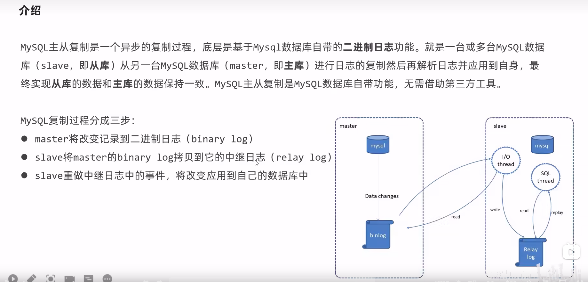

## 2. 实现步骤

首先对主库进行下面的操作

1. 配置文件更改

   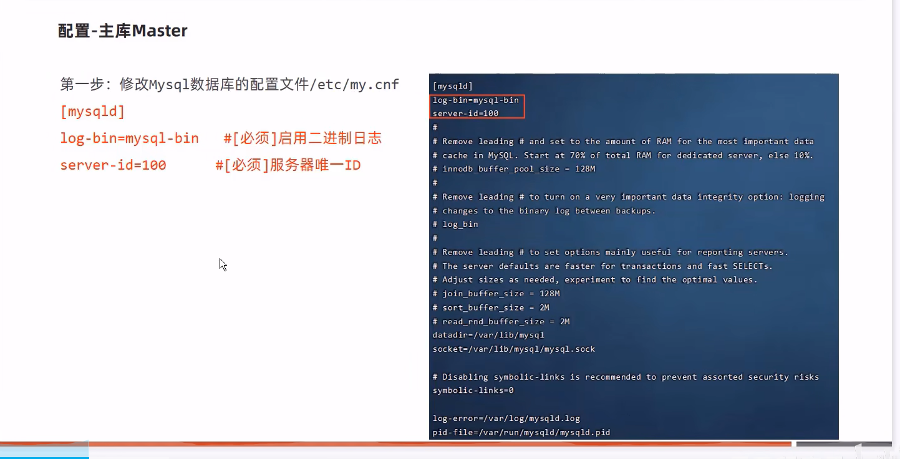

2. 重启mysql服务

   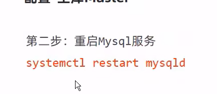

3. 创建用户，授予身份权限

   主从服务器需要有识别身份才可以拷贝二进制文件

   

4. 登录主库

   ​	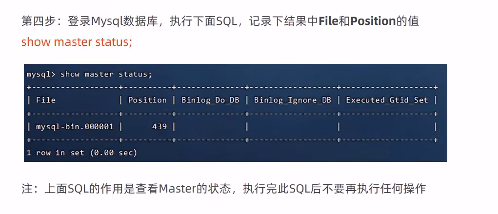

   以上是对于主库进行的操作，不需要再对主库操作，接下来需要对从库进行基本操作

   接下来是对从库进行操作

   1. 修改配置文件

      

      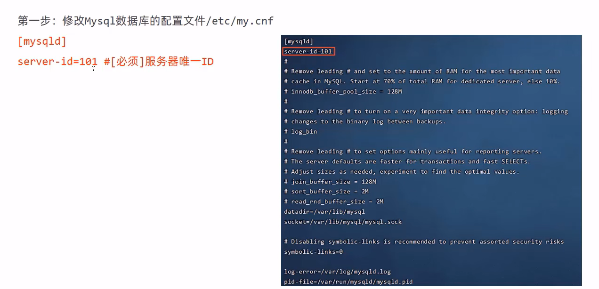

   2. 重启

      

   3. 登录进行授权配置

      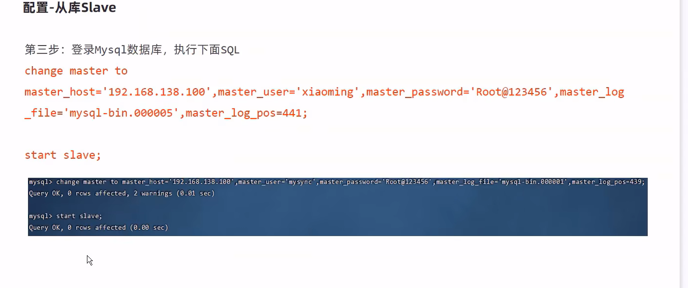

   4. 查看数据库状态

      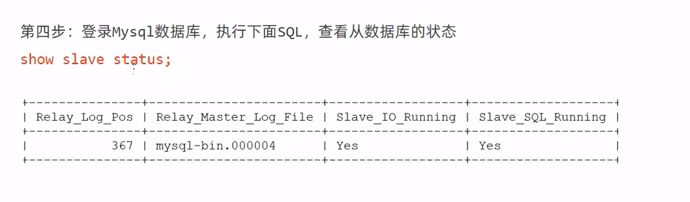

       	

## 3. 通过一个框架实现读写分离


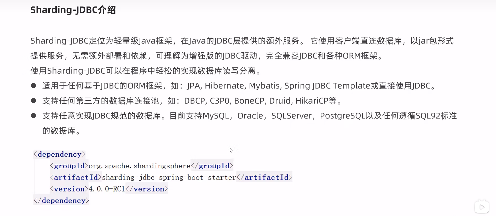

### 步骤

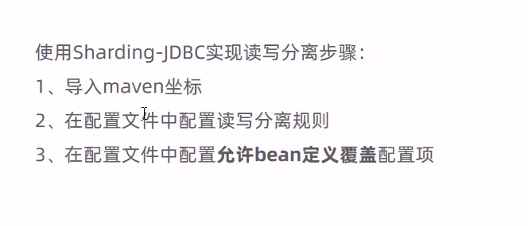

1. 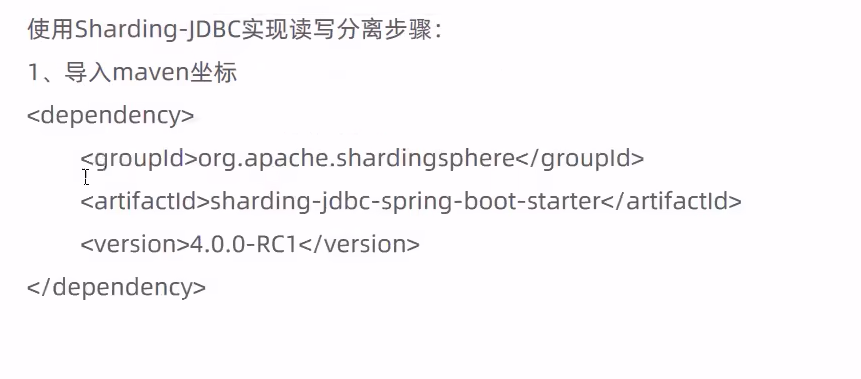

2. 配置yml文件，并且允许bean定义覆盖

   ```yaml
   spring:
     shardingsphere:
       datasource:
         names:
           master,slave
         # 主数据源
         master:
           type: com.alibaba.druid.pool.DruidDataSource
           driver-class-name: com.mysql.cj.jdbc.Driver
           url: jdbc:mysql://192.168.138.100:3306/rw?characterEncoding=utf-8
           username: root
           password: root
         # 从数据源
         slave:
           type: com.alibaba.druid.pool.DruidDataSource
           driver-class-name: com.mysql.cj.jdbc.Driver
           url: jdbc:mysql://192.168.138.101:3306/rw?characterEncoding=utf-8
           username: root
           password: root
       masterslave:
         # 读写分离配置
         load-balance-algorithm-type: round_robin
         # 最终的数据源名称
         name: dataSource
         # 主库数据源名称
         master-data-source-name: master
         # 从库数据源名称列表，多个逗号分隔
         slave-data-source-names: slave
       props:
         sql:
           show: true #开启SQL显示，默认false
     main:
       allow-bean-definition-overriding: true  # 允许相同的bean覆盖，这是因为不添加的话，在启动的时候有个两个类产生了相同名称的实体类，会因为这个报错，所以加入这一行，并且一般是必须加入的
   mybatis-plus:
     configuration:
       #在映射实体或者属性时，将数据库中表名和字段名中的下划线去掉，按照驼峰命名法映射
       map-underscore-to-camel-case: true
       log-impl: org.apache.ibatis.logging.stdout.StdOutImpl
     global-config:
       db-config:
         id-type: ASSIGN_ID
   ```

   

# NGINX代理服务器

1. 安装nginx，可以在网上搜索安装教程

2. 安装后的nginx目录结构

   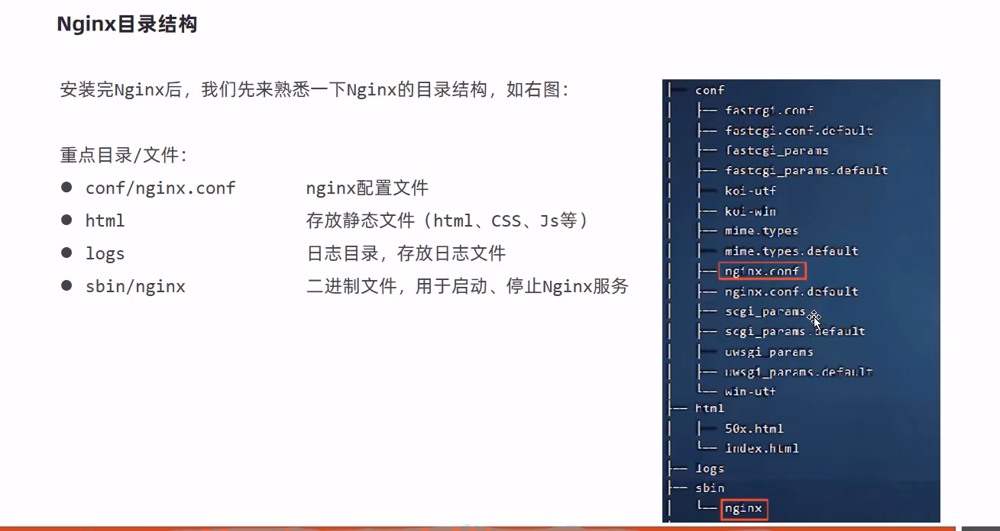

## 常用命令

这些命令需要在sbin目录下才能执行，其实只要找到sbin下的nginx文件就行，也可以使用绝对路径进行执行

1. 

   ```
   
   1. 查看版本命令
   [root@iZuf632daro7pbjy0hrxchZ sbin]# ./nginx -v
   nginx version: nginx/1.19.9
   
   2. 检查配置文件的正确性
   [root@iZuf632daro7pbjy0hrxchZ sbin]# ./nginx -t
   nginx: the configuration file /usr/local/nginxtest/conf/nginx.conf syntax is ok
   nginx: configuration file /usr/local/nginxtest/conf/nginx.conf test is successful
   
   3. 重新加载配置文件
   [root@iZuf632daro7pbjy0hrxchZ sbin]# ./nginx -s reload
   
   ```

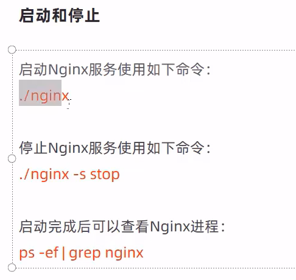


## 配置文件的结构

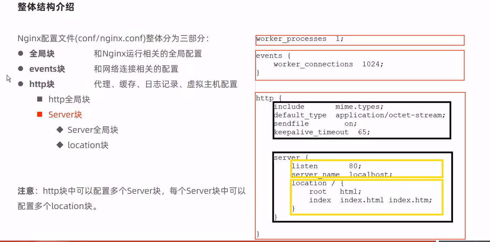

## 应用方向

1. 

2. 作为反向代理服务器

   先理解正向代理服务器

   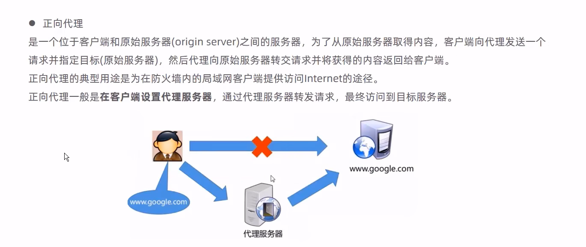

   在理解反向代理服务器

   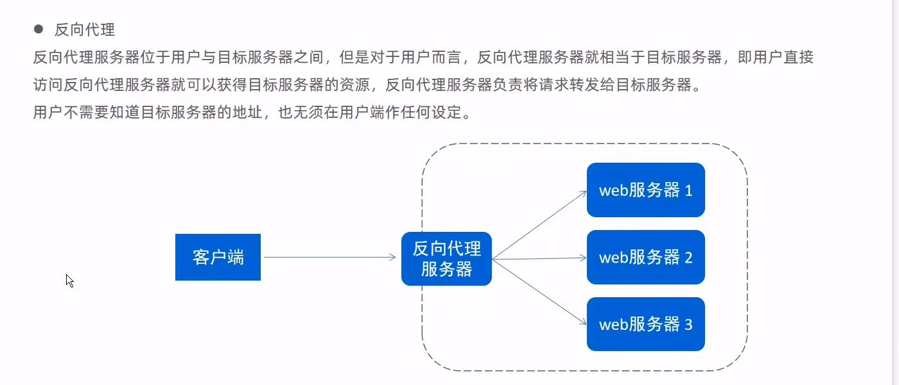

   乍一看，好像二者没有区别，真正的区别在于这个代理服务器在哪里设置的，正向代理服务器在客户端进行设置，反向代理服务器是在代理服务器进行设置的。而反向代理的功能恰好是nginx的功能应用方向之一。

   反向代理的配置形式：

   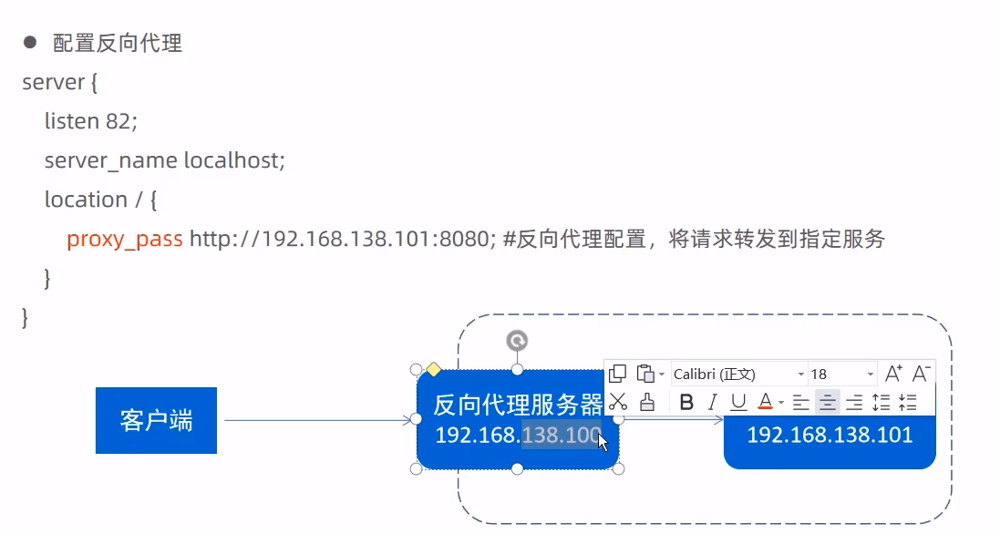

3. 负载均衡

   nginx的负载均衡就是基于反向代理进行实现的

   负载均衡的配置如下：

   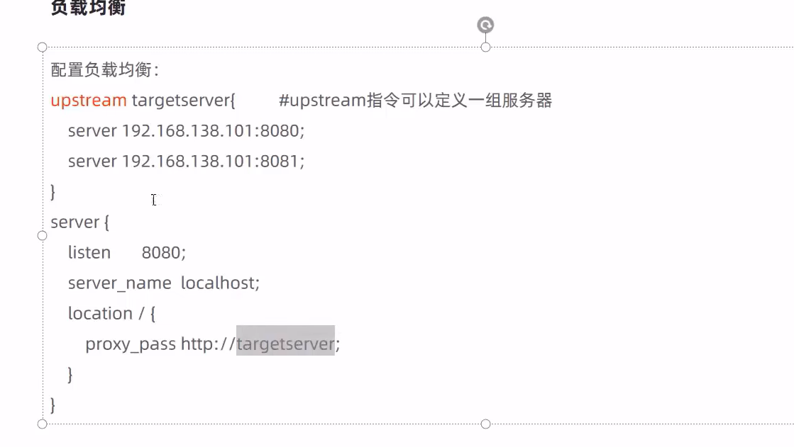

   这个配置是不全的，只是一个基本的轮询，具体的详细配置可以搜寻网络上的资料进行学习

   

   

   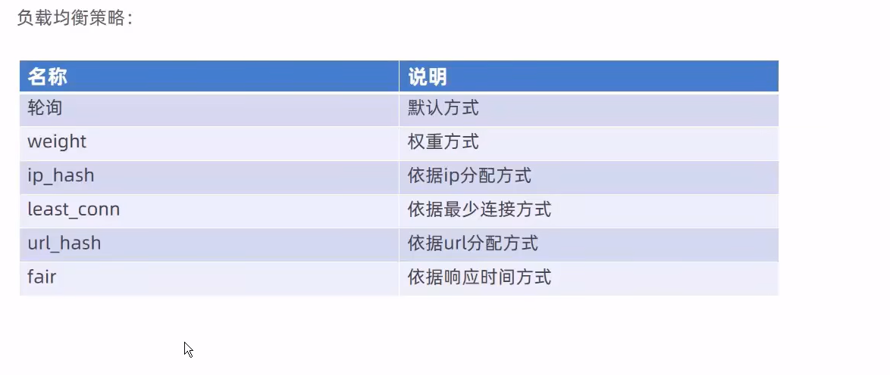


# Swagger

直接使用比较繁琐，我们使用一些完成这些接口的框架就可以了

## 1. 简介


## 2. 使用步骤

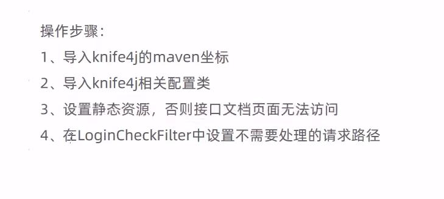

1. 导入坐标

   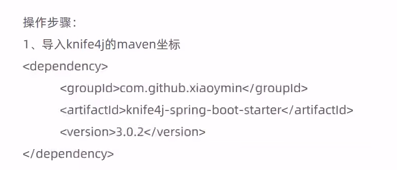

2. 创建一个配置

   一般配置的大体框架我们都写过了，这里只需要添加部分代码和注解就好了

   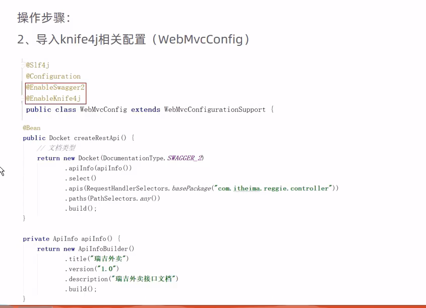

   在createRestApi方法中，basePackage中需要填入的应该是这个项目的controller所在的包。apiInfo方法只是为了描述这个项目

3. 设置静态资源映射

   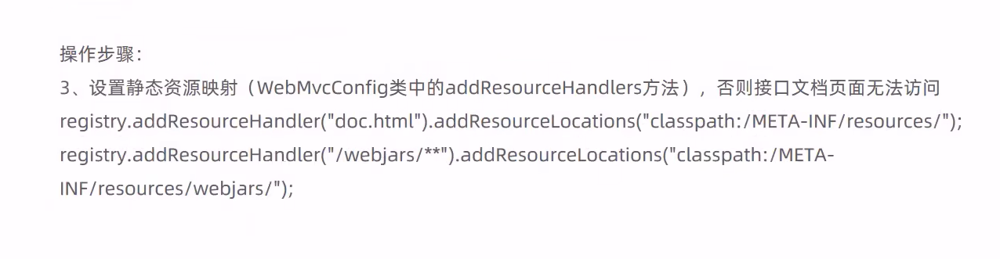

4. 避免接口文档访问被过滤器过滤

   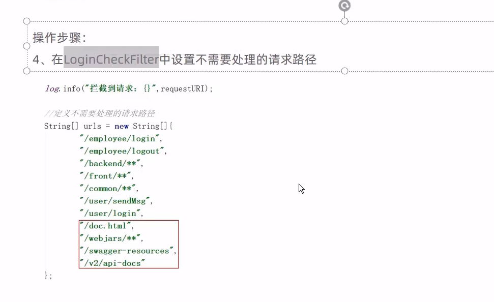

   5. 访问

      访问地址是直接找到端口，例如http://localhost:8080/doc.html   就可以进行接口测试了

## 3. 常用注解

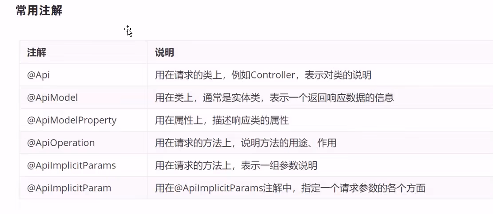

 
