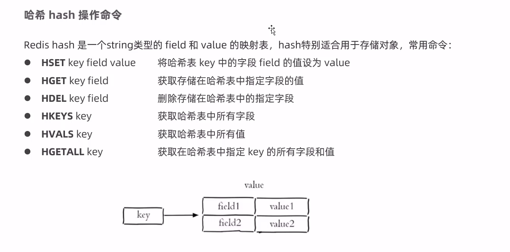
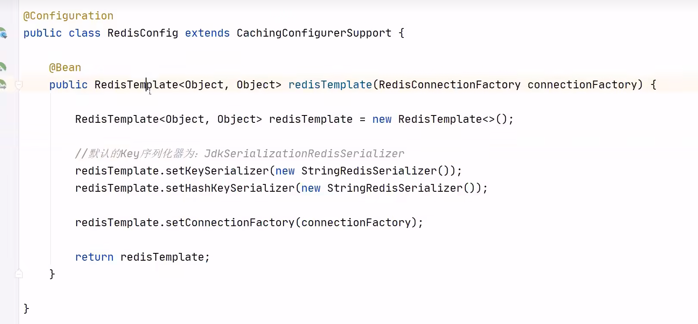
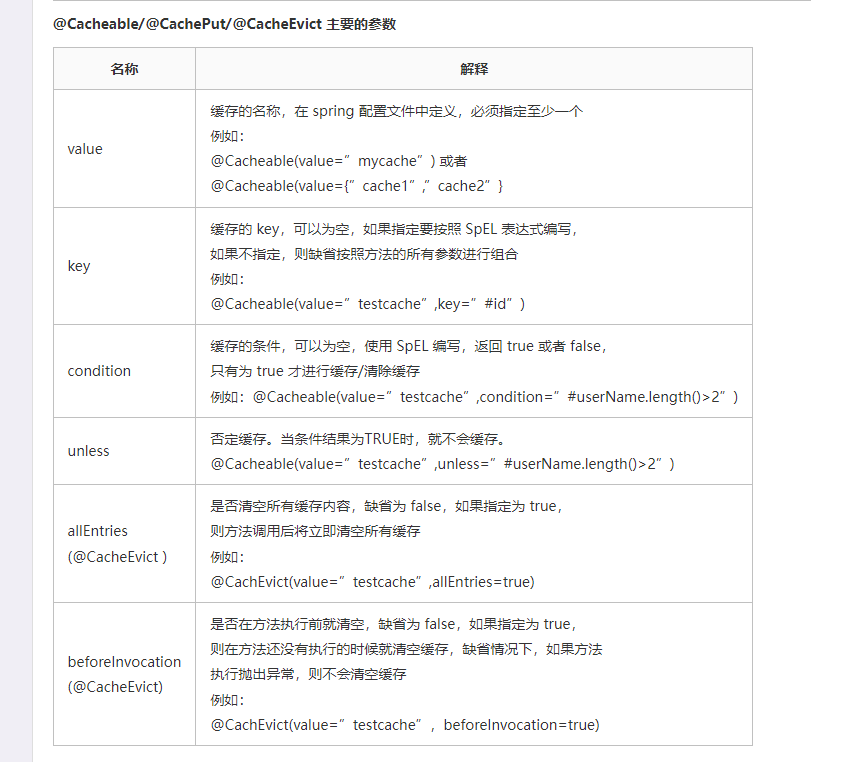
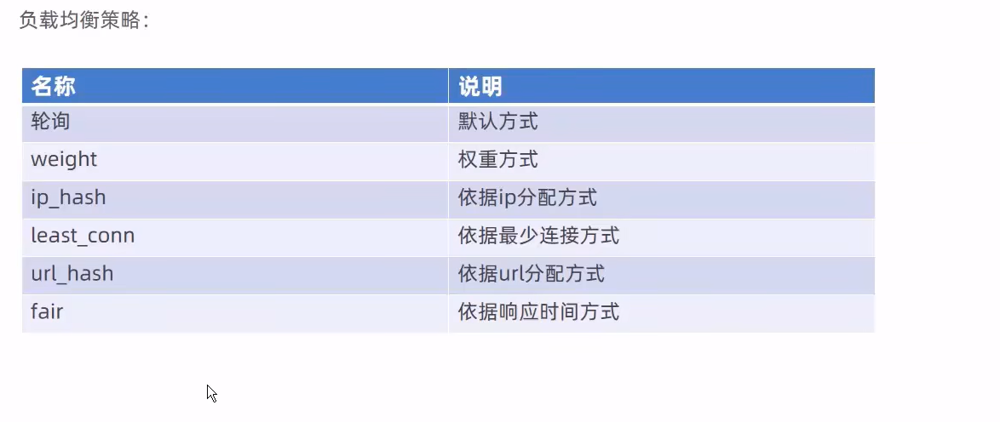
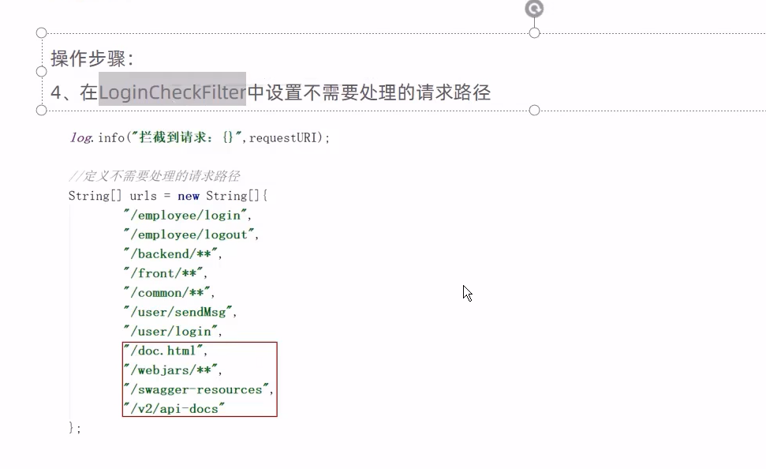
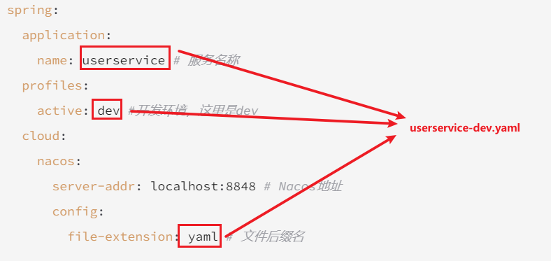
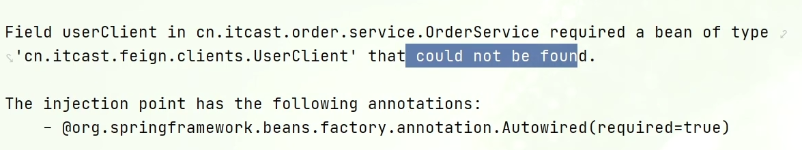
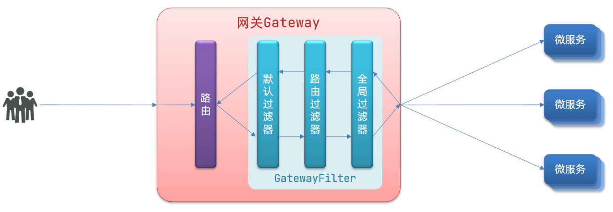
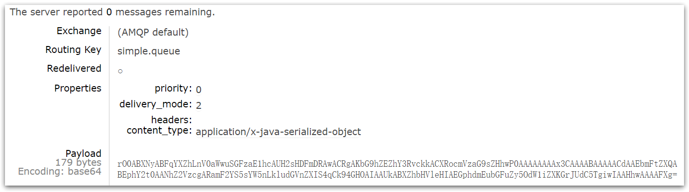

**注意**：redis默认没有密码，并且只能本地连接，想要设置密码并且可以远程连接就需要设置**配置文件** ，关于这一部分可以网上查阅资料或者观看B站进行


# 数据类型


# Redis 常用命令

删除某个key值可以使用del key命令

## 1. 字符串常用命令


## 2. 哈希常用命令（常用于存储java对象）

因为field可以存储属性，value存储属性值



## 3. 列表list常用命令


## 4. 集合set常用命令


## 5. 通用命令


# java中操作redis

## 1. 使用jedis操作数据库（不常用）


```java
//使用jedis操作redis数据库，需要1.连接数据库,2.操作数据库，3.关闭数据库
Jedis jedis = new Jedis("localhost",6379);
jedis.set("username","xiaoming");
jedis.close();
```

这就可以基本完成操作了

## 2. 使用Spring Data Redis操作（常用）

这个常常用于Spring Boot项目中使用

### 1. 坐标


### 2. 配置


### 3. 更改框架连接redis的序列化器

1. 新建一个配置类

   

2. value值也会有默认的序列化器，但是一般不会更改，因为java读取的时候会反序列化回来，当然也可以设置更改，但是没有必要


# Spring Cache

主要是通过注解就可以实现缓存功能，不需要再写这么多redis的缓存相关的代码

## 介绍


## 常用的注解


## 使用步骤


1. 首先需要导入相应的依赖，这些依赖有很多，需要根据自己用到的缓存技术进行添加，可以在网上搜一搜进行添加

2. 启动类需要加入注解@EnableCaching

3. 给需要的方法加入相应的注解，上面常用注解也提到了

   ```java
   @Service
   public class CacheDemoServiceImpl implements CacheDemoService {
   
       @Cacheable(cacheNames = "demoCache", key = "#id")
       @Override
       public Object getFromDB(Integer id) {
           System.out.println("模拟去db查询~~~" + id);
           return "hello cache...";
       }
   }
   
   ```

4. 方法的注解上还需要加入一些参数

   

   注意要遵循SPEL上下文数据格式，**#**是不可以省略的

   


# Spring  Task

Spring Task 是Spring框架提供的任务调度工具，可以按照约定的时间自动执行某个代码逻辑。


cron表达式在线生成器：https://cron.qqe2.com/

## Spring Task使用步骤：

①导入maven坐标 spring-context（已存在）

②启动类添加注解 @EnableScheduling 开启任务调度

③自定义定时任务类

给出一个简单的例子


# Web  Socket 


网上搜索教学

# Mysql主从复制机制

这篇学习笔记中主要是将两个服务器上的操作讲述，但是为了便于测试，组要在docker上新建两个mysql进行测试，为了更高的描述这个测试步骤，是需要搜索的，给出一个链接，当需要进行docker内测试时，可以考虑链接博客给出的步骤进行操作：https://learnku.com/articles/30439

 ## 1. 简介


## 2. 实现步骤

首先对主库进行下面的操作

1. 配置文件更改

   

2. 重启mysql服务

   

3. 创建用户，授予身份权限

   主从服务器需要有识别身份才可以拷贝二进制文件

   

4. 登录主库

   ​	

   以上是对于主库进行的操作，不需要再对主库操作，接下来需要对从库进行基本操作

   接下来是对从库进行操作

   1. 修改配置文件

      

      

   2. 重启

      

   3. 登录进行授权配置

      

   4. 查看数据库状态

      

       	

## 3. 通过一个框架实现读写分离


### 步骤


1. 

2. 配置yml文件，并且允许bean定义覆盖

   自动实现了对于读写操作路由到相应的数据库，无需自己指定
   
   ```yaml
   spring:
     shardingsphere:
       datasource:
         names:
           master,slave
         # 主数据源
         master:
           type: com.alibaba.druid.pool.DruidDataSource
           driver-class-name: com.mysql.cj.jdbc.Driver
           url: jdbc:mysql://192.168.138.100:3306/rw?characterEncoding=utf-8
           username: root
           password: root
         # 从数据源
         slave:
           type: com.alibaba.druid.pool.DruidDataSource
           driver-class-name: com.mysql.cj.jdbc.Driver
           url: jdbc:mysql://192.168.138.101:3306/rw?characterEncoding=utf-8
           username: root
           password: root
       masterslave:
         # 读写分离配置
         load-balance-algorithm-type: round_robin
         # 最终的数据源名称
         name: dataSource
         # 主库数据源名称
         master-data-source-name: master
         # 从库数据源名称列表，多个逗号分隔
         slave-data-source-names: slave
       props:
         sql:
           show: true #开启SQL显示，默认false
     main:
       allow-bean-definition-overriding: true  # 允许相同的bean覆盖，这是因为不添加的话，在启动的时候有个两个类产生了相同名称的实体类，会因为这个报错，所以加入这一行，并且一般是必须加入的
   mybatis-plus:
     configuration:
       #在映射实体或者属性时，将数据库中表名和字段名中的下划线去掉，按照驼峰命名法映射
       map-underscore-to-camel-case: true
       log-impl: org.apache.ibatis.logging.stdout.StdOutImpl
     global-config:
       db-config:
         id-type: ASSIGN_ID
   ```
   
   

# NGINX代理服务器

1. 安装nginx，可以在网上搜索安装教程

2. 安装后的nginx目录结构

   

## 常用命令

这些命令需要在sbin目录下才能执行，其实只要找到sbin下的nginx文件就行，也可以使用绝对路径进行执行

1. 

   ```
   
   1. 查看版本命令
   [root@iZuf632daro7pbjy0hrxchZ sbin]# ./nginx -v
   nginx version: nginx/1.19.9
   
   2. 检查配置文件的正确性
   [root@iZuf632daro7pbjy0hrxchZ sbin]# ./nginx -t
   nginx: the configuration file /usr/local/nginxtest/conf/nginx.conf syntax is ok
   nginx: configuration file /usr/local/nginxtest/conf/nginx.conf test is successful
   
   3. 重新加载配置文件
   [root@iZuf632daro7pbjy0hrxchZ sbin]# ./nginx -s reload
   
   ```


## 配置文件的结构


## 应用方向

1. 

2. 作为反向代理服务器

   先理解正向代理服务器

   

   在理解反向代理服务器

   

   乍一看，好像二者没有区别，真正的区别在于这个代理服务器在哪里设置的，正向代理服务器在客户端进行设置，反向代理服务器是在代理服务器进行设置的。而反向代理的功能恰好是nginx的功能应用方向之一。

   反向代理的配置形式：

   

3. 负载均衡

   nginx的负载均衡就是基于反向代理进行实现的

   负载均衡的配置如下：

   

   这个配置是不全的，只是一个基本的轮询，具体的详细配置可以搜寻网络上的资料进行学习

   

   

   


# Swagger

直接使用比较繁琐，我们使用一些完成这些接口的框架就可以了

## 1. 简介


## 2. 使用步骤


1. 导入坐标

   

2. 创建一个配置

   一般配置的大体框架我们都写过了，这里只需要添加部分代码和注解就好了

   

   在createRestApi方法中，basePackage中需要填入的应该是这个项目的controller所在的包。apiInfo方法只是为了描述这个项目

3. 设置静态资源映射

   

4. 避免接口文档访问被过滤器过滤

   

   5. 访问

      访问地址是直接找到端口，例如http://localhost:8080/doc.html   就可以进行接口测试了

## 3. 常用注解


  # JDBC

这门技术主要是看一下底层的连接池，自己平时查找数据库主要是使用mybatis-plus，根本不需要使用jdbc技术

简单来说就是使用JDBC的方法来连接数据库，操作数据库 的统称

## 1. 步骤

### 1.1. 静态sql（一般不建议）


下面用一个程序直接展示这个过程


```java
public class statementQueryPart {
    public static void main(String[] args) throws SQLException {
        //1.注册驱动
        DriverManager.registerDriver(new Driver());
        //2.获取链接
        Connection connection = DriverManager.
                getConnection("jdbc:mysql://114.115.137.7:3306/reggie", "root", "qwe123");
        //3.创建statement
        Statement statement = connection.createStatement();

        //4.发送sql语句，并获取返回结果
        String sql = "select * from employee";
        ResultSet resultSet = statement.executeQuery(sql);//执行的方法应该和sql语句保持一直，具体的细节可以网上搜索，有查询插入更新等操作，每个操作的具体执行方法都不一样
        //5.对结果集进行解析
        while (resultSet.next()) {//默认的游标其实指向的是第一行之前
            BigDecimal id = resultSet.getBigDecimal("id");
            String name = resultSet.getString("name");
            String username = resultSet.getString("username");
            System.out.println(id + "---" + name + "---" + username);
        }
        //6.关闭资源,注意关闭的次序和数量
        resultSet.close();
        statement.close();
        connection.close();

    }
}
```

注意这个是有缺陷的，是直接传递一个静态sql语句（希望可以是动态的sql），并且是提前拼接的sql，有可能发生注入攻击（当然jdbc可以使用预编译的sql语句进行操作），并且这个语句注册驱动注册了两次，可以使用类加载的方法只注册一次

```
Class.forName("com.mysql.cj.jdbc.Driver");//使用类加载的方法只注册了一次，具体细节需要查看源代码
```

获取连接时，url的书写格式


### 1.2. 动态预编译sql

​	

```java
public class JdbcPreparedStatementLoginPart {


    public static void main(String[] args) throws ClassNotFoundException, SQLException {

        //1.输入账号和密码
        Scanner scanner = new Scanner(System.in);
        String account = scanner.nextLine();
        String password = scanner.nextLine();
        scanner.close();

        //2.jdbc的查询使用
        //注册驱动
        Class.forName("com.mysql.cj.jdbc.Driver");

        //获取连接
        Connection connection = DriverManager.getConnection("jdbc:mysql:///atguigu", "root", "root");

        //创建preparedStatement
        //connection.createStatement();
        //TODO 需要传入SQL语句结构
        //TODO 要的是SQL语句结构，动态值的部分使用 ? ,  占位符！
        //TODO ?  不能加 '?'  ? 只能替代值，不能替代关键字和容器名
        String sql = "select * from t_user where account = ? and password = ? ;";
        PreparedStatement preparedStatement = connection.prepareStatement(sql);

        //占位符赋值
        //给占位符赋值！ 从左到右，从1开始！
        /**
         *  int 占位符的下角标
         *  object 占位符的值
         */
        preparedStatement.setObject(2,password);
        preparedStatement.setObject(1,account);

        //这哥们内部完成SQL语句拼接！
        //执行SQL语句即可
        ResultSet resultSet = preparedStatement.executeQuery();
        //preparedStatement.executeUpdate()

        //进行结果集对象解析
        if (resultSet.next()){
            //只要向下移动，就是有数据 就是登录成功！
            System.out.println("登录成功！");
        }else{
            System.out.println("登录失败！");
        }

        //关闭资源
        resultSet.close();
        preparedStatement.close();
        connection.close();
    }

}

```

这种形式是怎样防止注入攻击的呢？（下面这张图进行解释）


### 1.2. 获取新插入数据时所产生的主键

主要增加两个部分

```java
public void  returnPrimaryKey() throws Exception{

        //1.注册驱动
        Class.forName("com.mysql.cj.jdbc.Driver");
        //2.获取连接
        Connection connection = DriverManager.getConnection("jdbc:mysql:///atguigu?user=root&password=root");
        //3.编写SQL语句结构
        String sql = "insert into t_user (account,password,nickname) values (?,?,?);";
        //4.创建预编译的statement，传入SQL语句结构
        /**
         * TODO: 第二个参数填入 1 | Statement.RETURN_GENERATED_KEYS
         *       告诉statement携带回数据库生成的主键！
         */
        PreparedStatement statement = connection.prepareStatement(sql, Statement.RETURN_GENERATED_KEYS);//只是新加入一个参数既可以获得主键
        //5.占位符赋值
        statement.setObject(1,"towgog");
        statement.setObject(2,"123456");
        statement.setObject(3,"二狗子");
        //6.执行SQL语句 【注意：不需要传入SQL语句】 DML
        int i = statement.executeUpdate();
        //7.结果集解析
        System.out.println("i = " + i);

        //一行一列的数据！里面就装主键值！
        ResultSet resultSet = statement.getGeneratedKeys();
        resultSet.next();
        int anInt = resultSet.getInt(1);
        System.out.println("anInt = " + anInt);


        //8.释放资源
        statement.close();
        connection.close();
    }

```

### 1.3. 进行批量插入（大量数据插入时优化）

```java
批量细节：
     *    1.url?rewriteBatchedStatements=true
     *    2.insert 语句必须使用 values
     *    3.语句后面不能添加分号;
     *    4.语句不能直接执行，每次需要装货  addBatch() 最后 executeBatch();
     *
     * 批量插入优化！
     * @throws Exception
     */
    @Test
    public void  batchInsertYH() throws Exception{

        //1.注册驱动
        Class.forName("com.mysql.cj.jdbc.Driver");
        //2.获取连接
        Connection connection = DriverManager.getConnection("jdbc:mysql:///atguigu?rewriteBatchedStatements=true",
                "root","root");
        //3.编写SQL语句结构
        String sql = "insert into t_user (account,password,nickname) values (?,?,?)";
        //4.创建预编译的statement，传入SQL语句结构
        /**
         * TODO: 第二个参数填入 1 | Statement.RETURN_GENERATED_KEYS
         *       告诉statement携带回数据库生成的主键！
         */
        long start = System.currentTimeMillis();
        PreparedStatement statement = connection.prepareStatement(sql);
        for (int i = 0; i < 10000; i++) {

            //5.占位符赋值
            statement.setObject(1,"ergouzi"+i);
            statement.setObject(2,"lvdandan");
            statement.setObject(3,"驴蛋蛋"+i);
            //6.装车
            statement.addBatch();
        }

        //发车！ 批量操作！
        statement.executeBatch();

        long end = System.currentTimeMillis();

        System.out.println("消耗时间："+(end - start));


        //7.结果集解析

        //8.释放资源
        connection.close();
    }
```

### 1.4. 增加事务功能，保证数据一致性

重点在于关闭自动提交，执行手动提交，失败是就回滚

```java
* 转账业务方法
     * @param addAccount  加钱账号
     * @param subAccount  减钱账号
     * @param money  金额
     */
    public void transfer(String addAccount,String subAccount, int money) throws ClassNotFoundException, SQLException {

        System.out.println("addAccount = " + addAccount + ", subAccount = " + subAccount + ", money = " + money);

        //注册驱动
        Class.forName("com.mysql.cj.jdbc.Driver");

        //获取连接
        Connection connection = DriverManager.getConnection("jdbc:mysql:///atguigu", "root", "root");

        int flag = 0;

        //利用try代码块,调用dao
        try {
            //开启事务(关闭事务自动提交)
            connection.setAutoCommit(false);

            BankDao bankDao = new BankDao();
            //调用加钱 和 减钱
            bankDao.addMoney(addAccount,money,connection);//这个方法没有写，但是具体含义知道就行
            System.out.println("--------------");
            bankDao.subMoney(subAccount,money,connection);//这个方法没有写，但是具体含义知道就行
            flag = 1;
            //不报错,提交事务
            connection.commit();
        }catch (Exception e){

            //报错回滚事务
            connection.rollback();
            throw e;
        }finally {
            connection.close();
        }

        if (flag == 1){
            System.out.println("转账成功!");
        }else{
            System.out.println("转账失败!");
        }
    }
```


## 2. 使用现有工具优化JDBC操作

主要是使用**连接池**技术，这些技术都是根据java关于这个管理的规定进行实现的，这个规定其实就是一个接口:"javax.sql.DataSource",规定了获取和回收连接池的方法

直接网上搜索使用手册即可

分为硬编码和软编码，其实区别就在于是否是通过配置文件来配置，当更改配置后是否需要重新编译而已

可以通过properties结尾的配置文件进行配置，存放的就是key=value的形式

提供一种软编码来进行配置的形式（下面这种形式）


## 3. ThreadLocal存储共享变量

这是在同一个线程中所有方法获取同一个共享变量的方式，是一个很重要，必须理解的内容


# Servlet

就是一套规定的接口，规定了前后端交互的接口


# mybatis-plus

这篇笔记里面不讲语法，语法可以查看黑马程序员的相关视频和文档，给出一个链接：https://b11et3un53m.feishu.cn/wiki/PsyawI04ei2FQykqfcPcmd7Dnsc

1. 在框架中对于**公共字段**如何引入自动填充

   框架对于这些字段的填充已经给出了注解，通过注解就可以简便操作这些过程，

   ```java
   @TableField(fill = FieldFill.INSERT)
       private LocalDateTime createTime;
   
       @TableField(fill = FieldFill.INSERT_UPDATE)
       private LocalDateTime updateTime;
   
       @TableField(fill = FieldFill.INSERT)
       private Long createUser;
   
       @TableField(fill = FieldFill.INSERT_UPDATE)
       private Long updateUser;
   ```

   可以看到这些注解，其中fill指明的就是在什么作用下自动填充

   对于公共字段要如何操作还给出一个专门的类，MyMetaObjectHandler

   ```java
   @Component
   @Slf4j
   public class MyMetaObjectHandler implements MetaObjectHandler { //名字应该可以随便取
       @Override
       public void insertFill(MetaObject metaObject) {  //要执行的操作，形参是不能更改的
           metaObject.setValue("createTime", LocalDateTime.now());
           metaObject.setValue("updateTime", LocalDateTime.now());
           metaObject.setValue("createUser", BaseContext.getCurrentId());
           metaObject.setValue("updateUser", BaseContext.getCurrentId());
       }
   
       @Override
       public void updateFill(MetaObject metaObject) {  //要执行的操作，形参是不能更改的
           metaObject.setValue("updateTime", LocalDateTime.now());
           metaObject.setValue("updateUser", BaseContext.getCurrentId());
   
       }
   }
   ```

2. 给出一个配置类   MybatisPlusConfig

   ```java
   @Configuration
   public class MybatisPlusConfig {//名字不知道能否随便取
       //但是功能就是将我们上面指定的操作类要注入到mp框架中或者说要加入ioc容器中
   
       @Bean
       public MybatisPlusInterceptor mybatisPlusInterceptor(){
           MybatisPlusInterceptor mybatisPlusInterceptor = new MybatisPlusInterceptor();
           mybatisPlusInterceptor.addInnerInterceptor(new PaginationInnerInterceptor());
           return mybatisPlusInterceptor;
       }
   
   }
   ```


# Spring  Cloud

## 一、服务远程调用

### 1. 步骤

这种方式与语言没有关系，只要知道请求路径就可以实现这种调用


## 二、Eureka注册中心

为了将上面的服务远程调用不硬编码在代码中，使用到了我们的注册中心。

提供者启动时，就会每隔30s向注册中心发送一次注册（表示自己的接口是可用的），消费者直接向注册中心索要接口就可以调用了，当然，因为提供者有很多，可以按照一定的策略来寻找所需的接口，这就用到了负载均衡的策略。


## 1. 使用步骤

1. 

   指定了eureka服务的地址微服务的名称

   发现eureka会把自己也注册进入到eureka了，其实因为eureka是一个微服务，我们的eureka注册中心需要把所有的微服务都注册进去。

2. 查看界面

   

3. 注册微服务进入到eureka

   在需要注册的服务中进行以下步骤：

   可以发现，引入的依赖和上面的是不一样的，因为我们是客户端要注册到eureka中 

   

4. 完成服务的拉取

   因为后端服务需要动态的知晓自己请求的ip，这就需要拉取那些在eureka中注册的接口

   

   

   步骤：

   注意指代地址的时候是由 **//** 组成的

   

## 三、Ribbon负载均衡

上面的微服务中看到，order-service请求url时，我们可以看到url本身字面地址是无法访问的，需要映射到正确的ip和端口，这时候就需要用到我们的ribbon组件，当服务发出请求，会被这个组件拦下，映射到正确的端口ip上去。


上面是一个简单的示意图，下面给出一个**详细的示意图**


 

想要更改负载均衡的策略，就需要注意IRule接口


可以看看实现类中所拥有的策略方案

### 1. 方案


### 2. 配置

如何配置负载均衡的规则呢？有两种方式


对于第一种，这是全局的，就是在order-service中不管你调用其他那个服务的接口，都是按照这种规则进行的。

对于第二种方式，仅仅order-service调用userservie时才会执行这种负载均衡规则

### 3. 饥饿加载

这个是为了快速启动ribbon


这其中还制定了对于那些服务进行饥饿加载，注意书写模式，当只指定了对于一个服务进行饥饿加载，那么可以直接写，但是如果有多个服务就需要注意用下面这种格式


## 四、 Nacos注册中心

可能存在疑问，不是已经有Eureka注册中心了吗？Nacos是阿里巴巴的，现在已经成为了SpringCloud的一个组件，**功能更加丰富**，并且受欢迎程度很高，所以学习一下

### 1. 安装

已经在学习笔记中给出了详细的安装步骤，可以取安装文件夹内寻找(后面给出一个**链接**)：<a href="../安装步骤/Nacos安装步骤">Nacos安装步骤</a>

发现这个组件不是内嵌在springboot中的，而是需要我们额外启动的

### 2. 步骤

注意管理依赖是添加在<dependencyManagement>标签内的


### 3. 分级模型


配置集群属性


如何让微服务调用其他服务的接口时优先选择同一集群下的地址呢？这就需要修改负载均衡的规则来进行


这种配置的负载均衡规则就是优先选择和本服务相同的集群服务进行通信，但是在本集群内的多个服务进行选择时，其实是随机进行选择的，当本地集群没有时才会选择跨集群访问其他集群的服务，会出现警告，告诉你发生了跨集群访问

### 4. 权重负载均衡

上面显示优先选择近的集群，但是同一个集群内服务器的性能也不一样，这个时候就需要我们进行权重配置，让好服务器承担更多的任务


### 5. 环境隔离

为什么会有隔离呢？这是因为我们存在开发环境、测试环境、生产环境，所以出现了隔离。


#### 5.1.创建namespace

默认情况下，所有service、data、group都在同一个namespace，名为public：


我们可以点击页面新增按钮，添加一个namespace：


然后，填写表单：


就能在页面看到一个新的namespace：


#### 5.2 .给微服务配置namespace

给微服务配置namespace只能通过修改配置来实现。

例如，修改order-service的application.yml文件：

```yaml
spring:
  cloud:
    nacos:
      server-addr: localhost:8848
      discovery:
        cluster-name: HZ
        namespace: 492a7d5d-237b-46a1-a99a-fa8e98e4b0f9 # 命名空间，填ID
```

我们的userservice没有更改命名空间，是不会被orderservice寻找到的

重启order-service后，访问控制台，可以看到下面的结果：


此时访问order-service，因为namespace不同，会导致找不到userservice，控制台会报错：


### 6.Nacos与Eureka的区别

Nacos的服务实例分为两种l类型：

- 临时实例：如果实例宕机超过一定时间，会从服务列表剔除，默认的类型。

- 非临时实例：如果实例宕机，不会从服务列表剔除，也可以叫永久实例。


配置一个服务实例为永久实例：

```yaml
spring:
  cloud:
    nacos:
      discovery:
        ephemeral: false # 设置为非临时实例
```


Nacos和Eureka整体结构类似，服务注册、服务拉取、心跳等待，但是也存在一些差异：


- Nacos与eureka的共同点
  - 都支持服务注册和服务拉取
  - 都支持服务提供者心跳方式做健康检测

- Nacos与Eureka的区别
  - Nacos支持服务端主动检测提供者状态：临时实例采用心跳模式，非临时实例采用主动检测模式
  - 临时实例心跳不正常会被剔除，非临时实例则不会被剔除,会等到实例恢复
  - Nacos支持服务列表变更的消息推送模式，服务列表更新更及时
  - Nacos集群默认采用AP（强调可用性）方式，当集群中存在非临时实例时，采用CP（强调可靠性）模式；Eureka采用AP方式

## 五.Nacos配置管理 


Nacos除了可以做注册中心，同样可以做配置管理来使用。

### 1. 在nacos中添加配置文件

如何在nacos中管理配置呢？


然后在弹出的表单中，填写配置信息：


> 注意：项目的核心配置，需要热更新的配置才有放到nacos管理的必要。基本不会变更的一些配置还是保存在微服务本地比较好。

### 2.从微服务拉取配置

微服务要拉取nacos中管理的配置，并且与本地的application.yml配置合并，才能完成项目启动。

但如果尚未读取application.yml，又如何得知nacos地址呢？

因此spring引入了一种新的配置文件：bootstrap.yaml文件，会在application.yml之前被读取，流程如下：


1）引入nacos-config依赖

首先，在user-service服务中，引入nacos-config的客户端依赖：

```xml
<!--nacos配置管理依赖-->
<dependency>
    <groupId>com.alibaba.cloud</groupId>
    <artifactId>spring-cloud-starter-alibaba-nacos-config</artifactId>
</dependency>
```

2）添加bootstrap.yaml

然后，在user-service中添加一个bootstrap.yaml文件，内容如下：

```yaml
spring:
  application:
    name: userservice # 服务名称
  profiles:
    active: dev #开发环境，这里是dev 
  cloud:
    nacos:
      server-addr: localhost:8848 # Nacos地址
      config:
        file-extension: yaml # 文件后缀名
```

这里会根据spring.cloud.nacos.server-addr获取nacos地址，再根据

`${spring.application.name}-${spring.profiles.active}.${spring.cloud.nacos.config.file-extension}`作为文件id，来读取配置。

本例中，就是去读取`userservice-dev.yaml`：




3）读取nacos配置

在user-service中的UserController中添加业务逻辑，读取pattern.dateformat配置：


完整代码：

```java
package cn.itcast.user.web;

import cn.itcast.user.pojo.User;
import cn.itcast.user.service.UserService;
import lombok.extern.slf4j.Slf4j;
import org.springframework.beans.factory.annotation.Autowired;
import org.springframework.beans.factory.annotation.Value;
import org.springframework.web.bind.annotation.*;

import java.time.LocalDateTime;
import java.time.format.DateTimeFormatter;

@Slf4j
@RestController
@RequestMapping("/user")
public class UserController {

    @Autowired
    private UserService userService;

    @Value("${pattern.dateformat}")
    private String dateformat;
    
    @GetMapping("now")
    public String now(){
        return LocalDateTime.now().format(DateTimeFormatter.ofPattern(dateformat));
    }
    // ...略
}
```


在页面访问，可以看到效果：


### 3.配置热更新

我们最终的目的，是修改nacos中的配置后，微服务中无需重启即可让配置生效，也就是**配置热更新**。


要实现配置热更新，可以使用两种方式：

#### 3.1.方式一

在@Value注入的变量所在类上添加注解@RefreshScope：


#### 32.方式二

使用@ConfigurationProperties注解代替@Value注解。

在user-service服务中，添加一个类，读取patterrn.dateformat属性：

```java
package cn.itcast.user.config;

import lombok.Data;
import org.springframework.boot.context.properties.ConfigurationProperties;
import org.springframework.stereotype.Component;

@Component
@Data
@ConfigurationProperties(prefix = "pattern")
public class PatternProperties {
    private String dateformat;
}
```


在UserController中使用这个类代替@Value：


完整代码：

```java
package cn.itcast.user.web;

import cn.itcast.user.config.PatternProperties;
import cn.itcast.user.pojo.User;
import cn.itcast.user.service.UserService;
import lombok.extern.slf4j.Slf4j;
import org.springframework.beans.factory.annotation.Autowired;
import org.springframework.web.bind.annotation.GetMapping;
import org.springframework.web.bind.annotation.PathVariable;
import org.springframework.web.bind.annotation.RequestMapping;
import org.springframework.web.bind.annotation.RestController;

import java.time.LocalDateTime;
import java.time.format.DateTimeFormatter;

@Slf4j
@RestController
@RequestMapping("/user")
public class UserController {

    @Autowired
    private UserService userService;

    @Autowired
    private PatternProperties patternProperties;

    @GetMapping("now")
    public String now(){
        return LocalDateTime.now().format(DateTimeFormatter.ofPattern(patternProperties.getDateformat()));
    }

    // 略
}
```


### 4.配置共享的优先级

当nacos、服务本地同时出现相同属性时，优先级有高低之分：


## 六、Nacos集群搭建


### 1.集群结构图

官方给出的Nacos集群图：


其中包含3个nacos节点，然后一个负载均衡器代理3个Nacos。这里负载均衡器可以使用nginx。

我们计划的集群结构：


三个nacos节点的地址：

| 节点   | ip            | port |
| ------ | ------------- | ---- |
| nacos1 | 192.168.150.1 | 8845 |
| nacos2 | 192.168.150.1 | 8846 |
| nacos3 | 192.168.150.1 | 8847 |


### 2.搭建集群

搭建集群的基本步骤：

- 搭建数据库，初始化数据库表结构
- 下载nacos安装包
- 配置nacos
- 启动nacos集群
- nginx反向代理


#### 2.1.初始化数据库

Nacos默认数据存储在内嵌数据库Derby中，不属于生产可用的数据库。

官方推荐的最佳实践是使用带有主从的高可用数据库集群，主从模式的高可用数据库可以参考**传智教育**的后续高手课程。

这里我们以单点的数据库为例来讲解。

首先新建一个数据库，命名为nacos，而后导入下面的SQL：

```sql
CREATE TABLE `config_info` (
  `id` bigint(20) NOT NULL AUTO_INCREMENT COMMENT 'id',
  `data_id` varchar(255) NOT NULL COMMENT 'data_id',
  `group_id` varchar(255) DEFAULT NULL,
  `content` longtext NOT NULL COMMENT 'content',
  `md5` varchar(32) DEFAULT NULL COMMENT 'md5',
  `gmt_create` datetime NOT NULL DEFAULT CURRENT_TIMESTAMP COMMENT '创建时间',
  `gmt_modified` datetime NOT NULL DEFAULT CURRENT_TIMESTAMP COMMENT '修改时间',
  `src_user` text COMMENT 'source user',
  `src_ip` varchar(50) DEFAULT NULL COMMENT 'source ip',
  `app_name` varchar(128) DEFAULT NULL,
  `tenant_id` varchar(128) DEFAULT '' COMMENT '租户字段',
  `c_desc` varchar(256) DEFAULT NULL,
  `c_use` varchar(64) DEFAULT NULL,
  `effect` varchar(64) DEFAULT NULL,
  `type` varchar(64) DEFAULT NULL,
  `c_schema` text,
  PRIMARY KEY (`id`),
  UNIQUE KEY `uk_configinfo_datagrouptenant` (`data_id`,`group_id`,`tenant_id`)
) ENGINE=InnoDB DEFAULT CHARSET=utf8 COLLATE=utf8_bin COMMENT='config_info';

/******************************************/
/*   数据库全名 = nacos_config   */
/*   表名称 = config_info_aggr   */
/******************************************/
CREATE TABLE `config_info_aggr` (
  `id` bigint(20) NOT NULL AUTO_INCREMENT COMMENT 'id',
  `data_id` varchar(255) NOT NULL COMMENT 'data_id',
  `group_id` varchar(255) NOT NULL COMMENT 'group_id',
  `datum_id` varchar(255) NOT NULL COMMENT 'datum_id',
  `content` longtext NOT NULL COMMENT '内容',
  `gmt_modified` datetime NOT NULL COMMENT '修改时间',
  `app_name` varchar(128) DEFAULT NULL,
  `tenant_id` varchar(128) DEFAULT '' COMMENT '租户字段',
  PRIMARY KEY (`id`),
  UNIQUE KEY `uk_configinfoaggr_datagrouptenantdatum` (`data_id`,`group_id`,`tenant_id`,`datum_id`)
) ENGINE=InnoDB DEFAULT CHARSET=utf8 COLLATE=utf8_bin COMMENT='增加租户字段';


/******************************************/
/*   数据库全名 = nacos_config   */
/*   表名称 = config_info_beta   */
/******************************************/
CREATE TABLE `config_info_beta` (
  `id` bigint(20) NOT NULL AUTO_INCREMENT COMMENT 'id',
  `data_id` varchar(255) NOT NULL COMMENT 'data_id',
  `group_id` varchar(128) NOT NULL COMMENT 'group_id',
  `app_name` varchar(128) DEFAULT NULL COMMENT 'app_name',
  `content` longtext NOT NULL COMMENT 'content',
  `beta_ips` varchar(1024) DEFAULT NULL COMMENT 'betaIps',
  `md5` varchar(32) DEFAULT NULL COMMENT 'md5',
  `gmt_create` datetime NOT NULL DEFAULT CURRENT_TIMESTAMP COMMENT '创建时间',
  `gmt_modified` datetime NOT NULL DEFAULT CURRENT_TIMESTAMP COMMENT '修改时间',
  `src_user` text COMMENT 'source user',
  `src_ip` varchar(50) DEFAULT NULL COMMENT 'source ip',
  `tenant_id` varchar(128) DEFAULT '' COMMENT '租户字段',
  PRIMARY KEY (`id`),
  UNIQUE KEY `uk_configinfobeta_datagrouptenant` (`data_id`,`group_id`,`tenant_id`)
) ENGINE=InnoDB DEFAULT CHARSET=utf8 COLLATE=utf8_bin COMMENT='config_info_beta';

/******************************************/
/*   数据库全名 = nacos_config   */
/*   表名称 = config_info_tag   */
/******************************************/
CREATE TABLE `config_info_tag` (
  `id` bigint(20) NOT NULL AUTO_INCREMENT COMMENT 'id',
  `data_id` varchar(255) NOT NULL COMMENT 'data_id',
  `group_id` varchar(128) NOT NULL COMMENT 'group_id',
  `tenant_id` varchar(128) DEFAULT '' COMMENT 'tenant_id',
  `tag_id` varchar(128) NOT NULL COMMENT 'tag_id',
  `app_name` varchar(128) DEFAULT NULL COMMENT 'app_name',
  `content` longtext NOT NULL COMMENT 'content',
  `md5` varchar(32) DEFAULT NULL COMMENT 'md5',
  `gmt_create` datetime NOT NULL DEFAULT CURRENT_TIMESTAMP COMMENT '创建时间',
  `gmt_modified` datetime NOT NULL DEFAULT CURRENT_TIMESTAMP COMMENT '修改时间',
  `src_user` text COMMENT 'source user',
  `src_ip` varchar(50) DEFAULT NULL COMMENT 'source ip',
  PRIMARY KEY (`id`),
  UNIQUE KEY `uk_configinfotag_datagrouptenanttag` (`data_id`,`group_id`,`tenant_id`,`tag_id`)
) ENGINE=InnoDB DEFAULT CHARSET=utf8 COLLATE=utf8_bin COMMENT='config_info_tag';

/******************************************/
/*   数据库全名 = nacos_config   */
/*   表名称 = config_tags_relation   */
/******************************************/
CREATE TABLE `config_tags_relation` (
  `id` bigint(20) NOT NULL COMMENT 'id',
  `tag_name` varchar(128) NOT NULL COMMENT 'tag_name',
  `tag_type` varchar(64) DEFAULT NULL COMMENT 'tag_type',
  `data_id` varchar(255) NOT NULL COMMENT 'data_id',
  `group_id` varchar(128) NOT NULL COMMENT 'group_id',
  `tenant_id` varchar(128) DEFAULT '' COMMENT 'tenant_id',
  `nid` bigint(20) NOT NULL AUTO_INCREMENT,
  PRIMARY KEY (`nid`),
  UNIQUE KEY `uk_configtagrelation_configidtag` (`id`,`tag_name`,`tag_type`),
  KEY `idx_tenant_id` (`tenant_id`)
) ENGINE=InnoDB DEFAULT CHARSET=utf8 COLLATE=utf8_bin COMMENT='config_tag_relation';

/******************************************/
/*   数据库全名 = nacos_config   */
/*   表名称 = group_capacity   */
/******************************************/
CREATE TABLE `group_capacity` (
  `id` bigint(20) unsigned NOT NULL AUTO_INCREMENT COMMENT '主键ID',
  `group_id` varchar(128) NOT NULL DEFAULT '' COMMENT 'Group ID，空字符表示整个集群',
  `quota` int(10) unsigned NOT NULL DEFAULT '0' COMMENT '配额，0表示使用默认值',
  `usage` int(10) unsigned NOT NULL DEFAULT '0' COMMENT '使用量',
  `max_size` int(10) unsigned NOT NULL DEFAULT '0' COMMENT '单个配置大小上限，单位为字节，0表示使用默认值',
  `max_aggr_count` int(10) unsigned NOT NULL DEFAULT '0' COMMENT '聚合子配置最大个数，，0表示使用默认值',
  `max_aggr_size` int(10) unsigned NOT NULL DEFAULT '0' COMMENT '单个聚合数据的子配置大小上限，单位为字节，0表示使用默认值',
  `max_history_count` int(10) unsigned NOT NULL DEFAULT '0' COMMENT '最大变更历史数量',
  `gmt_create` datetime NOT NULL DEFAULT CURRENT_TIMESTAMP COMMENT '创建时间',
  `gmt_modified` datetime NOT NULL DEFAULT CURRENT_TIMESTAMP COMMENT '修改时间',
  PRIMARY KEY (`id`),
  UNIQUE KEY `uk_group_id` (`group_id`)
) ENGINE=InnoDB DEFAULT CHARSET=utf8 COLLATE=utf8_bin COMMENT='集群、各Group容量信息表';

/******************************************/
/*   数据库全名 = nacos_config   */
/*   表名称 = his_config_info   */
/******************************************/
CREATE TABLE `his_config_info` (
  `id` bigint(64) unsigned NOT NULL,
  `nid` bigint(20) unsigned NOT NULL AUTO_INCREMENT,
  `data_id` varchar(255) NOT NULL,
  `group_id` varchar(128) NOT NULL,
  `app_name` varchar(128) DEFAULT NULL COMMENT 'app_name',
  `content` longtext NOT NULL,
  `md5` varchar(32) DEFAULT NULL,
  `gmt_create` datetime NOT NULL DEFAULT CURRENT_TIMESTAMP,
  `gmt_modified` datetime NOT NULL DEFAULT CURRENT_TIMESTAMP,
  `src_user` text,
  `src_ip` varchar(50) DEFAULT NULL,
  `op_type` char(10) DEFAULT NULL,
  `tenant_id` varchar(128) DEFAULT '' COMMENT '租户字段',
  PRIMARY KEY (`nid`),
  KEY `idx_gmt_create` (`gmt_create`),
  KEY `idx_gmt_modified` (`gmt_modified`),
  KEY `idx_did` (`data_id`)
) ENGINE=InnoDB DEFAULT CHARSET=utf8 COLLATE=utf8_bin COMMENT='多租户改造';


/******************************************/
/*   数据库全名 = nacos_config   */
/*   表名称 = tenant_capacity   */
/******************************************/
CREATE TABLE `tenant_capacity` (
  `id` bigint(20) unsigned NOT NULL AUTO_INCREMENT COMMENT '主键ID',
  `tenant_id` varchar(128) NOT NULL DEFAULT '' COMMENT 'Tenant ID',
  `quota` int(10) unsigned NOT NULL DEFAULT '0' COMMENT '配额，0表示使用默认值',
  `usage` int(10) unsigned NOT NULL DEFAULT '0' COMMENT '使用量',
  `max_size` int(10) unsigned NOT NULL DEFAULT '0' COMMENT '单个配置大小上限，单位为字节，0表示使用默认值',
  `max_aggr_count` int(10) unsigned NOT NULL DEFAULT '0' COMMENT '聚合子配置最大个数',
  `max_aggr_size` int(10) unsigned NOT NULL DEFAULT '0' COMMENT '单个聚合数据的子配置大小上限，单位为字节，0表示使用默认值',
  `max_history_count` int(10) unsigned NOT NULL DEFAULT '0' COMMENT '最大变更历史数量',
  `gmt_create` datetime NOT NULL DEFAULT CURRENT_TIMESTAMP COMMENT '创建时间',
  `gmt_modified` datetime NOT NULL DEFAULT CURRENT_TIMESTAMP COMMENT '修改时间',
  PRIMARY KEY (`id`),
  UNIQUE KEY `uk_tenant_id` (`tenant_id`)
) ENGINE=InnoDB DEFAULT CHARSET=utf8 COLLATE=utf8_bin COMMENT='租户容量信息表';


CREATE TABLE `tenant_info` (
  `id` bigint(20) NOT NULL AUTO_INCREMENT COMMENT 'id',
  `kp` varchar(128) NOT NULL COMMENT 'kp',
  `tenant_id` varchar(128) default '' COMMENT 'tenant_id',
  `tenant_name` varchar(128) default '' COMMENT 'tenant_name',
  `tenant_desc` varchar(256) DEFAULT NULL COMMENT 'tenant_desc',
  `create_source` varchar(32) DEFAULT NULL COMMENT 'create_source',
  `gmt_create` bigint(20) NOT NULL COMMENT '创建时间',
  `gmt_modified` bigint(20) NOT NULL COMMENT '修改时间',
  PRIMARY KEY (`id`),
  UNIQUE KEY `uk_tenant_info_kptenantid` (`kp`,`tenant_id`),
  KEY `idx_tenant_id` (`tenant_id`)
) ENGINE=InnoDB DEFAULT CHARSET=utf8 COLLATE=utf8_bin COMMENT='tenant_info';

CREATE TABLE `users` (
	`username` varchar(50) NOT NULL PRIMARY KEY,
	`password` varchar(500) NOT NULL,
	`enabled` boolean NOT NULL
);

CREATE TABLE `roles` (
	`username` varchar(50) NOT NULL,
	`role` varchar(50) NOT NULL,
	UNIQUE INDEX `idx_user_role` (`username` ASC, `role` ASC) USING BTREE
);

CREATE TABLE `permissions` (
    `role` varchar(50) NOT NULL,
    `resource` varchar(255) NOT NULL,
    `action` varchar(8) NOT NULL,
    UNIQUE INDEX `uk_role_permission` (`role`,`resource`,`action`) USING BTREE
);

INSERT INTO users (username, password, enabled) VALUES ('nacos', '$2a$10$EuWPZHzz32dJN7jexM34MOeYirDdFAZm2kuWj7VEOJhhZkDrxfvUu', TRUE);

INSERT INTO roles (username, role) VALUES ('nacos', 'ROLE_ADMIN');
```


#### 2.2.下载nacos

nacos在GitHub上有下载地址：https://github.com/alibaba/nacos/tags，可以选择任意版本下载。

本例中才用1.4.1版本：


#### 2.3.配置Nacos

将这个包解压到任意非中文目录下，如图：


目录说明：

- bin：启动脚本
- conf：配置文件


进入nacos的conf目录，修改配置文件cluster.conf.example，重命名为cluster.conf：


然后添加内容：

```
127.0.0.1:8845
127.0.0.1.8846
127.0.0.1.8847
```


然后修改application.properties文件，添加数据库配置

```properties
spring.datasource.platform=mysql

db.num=1

db.url.0=jdbc:mysql://127.0.0.1:3306/nacos?characterEncoding=utf8&connectTimeout=1000&socketTimeout=3000&autoReconnect=true&useUnicode=true&useSSL=false&serverTimezone=UTC
db.user.0=root
db.password.0=123
```


#### 2.4.启动

将nacos文件夹复制三份，分别命名为：nacos1、nacos2、nacos3

 

然后分别修改三个文件夹中的application.properties，

nacos1:

```properties
server.port=8845
```

nacos2:

```properties
server.port=8846
```

nacos3:

```properties
server.port=8847
```


然后分别启动三个nacos节点：

```
startup.cmd
```


#### 2.5.nginx反向代理

找到课前资料提供的nginx安装包： 

 

解压到任意非中文目录下：

 

修改conf/nginx.conf文件，配置如下：

```nginx
upstream nacos-cluster {
    server 127.0.0.1:8845;
	server 127.0.0.1:8846;
	server 127.0.0.1:8847;
}

server {
    listen       80;
    server_name  localhost;

    location /nacos {
        proxy_pass http://nacos-cluster;
    }
}
```


而后在浏览器访问：http://localhost/nacos即可。


代码中application.yml文件配置如下：

```yaml
spring:
  cloud:
    nacos:
      server-addr: localhost:80 # Nacos地址
```


#### 2.6.优化


- 实际部署时，需要给做反向代理的nginx服务器设置一个域名，这样后续如果有服务器迁移nacos的客户端也无需更改配置.

- Nacos的各个节点应该部署到多个不同服务器，做好容灾和隔离


## 七、Feign远程调用


先来看我们以前利用RestTemplate发起远程调用的代码：


存在下面的问题：

•代码可读性差，编程体验不统一

•参数复杂URL难以维护


Feign是一个声明式的http客户端，官方地址：https://github.com/OpenFeign/feign

其作用就是帮助我们优雅的实现http请求的发送，解决上面提到的问题。


### 1.Feign替代RestTemplate

Fegin的使用步骤如下：

#### 1）引入依赖

我们在order-service服务的pom文件中引入feign的依赖：

```xml
<dependency>
    <groupId>org.springframework.cloud</groupId>
    <artifactId>spring-cloud-starter-openfeign</artifactId>
</dependency>
```


#### 2）添加注解

在order-service的启动类添加注解开启Feign的功能：


#### 3）编写Feign的客户端

在order-service中新建一个接口，内容如下：

```java
package cn.itcast.order.client;

import cn.itcast.order.pojo.User;
import org.springframework.cloud.openfeign.FeignClient;
import org.springframework.web.bind.annotation.GetMapping;
import org.springframework.web.bind.annotation.PathVariable;

@FeignClient("userservice")
public interface UserClient {
    @GetMapping("/user/{id}")
    User findById(@PathVariable("id") Long id);
}
```


这个客户端主要是基于SpringMVC的注解来声明远程调用的信息，比如：

- 服务名称：userservice
- 请求方式：GET
- 请求路径：/user/{id}
- 请求参数：Long id
- 返回值类型：User

这样，Feign就可以帮助我们发送http请求，无需自己使用RestTemplate来发送了。


#### 4）测试

修改order-service中的OrderService类中的queryOrderById方法，使用Feign客户端代替RestTemplate：


是不是看起来优雅多了。


#### 5）总结

使用Feign的步骤：

① 引入依赖

② 添加@EnableFeignClients注解

③ 编写FeignClient接口

④ 使用FeignClient中定义的方法代替RestTemplate

### 2.自定义配置

Feign可以支持很多的自定义配置，如下表所示：

| 类型                   | 作用             | 说明                                                   |
| ---------------------- | ---------------- | ------------------------------------------------------ |
| **feign.Logger.Level** | 修改日志级别     | 包含四种不同的级别：NONE、BASIC、HEADERS、FULL         |
| feign.codec.Decoder    | 响应结果的解析器 | http远程调用的结果做解析，例如解析json字符串为java对象 |
| feign.codec.Encoder    | 请求参数编码     | 将请求参数编码，便于通过http请求发送                   |
| feign. Contract        | 支持的注解格式   | 默认是SpringMVC的注解                                  |
| feign. Retryer         | 失败重试机制     | 请求失败的重试机制，默认是没有，不过会使用Ribbon的重试 |

一般情况下，默认值就能满足我们使用，如果要自定义时，只需要创建自定义的@Bean覆盖默认Bean即可。


下面以日志为例来演示如何自定义配置。

#### 2.1.配置文件方式

基于配置文件修改feign的日志级别可以针对单个服务：

```yaml
feign:  
  client:
    config: 
      userservice: # 针对某个微服务的配置
        loggerLevel: FULL #  日志级别 
```

也可以针对所有服务：

```yaml
feign:  
  client:
    config: 
      default: # 这里用default就是全局配置，如果是写服务名称，则是针对某个微服务的配置
        loggerLevel: FULL #  日志级别 
```


而日志的级别分为四种：

- NONE：不记录任何日志信息，这是默认值。
- BASIC：仅记录请求的方法，URL以及响应状态码和执行时间
- HEADERS：在BASIC的基础上，额外记录了请求和响应的头信息
- FULL：记录所有请求和响应的明细，包括头信息、请求体、元数据。


#### 2.2.Java代码方式

也可以基于Java代码来修改日志级别，先声明一个类，然后声明一个Logger.Level的对象：

```java
public class DefaultFeignConfiguration  {
    @Bean
    public Logger.Level feignLogLevel(){
        return Logger.Level.BASIC; // 日志级别为BASIC
    }
}
```


如果要**全局生效**，将其放到启动类的@EnableFeignClients（这个是在启动类上的）这个注解中：

```java
@EnableFeignClients(defaultConfiguration = DefaultFeignConfiguration .class) 
```


如果是**局部生效**，则把它放到对应的@FeignClient（这个是在编写的接口上的）这个注解中：

```java
@FeignClient(value = "userservice", configuration = DefaultFeignConfiguration .class) 
```


### 3.Feign使用优化

Feign底层发起http请求，依赖于其它的框架。其底层客户端实现包括：

•URLConnection：默认实现，不支持连接池

•Apache HttpClient ：支持连接池

•OKHttp：支持连接池


因此提高Feign的性能主要手段就是使用**连接池**代替默认的URLConnection。


这里我们用Apache的HttpClient来演示。

1）引入依赖

在order-service的pom文件中引入Apache的HttpClient依赖：

```xml
<!--httpClient的依赖 -->
<dependency>
    <groupId>io.github.openfeign</groupId>
    <artifactId>feign-httpclient</artifactId>
</dependency>
```


2）配置连接池

在order-service的application.yml中添加配置：

```yaml
feign:
  client:
    config:
      default: # default全局的配置
        loggerLevel: BASIC # 日志级别，BASIC就是基本的请求和响应信息
  httpclient:
    enabled: true # 开启feign对HttpClient的支持
    max-connections: 200 # 最大的连接数
    max-connections-per-route: 50 # 每个路径的最大连接数
```


总结，Feign的优化：

1.日志级别尽量用basic

2.使用HttpClient或OKHttp代替URLConnection

①  引入feign-httpClient依赖

②  配置文件开启httpClient功能，设置连接池参数


### 4.最佳实践

所谓最近实践，就是使用过程中总结的经验，最好的一种使用方式。

自习观察可以发现，Feign的客户端与服务提供者的controller代码非常相似：

feign客户端：


UserController：


有没有一种办法简化这种重复的代码编写呢？


#### 4.1.继承方式

一样的代码可以通过继承来共享：

1）定义一个API接口，利用定义方法，并基于SpringMVC注解做声明。

2）Feign客户端和Controller都集成这个接口


优点：

- 简单
- 实现了代码共享

缺点：

- 服务提供方、服务消费方紧耦合

- 参数列表中的注解映射并不会继承，因此Controller中必须再次声明方法、参数列表、注解


#### 4.2.抽取方式

将Feign的Client抽取为独立模块，并且把接口有关的POJO、默认的Feign配置都放到这个模块中，提供给所有消费者使用。

例如，将UserClient、User、Feign的默认配置都抽取到一个feign-api包中，所有微服务引用该依赖包，即可直接使用。


#### 4.3.实现基于抽取的最佳实践

##### 1）抽取

首先创建一个module，命名为feign-api：


项目结构：


在feign-api中然后引入feign的starter依赖

```xml
<dependency>
    <groupId>org.springframework.cloud</groupId>
    <artifactId>spring-cloud-starter-openfeign</artifactId>
</dependency>
```


然后，order-service中编写的UserClient、User、DefaultFeignConfiguration都复制到feign-api项目中


##### 2）在order-service中使用feign-api

首先，删除order-service中的UserClient、User、DefaultFeignConfiguration等类或接口。


在order-service的pom文件中中引入feign-api的依赖：

```xml
<dependency>
    <groupId>cn.itcast.demo</groupId>
    <artifactId>feign-api</artifactId>
    <version>1.0</version>
</dependency>
```


修改order-service中的所有与上述三个组件有关的导包部分，改成导入feign-api中的包


##### 3）重启测试

重启后，发现服务报错了：




这是因为UserClient现在在cn.itcast.feign.clients包下，

而order-service的@EnableFeignClients注解是在cn.itcast.order包下，不在同一个包，无法扫描到UserClient。


##### 4）解决扫描包问题

方式一：

指定Feign应该扫描的包：

```java
@EnableFeignClients(basePackages = "cn.itcast.feign.clients")
```


方式二：

指定需要加载的Client接口：

```java
@EnableFeignClients(clients = {UserClient.class})
```


## 八、Gateway服务网关

Spring Cloud Gateway 是 Spring Cloud 的一个全新项目，该项目是基于 Spring 5.0，Spring Boot 2.0 和 Project Reactor 等响应式编程和事件流技术开发的网关，它旨在为微服务架构提供一种简单有效的统一的 API 路由管理方式。


### 1.gateway快速入门

下面，我们就演示下网关的基本路由功能。基本步骤如下：

1. 创建SpringBoot工程gateway，引入网关依赖
2. 编写启动类
3. 编写基础配置和路由规则
4. 启动网关服务进行测试


#### 1）创建gateway服务，引入依赖

创建服务：


引入依赖：

```xml
<!--网关-->
<dependency>
    <groupId>org.springframework.cloud</groupId>
    <artifactId>spring-cloud-starter-gateway</artifactId>
</dependency>
<!--nacos服务发现依赖-->
<dependency>
    <groupId>com.alibaba.cloud</groupId>
    <artifactId>spring-cloud-starter-alibaba-nacos-discovery</artifactId>
</dependency>
```


#### 2）编写启动类

```java
package cn.itcast.gateway;

import org.springframework.boot.SpringApplication;
import org.springframework.boot.autoconfigure.SpringBootApplication;

@SpringBootApplication
public class GatewayApplication {

	public static void main(String[] args) {
		SpringApplication.run(GatewayApplication.class, args);
	}
}
```


#### 3）编写基础配置和路由规则

创建application.yml文件，内容如下：

```yaml
server:
  port: 10010 # 网关端口
spring:
  application:
    name: gateway # 服务名称
  cloud:
    nacos:
      server-addr: localhost:8848 # nacos地址
    gateway:
      routes: # 网关路由配置
        - id: user-service # 路由id，自定义，只要唯一即可
          # uri: http://127.0.0.1:8081 # 路由的目标地址 http就是固定地址
          uri: lb://userservice # 路由的目标地址 lb就是负载均衡，后面跟服务名称
          predicates: # 路由断言，也就是判断请求是否符合路由规则的条件
            - Path=/user/** # 这个是按照路径匹配，只要以/user/开头就符合要求
```


我们将符合`Path` 规则的一切请求，都代理到 `uri`参数指定的地址。

本例中，我们将 `/user/**`开头的请求，代理到`lb://userservice`，lb是负载均衡，根据服务名拉取服务列表，实现负载均衡。


#### 4）重启测试

重启网关，访问http://localhost:10010/user/1时，符合`/user/**`规则，请求转发到uri：http://userservice/user/1，得到了结果：


#### 5）网关路由的流程图

整个访问的流程如下：


总结：

网关搭建步骤：

1. 创建项目，引入nacos服务发现和gateway依赖

2. 配置application.yml，包括服务基本信息、nacos地址、路由

路由配置包括：

1. 路由id：路由的唯一标示

2. 路由目标（uri）：路由的目标地址，http代表固定地址，lb代表根据服务名负载均衡

3. 路由断言（predicates）：判断路由的规则，

4. 路由过滤器（filters）：对请求或响应做处理


接下来，就重点来学习路由断言和路由过滤器的详细知识

### 2.断言工厂

我们在配置文件中写的断言规则只是字符串，这些字符串会被Predicate Factory读取并处理，转变为路由判断的条件

例如Path=/user/**是按照路径匹配，这个规则是由

`org.springframework.cloud.gateway.handler.predicate.PathRoutePredicateFactory`类来

处理的，像这样的断言工厂在SpringCloudGateway还有十几个:

| **名称**   | **说明**                       | **示例**                                                     |
| ---------- | ------------------------------ | ------------------------------------------------------------ |
| After      | 是某个时间点后的请求           | -  After=2037-01-20T17:42:47.789-07:00[America/Denver]       |
| Before     | 是某个时间点之前的请求         | -  Before=2031-04-13T15:14:47.433+08:00[Asia/Shanghai]       |
| Between    | 是某两个时间点之前的请求       | -  Between=2037-01-20T17:42:47.789-07:00[America/Denver],  2037-01-21T17:42:47.789-07:00[America/Denver] |
| Cookie     | 请求必须包含某些cookie         | - Cookie=chocolate, ch.p                                     |
| Header     | 请求必须包含某些header         | - Header=X-Request-Id, \d+                                   |
| Host       | 请求必须是访问某个host（域名） | -  Host=**.somehost.org,**.anotherhost.org                   |
| Method     | 请求方式必须是指定方式         | - Method=GET,POST                                            |
| Path       | 请求路径必须符合指定规则       | - Path=/red/{segment},/blue/**                               |
| Query      | 请求参数必须包含指定参数       | - Query=name, Jack或者-  Query=name                          |
| RemoteAddr | 请求者的ip必须是指定范围       | - RemoteAddr=192.168.1.1/24                                  |
| Weight     | 权重处理                       |                                                              |


我们只需要掌握Path这种路由工程就可以了。


### 3.过滤器工厂

GatewayFilter是网关中提供的一种过滤器，可以对进入网关的请求和微服务返回的响应做处理：


#### 3.1.路由过滤器的种类

Spring提供了31种不同的路由过滤器工厂。例如：

| **名称**             | **说明**                     |
| -------------------- | ---------------------------- |
| AddRequestHeader     | 给当前请求添加一个请求头     |
| RemoveRequestHeader  | 移除请求中的一个请求头       |
| AddResponseHeader    | 给响应结果中添加一个响应头   |
| RemoveResponseHeader | 从响应结果中移除有一个响应头 |
| RequestRateLimiter   | 限制请求的流量               |


#### 3.2.请求头过滤器

下面我们以AddRequestHeader 为例来讲解。

> **需求**：给所有进入userservice的请求添加一个请求头：Truth=itcast is freaking awesome!


只需要修改gateway服务的application.yml文件，添加路由过滤即可：

```yaml
spring:
  cloud:
    gateway:
      routes:
      - id: user-service 
        uri: lb://userservice 
        predicates: 
        - Path=/user/** 
        filters: # 过滤器
        - AddRequestHeader=Truth, Itcast is freaking awesome! # 添加请求头
```

当前过滤器写在userservice路由下，因此仅仅对访问userservice的请求有效。


#### 3.3.默认过滤器

如果要对所有的路由都生效，则可以将过滤器工厂写到default下。格式如下：

```yaml
spring:
  cloud:
    gateway:
      routes:
      - id: user-service 
        uri: lb://userservice 
        predicates: 
        - Path=/user/**
      default-filters: # 默认过滤项
      - AddRequestHeader=Truth, Itcast is freaking awesome! 
```


### 5.全局过滤器

上一节学习的过滤器，网关提供了31种，但每一种过滤器的作用都是固定的。如果我们希望拦截请求，做自己的业务逻辑则没办法实现。

#### 5.1.全局过滤器作用

全局过滤器的作用也是处理一切进入网关的请求和微服务响应，与GatewayFilter的作用一样。区别在于GatewayFilter通过配置定义，处理逻辑是固定的；而GlobalFilter的逻辑需要自己写代码实现。

定义方式是实现GlobalFilter接口。

```java
public interface GlobalFilter {
    /**
     *  处理当前请求，有必要的话通过{@link GatewayFilterChain}将请求交给下一个过滤器处理
     *
     * @param exchange 请求上下文，里面可以获取Request、Response等信息
     * @param chain 用来把请求委托给下一个过滤器 
     * @return {@code Mono<Void>} 返回标示当前过滤器业务结束
     */
    Mono<Void> filter(ServerWebExchange exchange, GatewayFilterChain chain);
}
```


在filter中编写自定义逻辑，可以实现下列功能：

- 登录状态判断
- 权限校验
- 请求限流等


#### 5.2.自定义全局过滤器

需求：定义全局过滤器，拦截请求，判断请求的参数是否满足下面条件：

- 参数中是否有authorization，

- authorization参数值是否为admin

如果同时满足则放行，否则拦截


实现：

在gateway中定义一个过滤器：

```java
package cn.itcast.gateway.filters;

import org.springframework.cloud.gateway.filter.GatewayFilterChain;
import org.springframework.cloud.gateway.filter.GlobalFilter;
import org.springframework.core.annotation.Order;
import org.springframework.http.HttpStatus;
import org.springframework.stereotype.Component;
import org.springframework.web.server.ServerWebExchange;
import reactor.core.publisher.Mono;

@Order(-1)
@Component
public class AuthorizeFilter implements GlobalFilter {
    @Override
    public Mono<Void> filter(ServerWebExchange exchange, GatewayFilterChain chain) {
        // 1.获取请求参数
        MultiValueMap<String, String> params = exchange.getRequest().getQueryParams();
        // 2.获取authorization参数
        String auth = params.getFirst("authorization");
        // 3.校验
        if ("admin".equals(auth)) {
            // 放行
            return chain.filter(exchange);
        }
        // 4.拦截
        // 4.1.禁止访问，设置状态码
        exchange.getResponse().setStatusCode(HttpStatus.FORBIDDEN);
        // 4.2.结束处理
        return exchange.getResponse().setComplete();
    }
}
```


#### 5.3.过滤器执行顺序

请求进入网关会碰到三类过滤器：当前路由的过滤器、DefaultFilter、GlobalFilter

请求路由后，会将当前路由过滤器和DefaultFilter、GlobalFilter，合并到一个过滤器链（集合）中，排序后依次执行每个过滤器：




排序的规则是什么呢？

- 每一个过滤器都必须指定一个int类型的order值，**order值越小，优先级越高，执行顺序越靠前**。
- GlobalFilter通过实现Ordered接口，或者添加@Order注解来指定order值，由我们自己指定
- 路由过滤器和defaultFilter的order由Spring指定，默认是按照声明顺序从1递增。
- 当过滤器的order值一样时，会按照 defaultFilter > 路由过滤器 > GlobalFilter的顺序执行。


### 6.跨域问题


#### 6.1.什么是跨域问题

跨域：域名不一致就是跨域，主要包括：

- 域名不同： www.taobao.com 和 www.taobao.org 和 www.jd.com 和 miaosha.jd.com

- 域名相同，端口不同：localhost:8080和localhost8081

跨域问题：浏览器禁止请求的发起者与服务端发生跨域ajax请求，请求被浏览器拦截的问题


解决方案：CORS，这个以前应该学习过，这里不再赘述了。不知道的小伙伴可以查看https://www.ruanyifeng.com/blog/2016/04/cors.html


#### 6.2.模拟跨域问题

找到课前资料的页面文件：


放入tomcat或者nginx这样的web服务器中，启动并访问。

可以在浏览器控制台看到下面的错误：


从localhost:8090访问localhost:10010，端口不同，显然是跨域的请求。


#### 6.3.解决跨域问题

在gateway服务的application.yml文件中，添加下面的配置：

```yaml
spring:
  cloud:
    gateway:
      # 。。。
      globalcors: # 全局的跨域处理
        add-to-simple-url-handler-mapping: true # 解决options请求被拦截问题
        corsConfigurations:
          '[/**]':
            allowedOrigins: # 允许哪些网站的跨域请求 
              - "http://localhost:8090"
            allowedMethods: # 允许的跨域ajax的请求方式
              - "GET"
              - "POST"
              - "DELETE"
              - "PUT"
              - "OPTIONS"
            allowedHeaders: "*" # 允许在请求中携带的头信息
            allowCredentials: true # 是否允许携带cookie
            maxAge: 360000 # 这次跨域检测的有效期
```


# RabbitMQ

基本概念的理解


常见的模型，这些很重要，理解mq就是这几种模式


 

由于官方的mq非常的麻烦，我们引入了SpringAMQP

## SpringAMQP

### 步骤


### 1.Basic Queue 简单队列模型(快速入门)

在父工程mq-demo中引入依赖

```xml
<!--AMQP依赖，包含RabbitMQ-->
<dependency>
    <groupId>org.springframework.boot</groupId>
    <artifactId>spring-boot-starter-amqp</artifactId>
</dependency>
```


#### 1.1.消息发送

首先配置MQ地址，在publisher服务的application.yml中添加配置：

```yaml
spring:
  rabbitmq:
    host: 192.168.150.101 # 主机名
    port: 5672 # 端口
    virtual-host: / # 虚拟主机
    username: itcast # 用户名
    password: 123321 # 密码
```


然后在publisher服务中编写测试类SpringAmqpTest，并利用RabbitTemplate实现消息发送：

```java
package cn.itcast.mq.spring;

import org.junit.Test;
import org.junit.runner.RunWith;
import org.springframework.amqp.rabbit.core.RabbitTemplate;
import org.springframework.beans.factory.annotation.Autowired;
import org.springframework.boot.test.context.SpringBootTest;
import org.springframework.test.context.junit4.SpringRunner;

@RunWith(SpringRunner.class)
@SpringBootTest
public class SpringAmqpTest {

    @Autowired
    private RabbitTemplate rabbitTemplate;

    @Test
    public void testSimpleQueue() {
        // 队列名称
        String queueName = "simple.queue";
        // 消息
        String message = "hello, spring amqp!";
        // 发送消息
        rabbitTemplate.convertAndSend(queueName, message);
    }
}
```


#### 1.2.消息接收

首先配置MQ地址，在consumer服务的application.yml中添加配置：

```yaml
spring:
  rabbitmq:
    host: 192.168.150.101 # 主机名
    port: 5672 # 端口
    virtual-host: / # 虚拟主机
    username: itcast # 用户名
    password: 123321 # 密码
```


然后在consumer服务的`cn.itcast.mq.listener`包中新建一个类SpringRabbitListener，代码如下：

```java
package cn.itcast.mq.listener;

import org.springframework.amqp.rabbit.annotation.RabbitListener;
import org.springframework.stereotype.Component;

@Component
public class SpringRabbitListener {

    @RabbitListener(queues = "simple.queue")
    public void listenSimpleQueueMessage(String msg) throws InterruptedException {
        System.out.println("spring 消费者接收到消息：【" + msg + "】");
    }
}
```


### 2.WorkQueue

Work queues，也被称为（Task queues），任务模型。简单来说就是**让多个消费者绑定到一个队列，共同消费队列中的消息**。


当消息处理比较耗时的时候，可能生产消息的速度会远远大于消息的消费速度。长此以往，消息就会堆积越来越多，无法及时处理。

此时就可以使用work 模型，多个消费者共同处理消息处理，速度就能大大提高了。


#### 2.1.消息发送

这次我们循环发送，模拟大量消息堆积现象。

在publisher服务中的SpringAmqpTest类中添加一个测试方法：

```java
/**
     * workQueue
     * 向队列中不停发送消息，模拟消息堆积。
     */
@Test
public void testWorkQueue() throws InterruptedException {
    // 队列名称
    String queueName = "simple.queue";
    // 消息
    String message = "hello, message_";
    for (int i = 0; i < 50; i++) {
        // 发送消息
        rabbitTemplate.convertAndSend(queueName, message + i);
        Thread.sleep(20);
    }
}
```


#### 2.2.消息接收

要模拟多个消费者绑定同一个队列，我们在consumer服务的SpringRabbitListener中添加2个新的方法：

```java
@RabbitListener(queues = "simple.queue")
public void listenWorkQueue1(String msg) throws InterruptedException {
    System.out.println("消费者1接收到消息：【" + msg + "】" + LocalTime.now());
    Thread.sleep(20);
}

@RabbitListener(queues = "simple.queue")
public void listenWorkQueue2(String msg) throws InterruptedException {
    System.err.println("消费者2........接收到消息：【" + msg + "】" + LocalTime.now());
    Thread.sleep(200);
}
```

注意到这个消费者sleep了1000秒，模拟任务耗时。

#### 2.4.能者多劳

在spring中有一个简单的配置，可以解决这个问题。我们修改consumer服务的application.yml文件，添加配置：

```yaml
spring:
  rabbitmq:
    listener:
      simple:
        prefetch: 1 # 每次只能获取一条消息，处理完成才能获取下一个消息
```


#### 2.5.总结

Work模型的使用：

- 多个消费者绑定到一个队列，同一条消息只会被一个消费者处理
- 通过设置prefetch来控制消费者预取的消息数量

### 3.发布/订阅

发布订阅的模型如图：


可以看到，在订阅模型中，多了一个exchange角色，而且过程略有变化：

- Publisher：生产者，也就是要发送消息的程序，但是不再发送到队列中，而是发给X（交换机）
- Exchange：交换机，图中的X。一方面，接收生产者发送的消息。另一方面，知道如何处理消息，例如递交给某个特别队列、递交给所有队列、或是将消息丢弃。到底如何操作，取决于Exchange的类型。Exchange有以下3种类型：
  - Fanout：广播，将消息交给所有绑定到交换机的队列
  - Direct：定向，把消息交给符合指定routing key 的队列
  - Topic：通配符，把消息交给符合routing pattern（路由模式） 的队列
- Consumer：消费者，与以前一样，订阅队列，没有变化
- Queue：消息队列也与以前一样，接收消息、缓存消息。


**Exchange（交换机）只负责转发消息，不具备存储消息的能力**，因此如果没有任何队列与Exchange绑定，或者没有符合路由规则的队列，那么消息会丢失！


声明队列和交换机既可以使用配置类的方法进行绑定。同时也可以使用注解的方式进行绑定，下面Fanout使用配置类进行绑定，Direct使用注解的方式进行绑定，注意二者的使用方式，使用注解更为简单


### 4.Fanout

Fanout，英文翻译是扇出，我觉得在MQ中叫广播更合适。


在广播模式下，消息发送流程是这样的：

- 1）  可以有多个队列
- 2）  每个队列都要绑定到Exchange（交换机）
- 3）  生产者发送的消息，只能发送到交换机，交换机来决定要发给哪个队列，生产者无法决定
- 4）  交换机把消息发送给绑定过的所有队列
- 5）  订阅队列的消费者都能拿到消息


我们的计划是这样的：

- 创建一个交换机 itcast.fanout，类型是Fanout
- 创建两个队列fanout.queue1和fanout.queue2，绑定到交换机itcast.fanout


#### 4.1.声明队列和交换机

Spring提供了一个接口Exchange，来表示所有不同类型的交换机：


在consumer中创建一个类，声明队列和交换机：

```java
package cn.itcast.mq.config;

import org.springframework.amqp.core.Binding;
import org.springframework.amqp.core.BindingBuilder;
import org.springframework.amqp.core.FanoutExchange;
import org.springframework.amqp.core.Queue;
import org.springframework.context.annotation.Bean;
import org.springframework.context.annotation.Configuration;

@Configuration
public class FanoutConfig {
    /**
     * 声明交换机
     * @return Fanout类型交换机
     */
    @Bean
    public FanoutExchange fanoutExchange(){
        return new FanoutExchange("itcast.fanout");
    }

    /**
     * 第1个队列
     */
    @Bean
    public Queue fanoutQueue1(){
        return new Queue("fanout.queue1");
    }

    /**
     * 绑定队列和交换机
     */
    @Bean
    public Binding bindingQueue1(Queue fanoutQueue1, FanoutExchange fanoutExchange){
        return BindingBuilder.bind(fanoutQueue1).to(fanoutExchange);
    }

    /**
     * 第2个队列
     */
    @Bean
    public Queue fanoutQueue2(){
        return new Queue("fanout.queue2");
    }

    /**
     * 绑定队列和交换机
     */
    @Bean
    public Binding bindingQueue2(Queue fanoutQueue2, FanoutExchange fanoutExchange){
        return BindingBuilder.bind(fanoutQueue2).to(fanoutExchange);
    }
}
```


#### 4.2.消息发送

在publisher服务的SpringAmqpTest类中添加测试方法：

```java
@Test
public void testFanoutExchange() {
    // 队列名称
    String exchangeName = "itcast.fanout";
    // 消息
    String message = "hello, everyone!";
    rabbitTemplate.convertAndSend(exchangeName, "", message);
}
```


#### 4.3.消息接收

在consumer服务的SpringRabbitListener中添加两个方法，作为消费者：

```java
@RabbitListener(queues = "fanout.queue1")
public void listenFanoutQueue1(String msg) {
    System.out.println("消费者1接收到Fanout消息：【" + msg + "】");
}

@RabbitListener(queues = "fanout.queue2")
public void listenFanoutQueue2(String msg) {
    System.out.println("消费者2接收到Fanout消息：【" + msg + "】");
}
```


#### 4.4.总结


交换机的作用是什么？

- 接收publisher发送的消息
- 将消息按照规则路由到与之绑定的队列
- 不能缓存消息，路由失败，消息丢失
- FanoutExchange的会将消息路由到每个绑定的队列

声明队列、交换机、绑定关系的Bean是什么？

- Queue
- FanoutExchange
- Binding

### 5.Direct

在Fanout模式中，一条消息，会被所有订阅的队列都消费。但是，在某些场景下，我们希望不同的消息被不同的队列消费。这时就要用到Direct类型的Exchange。


 在Direct模型下：

- 队列与交换机的绑定，不能是任意绑定了，而是要指定一个`RoutingKey`（路由key）
- 消息的发送方在 向 Exchange发送消息时，也必须指定消息的 `RoutingKey`。
- Exchange不再把消息交给每一个绑定的队列，而是根据消息的`Routing Key`进行判断，只有队列的`Routingkey`与消息的 `Routing key`完全一致，才会接收到消息


**案例需求如下**：

1. 利用@RabbitListener声明Exchange、Queue、RoutingKey

2. 在consumer服务中，编写两个消费者方法，分别监听direct.queue1和direct.queue2

3. 在publisher中编写测试方法，向itcast. direct发送消息


#### 5.1.基于注解声明队列和交换机

基于@Bean的方式声明队列和交换机比较麻烦，Spring还提供了基于注解方式来声明。

在consumer的SpringRabbitListener中添加两个消费者，同时基于注解来声明队列和交换机：

```java
@RabbitListener(bindings = @QueueBinding(
    value = @Queue(name = "direct.queue1"),
    exchange = @Exchange(name = "itcast.direct", type = ExchangeTypes.DIRECT),
    key = {"red", "blue"}
))
public void listenDirectQueue1(String msg){
    System.out.println("消费者接收到direct.queue1的消息：【" + msg + "】");
}

@RabbitListener(bindings = @QueueBinding(
    value = @Queue(name = "direct.queue2"),
    exchange = @Exchange(name = "itcast.direct", type = ExchangeTypes.DIRECT),
    key = {"red", "yellow"}
))
public void listenDirectQueue2(String msg){
    System.out.println("消费者接收到direct.queue2的消息：【" + msg + "】");
}
```


#### 5.2.消息发送

在publisher服务的SpringAmqpTest类中添加测试方法：

```java
@Test
public void testSendDirectExchange() {
    // 交换机名称
    String exchangeName = "itcast.direct";
    // 消息
    String message = "红色警报！日本乱排核废水，导致海洋生物变异，惊现哥斯拉！";
    // 发送消息
    rabbitTemplate.convertAndSend(exchangeName, "red", message);
}
```


#### 5.3.总结

描述下Direct交换机与Fanout交换机的差异？

- Fanout交换机将消息路由给每一个与之绑定的队列
- Direct交换机根据RoutingKey判断路由给哪个队列
- 如果多个队列具有相同的RoutingKey，则与Fanout功能类似

基于@RabbitListener注解声明队列和交换机有哪些常见注解？

- @Queue
- @Exchange

### 6.Topic


#### 6.1.说明

`Topic`类型的`Exchange`与`Direct`相比，都是可以根据`RoutingKey`把消息路由到不同的队列。只不过`Topic`类型`Exchange`可以让队列在绑定`Routing key` 的时候使用通配符！


`Routingkey` 一般都是有一个或多个单词组成，多个单词之间以”.”分割，例如： `item.insert`

 通配符规则：

`#`：匹配一个或多个词

`*`：匹配不多不少恰好1个词


举例：

`item.#`：能够匹配`item.spu.insert` 或者 `item.spu`

`item.*`：只能匹配`item.spu`

​     

图示：

 

解释：

- Queue1：绑定的是`china.#` ，因此凡是以 `china.`开头的`routing key` 都会被匹配到。包括china.news和china.weather
- Queue2：绑定的是`#.news` ，因此凡是以 `.news`结尾的 `routing key` 都会被匹配。包括china.news和japan.news


案例需求：

实现思路如下：

1. 并利用@RabbitListener声明Exchange、Queue、RoutingKey

2. 在consumer服务中，编写两个消费者方法，分别监听topic.queue1和topic.queue2

3. 在publisher中编写测试方法，向itcast. topic发送消息


#### 6.2.消息发送

在publisher服务的SpringAmqpTest类中添加测试方法：

```java
/**
     * topicExchange
     */
@Test
public void testSendTopicExchange() {
    // 交换机名称
    String exchangeName = "itcast.topic";
    // 消息
    String message = "喜报！孙悟空大战哥斯拉，胜!";
    // 发送消息
    rabbitTemplate.convertAndSend(exchangeName, "china.news", message);
}
```


#### 6.3.消息接收

在consumer服务的SpringRabbitListener中添加方法：

```java
@RabbitListener(bindings = @QueueBinding(
    value = @Queue(name = "topic.queue1"),
    exchange = @Exchange(name = "itcast.topic", type = ExchangeTypes.TOPIC),
    key = "china.#"
))
public void listenTopicQueue1(String msg){
    System.out.println("消费者接收到topic.queue1的消息：【" + msg + "】");
}

@RabbitListener(bindings = @QueueBinding(
    value = @Queue(name = "topic.queue2"),
    exchange = @Exchange(name = "itcast.topic", type = ExchangeTypes.TOPIC),
    key = "#.news"
))
public void listenTopicQueue2(String msg){
    System.out.println("消费者接收到topic.queue2的消息：【" + msg + "】");
}
```


#### 6.4.总结

描述下Direct交换机与Topic交换机的差异？

- Topic交换机接收的消息RoutingKey必须是多个单词，以 `**.**` 分割
- Topic交换机与队列绑定时的bindingKey可以指定通配符
- `#`：代表0个或多个词
- `*`：代表1个词


### 7.消息转换器

之前说过，Spring会把你发送的消息序列化为字节发送给MQ，接收消息的时候，还会把字节反序列化为Java对象。


只不过，默认情况下Spring采用的序列化方式是JDK序列化。众所周知，JDK序列化存在下列问题：

- 数据体积过大
- 有安全漏洞
- 可读性差

我们来测试一下。


#### 7.1.测试默认转换器


我们修改消息发送的代码，发送一个Map对象：

```java
@Test
public void testSendMap() throws InterruptedException {
    // 准备消息
    Map<String,Object> msg = new HashMap<>();
    msg.put("name", "Jack");
    msg.put("age", 21);
    // 发送消息
    rabbitTemplate.convertAndSend("simple.queue","", msg);
}
```


停止consumer服务


发送消息后查看控制台：




#### 7.2.配置JSON转换器

显然，JDK序列化方式并不合适。我们希望消息体的体积更小、可读性更高，因此可以使用JSON方式来做序列化和反序列化。

在publisher和consumer两个服务中都引入依赖：

```xml
<dependency>
    <groupId>com.fasterxml.jackson.dataformat</groupId>
    <artifactId>jackson-dataformat-xml</artifactId>
    <version>2.9.10</version>
</dependency>
```

配置消息转换器。

在**启动类**中添加一个Bean即可：

```java
@Bean
public MessageConverter jsonMessageConverter(){
    return new Jackson2JsonMessageConverter();
}
```


