**注意**：redis默认没有密码，并且只能本地连接，想要设置密码并且可以远程连接就需要设置**配置文件** ，关于这一部分可以网上查阅资料或者观看B站进行


# 数据类型


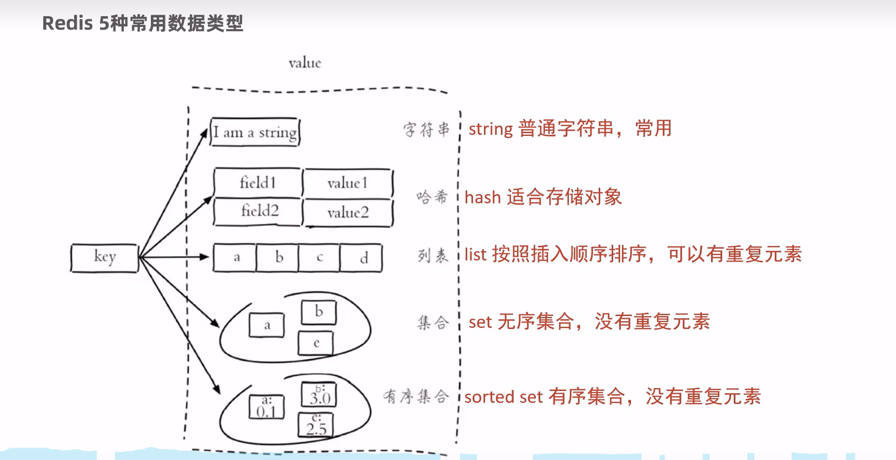

# Redis 常用命令

删除某个key值可以使用del key命令

## 1. 字符串常用命令

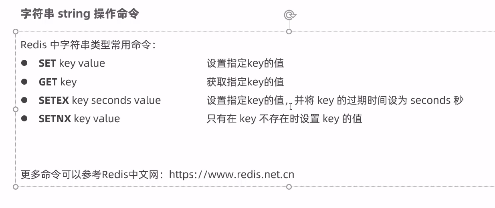

## 2. 哈希常用命令（常用于存储java对象）

因为field可以存储属性，value存储属性值


## 3. 列表list常用命令


## 4. 集合set常用命令


## 5. 通用命令


# java中操作redis

## 1. 使用jedis操作数据库（不常用）


```java
//使用jedis操作redis数据库，需要1.连接数据库,2.操作数据库，3.关闭数据库
Jedis jedis = new Jedis("localhost",6379);
jedis.set("username","xiaoming");
jedis.close();
```

这就可以基本完成操作了

## 2. 使用Spring Data Redis操作（常用）

这个常常用于Spring Boot项目中使用

### 1. 坐标


### 2. 配置

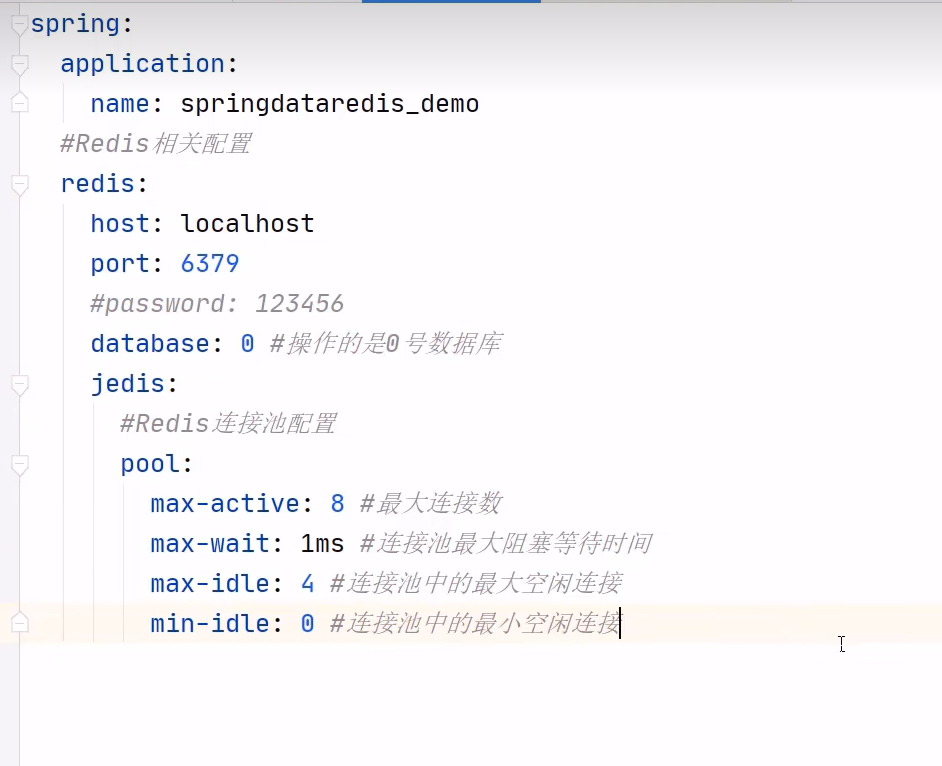

### 3. 更改框架连接redis的序列化器

1. 新建一个配置类

   

2. value值也会有默认的序列化器，但是一般不会更改，因为java读取的时候会反序列化回来，当然也可以设置更改，但是没有必要


# Spring Cache

主要是通过注解就可以实现缓存功能，不需要再写这么多redis的缓存相关的代码

## 介绍

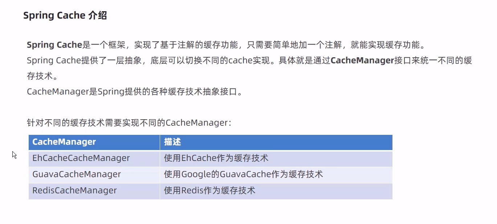

## 常用的注解


## 使用步骤


1. 首先需要导入相应的依赖，这些依赖有很多，需要根据自己用到的缓存技术进行添加，可以在网上搜一搜进行添加

2. 启动类需要加入注解@EnableCaching

3. 给需要的方法加入相应的注解，上面常用注解也提到了

   ```java
   @Service
   public class CacheDemoServiceImpl implements CacheDemoService {
   
       @Cacheable(cacheNames = "demoCache", key = "#id")
       @Override
       public Object getFromDB(Integer id) {
           System.out.println("模拟去db查询~~~" + id);
           return "hello cache...";
       }
   }
   
   ```

4. 方法的注解上还需要加入一些参数

   

   注意要遵循SPEL上下文数据格式，**#**是不可以省略的

   


# Mysql主从复制机制

这篇学习笔记中主要是将两个服务器上的操作讲述，但是为了便于测试，组要在docker上新建两个mysql进行测试，为了更高的描述这个测试步骤，是需要搜索的，给出一个链接，当需要进行docker内测试时，可以考虑链接博客给出的步骤进行操作：https://learnku.com/articles/30439

 ## 1. 简介


## 2. 实现步骤

首先对主库进行下面的操作

1. 配置文件更改

   

2. 重启mysql服务

   

3. 创建用户，授予身份权限

   主从服务器需要有识别身份才可以拷贝二进制文件

   

4. 登录主库

   ​	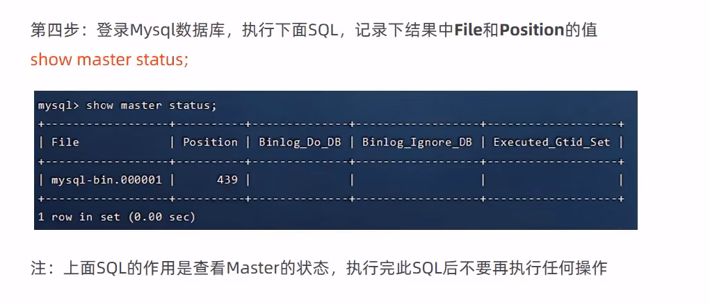

   以上是对于主库进行的操作，不需要再对主库操作，接下来需要对从库进行基本操作

   接下来是对从库进行操作

   1. 修改配置文件

      

      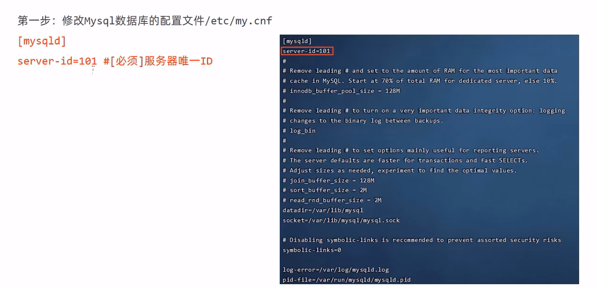

   2. 重启

      

   3. 登录进行授权配置

      

   4. 查看数据库状态

      

       	

## 3. 通过一个框架实现读写分离


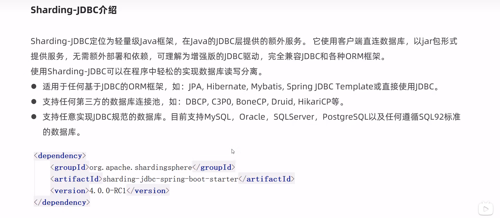

### 步骤


1. 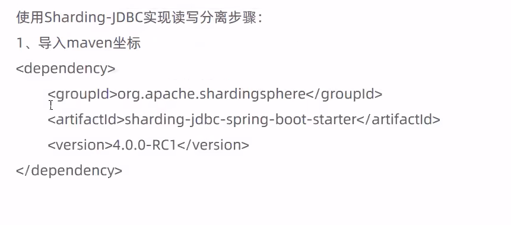

2. 配置yml文件，并且允许bean定义覆盖

   ```yaml
   spring:
     shardingsphere:
       datasource:
         names:
           master,slave
         # 主数据源
         master:
           type: com.alibaba.druid.pool.DruidDataSource
           driver-class-name: com.mysql.cj.jdbc.Driver
           url: jdbc:mysql://192.168.138.100:3306/rw?characterEncoding=utf-8
           username: root
           password: root
         # 从数据源
         slave:
           type: com.alibaba.druid.pool.DruidDataSource
           driver-class-name: com.mysql.cj.jdbc.Driver
           url: jdbc:mysql://192.168.138.101:3306/rw?characterEncoding=utf-8
           username: root
           password: root
       masterslave:
         # 读写分离配置
         load-balance-algorithm-type: round_robin
         # 最终的数据源名称
         name: dataSource
         # 主库数据源名称
         master-data-source-name: master
         # 从库数据源名称列表，多个逗号分隔
         slave-data-source-names: slave
       props:
         sql:
           show: true #开启SQL显示，默认false
     main:
       allow-bean-definition-overriding: true  # 允许相同的bean覆盖，这是因为不添加的话，在启动的时候有个两个类产生了相同名称的实体类，会因为这个报错，所以加入这一行，并且一般是必须加入的
   mybatis-plus:
     configuration:
       #在映射实体或者属性时，将数据库中表名和字段名中的下划线去掉，按照驼峰命名法映射
       map-underscore-to-camel-case: true
       log-impl: org.apache.ibatis.logging.stdout.StdOutImpl
     global-config:
       db-config:
         id-type: ASSIGN_ID
   ```

   

# NGINX代理服务器

1. 安装nginx，可以在网上搜索安装教程

2. 安装后的nginx目录结构

   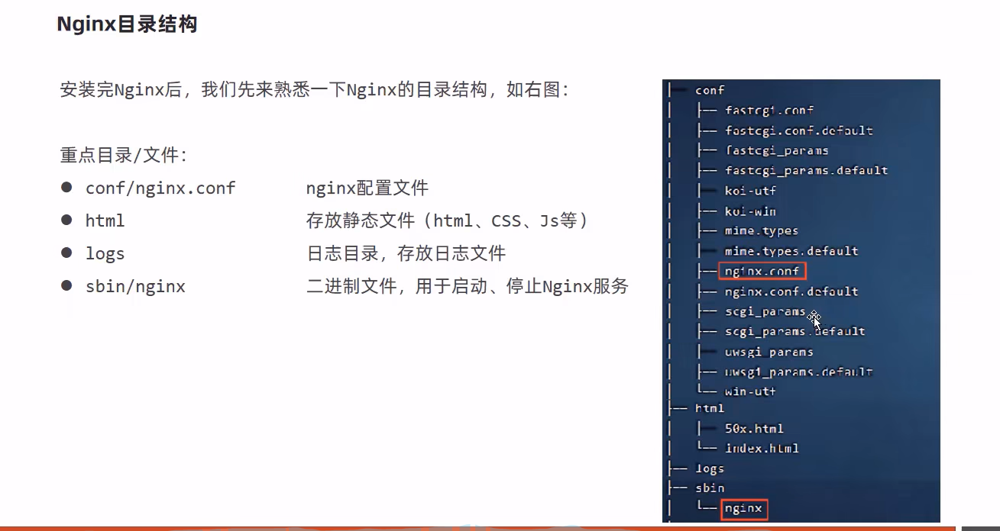

## 常用命令

这些命令需要在sbin目录下才能执行，其实只要找到sbin下的nginx文件就行，也可以使用绝对路径进行执行

1. 

   ```
   
   1. 查看版本命令
   [root@iZuf632daro7pbjy0hrxchZ sbin]# ./nginx -v
   nginx version: nginx/1.19.9
   
   2. 检查配置文件的正确性
   [root@iZuf632daro7pbjy0hrxchZ sbin]# ./nginx -t
   nginx: the configuration file /usr/local/nginxtest/conf/nginx.conf syntax is ok
   nginx: configuration file /usr/local/nginxtest/conf/nginx.conf test is successful
   
   3. 重新加载配置文件
   [root@iZuf632daro7pbjy0hrxchZ sbin]# ./nginx -s reload
   
   ```

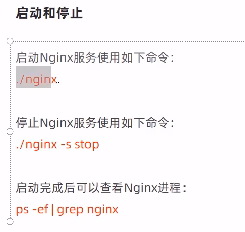


## 配置文件的结构


## 应用方向

1. 

2. 作为反向代理服务器

   先理解正向代理服务器

   

   在理解反向代理服务器

   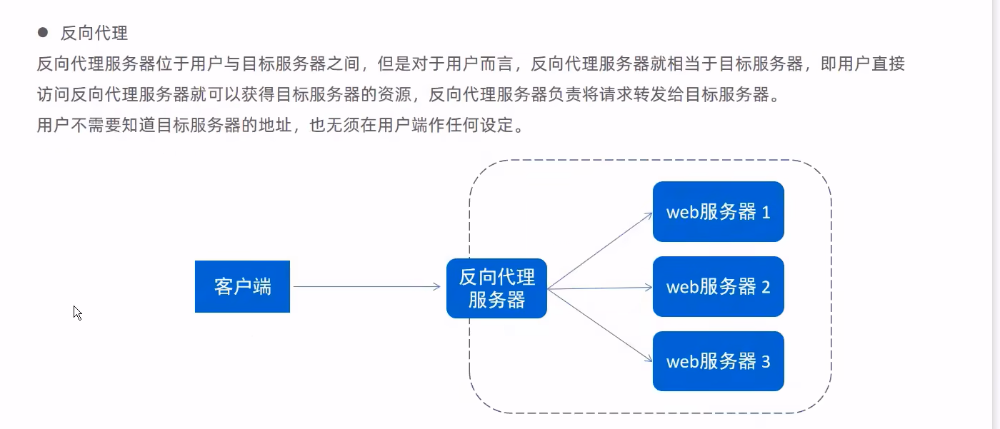

   乍一看，好像二者没有区别，真正的区别在于这个代理服务器在哪里设置的，正向代理服务器在客户端进行设置，反向代理服务器是在代理服务器进行设置的。而反向代理的功能恰好是nginx的功能应用方向之一。

   反向代理的配置形式：

   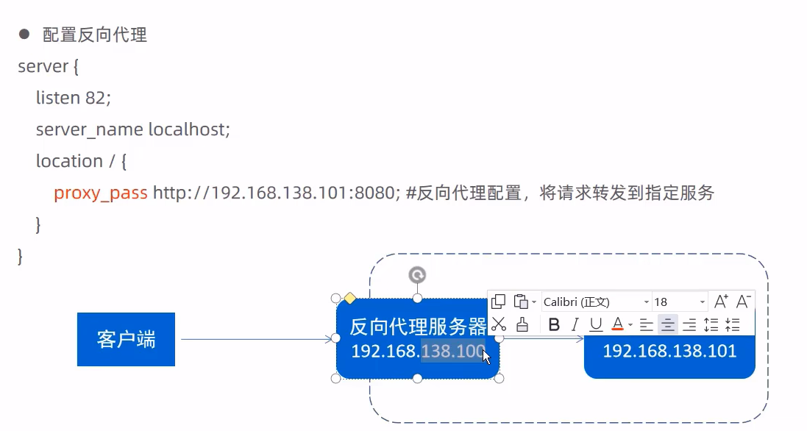

3. 负载均衡

   nginx的负载均衡就是基于反向代理进行实现的

   负载均衡的配置如下：

   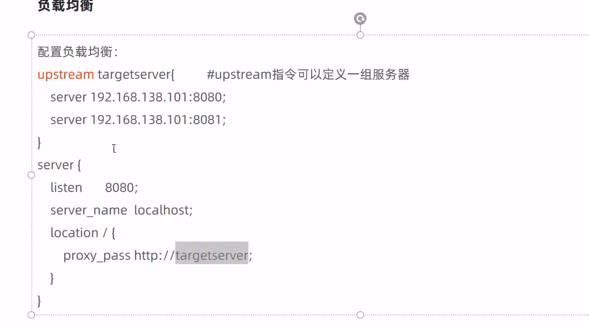

   这个配置是不全的，只是一个基本的轮询，具体的详细配置可以搜寻网络上的资料进行学习

   

   

   


# Swagger

直接使用比较繁琐，我们使用一些完成这些接口的框架就可以了

## 1. 简介

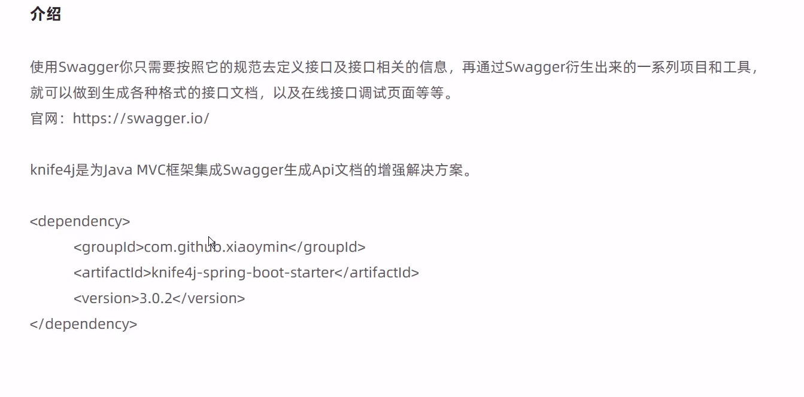


## 2. 使用步骤


1. 导入坐标

   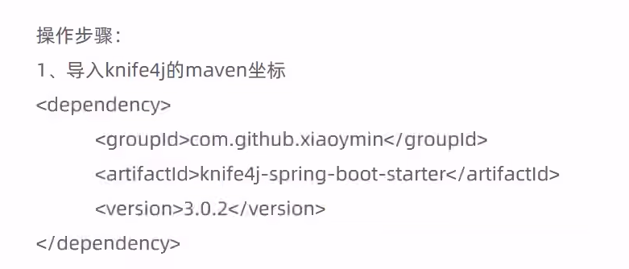

2. 创建一个配置

   一般配置的大体框架我们都写过了，这里只需要添加部分代码和注解就好了

   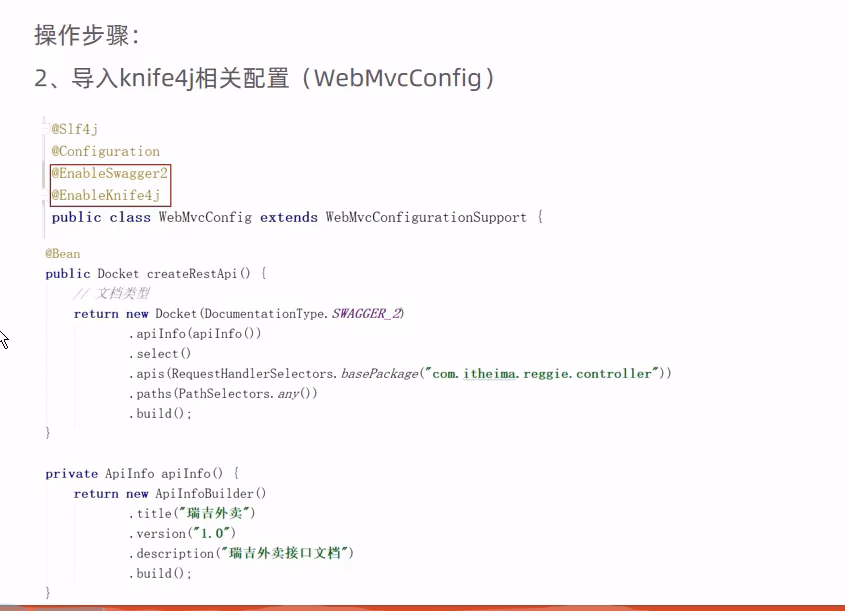

   在createRestApi方法中，basePackage中需要填入的应该是这个项目的controller所在的包。apiInfo方法只是为了描述这个项目

3. 设置静态资源映射

   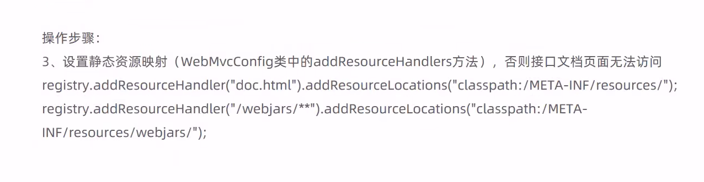

4. 避免接口文档访问被过滤器过滤

   

   5. 访问

      访问地址是直接找到端口，例如http://localhost:8080/doc.html   就可以进行接口测试了

## 3. 常用注解


  # JDBC

这门技术主要是看一下底层的连接池，自己平时查找数据库主要是使用mybatis-plus，根本不需要使用jdbc技术

简单来说就是使用JDBC的方法来连接数据库，操作数据库 的统称

## 1. 步骤

### 1.1. 静态sql（一般不建议）


下面用一个程序直接展示这个过程


```java
public class statementQueryPart {
    public static void main(String[] args) throws SQLException {
        //1.注册驱动
        DriverManager.registerDriver(new Driver());
        //2.获取链接
        Connection connection = DriverManager.
                getConnection("jdbc:mysql://114.115.137.7:3306/reggie", "root", "qwe123");
        //3.创建statement
        Statement statement = connection.createStatement();

        //4.发送sql语句，并获取返回结果
        String sql = "select * from employee";
        ResultSet resultSet = statement.executeQuery(sql);//执行的方法应该和sql语句保持一直，具体的细节可以网上搜索，有查询插入更新等操作，每个操作的具体执行方法都不一样
        //5.对结果集进行解析
        while (resultSet.next()) {//默认的游标其实指向的是第一行之前
            BigDecimal id = resultSet.getBigDecimal("id");
            String name = resultSet.getString("name");
            String username = resultSet.getString("username");
            System.out.println(id + "---" + name + "---" + username);
        }
        //6.关闭资源,注意关闭的次序和数量
        resultSet.close();
        statement.close();
        connection.close();

    }
}
```

注意这个是有缺陷的，是直接传递一个静态sql语句（希望可以是动态的sql），并且是提前拼接的sql，有可能发生注入攻击（当然jdbc可以使用预编译的sql语句进行操作），并且这个语句注册驱动注册了两次，可以使用反射的方法只注册一次

```
Class.forName("com.mysql.cj.jdbc.Driver");//使用类加载的方法只注册了一次，具体细节需要查看源代码
```

获取连接时，url的书写格式

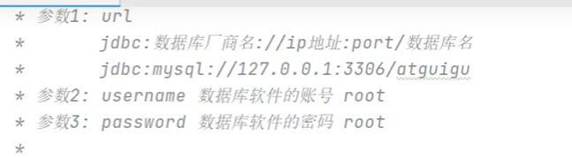

### 1.2. 动态预编译sql

​	

```java
public class JdbcPreparedStatementLoginPart {


    public static void main(String[] args) throws ClassNotFoundException, SQLException {

        //1.输入账号和密码
        Scanner scanner = new Scanner(System.in);
        String account = scanner.nextLine();
        String password = scanner.nextLine();
        scanner.close();

        //2.jdbc的查询使用
        //注册驱动
        Class.forName("com.mysql.cj.jdbc.Driver");

        //获取连接
        Connection connection = DriverManager.getConnection("jdbc:mysql:///atguigu", "root", "root");

        //创建preparedStatement
        //connection.createStatement();
        //TODO 需要传入SQL语句结构
        //TODO 要的是SQL语句结构，动态值的部分使用 ? ,  占位符！
        //TODO ?  不能加 '?'  ? 只能替代值，不能替代关键字和容器名
        String sql = "select * from t_user where account = ? and password = ? ;";
        PreparedStatement preparedStatement = connection.prepareStatement(sql);

        //占位符赋值
        //给占位符赋值！ 从左到右，从1开始！
        /**
         *  int 占位符的下角标
         *  object 占位符的值
         */
        preparedStatement.setObject(2,password);
        preparedStatement.setObject(1,account);

        //这哥们内部完成SQL语句拼接！
        //执行SQL语句即可
        ResultSet resultSet = preparedStatement.executeQuery();
        //preparedStatement.executeUpdate()

        //进行结果集对象解析
        if (resultSet.next()){
            //只要向下移动，就是有数据 就是登录成功！
            System.out.println("登录成功！");
        }else{
            System.out.println("登录失败！");
        }

        //关闭资源
        resultSet.close();
        preparedStatement.close();
        connection.close();
    }

}

```

这种形式是怎样防止注入攻击的呢？（下面这张图进行解释）

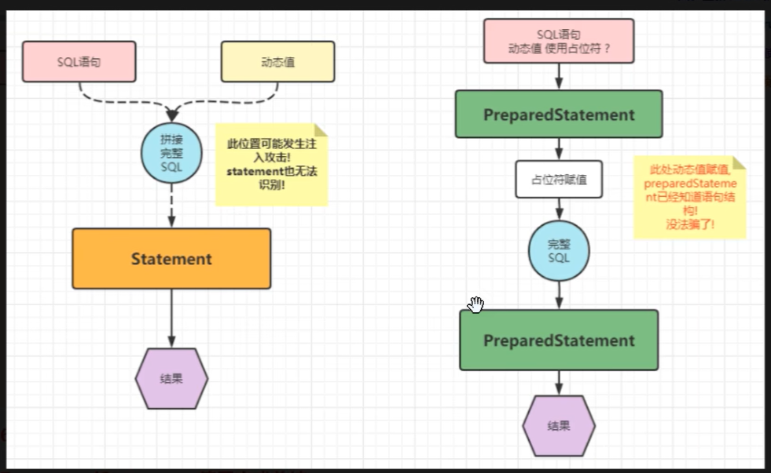

### 1.2. 获取新插入数据时所产生的主键

主要增加两个部分

```java
public void  returnPrimaryKey() throws Exception{

        //1.注册驱动
        Class.forName("com.mysql.cj.jdbc.Driver");
        //2.获取连接
        Connection connection = DriverManager.getConnection("jdbc:mysql:///atguigu?user=root&password=root");
        //3.编写SQL语句结构
        String sql = "insert into t_user (account,password,nickname) values (?,?,?);";
        //4.创建预编译的statement，传入SQL语句结构
        /**
         * TODO: 第二个参数填入 1 | Statement.RETURN_GENERATED_KEYS
         *       告诉statement携带回数据库生成的主键！
         */
        PreparedStatement statement = connection.prepareStatement(sql, Statement.RETURN_GENERATED_KEYS);//只是新加入一个参数既可以获得主键
        //5.占位符赋值
        statement.setObject(1,"towgog");
        statement.setObject(2,"123456");
        statement.setObject(3,"二狗子");
        //6.执行SQL语句 【注意：不需要传入SQL语句】 DML
        int i = statement.executeUpdate();
        //7.结果集解析
        System.out.println("i = " + i);

        //一行一列的数据！里面就装主键值！
        ResultSet resultSet = statement.getGeneratedKeys();
        resultSet.next();
        int anInt = resultSet.getInt(1);
        System.out.println("anInt = " + anInt);


        //8.释放资源
        statement.close();
        connection.close();
    }

```

### 1.3. 进行批量插入（大量数据插入时优化）

```java
批量细节：
     *    1.url?rewriteBatchedStatements=true
     *    2.insert 语句必须使用 values
     *    3.语句后面不能添加分号;
     *    4.语句不能直接执行，每次需要装货  addBatch() 最后 executeBatch();
     *
     * 批量插入优化！
     * @throws Exception
     */
    @Test
    public void  batchInsertYH() throws Exception{

        //1.注册驱动
        Class.forName("com.mysql.cj.jdbc.Driver");
        //2.获取连接
        Connection connection = DriverManager.getConnection("jdbc:mysql:///atguigu?rewriteBatchedStatements=true",
                "root","root");
        //3.编写SQL语句结构
        String sql = "insert into t_user (account,password,nickname) values (?,?,?)";
        //4.创建预编译的statement，传入SQL语句结构
        /**
         * TODO: 第二个参数填入 1 | Statement.RETURN_GENERATED_KEYS
         *       告诉statement携带回数据库生成的主键！
         */
        long start = System.currentTimeMillis();
        PreparedStatement statement = connection.prepareStatement(sql);
        for (int i = 0; i < 10000; i++) {

            //5.占位符赋值
            statement.setObject(1,"ergouzi"+i);
            statement.setObject(2,"lvdandan");
            statement.setObject(3,"驴蛋蛋"+i);
            //6.装车
            statement.addBatch();
        }

        //发车！ 批量操作！
        statement.executeBatch();

        long end = System.currentTimeMillis();

        System.out.println("消耗时间："+(end - start));


        //7.结果集解析

        //8.释放资源
        connection.close();
    }
```

### 1.4. 增加事务功能，保证数据一致性

重点在于关闭自动提交，执行手动提交，失败是就回滚

```java
* 转账业务方法
     * @param addAccount  加钱账号
     * @param subAccount  减钱账号
     * @param money  金额
     */
    public void transfer(String addAccount,String subAccount, int money) throws ClassNotFoundException, SQLException {

        System.out.println("addAccount = " + addAccount + ", subAccount = " + subAccount + ", money = " + money);

        //注册驱动
        Class.forName("com.mysql.cj.jdbc.Driver");

        //获取连接
        Connection connection = DriverManager.getConnection("jdbc:mysql:///atguigu", "root", "root");

        int flag = 0;

        //利用try代码块,调用dao
        try {
            //开启事务(关闭事务自动提交)
            connection.setAutoCommit(false);

            BankDao bankDao = new BankDao();
            //调用加钱 和 减钱
            bankDao.addMoney(addAccount,money,connection);//这个方法没有写，但是具体含义知道就行
            System.out.println("--------------");
            bankDao.subMoney(subAccount,money,connection);//这个方法没有写，但是具体含义知道就行
            flag = 1;
            //不报错,提交事务
            connection.commit();
        }catch (Exception e){

            //报错回滚事务
            connection.rollback();
            throw e;
        }finally {
            connection.close();
        }

        if (flag == 1){
            System.out.println("转账成功!");
        }else{
            System.out.println("转账失败!");
        }
    }
```


## 2. 使用现有工具优化JDBC操作

主要是使用**连接池**技术，这些技术都是根据java关于这个管理的规定进行实现的，这个规定其实就是一个接口:"javax.sql.DataSource",规定了获取和回收连接池的方法

直接网上搜索使用手册即可

分为硬编码和软编码，其实区别就在于是否是通过配置文件来配置，当更改配置后是否需要重新编译而已

可以通过properties结尾的配置文件进行配置，存放的就是key=value的形式

提供一种软编码来进行配置的形式（下面这种形式）


## 3. ThreadLocal存储共享变量

这是在同一个线程中所有方法获取同一个共享变量的方式，是一个很重要，必须理解的内容


