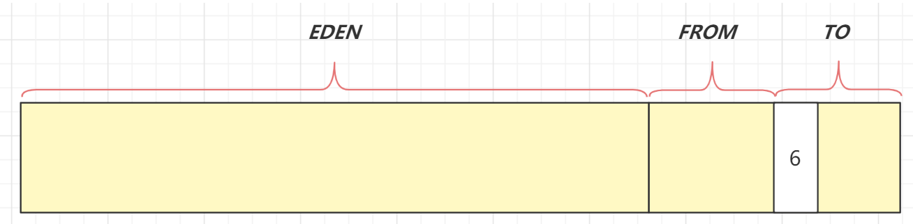
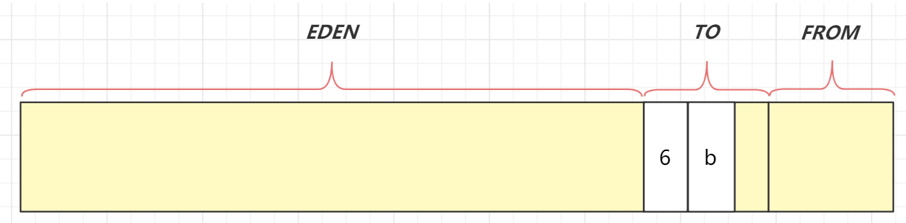
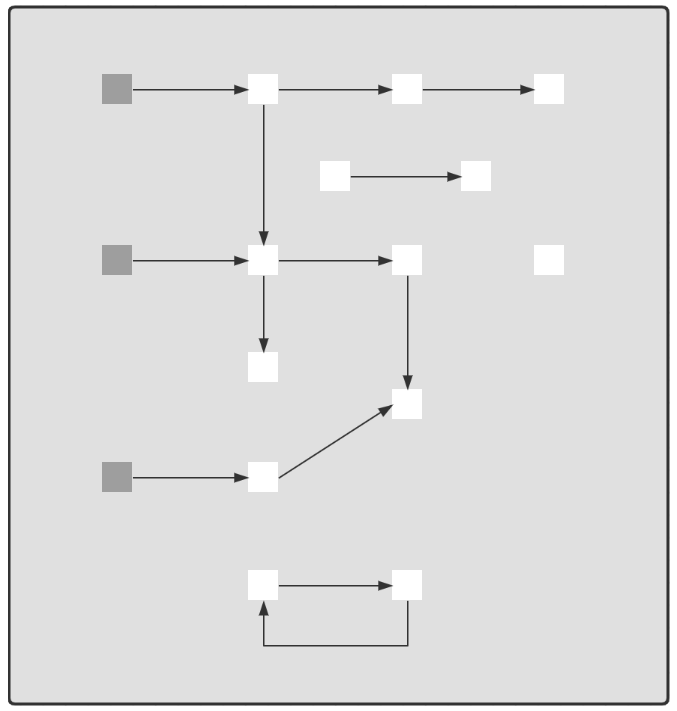
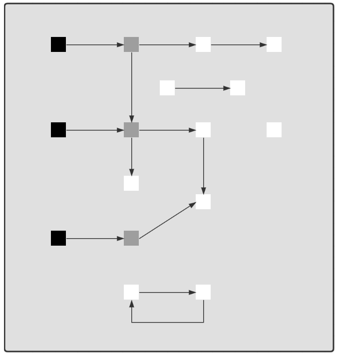
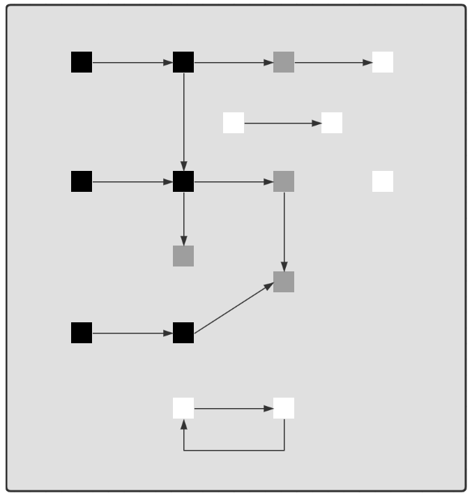
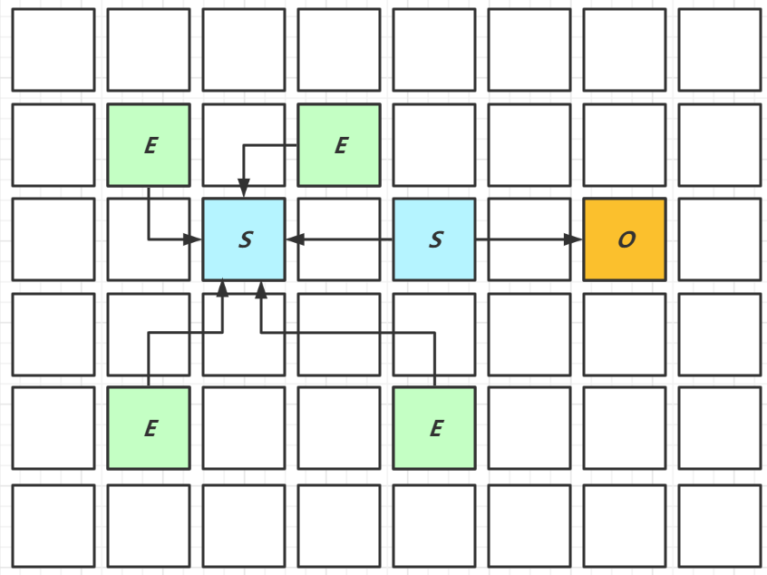
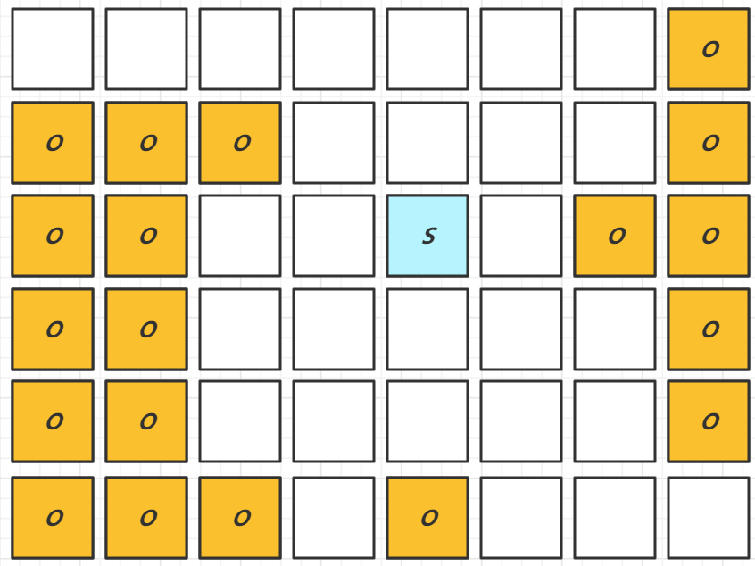
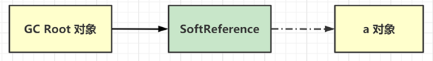
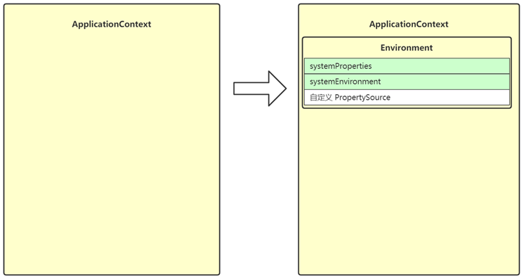
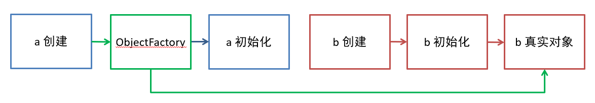

# Java基本疑惑

## 1. 抽象类、接口、正常父子类之间方法声明和实现问题

对于抽象类，和正常的类一样，类本身的修饰符可以为public\default	

类有的成员（成员变量、方法、构造器）抽象类都具备

抽象方法是一种没有任何实现的方法，该方法的具体实现由子类提供。

抽象方法不能被声明成 final 和 static。

任何继承抽象类的子类必须实现父类的所有抽象方法，除非该子类也是抽象类。

如果一个类包含若干个抽象方法，那么该类必须声明为抽象类。抽象类可以不包含抽象方法。

同时内部的方法可以是正常的方法，权限修饰符也和普通类一样正常。但是如果是抽象方法，不能为private

---

接口类的修饰符只能为public，内部的方法为抽象方法，但是可以拥有默认方法，并且默认方法可以有方法体。内部的方法和成员变量必须都是public修饰，写不写都是。

**补充知识：JDK8开始接口新增的方法**

**第一种：默认方法**

- 类似之前写的普通实例方法：必须用default修饰

- 默认会public修饰。需要用接口的实现类的对象来调用

**第二种：静态方法**

- 默认会public修饰，必须static修饰。

- 注意：接口的静态方法必须用本身的接口名来调用。

**第三种：私有方法**

- 就是私有的实例方法:，必须使用private修饰，从JDK 1.9才开始有的。

- 只能在本类中被其他的默认方法或者私有方法访问。

注意：JDK8新增的3种方法我们自己在开发中很少使用，通常是Java源码涉及到的，我们需要理解、识别语法、明白调用关系即可。

---

父子类之间继承时的权限关系，如果**父类方法**访问修饰符为 `private/final/static` 则子类就不能重写该方法，但是被 `static` 修饰的方法能够被再次声明。

这个时候通过多态调用private的方法时，本身没有办法调用。

调用static方法时，谁调用就用谁的static方法。和普通的重载方法调用规则不同。

**方法的重写要遵循“两同两小一大”**：

- “两同”即方法名相同、形参列表相同；
- “两小”指的是子类方法返回值类型应比父类方法返回值类型更小或相等，子类方法声明抛出的异常类应比父类方法声明抛出的异常类更小或相等；
- “一大”指的是子类方法的访问权限应比父类方法的访问权限更大或相等。

⭐️ 关于 **重写的返回值类型** 这里需要额外多说明一下，上面的表述不太清晰准确：如果方法的返回类型是 void 和基本数据类型，则返回值重写时不可修改。但是如果方法的返回值是引用类型，重写时是可以返回该引用类型的子类的。


# ArrayList扩容机制

1. 无参构造时初始化容量是0，如果是有参构造就是指定的容量
2. 如果使用的是无参构造，初试没有容量，当向其中添加元素时初始化为10，后续扩容都是前一个容量的1.5倍（这个是add方法执行时的扩容规则，如果我们使用addall方法呢？）

3. 当我们使用addall方法是扩容的规律。假如初始化的时候使用无参构造，那么添加的集合元素数量小于10的时候，扩容为10；如果添加的集合元素大于10的时候，会根据个数直接确定，比如添加11个元素，会直接将容量变为11个。但是如果原本里面就有数据呢？以后遇见addall方法，扩容的方法统一是在扩容后的容量和实际装入的元素个数之间取一个最大值。比如实际有3个，再次添加10个，实际有13个元素，但是原来的容量10容不下，那么扩容后1.5倍应该是15，但是15>13,所以容量会变为15。
4. 

5. 满足fail-fast，并发修改时会立刻抛出异常

## fail-fast

一旦遍历的时候发现有人修改，就立刻抛出异常

分析arraylist的fail-fast原理。遍历的时候也会创建一个迭代器，在创建迭代器的时候 有一个expectedModcount,将其初始化为modCount(这个东西是arraylist内部的一个属性，表示arraylist修改了多少次），当遍历的时候，迭代器会在next（）方法中检查expectedModcount和modCount是否相等，相等就什么都不做，继续遍历，如果有线程修改了arraylist，那么expectedModcount和modCount就不在相等了，此时继续遍历的时候就会检查出来并进行报错

## fail-safe

发现遍历的时候有人修改，可以有相应的策略，比如牺牲一致性来完成整个遍历

一个应用这种策略的典型的类是CopyOnWriteArrayList。遍历的时候，创建了迭代器，重点是，这是一种新的迭代器，会将之前的数组赋值给这个迭代器，当其他线程更改了这个类时，这个类本身的add方式是先进行了扩容，然后将旧数组拷贝到新扩容后的数组，在把新的元素添加进去。此时，你会发现，迭代器遍历的和CopyOnWriteArrayList自身的数组已经不是同一个数组了，就实现了fail-safe，重点就是实现了读写分离


# ArrayList和LinkedList比较


# HashMap

使用的是懒加载

**JDK1.8 之前** `HashMap` 底层是 **数组和链表** 结合在一起使用也就是 **链表散列**。HashMap 通过 key 的 `hashcode` 经过扰动函数处理过后得到 hash 值，然后通过 `(n - 1) & hash` 判断当前元素存放的位置（这里的 n 指的是数组的长度），如果当前位置存在元素的话，就判断该元素与要存入的元素的 hash 值以及 key 是否相同，如果相同的话，直接覆盖，不相同就通过拉链法解决冲突。

所谓扰动函数指的就是 HashMap 的 `hash` 方法。使用 `hash` 方法也就是扰动函数是为了防止一些实现比较差的 `hashCode()` 方法 换句话说使用扰动函数之后可以减少碰撞。

 **JDK1.8** 之后在解决哈希冲突时有了较大的变化，当链表长度大于阈值（默认为 8）（将链表转换成红黑树前会判断，如果当前数组的长度小于 64，那么会选择先进行数组扩容，而不是转换为红黑树）时，将链表转化为红黑树，以减少搜索时间。TreeMap、TreeSet 以及 JDK1.8 之后的 HashMap 底层都用到了红黑树。红黑树就是为了解决二叉查找树的缺陷，因为**二叉查找树在某些情况下会退化成一个线性结构**。

1. hashmap扩容机制（这里指的是扩容数组）
   　　当HashMap中的元素越来越多的时候，碰撞的几率也就越来越高（因为数组的长度是固定的），所以为了提高查询的效率，就要对HashMap的数组进行扩容，而在hashmap数组扩容之后，最消耗性能的点就出现了：原数组中的数据必须重新计算其在新数组中的位置，并放进去，这就是resize。 
      　　那么HashMap什么时候进行扩容呢？当hashmap中的元素个数超过数组大小*loadFactor时，就会进行数组扩容，loadFactor的默认值为0.75，也就是说，默认情况下，数组大小为16，那么当hashmap中元素个数超过`16*0.75`=12的时候，就把数组的大小扩展为`2*16`=32，即扩大一倍，然后重新计算每个元素在数组中的位置，而这是一个非常消耗性能的操作，所以如果我们已经预知hashmap中元素的个数，那么预设元素的个数能够有效的提高hashmap的性能。比如说，我们有1000个元素new HashMap(1000), 但是理论上来讲new HashMap(1024)更合适，不过上面annegu已经说过，即使是1000，hashmap也自动会将其设置为1024。 但是new HashMap(1024)还不是更合适的，因为0.75`*`1024 < 1000, 也就是说为了让0.75 * size > 1000, 我们必须这样new HashMap(2048)才最合适，既考虑了&的问题，也避免了resize的问题。
2. 


 之所以选取2的n次幂，是为了计算索引的效率，如果为了分布性给您更好，一般应该选取质数


# 单例模式


## 1. 饿汉式

```java
public class Singleton1 implements Serializable {
    private Singleton1() {
        if (INSTANCE != null) {
            throw new RuntimeException("单例对象不能重复创建");
        }
        System.out.println("private Singleton1()");
    }

    private static final Singleton1 INSTANCE = new Singleton1();

    public static Singleton1 getInstance() {
        return INSTANCE;
    }

    public static void otherMethod() {
        System.out.println("otherMethod()");
    }

    public Object readResolve() {
        return INSTANCE;
    }
}
```

* 构造方法抛出异常是防止反射破坏单例
* `readResolve()` 是防止反序列化破坏单例

## 2. **枚举饿汉式**

枚举法创建

```java
public enum Singleton2 {
    INSTANCE;

    private Singleton2() {
        System.out.println("private Singleton2()");
    }

    @Override
    public String toString() {
        return getClass().getName() + "@" + Integer.toHexString(hashCode());
    }

    public static Singleton2 getInstance() {
        return INSTANCE;
    }

    public static void otherMethod() {
        System.out.println("otherMethod()");
    }
}
```

* 枚举饿汉式能天然防止反射、反序列化破坏单例

## 3. 懒汉式

```java
public class Singleton3 implements Serializable {
    private Singleton3() {
        System.out.println("private Singleton3()");
    }

    private static Singleton3 INSTANCE = null;

    // Singleton3.class
    public static synchronized Singleton3 getInstance() {
        if (INSTANCE == null) {
            INSTANCE = new Singleton3();
        }
        return INSTANCE;
    }

    public static void otherMethod() {
        System.out.println("otherMethod()");
    }

}
```

* 其实只有首次创建单例对象时才需要同步，但该代码实际上每次调用都会同步
* 因此有了下面的双检锁改进


## 4. **双检锁懒汉式**

```java
public class Singleton4 implements Serializable {
    private Singleton4() {
        System.out.println("private Singleton4()");
    }

    private static volatile Singleton4 INSTANCE = null; // 可见性，有序性

    public static Singleton4 getInstance() {
        if (INSTANCE == null) {
            synchronized (Singleton4.class) {
                if (INSTANCE == null) {
                    INSTANCE = new Singleton4();
                }
            }
        }
        return INSTANCE;
    }

    public static void otherMethod() {
        System.out.println("otherMethod()");
    }
}
```

为何必须加 volatile：

* `INSTANCE = new Singleton4()` 不是原子的，分成 3 步：创建对象、调用构造、给静态变量赋值，其中后两步可能被指令重排序优化，变成先赋值、再调用构造
* 如果线程1 先执行了赋值，线程2 执行到第一个 `INSTANCE == null` 时发现 INSTANCE 已经不为 null，此时就会返回一个未完全构造的对象


## 5. **内部类懒汉式**

```java
public class Singleton5 implements Serializable {
    private Singleton5() {
        System.out.println("private Singleton5()");
    }

    private static class Holder {
        static Singleton5 INSTANCE = new Singleton5();
    }

    public static Singleton5 getInstance() {
        return Holder.INSTANCE;
    }

    public static void otherMethod() {
        System.out.println("otherMethod()");
    }
}
```

* 避免了双检锁的缺点


**JDK 中单例的体现**

* Runtime 体现了饿汉式单例
* Console 体现了双检锁懒汉式单例
* Collections 中的 EmptyNavigableSet 内部类懒汉式单例
* ReverseComparator.REVERSE_ORDER 内部类懒汉式单例
* Comparators.NaturalOrderComparator.INSTANCE 枚举饿汉式单例

# 并发篇

## 1. 六种状态


分别是

* 新建
  * 当一个线程对象被创建，但还未调用 start 方法时处于**新建**状态
  * 此时未与操作系统底层线程关联
* 可运行
  * 调用了 start 方法，就会由**新建**进入**可运行**
  * 此时与底层线程关联，由操作系统调度执行
* 终结
  * 线程内代码已经执行完毕，由**可运行**进入**终结**
  * 此时会取消与底层线程关联
* 阻塞
  * 当获取锁失败后，由**可运行**进入 Monitor 的阻塞队列**阻塞**，此时不占用 cpu 时间
  * 当持锁线程释放锁时，会按照一定规则唤醒阻塞队列中的**阻塞**线程，唤醒后的线程进入**可运行**状态
* 等待
  * 当获取锁成功后，但由于条件不满足，调用了 wait() 方法，此时从**可运行**状态**释放锁**进入 Monitor 等待集合**等待**，同样不占用 cpu 时间
  * 当其它持锁线程调用 notify() 或 notifyAll() 方法，会按照一定规则唤醒等待集合中的**等待**线程，恢复为**可运行**状态
* 有时限等待
  * 当获取锁成功后，但由于条件不满足，调用了 wait(long) 方法，此时从**可运行**状态**释放锁**进入 Monitor 等待集合进行**有时限等待**，同样不占用 cpu 时间
  * 当其它持锁线程调用 notify() 或 notifyAll() 方法，会按照一定规则唤醒等待集合中的**有时限等待**线程，恢复为**可运行**状态，并重新去竞争锁
  * 如果等待超时，也会从**有时限等待**状态恢复为**可运行**状态，并重新去竞争锁
  * 还有一种情况是调用 sleep(long) 方法也会从**可运行**状态进入**有时限等待**状态，但与 Monitor 无关，不需要主动唤醒，超时时间到自然恢复为**可运行**状态

> ***其它情况（只需了解）***
>
> * 可以用 interrupt() 方法打断**等待**、**有时限等待**的线程，让它们恢复为**可运行**状态
> * park，unpark 等方法也可以让线程等待和唤醒


**五种状态**

五种状态的说法来自于操作系统层面的划分


* 运行态：分到 cpu 时间，能真正执行线程内代码的
* 就绪态：有资格分到 cpu 时间，但还未轮到它的
* 阻塞态：没资格分到 cpu 时间的
  * 涵盖了 java 状态中提到的**阻塞**、**等待**、**有时限等待**
  * 多出了阻塞 I/O，指线程在调用阻塞 I/O 时，实际活由 I/O 设备完成，此时线程无事可做，只能干等
* 新建与终结态：与 java 中同名状态类似，不再啰嗦

## 2. 线程池

**七大参数**

1. corePoolSize 核心线程数目 - 池中会保留的最多线程数
2. maximumPoolSize 最大线程数目 - 核心线程+救急线程的最大数目
3. keepAliveTime 生存时间 - 救急线程的生存时间，生存时间内没有新任务，此线程资源会释放
4. unit 时间单位 - 救急线程的生存时间单位，如秒、毫秒等
5. workQueue - 当没有空闲核心线程时，新来任务会加入到此队列排队，队列满会创建救急线程执行任务
6. threadFactory 线程工厂 - 可以定制线程对象的创建，例如设置线程名字、是否是守护线程等
7. handler 拒绝策略 - 当所有线程都在繁忙，workQueue 也放满时，会触发拒绝策略
   1. 抛异常 java.util.concurrent.ThreadPoolExecutor.AbortPolicy
   2. 由调用者执行任务 java.util.concurrent.ThreadPoolExecutor.CallerRunsPolicy
   3. 丢弃任务 java.util.concurrent.ThreadPoolExecutor.DiscardPolicy
   4. 丢弃最早排队任务 java.util.concurrent.ThreadPoolExecutor.DiscardOldestPolicy


## 3. wait vs sleep

**一个共同点，三个不同点**

共同点

* wait() ，wait(long) 和 sleep(long) 的效果都是让当前线程暂时放弃 CPU 的使用权，进入阻塞状态（站在cpu的角度）

不同点

* 方法归属不同

  * sleep(long) 是 Thread 的静态方法
  * 而 wait()，wait(long) 都是 Object 的成员方法，每个对象都有

* 醒来时机不同

  * 执行 sleep(long) 和 wait(long) 的线程都会在等待相应毫秒后醒来
  * wait(long) 和 wait() 还可以被 notify 唤醒，wait() 如果不唤醒就一直等下去
  * 它们都可以被打断唤醒

* 锁特性不同（重点）

  * wait 方法的调用必须先获取 wait 对象的锁，而 sleep 则无此限制
  * wait 方法执行后会释放对象锁，允许其它线程获得该对象锁（我放弃 cpu，但你们还可以用）
  * 而 sleep 如果在 synchronized 代码块中执行，并不会释放对象锁（我放弃 cpu，你们也用不了）

  按照我的理解，wait方法一般由锁对象进行调用

## 4. lock vs synchronized

**三个层面**

不同点

* 语法层面
  * synchronized 是关键字，源码在 jvm 中，用 c++ 语言实现
  * Lock 是接口，源码由 jdk 提供，用 java 语言实现
  * 使用 synchronized 时，退出同步代码块锁会自动释放，而使用 Lock 时，需要手动调用 unlock 方法释放锁
* 功能层面
  * 二者均属于悲观锁、都具备基本的互斥、同步、锁重入功能
  * Lock 提供了许多 synchronized 不具备的功能，例如获取等待状态、公平锁、可打断、可超时、多条件变量
  * Lock 有适合不同场景的实现，如 ReentrantLock， ReentrantReadWriteLock
* 性能层面
  * 在没有竞争时，synchronized 做了很多优化，如偏向锁、轻量级锁，性能不赖
  * 在竞争激烈时，Lock 的实现通常会提供更好的性能

**公平锁**

* 公平锁的公平体现
  * **已经处在阻塞队列**中的线程（不考虑超时）始终都是公平的，先进先出
  * 公平锁是指**未处于阻塞队列**中的线程来争抢锁，如果队列不为空，则老实到队尾等待
  * 非公平锁是指**未处于阻塞队列**中的线程来争抢锁，与队列头唤醒的线程去竞争，谁抢到算谁的
* 公平锁会降低吞吐量，一般不用

**条件变量**

* ReentrantLock 中的条件变量功能类似于普通 synchronized 的 wait，notify，用在当线程获得锁后，发现条件不满足时，临时等待的链表结构
* 与 synchronized 的等待集合不同之处在于，ReentrantLock 中的条件变量可以有多个，可以实现更精细的等待、唤醒控制


## 5. volatile

**原子性**

* 起因：多线程下，不同线程的**指令发生了交错**导致的共享变量的读写混乱
* 解决：用悲观锁或乐观锁解决，volatile 并不能解决原子性

**可见性**

* 起因：由于**编译器优化、或缓存优化、或 CPU 指令重排序优化**导致的对共享变量所做的修改另外的线程看不到
* 解决：用 volatile 修饰共享变量，能够防止编译器等优化发生，让一个线程对共享变量的修改对另一个线程可见

**有序性**

* 起因：由于**编译器优化、或缓存优化、或 CPU 指令重排序优化**导致指令的实际执行顺序与编写顺序不一致
* 解决：用 volatile 修饰共享变量会在读、写共享变量时加入不同的屏障，阻止其他读写操作越过屏障，从而达到阻止重排序的效果
* 注意：
  * **volatile 变量写**加的屏障是阻止上方其它写操作越过屏障排到 **volatile 变量写**之下
  * **volatile 变量读**加的屏障是阻止下方其它读操作越过屏障排到 **volatile 变量读**之上
  * volatile 读写加入的屏障只能防止同一线程内的指令重排

对于volatile修饰的变量，要后写先读，用来防止指令重排产生错误

## 6.**悲观锁与乐观锁**

* 悲观锁的代表是 synchronized 和 Lock 锁
  * 其核心思想是【线程只有占有了锁，才能去操作共享变量，每次只有一个线程占锁成功，获取锁失败的线程，都得停下来等待】
  * 线程从运行到阻塞、再从阻塞到唤醒，涉及线程上下文切换，如果频繁发生，影响性能
  * 实际上，线程在获取 synchronized 和 Lock 锁时，如果锁已被占用，都会做几次重试操作，减少阻塞的机会

* 乐观锁的代表是 AtomicInteger，使用 cas 来保证原子性
  * 其核心思想是【无需加锁，每次只有一个线程能成功修改共享变量，其它失败的线程不需要停止，不断重试直至成功】
  * 由于线程一直运行，不需要阻塞，因此不涉及线程上下文切换
  * 它需要多核 cpu 支持，且线程数不应超过 cpu 核数 

乐观锁的底层使用了cas，也就是unsafe中的compareAndSet方法，这个方法底层实现的是，首先比较旧值是否是相等的，如果相等才可以更改，否则就会更改失败，使用cas时要求所用到的变量要被volatile修饰，保证他的可见性	

## 7. Hashtable vs ConcurrentHashMap


Hashtable初始的容量为11，扩容的时候是新容量 = 旧容量*2+1，不需要二次哈希。


**ConcurrentHashMap 1.7**

* 数据结构：`Segment(大数组) + HashEntry(小数组) + 链表`，每个 Segment 对应一把锁，如果多个线程访问不同的 Segment，则不会冲突

* 并发度：Segment 数组大小即并发度，决定了同一时刻最多能有多少个线程并发访问。Segment 数组不能扩容，意味着并发度在 ConcurrentHashMap 创建时就固定了

* 索引计算

  * 假设大数组长度是 $2^m$，key 在大数组内的索引是 key 的二次 hash 值的高 m 位
  * 假设小数组长度是 $2^n$，key 在小数组内的索引是 key 的二次 hash 值的低 n 位

* 扩容：每个小数组的扩容相对独立，小数组在**超过**扩容因子时会触发扩容，每次扩容翻倍

* Segment[0] 原型：**首次创建其它小数组时，会以此原型为依据**，数组长度，扩容因子都会以原型为准

  注意：首次创建时，就已经存在Segment[0] 和他的小数组，这个和8版本是不一样的

**ConcurrentHashMap 1.8**

* 数据结构：`Node 数组 + 链表或红黑树`，数组的每个**头节点**作为锁，如果多个线程访问的头节点不同，则不会冲突。首次生成头节点时如果发生竞争，利用 cas 而非 syncronized，进一步提升性能
* 并发度：Node 数组有多大，并发度就有多大，与 1.7 不同，Node 数组可以扩容
* 扩容条件：Node 数组**满** （不是超过）3/4 时就会扩容
* 扩容单位：以链表为单位从后向前迁移链表，迁移完成的将旧数组头节点替换为 ForwardingNode
* 扩容时并发 get
  * 根据是否为 ForwardingNode 来决定是在新数组查找还是在旧数组查找，不会阻塞
  * 如果链表长度超过 1，则需要对节点进行复制（复制使用的创建新节点），如果长度是1，使用的是同一个对象，怕的是节点迁移后 next 指针改变
  * 如果链表最后几个元素扩容后索引不变，则节点无需复制
* 扩容时并发 put
  * 如果 put 的线程与扩容线程操作的链表是同一个，put 线程会**阻塞**
  * 如果 put 的线程操作的链表还未迁移完成，即头节点不是 ForwardingNode，则可以并发执行
  * 如果 put 的线程操作的链表已经迁移完成，即头结点是 ForwardingNode，则可以协助扩容
* 与 1.7 相比是**懒惰**初始化，首次放入元素的时候才会创建底层的数据结构
* capacity 代表预估的元素个数，capacity / factory 来计算出初始数组大小，需要贴近 $2^n$ 
* loadFactor **只在**计算初始数组大小时被使用，之后扩容**固定**为 3/4
* 超过树化阈值时的扩容问题，如果容量已经是 64，直接树化，否则在原来容量基础上做 3 轮扩容

## 8. ThreadLocal

**作用**

* ThreadLocal 可以实现【资源对象】的线程隔离，让每个线程各用各的【资源对象】，避免争用引发的线程安全问题
* ThreadLocal 同时实现了线程内的资源共享

**原理**

每个线程内有一个 ThreadLocalMap 类型的成员变量，用来存储资源对象

* 调用 set 方法，就是以 ThreadLocal 自己作为 key，资源对象作为 value，放入当前线程的 ThreadLocalMap 集合中
* 调用 get 方法，就是以 ThreadLocal 自己作为 key，到当前线程中查找关联的资源值
* 调用 remove 方法，就是以 ThreadLocal 自己作为 key，移除当前线程关联的资源值

ThreadLocalMap 的一些特点

* key 的 hash 值统一分配
* 初始容量 16，扩容因子 2/3（等于的时候就会扩容），扩容容量翻倍
* key 索引冲突后用开放寻址法解决冲突

**弱引用 key**

ThreadLocalMap 中的 key 被设计为弱引用，原因如下

* Thread 可能需要长时间运行（如线程池中的线程），如果 key 不再使用，需要在内存不足（GC）时释放其占用的内存

**内存释放时机**

* 被动 GC 释放 key
  * 仅是让 key 的内存释放，关联 value 的内存并不会释放
* 懒惰被动释放 value
  * get key 时，发现是 null key，则释放其 value 内存
  * set key 时，会使用启发式扫描，清除临近的 null key 的 value 内存，启发次数与元素个数，是否发现 null key 有关
* 主动 remove 释放 key，value
  * 会同时释放 key，value 的内存，也会清除临近的 null key 的 value 内存
  * 推荐使用它，因为一般使用 ThreadLocal 时都把它作为静态变量（即强引用），因此无法被动依靠 GC 回收


# 虚拟机篇

## 1. JVM 内存结构


* 执行 javac 命令编译源代码为字节码
* 执行 java 命令
  1. 创建 JVM，调用类加载子系统加载 class，将类的信息存入**方法区** 
  2. 创建 main 线程，使用的内存区域是 **JVM 虚拟机栈**，开始执行 main 方法代码
  3. 如果遇到了未见过的类，会继续触发类加载过程，同样会存入**方法区**
  4. 需要创建对象，会使用**堆**内存来存储对象
  5. 不再使用的对象，会由**垃圾回收器**在内存不足时回收其内存
  6. 调用方法时，方法内的局部变量、方法参数所使用的是  **JVM 虚拟机栈**中的栈帧内存
  7. 调用方法时，先要到**方法区**获得到该方法的字节码指令，由**解释器**将字节码指令解释为机器码执行
  8. 调用方法时，会将要执行的指令行号读到**程序计数器**，这样当发生了线程切换，恢复时就可以从中断的位置继续
  9. 对于非 java 实现的方法调用，使用内存称为**本地方法栈**（见说明）
  10. 对于热点方法调用，或者频繁的循环代码，由 **JIT 即时编译器**将这些代码编译成机器码缓存，提高执行性能

说明

* 加粗字体代表了 JVM 虚拟机组件
* 对于 Oracle 的 Hotspot 虚拟机实现，不区分虚拟机栈和本地方法栈

**会发生内存溢出的区域**

* 不会出现内存溢出的区域 – 程序计数器
* 出现 OutOfMemoryError 的情况
  * 堆内存耗尽 – 对象越来越多，又一直在使用，不能被垃圾回收
  * 方法区内存耗尽 – 加载的类越来越多，很多框架都会在运行期间动态产生新的类
  * 虚拟机栈累积 – 每个线程最多会占用 1 M 内存，线程个数越来越多，而又长时间运行不销毁时
* 出现 StackOverflowError 的区域
  * JVM 虚拟机栈，原因有方法递归调用未正确结束、反序列化 json 时循环引用

**方法区、永久代、元空间**

* **方法区**是 JVM 规范中定义的一块内存区域，用来存储类元数据、方法字节码、即时编译器需要的信息等
* **永久代**是 Hotspot 虚拟机对 JVM 规范的实现（1.8 之前）
* **元空间**是 Hotspot 虚拟机对 JVM 规范的另一种实现（1.8 以后），使用本地内存作为这些信息的存储空间


从这张图学到三点

* 当第一次用到某个类是，由类加载器将 class 文件的类元信息读入，并存储于元空间
* X，Y 的类元信息是存储于元空间中，无法直接访问
* 可以用 X.class，Y.class 间接访问类元信息，它们俩属于 java 对象，我们的代码中可以使用


从这张图可以学到

* 堆内存中：当一个**类加载器对象**，这个类加载器对象加载的所有**类对象**，这些类对象对应的所有**实例对象**都没人引用时，GC 时就会对它们占用的对内存进行释放
* 元空间中：内存释放**以类加载器为单位**，当堆中类加载器内存释放时，对应的元空间中的类元信息也会释放


## 2. JVM 内存参数

**要求** 

* 熟悉常见的 JVM 参数，尤其和大小相关的

**堆内存，按大小设置**


解释：

* -Xms 最小堆内存（包括新生代和老年代）
* -Xmx 最大堆内存（包括新生代和老年代）
* 通常建议将 -Xms 与 -Xmx 设置为大小相等，即不需要保留内存，不需要从小到大增长，这样性能较好
* -XX:NewSize 与 -XX:MaxNewSize 设置新生代的最小与最大值，但一般不建议设置，由 JVM 自己控制
* -Xmn 设置新生代大小，相当于同时设置了 -XX:NewSize 与 -XX:MaxNewSize 并且取值相等
* 保留是指，一开始不会占用那么多内存，随着使用内存越来越多，会逐步使用这部分保留内存。下同


**堆内存，按比例设置**


解释：

* -XX:NewRatio=2:1 表示老年代占两份，新生代占一份
* -XX:SurvivorRatio=4:1 表示新生代分成六份，伊甸园占四份，from 和 to 各占一份


**元空间内存设置**


解释：

* class space 存储类的基本信息，最大值受 -XX:CompressedClassSpaceSize 控制
* non-class space 存储除类的基本信息以外的其它信息（如方法字节码、注解等）
* class space 和 non-class space 总大小受 -XX:MaxMetaspaceSize 控制

注意：

* 这里 -XX:CompressedClassSpaceSize 这段空间还与是否开启了指针压缩有关，这里暂不深入展开，可以简单认为**指针压缩默认开启**


**代码缓存内存设置**


解释：

* 如果 -XX:ReservedCodeCacheSize < 240m，所有优化机器代码不加区分存在一起
* 否则，分成三个区域（图中笔误 mthod 拼写错误，少一个 e）
  * non-nmethods - JVM 自己用的代码
  * profiled nmethods - 部分优化的机器码
  * non-profiled nmethods - 完全优化的机器码


**线程内存设置**


> ***官方参考文档***
>
> * https://docs.oracle.com/en/java/javase/11/tools/java.html#GUID-3B1CE181-CD30-4178-9602-230B800D4FAE

## 3. JVM 垃圾回收

**三种垃圾回收算法**

1. 标记清除法


解释：

1. 找到 GC Root 对象，即那些一定不会被回收的对象，如正执行方法内局部变量引用的对象、静态变量引用的对象
2. 标记阶段：沿着 GC Root 对象的引用链找，直接或间接引用到的对象加上标记
3. 清除阶段：释放未加标记的对象占用的内存

要点：

* 标记速度与存活对象线性关系
* 清除速度与内存大小线性关系
* 缺点是会产生内存碎片


2. 标记整理法


解释：

1. 前面的标记阶段、清理阶段与标记清除法类似
2. 多了一步整理的动作，将存活对象向一端移动，可以避免内存碎片产生

特点：

* 标记速度与存活对象线性关系

* 清除与整理速度与内存大小成线性关系
* 缺点是性能上较慢


3. 标记复制法


解释：

1. 将整个内存分成两个大小相等的区域，from 和 to，其中 to 总是处于空闲，from 存储新创建的对象
2. 标记阶段与前面的算法类似
3. 在找出存活对象后，会将它们从 from 复制到 to 区域，复制的过程中自然完成了碎片整理
4. 复制完成后，交换 from 和 to 的位置即可

特点：

* 标记与复制速度与存活对象成线性关系
* 缺点是会占用成倍的空间


**GC 与分代回收算法**

GC 的目的在于实现无用对象内存自动释放，减少内存碎片、加快分配速度

GC 要点：

* 回收区域是**堆内存**，不包括虚拟机栈
* 判断无用对象，使用**可达性分析算法**，**三色标记法**标记存活对象，回收未标记对象
* GC 具体的实现称为**垃圾回收器**
* GC 大都采用了**分代回收思想**
  * 理论依据是大部分对象朝生夕灭，用完立刻就可以回收，另有少部分对象会长时间存活，每次很难回收
  * 根据这两类对象的特性将回收区域分为**新生代**和**老年代**，新生代采用标记复制法、老年代一般采用标记整理法
* 根据 GC 的规模可以分成 **Minor GC**(新生代发生垃圾回收)，**Mixed GC**（新生代和部分老年代发生垃圾回收），**Full GC**（新生代和老年代发生垃圾回收）


**分代回收**

1. 伊甸园 eden，最初对象都分配到这里，与幸存区 survivor（分成 from 和 to）合称新生代，


2. 当伊甸园内存不足，标记伊甸园与 from（现阶段没有）的存活对象


3. 将存活对象采用复制算法复制到 to 中，复制完毕后，伊甸园和 from 内存都得到释放



4. 将 from 和 to 交换位置


5. 经过一段时间后伊甸园的内存又出现不足


6. 标记伊甸园与 from（现阶段没有）的存活对象


7. 将存活对象采用复制算法复制到 to 中


8. 复制完毕后，伊甸园和 from 内存都得到释放



9. 将 from 和 to 交换位置


10. 老年代 old，当幸存区对象熬过几次回收（最多15次），晋升到老年代（幸存区内存不足或大对象会导致提前晋升）


**GC 规模**

* Minor GC 发生在新生代的垃圾回收，暂停时间短

* Mixed GC 新生代 + 老年代部分区域的垃圾回收，G1 收集器特有

* Full GC 新生代 + 老年代完整垃圾回收，暂停时间长，**应尽力避免**


**三色标记**

即用三种颜色记录对象的标记状态

* 黑色 – 已标记
* 灰色 – 标记中
* 白色 – 还未标记


1. 起始的三个对象还未处理完成，用灰色表示



2. 该对象的引用已经处理完成，用黑色表示，黑色引用的对象变为灰色



3. 依次类推



4. 沿着引用链都标记了一遍


5. 最后为标记的白色对象，即为垃圾


**并发漏标问题**

比较先进的垃圾回收器都支持**并发标记**，即在标记过程中，用户线程仍然能工作。但这样带来一个新的问题，如果用户线程修改了对象引用，那么就存在漏标问题。例如：

1. 如图所示标记工作尚未完成


2. 用户线程同时在工作，断开了第一层 3、4 两个对象之间的引用，这时对于正在处理 3 号对象的垃圾回收线程来讲，它会将 4 号对象当做是白色垃圾


3. 但如果其他用户线程又建立了 2、4 两个对象的引用，这时因为 2 号对象是黑色已处理对象了，因此垃圾回收线程不会察觉到这个引用关系的变化，从而产生了漏标


4. 如果用户线程让黑色对象引用了一个新增对象，一样会存在漏标问题


因此对于**并发标记**而言，必须解决漏标问题，也就是要记录标记过程中的变化。有两种解决方法：

1. Incremental Update 增量更新法，CMS 垃圾回收器采用
   * 思路是拦截每次赋值动作，只要赋值发生，**被赋值的对象**就会被记录下来，在重新标记阶段再确认一遍
2. Snapshot At The Beginning，SATB 原始快照法，G1 垃圾回收器采用
   * 思路也是拦截每次赋值动作，不过记录的对象不同，也需要在重新标记阶段对这些对象二次处理
   * 新加对象会被记录
   * 被删除引用关系的对象也被记录


**垃圾回收器 - Parallel GC**

* eden 内存不足发生 Minor GC，采用标记复制算法，需要暂停用户线程
* old 内存不足发生 Full GC，采用标记整理算法，需要暂停用户线程

* **注重吞吐量**(本身会启用多个线程进行垃圾回收)

**垃圾回收器 - ConcurrentMarkSweep GC**（现在已经被舍弃了，有比他更优秀的回收器）

* 它是工作在 old 老年代，支持**并发标记**的一款回收器，采用**并发清除**算法
  * 并发标记时不需暂停用户线程
  * 重新标记时仍需暂停用户线程

* 如果并发失败（即回收速度赶不上创建新对象速度），会触发 Full GC

* **注重响应时间**

**垃圾回收器 - G1 GC**

* **响应时间与吞吐量兼顾**
* 划分成多个区域，每个区域都可以充当 eden，survivor，old， humongous，其中 humongous 专为大对象准备
* 分成三个阶段：新生代回收、并发标记、混合收集
* 如果并发失败（即回收速度赶不上创建新对象速度），会触发 Full GC


**G1 回收阶段 - 新生代回收**（这个并不是并发回收）

1. 初始时，所有区域都处于空闲状态


2. 创建了一些对象，挑出一些空闲区域作为伊甸园区存储这些对象


3. 当伊甸园需要垃圾回收时，挑出一个空闲区域作为幸存区，用复制算法复制存活对象，**需要暂停用户线程**


4. 复制完成，将之前的伊甸园内存释放


5. 随着时间流逝，伊甸园的内存又有不足


6. 将伊甸园以及之前幸存区中的存活对象，采用复制算法，复制到新的幸存区，其中较老对象晋升至老年代



7. 释放伊甸园以及之前幸存区的内存


**G1 回收阶段 - 并发标记与混合收集**

1. 当老年代占用内存超过阈值后，触发并发标记，这时无需暂停用户线程


2. 并发标记之后，会有重新标记阶段解决漏标问题，此时需要暂停用户线程。这些都完成后就知道了老年代有哪些存活对象，随后进入混合收集阶段。此时不会对所有老年代区域进行回收，而是根据**暂停时间目标**优先回收价值高（存活对象少）的区域（这也是 Gabage First 名称的由来）。


3. 混合收集阶段中，参与复制的有 eden、survivor、old，下图显示了伊甸园和幸存区的存活对象复制


4. 下图显示了老年代和幸存区晋升的存活对象的复制


5. 复制完成，内存得到释放。进入下一轮的新生代回收、并发标记、混合收集



## 4. 内存溢出

**典型情况**

* 误用线程池导致的内存溢出
* 查询数据量太大导致的内存溢出
* 动态生成类导致的内存溢出


## 5. 类加载

**类加载过程的三个阶段**

1. 加载

   1. 将类的**字节码**载入方法区，并创建类.class 对象（这个对象是存在堆中的）

   2. 如果此类的父类没有加载，先加载父类
   3. 加载是懒惰执行（用到这个类的时候才会进行加载）

2. 链接
   1. 验证 – 验证类是否符合 Class 规范，合法性、安全性检查
   2. 准备 – 为 static 变量分配空间，设置默认值（原本是应该存放在方法区中，但是jdk7之后放在了堆中）
   3. 解析 – 将常量池的符号引用解析为直接引用（这个是随着代码的执行慢慢进行的，不是一次性就完成的，加入你需要B b = new B()，这个时候类B才会执行类加载，才能A中的b将符号引用解析为直接引用，为什么会这样呢，因为B的地址在不同机器上会有不同的地址）

3. 初始化
   1. 静态代码块、static 修饰的变量赋值、static final 修饰的**引用类型**变量赋值，会被合并成一个 `<cinit>` 方法，在初始化时被调用
   
   2. static final 修饰的**基本类型**变量赋值，在**链接**阶段就已完成
   
   3. 初始化是懒惰执行（初始化不仅仅指的是new一个对象时，还包括对（static 修饰但不是**static final修饰的基本数据**类型）静态变量的访问或调用静态方法等操作，如果访问的是final static修饰的基本数据类型进行访问，是不会触发初始化的。这种说法也并不完全正确，假如说由A类用到了B类的static final修饰的基本数据类型，其实在编译成字节码的时候，是直接将这个值复制了一遍给了A，所以B类型根本不会被第一个加载过程加载。）
   
   4. ```java
      //比如说
      sout(B.class);//这个类B本身只会执行加载和链接过程
      B b = new B();//这个才会执行初始化
      ```
   
      注意，每个类都有自己的常量池


**jdk 8 的类加载器**

| **名称**                                    | **加载哪的类**        | **说明**                       |
| ------------------------------------------- | --------------------- | ------------------------------ |
| Bootstrap ClassLoader（启动类加载器）       | JAVA_HOME/jre/lib     | 无法直接访问                   |
| Extension ClassLoader（扩展类加载器）       | JAVA_HOME/jre/lib/ext | 上级为 Bootstrap，显示为  null |
| Application ClassLoader（应用程序类加载器） | classpath             | 上级为 Extension               |
| 自定义类加载器                              | 自定义                | 上级为 Application             |


**双亲委派机制**

所谓的双亲委派，就是指优先委派上级类加载器进行加载，如果上级类加载器

* 能找到这个类，由上级加载，加载后该类也对下级加载器可见
* 找不到这个类，则下级类加载器才有资格执行加载

双亲委派的目的有两点

1. 让上级类加载器中的类对下级共享（反之不行），即能让你的类能依赖到 jdk 提供的核心类，让下级的类可以使用到上级的类

2. 让类的加载有优先次序，保证核心类优先加载


**对双亲委派的误解**

下面面试题的回答是错误的


错在哪了？

* 自己编写类加载器就能加载一个假冒的 java.lang.System 吗? 答案是不行。

* 假设你自己的类加载器用双亲委派，那么优先由启动类加载器加载真正的 java.lang.System，自然不会加载假冒的

* 假设你自己的类加载器不用双亲委派，那么你的类加载器加载假冒的 java.lang.System 时，它需要先加载父类 java.lang.Object，而你没有用委派，找不到 java.lang.Object 所以加载会失败

* **以上也仅仅是假设**。事实上操作你就会发现，自定义类加载器加载以 java. 打头的类时，会抛安全异常，在 jdk9 以上版本这些特殊包名都与模块进行了绑定，更连编译都过不了


## 6. 四种引用

**强引用**

1. 普通变量赋值即为强引用，如 A a = new A();

2. 通过 GC Root 的引用链，如果强引用不到该对象，该对象才能被回收


**软引用（SoftReference）**

1. 例如：SoftReference a = new SoftReference(new A());

2. 如果仅有软引用该对象时，首次垃圾回收不会回收该对象，如果内存仍不足，再次回收时才会释放对象

3. 软引用自身需要配合引用队列来释放

4. 典型例子是反射数据




**弱引用（WeakReference）**

1. 例如：WeakReference a = new WeakReference(new A());

2. 如果仅有弱引用引用该对象时，只要发生垃圾回收，就会释放该对象

3. 弱引用自身需要配合引用队列来释放

4. 典型例子是 ThreadLocalMap 中的 Entry 对象


**虚引用（PhantomReference）**

1. 例如： PhantomReference a = new PhantomReference(new A(), referenceQueue);

2. 必须配合引用队列一起使用，当虚引用所引用的对象被回收时，由 Reference Handler 线程将虚引用对象入队，这样就可以知道哪些对象被回收，从而对它们关联的资源做进一步处理（比如占用的外部资源，外部内存、i/o设备等）

3. 典型例子是 Cleaner 释放 DirectByteBuffer 关联的直接内存


​	 


## 7. finalize

**finalize**

* 它是 Object 中的一个方法，如果子类重写它，垃圾回收时此方法会被调用，可以在其中进行资源释放和清理工作
* 将资源释放和清理放在 finalize 方法中非常不好，非常影响性能，严重时甚至会引起 OOM，从 Java9 开始就被标注为 @Deprecated，不建议被使用了


**finalize 原理**

1. 对 finalize 方法进行处理的核心逻辑位于 java.lang.ref.Finalizer 类中，它包含了名为 unfinalized 的静态变量（双向链表结构），Finalizer 也可被视为另一种引用对象（地位与软、弱、虚相当，只是不对外，无法直接使用）
2. 当重写了 finalize 方法的对象，在构造方法调用之时，JVM 都会将其包装成一个 Finalizer 对象，并加入 unfinalized 链表中


3. Finalizer 类中还有另一个重要的静态变量，即 ReferenceQueue 引用队列，刚开始它是空的。当狗对象可以被当作垃圾回收时，就会把这些狗对象对应的 Finalizer 对象加入此引用队列
4. 但此时 Dog 对象还没法被立刻回收，因为 unfinalized -> Finalizer 这一引用链还在引用它嘛，为的是【先别着急回收啊，等我调完 finalize 方法，再回收】
5. FinalizerThread 线程会从 ReferenceQueue 中逐一取出每个 Finalizer 对象，把它们从链表断开并真正调用 finallize 方法


6. 由于整个 Finalizer 对象已经从 unfinalized 链表中断开，这样没谁能引用到它和狗对象，所以下次 gc 时就被回收了


**finalize 缺点**

* 无法保证资源释放：FinalizerThread 是守护线程，代码很有可能没来得及执行完，线程就结束了
* 无法判断是否发生错误：执行 finalize 方法时，会吞掉任意异常（Throwable）
* 内存释放不及时：重写了 finalize 方法的对象在第一次被 gc 时，并不能及时释放它占用的内存，因为要等着 FinalizerThread 调用完 finalize，把它从 unfinalized 队列移除后，第二次 gc 时才能真正释放内存
* 有的文章提到【Finalizer 线程会和我们的主线程进行竞争，不过由于它的优先级较低，获取到的CPU时间较少，因此它永远也赶不上主线程的步伐】这个显然是错误的，FinalizerThread 的优先级较普通线程更高，原因应该是 finalize 串行执行慢等原因综合导致


# 框架篇

## 1. Spring refresh 流程

**Spring refresh 概述**

refresh 是 AbstractApplicationContext 中的一个方法，负责初始化 ApplicationContext 容器，容器必须调用 refresh 才能正常工作。它的内部主要会调用 12 个方法，我们把它们称为 refresh 的 12 个步骤：

1. prepareRefresh

2. obtainFreshBeanFactory

3. prepareBeanFactory

4. postProcessBeanFactory

5. invokeBeanFactoryPostProcessors

6. registerBeanPostProcessors

7. initMessageSource

8. initApplicationEventMulticaster

9. onRefresh

10. registerListeners

11. finishBeanFactoryInitialization

12. finishRefresh

> ***功能分类***
>
> * 1 为准备环境
>
> * 2 3 4 5 6 为准备 BeanFactory
>
> * 7 8 9 10 12 为准备 ApplicationContext
>
> * 11 为初始化 BeanFactory 中非延迟单例 bean


**1. prepareRefresh**

* 这一步创建和准备了 Environment 对象，它作为 ApplicationContext 的一个成员变量

* Environment 对象的作用之一是为后续 @Value，值注入时提供键值
* Environment 分成三个主要部分
  * systemProperties - 保存 java 环境键值
  * systemEnvironment - 保存系统环境键值
  * 自定义 PropertySource - 保存自定义键值，例如来自于 *.properties 文件的键值



**2. obtainFreshBeanFactory**

* 这一步获取（或创建） BeanFactory，它也是作为 ApplicationContext 的一个成员变量
* BeanFactory 的作用是负责 bean 的创建、依赖注入和初始化，bean 的各项特征由 BeanDefinition 定义
  * BeanDefinition 作为 bean 的设计蓝图，规定了 bean 的特征，如单例多例、依赖关系、初始销毁方法等
  * BeanDefinition 的来源有多种多样，可以是通过 **xml 获得、配置类获得、组件扫描**获得，也可以是**编程添加**
* 所有的 BeanDefinition 会存入 BeanFactory 中的 beanDefinitionMap 集合


**3. prepareBeanFactory**

* 这一步会进一步完善 BeanFactory，为它的各项成员变量赋值
* beanExpressionResolver 用来解析 SpEL，常见实现为 StandardBeanExpressionResolver
* propertyEditorRegistrars 会注册类型转换器
  * 它在这里使用了 ResourceEditorRegistrar 实现类
  * 并应用 ApplicationContext 提供的 Environment 完成 ${ } 解析
* registerResolvableDependency 来注册 beanFactory 以及 ApplicationContext，让它们也能用于依赖注入
* beanPostProcessors 是 bean 后处理器集合，会工作在 bean 的生命周期各个阶段，此处会添加两个：
  * ApplicationContextAwareProcessor 用来解析 Aware 接口
  * ApplicationListenerDetector 用来识别容器中 ApplicationListener 类型的 bean


**4. postProcessBeanFactory**

* 这一步是空实现，留给子类扩展。
  * 一般 Web 环境的 ApplicationContext 都要利用它注册新的 Scope，完善 Web 下的 BeanFactory
* 这里体现的是模板方法设计模式

**5. invokeBeanFactoryPostProcessors**

* 这一步会调用 beanFactory 后处理器
* beanFactory 后处理器，充当 beanFactory 的扩展点，可以用来补充或修改 BeanDefinition
* 常见的 beanFactory 后处理器有
  * ConfigurationClassPostProcessor – 解析 @Configuration、@Bean、@Import、@PropertySource 等
  * PropertySourcesPlaceHolderConfigurer – 替换 BeanDefinition 中的 ${ }
  * MapperScannerConfigurer – 补充 Mapper 接口对应的 BeanDefinition


**6. registerBeanPostProcessors**

* 这一步是继续从 beanFactory 中找出 bean 后处理器，添加至 beanPostProcessors 集合中
* bean 后处理器，充当 bean 的扩展点，可以工作在 bean 的实例化、依赖注入、初始化阶段，常见的有：
  * AutowiredAnnotationBeanPostProcessor 功能有：解析 @Autowired，@Value 注解
  * CommonAnnotationBeanPostProcessor 功能有：解析 @Resource，@PostConstruct，@PreDestroy
  * AnnotationAwareAspectJAutoProxyCreator 功能有：为符合切点的目标 bean 自动创建代理


**7. initMessageSource**

* 这一步是为 ApplicationContext 添加 messageSource 成员，实现国际化功能
* 去 beanFactory 内找名为 messageSource 的 bean，如果没有，则提供空的 MessageSource 实现


**8. initApplicationContextEventMulticaster**

* 这一步为 ApplicationContext 添加事件广播器成员，即 applicationContextEventMulticaster
* 它的作用是发布事件给监听器
* 去 beanFactory 找名为 applicationEventMulticaster 的 bean 作为事件广播器，若没有，会创建默认的事件广播器
* 之后就可以调用 ApplicationContext.publishEvent(事件对象) 来发布事件


**9. onRefresh**

* 这一步是空实现，留给子类扩展
  * SpringBoot 中的子类在这里准备了 WebServer，即内嵌 web 容器
* 体现的是模板方法设计模式

**10. registerListeners**

* 这一步会从多种途径找到事件监听器，并添加至 applicationEventMulticaster
* 事件监听器顾名思义，用来接收事件广播器发布的事件，有如下来源
  * 事先编程添加的
  * 来自容器中的 bean
  * 来自于 @EventListener 的解析
* 要实现事件监听器，只需要实现 ApplicationListener 接口，重写其中 onApplicationEvent(E e) 方法即可


**11. finishBeanFactoryInitialization**

* 这一步会将 beanFactory 的成员补充完毕，并初始化所有非延迟单例 bean
* conversionService 也是一套转换机制，作为对 PropertyEditor 的补充
* embeddedValueResolvers 即内嵌值解析器，用来解析 @Value 中的 ${ }，借用的是 Environment 的功能
* singletonObjects 即单例池，缓存所有单例对象
  * 对象的创建都分三个阶段，每一阶段都有不同的 bean 后处理器参与进来，扩展功能


**12. finishRefresh**

* 这一步会为 ApplicationContext 添加 lifecycleProcessor 成员，用来控制容器内需要生命周期管理的 bean
* 如果容器中有名称为 lifecycleProcessor 的 bean 就用它，否则创建默认的生命周期管理器
* 准备好生命周期管理器，就可以实现
  * 调用 context 的 start，即可触发所有实现 LifeCycle 接口 bean 的 start
  * 调用 context 的 stop，即可触发所有实现 LifeCycle 接口 bean 的 stop
* 发布 ContextRefreshed 事件，整个 refresh 执行完成


小结：


## 2. Spring bean 生命周期

**bean 生命周期 概述**

bean 的生命周期从调用 beanFactory 的 getBean 开始，到这个 bean 被销毁，可以总结为以下七个阶段：

1. 处理名称，检查缓存
2. 处理父子容器
3. 处理 dependsOn
4. 选择 scope 策略
5. 创建 bean
6. 类型转换处理
7. 销毁 bean


**1. 处理名称，检查缓存**

* 这一步会处理别名，将别名解析为实际名称
* 对 FactoryBean 也会特殊处理，如果以 & 开头表示要获取 FactoryBean 本身，否则表示要获取其产品
* 这里针对单例对象会检查一级、二级、三级缓存
  * singletonFactories 三级缓存，存放单例工厂对象
  * earlySingletonObjects 二级缓存，存放单例工厂的产品对象
    * 如果发生循环依赖，产品是代理；无循环依赖，产品是原始对象
  * singletonObjects 一级缓存，存放单例成品对象

**2. 处理父子容器**

* 如果当前容器根据名字找不到这个 bean，此时若父容器存在，则执行父容器的 getBean 流程
* 父子容器的 bean 名称可以重复

**3. 处理 dependsOn**

* 如果当前 bean 有通过 dependsOn 指定了非显式依赖的 bean，这一步会提前创建这些 dependsOn 的 bean 
* 所谓非显式依赖，就是指两个 bean 之间不存在直接依赖关系，但需要控制它们的创建先后顺序

**4. 选择 scope 策略**

* 对于 singleton scope，首先到单例池去获取 bean，如果有则直接返回，没有再进入创建流程
* 对于 prototype scope，每次都会进入创建流程
* 对于自定义 scope，例如 request，首先到 request 域获取 bean，如果有则直接返回，没有再进入创建流程

**5.1 创建 bean - 创建 bean 实例**

| **要点**                                 | **总结**                                                     |
| ---------------------------------------- | ------------------------------------------------------------ |
| 有自定义 TargetSource 的情况             | 由 AnnotationAwareAspectJAutoProxyCreator 创建代理返回       |
| Supplier 方式创建 bean 实例              | 为 Spring 5.0 新增功能，方便编程方式创建  bean  实例         |
| FactoryMethod 方式  创建 bean  实例      | ① 分成静态工厂与实例工厂；② 工厂方法若有参数，需要对工厂方法参数进行解析，利用  resolveDependency；③ 如果有多个工厂方法候选者，还要进一步按权重筛选 |
| **AutowiredAnnotationBeanPostProcessor** | ① 优先选择带  @Autowired  注解的构造；② 若有唯一的带参构造，也会入选 |
| mbd.getPreferredConstructors             | 选择所有公共构造，这些构造之间按权重筛选                     |
| **采用默认构造**                         | 如果上面的后处理器和 BeanDefiniation 都没找到构造，采用默认构造，即使是私有的 |

**5.2 创建 bean - 依赖注入**

| **要点**                             | **总结**                                                     |
| ------------------------------------ | ------------------------------------------------------------ |
| AutowiredAnnotationBeanPostProcessor | 识别   @Autowired  及 @Value  标注的成员，封装为  InjectionMetadata 进行依赖注入 |
| CommonAnnotationBeanPostProcessor    | 识别   @Resource  标注的成员，封装为  InjectionMetadata 进行依赖注入 |
| resolveDependency                    | 用来查找要装配的值，可以识别：① Optional；② ObjectFactory 及 ObjectProvider；③ @Lazy  注解；④ @Value  注解（${  }, #{ }, 类型转换）；⑤ 集合类型（Collection，Map，数组等）；⑥ 泛型和  @Qualifier（用来区分类型歧义）；⑦ primary  及名字匹配（用来区分类型歧义） |
| AUTOWIRE_BY_NAME                     | 根据成员名字找 bean 对象，修改 mbd 的 propertyValues，不会考虑简单类型的成员 |
| AUTOWIRE_BY_TYPE                     | 根据成员类型执行 resolveDependency 找到依赖注入的值，修改  mbd 的 propertyValues |
| applyPropertyValues                  | 根据 mbd 的 propertyValues 进行依赖注入（即xml中 `<property name ref|value/>`） |

**5.3 创建 bean - 初始化**

| **要点**              | **总结**                                                     |
| --------------------- | ------------------------------------------------------------ |
| 内置 Aware 接口的装配 | 包括 BeanNameAware，BeanFactoryAware 等                      |
| 扩展 Aware 接口的装配 | 由 ApplicationContextAwareProcessor 解析，执行时机在  postProcessBeforeInitialization |
| @PostConstruct        | 由 CommonAnnotationBeanPostProcessor 解析，执行时机在  postProcessBeforeInitialization |
| InitializingBean      | 通过接口回调执行初始化                                       |
| initMethod            | 根据 BeanDefinition 得到的初始化方法执行初始化，即 `<bean init-method>` 或 @Bean(initMethod) |
| 创建 aop 代理         | 由 AnnotationAwareAspectJAutoProxyCreator 创建，执行时机在  postProcessAfterInitialization |

**5.4 创建 bean - 注册可销毁 bean**

在这一步判断并登记可销毁 bean

* 判断依据
  * 如果实现了 DisposableBean 或 AutoCloseable 接口，则为可销毁 bean
  * 如果自定义了 destroyMethod，则为可销毁 bean
  * 如果采用 @Bean 没有指定 destroyMethod，则采用自动推断方式获取销毁方法名（close，shutdown）
  * 如果有 @PreDestroy 标注的方法
* 存储位置
  * singleton scope 的可销毁 bean 会存储于 beanFactory 的成员当中
  * 自定义 scope 的可销毁 bean 会存储于对应的域对象当中
  * prototype scope 不会存储，需要自己找到此对象销毁
* 存储时都会封装为 DisposableBeanAdapter 类型对销毁方法的调用进行适配

**6. 类型转换处理**

* 如果 getBean 的 requiredType 参数与实际得到的对象类型不同，会尝试进行类型转换

**7. 销毁 bean**

* 销毁时机
  * singleton bean 的销毁在 ApplicationContext.close 时，此时会找到所有 DisposableBean 的名字，逐一销毁
  * 自定义 scope bean 的销毁在作用域对象生命周期结束时
  * prototype bean 的销毁可以通过自己手动调用 AutowireCapableBeanFactory.destroyBean 方法执行销毁
* 同一 bean 中不同形式销毁方法的调用次序
  * 优先后处理器销毁，即 @PreDestroy
  * 其次 DisposableBean 接口销毁
  * 最后 destroyMethod 销毁（包括自定义名称，推断名称，AutoCloseable 接口 多选一）


## 3. Spring bean 循环依赖

**要求**

* 掌握单例 set 方式循环依赖的原理
* 掌握其它循环依赖的解决方法

**循环依赖的产生**

* 首先要明白，bean 的创建要遵循一定的步骤，必须是创建、注入、初始化三步，这些顺序不能乱


* set 方法（包括成员变量）的循环依赖如图所示

  * 可以在【a 创建】和【a set 注入 b】之间加入 b 的整个流程来解决
  * 【b set 注入 a】 时可以成功，因为之前 a 的实例已经创建完毕

  * a 的顺序，及 b 的顺序都能得到保障


* 构造方法的循环依赖如图所示，显然无法用前面的方法解决


**构造循环依赖的解决**

* 思路1
  * a 注入 b 的代理对象，这样能够保证 a 的流程走通
  * 后续需要用到 b 的真实对象时，可以通过代理间接访问


* 思路2
  * a 注入 b 的工厂对象，让 b 的实例创建被推迟，这样能够保证 a 的流程先走通
  * 后续需要用到 b 的真实对象时，再通过 ObjectFactory 工厂间接访问



* 示例1：用 @Lazy 为构造方法参数生成代理

```java
public class App60_1 {

    static class A {
        private static final Logger log = LoggerFactory.getLogger("A");
        private B b;

        public A(@Lazy B b) {
            log.debug("A(B b) {}", b.getClass());
            this.b = b;
        }

        @PostConstruct
        public void init() {
            log.debug("init()");
        }
    }

    static class B {
        private static final Logger log = LoggerFactory.getLogger("B");
        private A a;

        public B(A a) {
            log.debug("B({})", a);
            this.a = a;
        }

        @PostConstruct
        public void init() {
            log.debug("init()");
        }
    }

    public static void main(String[] args) {
        GenericApplicationContext context = new GenericApplicationContext();
        context.registerBean("a", A.class);
        context.registerBean("b", B.class);
        AnnotationConfigUtils.registerAnnotationConfigProcessors(context.getDefaultListableBeanFactory());
        context.refresh();
        System.out.println();
    }
}
```

* 示例2：用 ObjectProvider 延迟依赖对象的创建

```java
public class App60_2 {

    static class A {
        private static final Logger log = LoggerFactory.getLogger("A");
        private ObjectProvider<B> b;

        public A(ObjectProvider<B> b) {
            log.debug("A({})", b);
            this.b = b;
        }

        @PostConstruct
        public void init() {
            log.debug("init()");
        }
    }

    static class B {
        private static final Logger log = LoggerFactory.getLogger("B");
        private A a;

        public B(A a) {
            log.debug("B({})", a);
            this.a = a;
        }

        @PostConstruct
        public void init() {
            log.debug("init()");
        }
    }

    public static void main(String[] args) {
        GenericApplicationContext context = new GenericApplicationContext();
        context.registerBean("a", A.class);
        context.registerBean("b", B.class);
        AnnotationConfigUtils.registerAnnotationConfigProcessors(context.getDefaultListableBeanFactory());
        context.refresh();

        System.out.println(context.getBean(A.class).b.getObject());
        System.out.println(context.getBean(B.class));
    }
}
```

* 示例3：用 @Scope 产生代理

```java
public class App60_3 {

    public static void main(String[] args) {
        GenericApplicationContext context = new GenericApplicationContext();
        ClassPathBeanDefinitionScanner scanner = new ClassPathBeanDefinitionScanner(context.getDefaultListableBeanFactory());
        scanner.scan("com.itheima.app60.sub");
        context.refresh();
        System.out.println();
    }
}
```


```java
@Component
class A {
    private static final Logger log = LoggerFactory.getLogger("A");
    private B b;

    public A(B b) {
        log.debug("A(B b) {}", b.getClass());
        this.b = b;
    }

    @PostConstruct
    public void init() {
        log.debug("init()");
    }
}
```


```java
@Scope(proxyMode = ScopedProxyMode.TARGET_CLASS)
@Component
class B {
    private static final Logger log = LoggerFactory.getLogger("B");
    private A a;

    public B(A a) {
        log.debug("B({})", a);
        this.a = a;
    }

    @PostConstruct
    public void init() {
        log.debug("init()");
    }
}
```


* 示例4：用 Provider 接口解决，原理上与 ObjectProvider 一样，Provider 接口是独立的 jar 包，需要加入依赖

```xml
<dependency>
    <groupId>javax.inject</groupId>
    <artifactId>javax.inject</artifactId>
    <version>1</version>
</dependency>
```


```java
public class App60_4 {

    static class A {
        private static final Logger log = LoggerFactory.getLogger("A");
        private Provider<B> b;

        public A(Provider<B> b) {
            log.debug("A({}})", b);
            this.b = b;
        }

        @PostConstruct
        public void init() {
            log.debug("init()");
        }
    }

    static class B {
        private static final Logger log = LoggerFactory.getLogger("B");
        private A a;

        public B(A a) {
            log.debug("B({}})", a);
            this.a = a;
        }

        @PostConstruct
        public void init() {
            log.debug("init()");
        }
    }

    public static void main(String[] args) {
        GenericApplicationContext context = new GenericApplicationContext();
        context.registerBean("a", A.class);
        context.registerBean("b", B.class);
        AnnotationConfigUtils.registerAnnotationConfigProcessors(context.getDefaultListableBeanFactory());
        context.refresh();

        System.out.println(context.getBean(A.class).b.get());
        System.out.println(context.getBean(B.class));
    }
}
```


### 解决 set 循环依赖的原理

**一级缓存**


作用是保证单例对象仅被创建一次

* 第一次走 `getBean("a")` 流程后，最后会将成品 a 放入 singletonObjects 一级缓存
* 后续再走 `getBean("a")` 流程时，先从一级缓存中找，这时已经有成品 a，就无需再次创建

**一级缓存与循环依赖**


一级缓存无法解决循环依赖问题，分析如下

* 无论是获取 bean a 还是获取 bean b，走的方法都是同一个 getBean 方法，假设先走 `getBean("a")`
* 当 a 的实例对象创建，接下来执行 `a.setB()` 时，需要走 `getBean("b")` 流程，红色箭头 1
* 当 b 的实例对象创建，接下来执行 `b.setA()` 时，又回到了 `getBean("a")` 的流程，红色箭头 2
* 但此时 singletonObjects 一级缓存内没有成品的 a，陷入了死循环

**二级缓存**


解决思路如下：

* 再增加一个 singletonFactories 缓存
* 在依赖注入前，即 `a.setB()` 以及 `b.setA()` 将 a 及 b 的半成品对象（未完成依赖注入和初始化）放入此缓存
* 执行依赖注入时，先看看 singletonFactories 缓存中是否有半成品的对象，如果有拿来注入，顺利走完流程

对于上面的图

* `a = new A()` 执行之后就会把这个半成品的 a 放入 singletonFactories 缓存，即 `factories.put(a)`
* 接下来执行 `a.setB()`，走入 `getBean("b")` 流程，红色箭头 3
* 这回再执行到 `b.setA()` 时，需要一个 a 对象，有没有呢？有！
* `factories.get()` 在 singletonFactories  缓存中就可以找到，红色箭头 4 和 5
* b 的流程能够顺利走完，将 b 成品放入 singletonObject 一级缓存，返回到 a 的依赖注入流程，红色箭头 6

**二级缓存与创建代理**


二级缓存无法正确处理循环依赖并且包含有代理创建的场景，分析如下

* spring 默认要求，在 `a.init` 完成之后才能创建代理 `pa = proxy(a)`
* 由于 a 的代理创建时机靠后，在执行 `factories.put(a)` 向 singletonFactories 中放入的还是原始对象
* 接下来箭头 3、4、5 这几步 b 对象拿到和注入的都是原始对象

**三级缓存**


简单分析的话，只需要将代理的创建时机放在依赖注入之前即可，但 spring 仍然希望代理的创建时机在 init 之后，只有出现循环依赖时，才会将代理的创建时机提前。所以解决思路稍显复杂：

* 图中 `factories.put(fa)` 放入的既不是原始对象，也不是代理对象而是工厂对象 fa
* 当检查出发生循环依赖时，fa 的产品就是代理 pa，没有发生循环依赖，fa 的产品是原始对象 a
* 假设出现了循环依赖，拿到了 singletonFactories 中的工厂对象，通过在依赖注入前获得了 pa，红色箭头 5
* 这回 `b.setA()` 注入的就是代理对象，保证了正确性，红色箭头 7
* 还需要把 pa 存入新加的 earlySingletonObjects 缓存，红色箭头 6
* `a.init` 完成后，无需二次创建代理，从哪儿找到 pa 呢？earlySingletonObjects 已经缓存，蓝色箭头 9

当成品对象产生，放入 singletonObject 后，singletonFactories 和 earlySingletonObjects 就中的对象就没有用处，清除即可


## 4. Spring 事务失效

**要求**

* 掌握事务失效的八种场景

**1. 抛出检查异常导致事务不能正确回滚**

```java
@Service
public class Service1 {

    @Autowired
    private AccountMapper accountMapper;

    @Transactional
    public void transfer(int from, int to, int amount) throws FileNotFoundException {
        int fromBalance = accountMapper.findBalanceBy(from);
        if (fromBalance - amount >= 0) {
            accountMapper.update(from, -1 * amount);
            new FileInputStream("aaa");
            accountMapper.update(to, amount);
        }
    }
}
```

* 原因：Spring 默认只会回滚非检查异常（默认情况下只对runtimeexception和error这两个类和其子类进行回滚）

* 解法：配置 rollbackFor 属性
  * `@Transactional(rollbackFor = Exception.class)`


**2. 业务方法内自己 try-catch 异常导致事务不能正确回滚**

```java
@Service
public class Service2 {

    @Autowired
    private AccountMapper accountMapper;

    @Transactional(rollbackFor = Exception.class)
    public void transfer(int from, int to, int amount)  {
        try {
            int fromBalance = accountMapper.findBalanceBy(from);
            if (fromBalance - amount >= 0) {
                accountMapper.update(from, -1 * amount);
                new FileInputStream("aaa");
                accountMapper.update(to, amount);
            }
        } catch (FileNotFoundException e) {
            e.printStackTrace();
        }
    }
}
```

* 原因：事务通知只有捉到了目标抛出的异常，才能进行后续的回滚处理，如果目标自己处理掉异常，事务通知无法知悉

* 解法1：异常原样抛出
  * 在 catch 块添加 `throw new RuntimeException(e);`

* 解法2：手动设置 TransactionStatus.setRollbackOnly()
  * 在 catch 块添加 `TransactionInterceptor.currentTransactionStatus().setRollbackOnly();`


**3. aop 切面顺序导致导致事务不能正确回滚**

```java
@Service
public class Service3 {

    @Autowired
    private AccountMapper accountMapper;

    @Transactional(rollbackFor = Exception.class)
    public void transfer(int from, int to, int amount) throws FileNotFoundException {
        int fromBalance = accountMapper.findBalanceBy(from);
        if (fromBalance - amount >= 0) {
            accountMapper.update(from, -1 * amount);
            new FileInputStream("aaa");
            accountMapper.update(to, amount);
        }
    }
}
```


```java
@Aspect
public class MyAspect {
    @Around("execution(* transfer(..))")
    public Object around(ProceedingJoinPoint pjp) throws Throwable {
        LoggerUtils.get().debug("log:{}", pjp.getTarget());
        try {
            return pjp.proceed();
        } catch (Throwable e) {
            e.printStackTrace();
            return null;
        }
    }
}
```

* 原因：事务切面优先级最低，但如果自定义的切面优先级和他一样，则还是自定义切面在内层，这时若自定义切面没有正确抛出异常…

* 解法1、2：同情况2 中的解法:1、2
* 解法3：调整切面顺序，在 MyAspect 上添加 `@Order(Ordered.LOWEST_PRECEDENCE - 1)` （不推荐）


**4. 非 public 方法导致的事务失效**

```java
@Service
public class Service4 {

    @Autowired
    private AccountMapper accountMapper;

    @Transactional
    void transfer(int from, int to, int amount) throws FileNotFoundException {
        int fromBalance = accountMapper.findBalanceBy(from);
        if (fromBalance - amount >= 0) {
            accountMapper.update(from, -1 * amount);
            accountMapper.update(to, amount);
        }
    }
}
```

* 原因：Spring 为方法创建代理、添加事务通知、前提条件都是该方法是 public 的

* 解法1：改为 public 方法
* 解法2：添加 bean 配置如下（不推荐）

```java
@Bean
public TransactionAttributeSource transactionAttributeSource() {
    return new AnnotationTransactionAttributeSource(false);
}
```


**5. 父子容器导致的事务失效**

```java
package day04.tx.app.service;

// ...

@Service
public class Service5 {

    @Autowired
    private AccountMapper accountMapper;

    @Transactional(rollbackFor = Exception.class)
    public void transfer(int from, int to, int amount) throws FileNotFoundException {
        int fromBalance = accountMapper.findBalanceBy(from);
        if (fromBalance - amount >= 0) {
            accountMapper.update(from, -1 * amount);
            accountMapper.update(to, amount);
        }
    }
}
```

控制器类

```java
package day04.tx.app.controller;

// ...

@Controller
public class AccountController {

    @Autowired
    public Service5 service;

    public void transfer(int from, int to, int amount) throws FileNotFoundException {
        service.transfer(from, to, amount);
    }
}
```

App 配置类

```java
@Configuration
@ComponentScan("day04.tx.app.service")
@EnableTransactionManagement
// ...
public class AppConfig {
    // ... 有事务相关配置
}
```

Web 配置类

```java
@Configuration
@ComponentScan("day04.tx.app")
// ...
public class WebConfig {
    // ... 无事务配置
}
```

现在配置了父子容器，WebConfig 对应子容器，AppConfig 对应父容器，发现事务依然失效

* 原因：子容器扫描范围过大，把未加事务配置的 service 扫描进来

* 解法1：各扫描各的，不要图简便

* 解法2：不要用父子容器，所有 bean 放在同一容器


**6. 调用本类方法导致传播行为失效**

```java
@Service
public class Service6 {

    @Transactional(propagation = Propagation.REQUIRED, rollbackFor = Exception.class)
    public void foo() throws FileNotFoundException {
        LoggerUtils.get().debug("foo");
        bar();
    }

    @Transactional(propagation = Propagation.REQUIRES_NEW, rollbackFor = Exception.class)
    public void bar() throws FileNotFoundException {
        LoggerUtils.get().debug("bar");
    }
}
```

* 原因：本类方法调用不经过代理，因此无法增强

* 解法1：依赖注入自己（代理）来调用

* 解法2：通过 AopContext 拿到代理对象，来调用

* 解法3：通过 CTW，LTW 实现功能增强

解法1

```java
@Service
public class Service6 {

	@Autowired
	private Service6 proxy; // 本质上是一种循环依赖

    @Transactional(propagation = Propagation.REQUIRED, rollbackFor = Exception.class)
    public void foo() throws FileNotFoundException {
        LoggerUtils.get().debug("foo");
		System.out.println(proxy.getClass());
		proxy.bar();
    }

    @Transactional(propagation = Propagation.REQUIRES_NEW, rollbackFor = Exception.class)
    public void bar() throws FileNotFoundException {
        LoggerUtils.get().debug("bar");
    }
}
```

解法2，还需要在 AppConfig 上添加 `@EnableAspectJAutoProxy(exposeProxy = true)`

```java
@Service
public class Service6 {
    
    @Transactional(propagation = Propagation.REQUIRED, rollbackFor = Exception.class)
    public void foo() throws FileNotFoundException {
        LoggerUtils.get().debug("foo");
        ((Service6) AopContext.currentProxy()).bar();
    }

    @Transactional(propagation = Propagation.REQUIRES_NEW, rollbackFor = Exception.class)
    public void bar() throws FileNotFoundException {
        LoggerUtils.get().debug("bar");
    }
}
```


**7. @Transactional 没有保证原子行为**

```java
@Service
public class Service7 {

    private static final Logger logger = LoggerFactory.getLogger(Service7.class);

    @Autowired
    private AccountMapper accountMapper;

    @Transactional(rollbackFor = Exception.class)
    public void transfer(int from, int to, int amount) {
        int fromBalance = accountMapper.findBalanceBy(from);
        logger.debug("更新前查询余额为: {}", fromBalance);
        if (fromBalance - amount >= 0) {
            accountMapper.update(from, -1 * amount);
            accountMapper.update(to, amount);
        }
    }

    public int findBalance(int accountNo) {
        return accountMapper.findBalanceBy(accountNo);
    }
}
```

上面的代码实际上是有 bug 的，假设 from 余额为 1000，两个线程都来转账 1000，可能会出现扣减为负数的情况

* 原因：事务的原子性仅涵盖 insert、update、delete、select … for update 语句，select 方法并不阻塞


* 如上图所示，红色线程和蓝色线程的查询都发生在扣减之前，都以为自己有足够的余额做扣减


**8. @Transactional 方法导致的 synchronized 失效**

针对上面的问题，能否在方法上加 synchronized 锁来解决呢？

```java
@Service
public class Service7 {

    private static final Logger logger = LoggerFactory.getLogger(Service7.class);

    @Autowired
    private AccountMapper accountMapper;

    @Transactional(rollbackFor = Exception.class)
    public synchronized void transfer(int from, int to, int amount) {
        int fromBalance = accountMapper.findBalanceBy(from);
        logger.debug("更新前查询余额为: {}", fromBalance);
        if (fromBalance - amount >= 0) {
            accountMapper.update(from, -1 * amount);
            accountMapper.update(to, amount);
        }
    }

    public int findBalance(int accountNo) {
        return accountMapper.findBalanceBy(accountNo);
    }
}
```

答案是不行，原因如下：

* synchronized 保证的仅是目标方法的原子性，环绕目标方法的还有 commit 等操作，它们并未处于 sync 块内
* 可以参考下图发现，蓝色线程的查询只要在红色线程提交之前执行，那么依然会查询到有 1000 足够余额来转账


* 解法1：synchronized 范围应扩大至代理方法调用

* 解法2：使用 select … for update 替换 select。这是数据库本身可以对于一条记录进行原子操作

* 

  


## 5. Spring MVC 执行流程

**概要**

我把整个流程分成三个阶段

* 准备阶段
* 匹配阶段
* 执行阶段

**准备阶段**

1. 在 Web 容器第一次用到 DispatcherServlet 的时候，会创建其对象并执行 init 方法

2. init 方法内会创建 Spring Web 容器，并调用容器 refresh 方法
3. refresh 过程中会创建并初始化 SpringMVC 中的重要组件， 例如 MultipartResolver，HandlerMapping，HandlerAdapter，HandlerExceptionResolver、ViewResolver 等
4. 容器初始化后，会将上一步初始化好的重要组件，赋值给 DispatcherServlet 的成员变量，留待后用


**匹配阶段**

1. 用户发送的请求统一到达前端控制器 DispatcherServlet

2. DispatcherServlet 遍历所有 HandlerMapping ，找到与路径匹配的处理器

   ① HandlerMapping 有多个，每个 HandlerMapping 会返回不同的处理器对象，谁先匹配，返回谁的处理器。其中能识别 @RequestMapping 的优先

   级最高

   ② 对应 @RequestMapping 的处理器是 HandlerMethod，它包含了控制器对象和控制器方法信息
   
   ③ 其中路径与处理器的映射关系在 HandlerMapping 初始化时就会建立好


3. 将 HandlerMethod 连同匹配到的拦截器，生成调用链对象 HandlerExecutionChain 返回


4. 遍历HandlerAdapter 处理器适配器，找到能处理 HandlerMethod 的适配器对象，开始调用


**调用阶段**

1. 执行拦截器 preHandle


2. 由 HandlerAdapter 调用 HandlerMethod

   ① 调用前处理不同类型的参数

   ② 调用后处理不同类型的返回值


3. 第 2 步没有异常

   ① 返回 ModelAndView

   ② 执行拦截器 postHandle 方法，这个调用的顺序和prehandle的调用顺序是相反的

   ③ 解析视图，得到 View 对象，进行视图渲染


4. 第 2 步有异常，进入 HandlerExceptionResolver 异常处理流程


5. 最后都会执行拦截器的 afterCompletion 方法，顺序和poshandle的顺序一致。

6. 如果控制器方法标注了 @ResponseBody 注解，则在第 2 步，就会生成 json 结果，并标记 ModelAndView 已处理，这样就不会执行第 3 步的视图渲染


## 6. Spring 注解

全面的思维导图，[注解思维导图](./面试题-spring-注解.xmind)

下面是部分注解的讲解，详细讲解请点击上面的链接

**事务注解**

* @EnableTransactionManagement，会额外加载 4 个 bean
  * BeanFactoryTransactionAttributeSourceAdvisor 事务切面类
  * TransactionAttributeSource 用来解析事务属性
  * TransactionInterceptor 事务拦截器
  * TransactionalEventListenerFactory 事务监听器工厂
* @Transactional

**核心**

* @Order

**切面**

* @EnableAspectJAutoProxy
  * 会加载 AnnotationAwareAspectJAutoProxyCreator，它是一个 bean 后处理器，用来创建代理
  * 如果没有配置 @EnableAspectJAutoProxy，又需要用到代理（如事务）则会使用 InfrastructureAdvisorAutoProxyCreator 这个 bean 后处理器

**组件扫描与配置类**

* @Component

* @Controller

* @Service

* @Repository

* @ComponentScan

* @Conditional 

* @Configuration

  * 配置类其实相当于一个工厂, 标注 @Bean 注解的方法相当于工厂方法
  * @Bean 不支持方法重载, 如果有多个重载方法, 仅有一个能入选为工厂方法
  * @Configuration 默认会为标注的类生成代理, 其目的是保证 @Bean 方法相互调用时, 仍然能保证其单例特性
  * @Configuration 中如果含有 BeanFactory 后处理器, 则实例工厂方法会导致 MyConfig 提前创建, 造成其依赖注入失败，解决方法是改用静态工厂方法或直接为 @Bean 的方法参数依赖注入, 针对 Mapper 扫描可以改用注解方式

* @Bean

* @Import 

  * 四种用法

    ① 引入单个 bean

    ② 引入一个配置类

    ③ 通过 Selector 引入多个类

    ④ 通过 beanDefinition 注册器

  * 解析规则

    * 同一配置类中, @Import 先解析  @Bean 后解析
    
    * 同名定义, 默认后面解析的会覆盖前面解析的
    
    * 不允许覆盖的情况下, 如何能够让 MyConfig(主配置类) 的配置优先? (虽然覆盖方式能解决)
    
      可以考虑采用 DeferredImportSelector（让导入的配置类实现这个接口），因为它最后工作, 可以简单认为先解析 @Bean, 再 Import，这样就可以实现覆盖了

* @Lazy

  * 加在类上，表示此类延迟实例化、初始化
  * 加在方法参数上，此参数会以代理方式注入，一般用于解决循环依赖

* @PropertySource

**依赖注入**

* @Autowired
* @Qualifier
* @Value

**mvc mapping**

* @RequestMapping，可以派生多个注解如 @GetMapping 等

**mvc rest**

* @RequestBody
* @ResponseBody，组合 @Controller =>  @RestController
* @ResponseStatus

**mvc 统一处理**

* @ControllerAdvice（用于标注全局异常处理），组合 @ResponseBody => @RestControllerAdvice
* @ExceptionHandler

**mvc 参数**

* @PathVariable

**mvc ajax**

* @CrossOrigin（用来解决跨域问题）

**boot auto**

* @SpringBootApplication
* @EnableAutoConfiguration
* @SpringBootConfiguration

**boot condition**

* @ConditionalOnClass，classpath 下存在某个 class 时，条件才成立
* @ConditionalOnMissingBean，beanFactory 内不存在某个 bean 时，条件才成立
* @ConditionalOnProperty，配置文件中存在某个 property（键、值）时，条件才成立

**boot properties**

* @ConfigurationProperties，会将当前 bean 的属性与配置文件中的键值进行绑定,相当于简化了@value
* @EnableConfigurationProperties，会添加两个较为重要的 bean
  * ConfigurationPropertiesBindingPostProcessor，bean 后处理器，在 bean 初始化前调用下面的 binder
  * ConfigurationPropertiesBinder，真正执行绑定操作


## 7. SpringBoot 自动配置原理

**自动配置原理**

@SpringBootApplication 是一个组合注解，由 @ComponentScan、@EnableAutoConfiguration 和 @SpringBootConfiguration 组成

1. @SpringBootConfiguration 与普通 @Configuration 相比，唯一区别是前者要求整个 app 中只出现一次
2. @ComponentScan
   * excludeFilters - 用来在组件扫描时进行排除，也会排除自动配置类

3. @EnableAutoConfiguration 也是一个组合注解，由下面注解组成
   * @AutoConfigurationPackage – 用来记住扫描的起始包
   * @Import(AutoConfigurationImportSelector.class) 用来加载 `META-INF/spring.factories` 中的自动配置类

**为什么不使用 @Import 直接引入自动配置类**

有两个原因：

1. 让主配置类和自动配置类变成了强耦合，主配置类不应该知道有哪些从属配置
2. 直接用 `@Import(自动配置类.class)`，引入的配置解析优先级较高，自动配置类的解析应该在主配置没提供时作为默认配置

因此，采用了 `@Import(AutoConfigurationImportSelector.class)`

* 由 `AutoConfigurationImportSelector.class` 去读取 `META-INF/spring.factories` 中的自动配置类，实现了弱耦合。
* 另外 `AutoConfigurationImportSelector.class` 实现了 DeferredImportSelector 接口，让自动配置的解析晚于主配置的解析


## 8. Spring 中的设计模式

**1. Spring 中的 Singleton**

请大家区分 singleton pattern 与 Spring 中的 singleton bean

* 根据单例模式的目的 *Ensure a class only has one instance, and provide a global point of access to it* 
* 显然 Spring 中的 singleton bean 并非实现了单例模式，singleton bean 只能保证每个容器内，相同 id 的 bean 单实例
* 当然 Spring 中也用到了单例模式，例如
  * org.springframework.transaction.TransactionDefinition#withDefaults
  * org.springframework.aop.TruePointcut#INSTANCE
  * org.springframework.aop.interceptor.ExposeInvocationInterceptor#ADVISOR
  * org.springframework.core.annotation.AnnotationAwareOrderComparator#INSTANCE
  * org.springframework.core.OrderComparator#INSTANCE

**2. Spring 中的 Builder**

定义 *Separate the construction of a complex object from its representation so that the same construction process can create different representations* 

它的主要亮点有三处：

1. 较为灵活的构建产品对象

2. 在不执行最后 build 方法前，产品对象都不可用

3. 构建过程采用链式调用，看起来比较爽

Spring 中体现 Builder 模式的地方：

* org.springframework.beans.factory.support.BeanDefinitionBuilder

* org.springframework.web.util.UriComponentsBuilder

* org.springframework.http.ResponseEntity.HeadersBuilder

* org.springframework.http.ResponseEntity.BodyBuilder

**3. Spring 中的 Factory Method**

定义 *Define an interface for creating an object, but let subclasses decide which class to instantiate. Factory Method lets a class defer instantiation to subclasses* 

根据上面的定义，Spring 中的 ApplicationContext 与 BeanFactory 中的 getBean 都可以视为工厂方法，它隐藏了 bean （产品）的创建过程和具体实现

Spring 中其它工厂：	

* org.springframework.beans.factory.FactoryBean

* @Bean 标注的静态方法及实例方法

* ObjectFactory 及 ObjectProvider

前两种工厂主要封装第三方的 bean 的创建过程，后两种工厂可以推迟 bean 创建，解决循环依赖及单例注入多例等问题

**4. Spring 中的 Adapter**

定义 *Convert the interface of a class into another interface clients expect. Adapter lets classes work together that couldn't otherwise because of incompatible interfaces* 

典型的实现有两处：

* org.springframework.web.servlet.HandlerAdapter – 因为控制器实现有各种各样，比如有
  * 大家熟悉的 @RequestMapping 标注的控制器实现
  * 传统的基于 Controller 接口（不是 @Controller注解啊）的实现
  * 较新的基于 RouterFunction 接口的实现
  * 它们的处理方法都不一样，为了统一调用，必须适配为 HandlerAdapter 接口
* org.springframework.beans.factory.support.DisposableBeanAdapter – 因为销毁方法多种多样，因此都要适配为 DisposableBean 来统一调用销毁方法 

**5. Spring 中的 Composite**

定义 *Compose objects into tree structures to represent part-whole hierarchies. Composite lets clients treat individual objects and compositions of objects uniformly* 

典型实现有：

* org.springframework.web.method.support.HandlerMethodArgumentResolverComposite
* org.springframework.web.method.support.HandlerMethodReturnValueHandlerComposite
* org.springframework.web.servlet.handler.HandlerExceptionResolverComposite
* org.springframework.web.servlet.view.ViewResolverComposite

composite 对象的作用是，将分散的调用集中起来，统一调用入口，它的特征是，与具体干活的实现实现同一个接口，当调用 composite 对象的接口方法时，其实是委托具体干活的实现来完成

**6. Spring 中的 Decorator**

定义 *Attach additional responsibilities to an object dynamically. Decorators provide a flexible alternative to subclassing for extending functionality* 

典型实现：

* org.springframework.web.util.ContentCachingRequestWrapper

**7. Spring 中的 Proxy**

定义 *Provide a surrogate or placeholder for another object to control access to it* 

装饰器模式注重的是功能增强，避免子类继承方式进行功能扩展，而代理模式更注重控制目标的访问

典型实现：

* org.springframework.aop.framework.JdkDynamicAopProxy
* org.springframework.aop.framework.ObjenesisCglibAopProxy

**8. Spring 中的 Chain of Responsibility**

定义 *Avoid coupling the sender of a request to its receiver by giving more than one object a chance to handle the request. Chain the receiving objects and pass the request along the chain until an object handles it* 

典型实现：

* org.springframework.web.servlet.HandlerInterceptor

**9. Spring 中的 Observer**

定义 *Define a one-to-many dependency between objects so that when one object changes state, all its dependents are notified and updated automatically* 

典型实现：

* org.springframework.context.ApplicationListener
* org.springframework.context.event.ApplicationEventMulticaster
* org.springframework.context.ApplicationEvent

**10. Spring 中的 Strategy**

定义 *Define a family of algorithms, encapsulate each one, and make them interchangeable. Strategy lets the algorithm vary independently from clients that use it* 

典型实现：

* org.springframework.beans.factory.support.InstantiationStrategy
* org.springframework.core.annotation.MergedAnnotations.SearchStrategy
* org.springframework.boot.autoconfigure.condition.SearchStrategy

**11. Spring 中的 Template Method**

定义 *Define the skeleton of an algorithm in an operation, deferring some steps to subclasses. Template Method lets subclasses redefine certain steps of an algorithm without changing the algorithm's structure* 

典型实现：

* 大部分以 Template 命名的类，如 JdbcTemplate，TransactionTemplate
* 很多以 Abstract 命名的类，如 AbstractApplicationContext

# 


# redis面试

## 缓存穿透

缓存穿透是指查询一个一定**不存在**的数据，如果从存储层查不到数据则不写入缓存，这将导致这个不存在的数据每次请求都要到 DB 去查询，可能导致 DB 挂掉。这种情况大概率是遭到了攻击。

一般使用布隆过滤器解决。

布隆过滤器主要是用于检索一个元素是否在一个集合中。

它的底层主要是先去初始化一个比较大数组，里面存放的二进制0或1。在一开始都是0，当一个key来了之后经过3次hash计算，模于数组长度找到数据的下标然后把数组中原来的0改为1，这样的话，三个数组的位置就能标明一个key的存在。查找的过程也是一样的。

当然是有缺点的，布隆过滤器有可能会产生一定的误判，一般可以设置这个误判率，大概不会超过5%，其实这个误判是必然存在的，要不就得增加数组的长度，其实已经算是很划分了，5%以内的误判率一般的项目也能接受，不至于高并发下压倒数据库。

## 缓存击穿

缓存击穿的意思是对于设置了过期时间的key，缓存在某个时间点过期的时候，恰好这时间点对这个Key有大量的并发请求过来，这些请求发现缓存过期一般都会从后端 DB 加载数据并回设到缓存，这个时候大并发的请求可能会瞬间把 DB 压垮。

解决方案有两种方式：

第一可以使用互斥锁：当缓存失效时，不立即去load db，先使用如 Redis 的 setnx 去设置一个互斥锁，当操作成功返回时再进行 load db的操作并回设缓存，否则重试get缓存的方法

第二种方案可以设置当前key逻辑过期，大概是思路如下：

①：在设置key的时候，设置一个过期时间字段一块存入缓存中，不给当前key设置过期时间

②：当查询的时候，从redis取出数据后判断时间是否过期

③：如果过期则开通另外一个线程进行数据同步，当前线程正常返回数据，这个数据不是最新

当然两种方案各有利弊：

如果选择数据的强一致性，建议使用分布式锁的方案，性能上可能没那么高，锁需要等，也有可能产生死锁的问题

如果选择key的逻辑删除，则优先考虑的高可用性，性能比较高，但是数据同步这块做不到强一致。

## 缓存雪崩

缓存雪崩意思是设置缓存时采用了相同的过期时间，导致缓存在某一时刻同时失效，请求全部转发到DB，DB 瞬时压力过重雪崩。与缓存击穿的区别：雪崩是很多key，击穿是某一个key缓存。

解决方案主要是可以将缓存失效时间分散开，比如可以在原有的失效时间基础上增加一个随机值，比如1-5分钟随机，这样每一个缓存的过期时间的重复率就会降低，就很难引发集体失效的事件。

## 双写一致性

redis做为缓存，mysql的数据如何与redis进行同步呢？（双写一致性）

我们采用的是redisson实现的读写锁，在读的时候添加共享锁，可以保证读读不互斥，读写互斥。当我们更新数据的时候，添加排他锁，它是读写，读读都互斥，这样就能保证在写数据的同时是不会让其他线程读数据的，避免了脏数据。这里面需要注意的是读方法和写方法上需要使用同一把锁才行。

其实排他锁底层使用也是setnx，保证了同时只能有一个线程操作锁住的方法

你听说过延时双删吗？为什么不用它呢？

延迟双删，如果是写操作，我们先把缓存中的数据删除，然后更新数据库，最后再延时删除缓存中的数据，其中这个延时多久不太好确定，在延时的过程中可能会出现脏数据，并不能保证强一致性。

## 持久化方式

在Redis中提供了两种数据持久化的方式：1、RDB  2、AOF

这两种持久化方式有什么区别呢？

RDB是一个快照文件，它是把redis内存存储的数据写到磁盘上，当redis实例宕机恢复数据的时候，方便从RDB的快照文件中恢复数据。

AOF的含义是追加文件，当redis操作写命令的时候，都会存储这个文件中，当redis实例宕机恢复数据的时候，会从这个文件中再次执行一遍命令来恢复数据。

这两种方式，哪种恢复的比较快呢？

RDB因为是二进制文件，在保存的时候体积也是比较小的，它恢复的比较快，但是它有可能会丢数据，我们通常在项目中也会使用AOF来恢复数据，虽然AOF恢复的速度慢一些，但是它丢数据的风险要小很多，在AOF文件中可以设置刷盘策略，我们当时设置的就是每秒批量写入一次命令

## 数据过期策略

在redis中提供了两种数据过期删除策略


第一种是惰性删除，在设置该key过期时间后，我们不去管它，当需要该key时，我们在检查其是否过期，如果过期，我们就删掉它，反之返回该key。

第二种是 定期删除，就是说每隔一段时间，我们就对一些key进行检查，删除里面过期的key

定期清理的两种模式：

- SLOW模式是定时任务，执行频率默认为10hz，每次不超过25ms，以通过修改配置文件redis.conf 的 **hz** 选项来调整这个次数
- FAST模式执行频率不固定，每次事件循环会尝试执行，但两次间隔不低于2ms，每次耗时不超过1ms

Redis的过期删除策略：**惰性删除 + 定期删除**两种策略进行配合使用。

## 数据淘汰策略

这个在redis中提供了很多种，默认是noeviction，不删除任何数据，内部不足直接报错

是可以在redis的配置文件中进行设置的，里面有两个非常重要的概念，一个是LRU，另外一个是LFU

LRU的意思就是最少最近使用，用当前时间减去最后一次访问时间，这个值越大则淘汰优先级越高。

LFU的意思是最少频率使用。会统计每个key的访问频率，值越小淘汰优先级越高

我们在项目设置的allkeys-lru，挑选最近最少使用的数据淘汰，把一些经常访问的key留在redis中

**面试官**：数据库有1000万数据 ,Redis只能缓存20w数据, 如何保证Redis中的数据都是热点数据 ?

**候选人**：

嗯，我想一下~~

可以使用 allkeys-lru （挑选最近最少使用的数据淘汰）淘汰策略，那留下来的都是经常访问的热点数据

**面试官**：Redis的内存用完了会发生什么？

**候选人**：

嗯~，这个要看redis的数据淘汰策略是什么，如果是默认的配置，redis内存用完以后则直接报错。我们当时设置的 allkeys-lru 策略。把最近最常访问的数据留在缓存中。

## Redis分布式锁 

在redis中提供了一个命令setnx(SET if not exists)

由于redis的单线程的，用了命令之后，只能有一个客户端对某一个key设置值，在没有过期或删除key的时候是其他客户端是不能设置这个key的

那你如何控制Redis实现分布式锁有效时长呢？

redis的setnx指令不好控制这个问题，我们当时采用的redis的一个框架redisson实现的。

在redisson中需要手动加锁，并且可以控制锁的失效时间和等待时间，当锁住的一个业务还没有执行完成的时候，在redisson中引入了一个看门狗机制，就是说每隔一段时间就检查当前业务是否还持有锁，如果持有就增加加锁的持有时间，当业务执行完成之后需要使用释放锁就可以了

还有一个好处就是，在高并发下，一个业务有可能会执行很快，先客户1持有锁的时候，客户2来了以后并不会马上拒绝，它会自旋不断尝试获取锁，如果客户1释放之后，客户2就可以马上持有锁，性能也得到了提升。

redisson实现的分布式锁是可重入的吗？是可以重入的。这样做是为了避免死锁的产生。这个重入其实在内部就是判断是否是当前线程持有的锁，如果是当前线程持有的锁就会计数，如果释放锁就会在计算上减一。在存储数据的时候采用的hash结构，大key可以按照自己的业务进行定制，其中小key是当前线程的唯一标识，value是当前线程重入的次数

redisson实现的分布式锁能解决主从一致性的问题吗？这个是不能的，比如，当线程1加锁成功后，master节点数据会异步复制到slave节点，此时当前持有Redis锁的master节点宕机，slave节点被提升为新的master节点，假如现在来了一个线程2，再次加锁，会在新的master节点上加锁成功，这个时候就会出现两个节点同时持有一把锁的问题。

我们可以利用redisson提供的红锁来解决这个问题，它的主要作用是，不能只在一个redis实例上创建锁，应该是在多个redis实例上创建锁，并且要求在大多数redis节点上都成功创建锁，红锁中要求是redis的节点数量要过半。这样就能避免线程1加锁成功后master节点宕机导致线程2成功加锁到新的master节点上的问题了。

但是，如果使用了红锁，因为需要同时在多个节点上都添加锁，性能就变的很低了，并且运维维护成本也非常高，所以，我们一般在项目中也不会直接使用红锁，并且官方也暂时废弃了这个红锁

**面试官**：好的，如果业务非要保证数据的强一致性，这个该怎么解决呢？

redis本身就是支持高可用的，做到强一致性，就非常影响性能，所以，如果有强一致性要求高的业务，建议使用zookeeper实现的分布式锁，它是可以保证强一致性的。

## Redis集群方案

在Redis中提供的集群方案总共有三种：主从复制、哨兵模式、Redis分片集群

## 主从同步

单节点Redis的并发能力是有上限的，要进一步提高Redis的并发能力，可以搭建主从集群，实现读写分离。一般都是一主多从，主节点负责写数据，从节点负责读数据，主节点写入数据之后，需要把数据同步到从节点中

主从同步数据的流程：

主从同步分为了两个阶段，一个是全量同步，一个是增量同步

全量同步是指从节点第一次与主节点建立连接的时候使用全量同步，流程是这样的：

第一：从节点请求主节点同步数据，其中从节点会携带自己的replication id和offset偏移量。

第二：主节点判断是否是第一次请求，主要判断的依据就是，主节点与从节点是否是同一个replication id，如果不是，就说明是第一次同步，那主节点就会把自己的replication id和offset发送给从节点，让从节点与主节点的信息保持一致。

第三：在同时主节点会执行bgsave，生成rdb文件后，发送给从节点去执行，从节点先把自己的数据清空，然后执行主节点发送过来的rdb文件，这样就保持了一致

当然，如果在rdb生成执行期间，依然有请求到了主节点，而主节点会以命令的方式记录到缓冲区，缓冲区是一个日志文件，最后把这个日志文件发送给从节点，这样就能保证主节点与从节点完全一致了，后期再同步数据的时候，都是依赖于这个日志文件，这个就是全量同步

增量同步指的是，当从节点服务重启之后，数据就不一致了，所以这个时候，从节点会请求主节点同步数据，主节点还是判断不是第一次请求，不是第一次就获取从节点的offset值，然后主节点从命令日志中获取offset值之后的数据，发送给从节点进行数据同步

## 保证Redis的高并发高可用

首先可以搭建主从集群，再加上使用redis中的哨兵模式，哨兵模式可以实现主从集群的自动故障恢复，里面就包含了对主从服务的监控、自动故障恢复、通知；如果master故障，Sentinel会将一个slave提升为master。当故障实例恢复后也以新的master为主；同时Sentinel也充当Redis客户端的服务发现来源，当集群发生故障转移时，会将最新信息推送给Redis的客户端，所以一般项目都会采用哨兵的模式来保证redis的高并发高可用

**面试官**：你们使用redis是单点还是集群，哪种集群

**候选人**：嗯！，我们当时使用的是主从（1主1从）加哨兵。一般单节点不超过10G内存，如果Redis内存不足则可以给不同服务分配独立的Redis主从节点。尽量不做分片集群。因为集群维护起来比较麻烦，并且集群之间的心跳检测和数据通信会消耗大量的网络带宽，也没有办法使用lua脚本和事务

**面试官**：redis集群脑裂，该怎么解决呢？

**候选人**：嗯！ 这个在项目很少见，不过脑裂的问题是这样的，我们现在用的是redis的哨兵模式集群的

有的时候由于网络等原因可能会出现脑裂的情况，就是说，由于redis master节点和redis salve节点和sentinel处于不同的网络分区，使得sentinel没有能够心跳感知到master，所以通过选举的方式提升了一个salve为master，这样就存在了两个master，就像大脑分裂了一样，这样会导致客户端还在old master那里写入数据，新节点无法同步数据，当网络恢复后，sentinel会将old master降为salve，这时再从新master同步数据，这会导致old master中的大量数据丢失。

关于解决的话，我记得在redis的配置中可以设置：第一可以设置最少的salve节点个数，比如设置至少要有一个从节点才能同步数据，第二个可以设置主从数据复制和同步的延迟时间，达不到要求就拒绝请求，就可以避免大量的数据丢失

**面试官**：redis的分片集群有什么作用

**候选人**：分片集群主要解决的是，海量数据存储的问题，集群中有多个master，每个master保存不同数据，并且还可以给每个master设置多个slave节点，就可以继续增大集群的高并发能力。同时每个master之间通过ping监测彼此健康状态，就类似于哨兵模式了。当客户端请求可以访问集群任意节点，最终都会被转发到正确节点

**面试官**：Redis分片集群中数据是怎么存储和读取的？

**候选人**：

Redis 集群引入了哈希槽的概念，有 16384 个哈希槽，集群中每个主节点绑定了一定范围的哈希槽范围， key通过 CRC16 校验后对 16384 取模来决定放置哪个槽，通过槽找到对应的节点进行存储。

取值的逻辑是一样的

**面试官**：Redis是单线程的，但是为什么还那么快？

**候选人**：

1、完全基于内存的，C语言编写

2、采用单线程，避免不必要的上下文切换可竞争条件

3、使用多路I/O复用模型，非阻塞IO

例如：bgsave 和 bgrewriteaof  都是在**后台**执行操作，不影响主线程的正常使用，不会产生阻塞

**面试官**：能解释一下I/O多路复用模型？

**候选人**：嗯~~，I/O多路复用是指利用单个线程来同时监听多个Socket ，并在某个Socket可读、可写时得到通知，从而避免无效的等待，充分利用CPU资源。目前的I/O多路复用都是采用的epoll模式实现，它会在通知用户进程Socket就绪的同时，把已就绪的Socket写入用户空间，不需要挨个遍历Socket来判断是否就绪，提升了性能。

其中Redis的网络模型就是使用I/O多路复用结合事件的处理器来应对多个Socket请求，比如，提供了连接应答处理器、命令回复处理器，命令请求处理器；

在Redis6.0之后，为了提升更好的性能，在命令回复处理器使用了多线程来处理回复事件，在命令请求处理器中，将命令的转换使用了多线程，增加命令转换速度，在命令执行的时候，依然是单线程

# Mysql

## 定位慢查询

我们当时做压测的时候有的接口非常的慢，接口的响应时间超过了2秒以上，因为我们当时的系统部署了运维的监控系统Skywalking ，在展示的报表中可以看到是哪一个接口比较慢，并且可以分析这个接口哪部分比较慢，这里可以看到SQL的具体的执行时间，所以可以定位是哪个sql出了问题

如果，项目中没有这种运维的监控系统，其实在MySQL中也提供了慢日志查询的功能，可以在MySQL的系统配置文件中开启这个慢日志的功能，并且也可以设置SQL执行超过多少时间来记录到一个日志文件中，我记得上一个项目配置的是2秒，只要SQL执行的时间超过了2秒就会记录到日志文件中，我们就可以在日志文件找到执行比较慢的SQL了。

**面试官：**那这个SQL语句执行很慢, 如何分析呢？

**候选人：**如果一条sql执行很慢的话，我们通常会使用mysql自动的执行计划explain来去查看这条sql的执行情况，比如在这里面可以通过key和key_len检查是否命中了索引，如果本身已经添加了索引，也可以判断索引是否有失效的情况，第二个，可以通过type字段查看sql是否有进一步的优化空间，是否存在全索引扫描或全盘扫描，第三个可以通过extra建议来判断，是否出现了回表的情况，如果出现了，可以尝试添加索引或修改返回字段来修复

## 什么是索引

索引在项目中还是比较常见的，它是帮助MySQL高效获取数据的数据结构，主要是用来提高数据检索的效率，降低数据库的IO成本，同时通过索引列对数据进行排序，降低数据排序的成本，也能降低了CPU的消耗

**面试官：**索引的底层数据结构了解过嘛 ? 

**候选人：**MySQL的默认的存储引擎InnoDB采用的B+树的数据结构来存储索引，选择B+树的主要的原因是：第一阶数更多，路径更短，第二个磁盘读写代价B+树更低，非叶子节点只存储指针，叶子阶段存储数据，第三是B+树便于扫库和区间查询，叶子节点是一个双向链表

## B树和B+树的区别

第一：在B树中，非叶子节点和叶子节点都会存放数据，而B+树的所有的数据都会出现在叶子节点，在查询的时候，B+树查找效率更加稳定

第二：在进行范围查询的时候，B+树效率更高，因为B+树都在叶子节点存储，并且叶子节点是一个双向链表

## 聚簇索引、非聚簇索引 

**候选人：**

聚簇索引主要是指数据与索引放到一块，B+树的叶子节点保存了整行数据，有且只有一个，一般情况下主键作为聚簇索引

非聚簇索引值的是数据与索引分开存储，B+树的**叶子节点**保存对应的**主键**，可以有多个，一般我们自己定义的索引都是非聚簇索引

**面试官：**知道什么是回表查询嘛 ?

**候选人：**嗯，其实跟刚才介绍的聚簇索引和非聚簇索引是有关系的，回表的意思就是通过二级索引找到对应的主键值，然后再通过主键值找到聚集索引中所对应的整行数据，这个过程就是回表

【**备注**：如果面试官直接问回表，则需要先介绍聚簇索引和非聚簇索引】

**面试官：**知道什么叫覆盖索引嘛 ? 

覆盖索引是指select查询语句使用了索引，在返回的列，必须在索引中全部能够找到，如果我们使用id查询，它会直接走聚集索引查询，一次索引扫描，直接返回数据，性能高。

如果按照二级索引查询数据的时候，返回的列中没有创建索引，有可能会触发回表查询，尽量避免使用select *，尽量在返回的列中都包含添加索引的字段

## 超大分页处理

**候选人：**嗯，超大分页一般都是在数据量比较大时，我们使用了limit分页查询，并且需要对数据进行排序，这个时候效率就很低，我们可以采用覆盖索引和子查询来解决

先分页查询数据的id字段，确定了id之后，再用子查询来过滤，只查询这个id列表中的数据就可以了

因为查询id的时候，走的覆盖索引，所以效率可以提升很多

**面试官：**索引创建原则有哪些？

**候选人：**嗯，这个情况有很多，不过都有一个大前提，就是表中的数据要超过10万以上，我们才会创建索引，并且添加索引的字段是查询比较频繁的字段，一般也是像作为查询条件，排序字段或分组的字段这些。

还有就是，我们通常创建索引的时候都是使用复合索引来创建，一条sql的返回值，尽量使用覆盖索引，如果字段的区分度不高的话，我们也会把它放在组合索引后面的字段。

如果某一个字段的内容较长，我们会考虑使用前缀索引来使用，当然并不是所有的字段都要添加索引，这个索引的数量也要控制，因为添加索引也会导致新增改的速度变慢。

## 索引失效 

**候选人：**嗯，这个情况比较多，我说一些自己的经验，以前遇到过的

比如，索引在使用的时候没有遵循最左匹配法则，第二个是，模糊查询，如果%号在前面也会导致索引失效。如果在添加索引的字段上进行了运算操作或者类型转换也都会导致索引失效。

我们之前还遇到过一个就是，如果使用了复合索引，中间使用了范围查询，右边的条件索引也会失效

所以，通常情况下，想要判断出这条sql是否有索引失效的情况，可以使用explain执行计划来分析

**面试官：**sql的优化的经验

**候选人：**嗯，这个在项目还是挺常见的，当然如果直说sql优化的话，我们会从这几方面考虑，比如

建表的时候、使用索引、sql语句的编写、主从复制，读写分离，还有一个是如果量比较大的话，可以考虑分库分表

**面试官：**创建表的时候，你们是如何优化的呢？

**候选人：**这个我们主要参考的阿里出的那个开发手册《嵩山版》，就比如，在定义字段的时候需要结合字段的内容来选择合适的类型，如果是数值的话，像tinyint、int 、bigint这些类型，要根据实际情况选择。如果是字符串类型，也是结合存储的内容来选择char和varchar或者text类型

**面试官：**你平时对sql语句做了哪些优化呢？

**候选人：**嗯，这个也有很多，比如SELECT语句务必指明字段名称，不要直接使用select * ，还有就是要注意SQL语句避免造成索引失效的写法；如果是聚合查询，尽量用union all代替union ，union会多一次过滤，效率比较低；如果是表关联的话，尽量使用innerjoin ，不要使用用left join right join，如必须使用 一定要以小表为驱动

## 事务的特性

**候选人：**嗯，这个比较清楚，ACID，分别指的是：原子性、一致性、隔离性、持久性；我举个例子：

A向B转账500，转账成功，A扣除500元，B增加500元，原子操作体现在要么都成功，要么都失败

在转账的过程中，数据要一致，A扣除了500，B必须增加500

在转账的过程中，隔离性体现在A像B转账，不能受其他事务干扰

在转账的过程中，持久性体现在事务提交后，要把数据持久化（可以说是落盘操作）

## 并发事务带来问题

**候选人**：

第一是脏读， 当一个事务正在访问数据并且对数据进行了修改，而这种修改还没有提交到数据库中，这时另外一个事务也访问了这个数据，因为这个数据是还没有提交的数据，那么另外一个事务读到的这个数据是“脏数据”，依据“脏数据”所做的操作可能是不正确的。

第二是不可重复读：比如在一个事务内多次读同一数据。在这个事务还没有结束时，另一个事务也访问该数据。那么，在第一个事务中的两次读数据之间，由于第二个事务的修改导致第一个事务两次读取的数据可能不太一样。这就发生了在一个事务内两次读到的数据是不一样的情况，因此称为不可重复读。

第三是幻读（Phantom read）：幻读与不可重复读类似。它发生在一个事务（T1）读取了几行数据，接着另一个并发事务（T2）插入了一些数据时。在随后的查询中，第一个事务（T1）就会发现多了一些原本不存在的记录，就好像发生了幻觉一样，所以称为幻读。

**面试官**：怎么解决这些问题呢？MySQL的默认隔离级别是？

**候选人**：解决方案是对事务进行隔离

MySQL支持四种隔离级别，分别有：

第一个是，未提交读（read uncommitted）它解决不了刚才提出的所有问题，一般项目中也不用这个。第二个是读已提交（read committed）它能解决脏读的问题的，但是解决不了不可重复读和幻读。第三个是可重复读（repeatable read）它能解决脏读和不可重复读，但是解决不了幻读，这个也是mysql默认的隔离级别。第四个是串行化（serializable）它可以解决刚才提出来的所有问题，但是由于让是事务串行执行的，性能比较低。所以，我们一般使用的都是mysql默认的隔离级别:可重复读

**面试官**：undo log和redo log的区别

**候选人**：好的，其中redo log日志记录的是数据页的物理变化，服务宕机可用来同步数据，而undo log 不同，它主要记录的是逻辑日志，当事务回滚时，通过逆操作恢复原来的数据，比如我们删除一条数据的时候，就会在undo log日志文件中新增一条delete语句，如果发生回滚就执行逆操作；

redo log保证了事务的持久性，undo log保证了事务的原子性和一致性

## MVCC

**面试官**：事务中的隔离性是如何保证的呢？(你解释一下MVCC)

**候选人**：事务的隔离性是由锁和mvcc实现的。

其中mvcc的意思是多版本并发控制。指维护一个数据的多个版本，使得读写操作没有冲突，它的底层实现主要是分为了三个部分，第一个是隐藏字段，第二个是undo log日志，第三个是readView读视图

隐藏字段是指：在mysql中给每个表都设置了隐藏字段，有一个是trx_id(事务id)，记录每一次操作的事务id，是自增的；另一个字段是roll_pointer(回滚指针)，指向上一个版本的事务版本记录地址

undo log主要的作用是记录回滚日志，存储老版本数据，在内部会形成一个版本链，在多个事务并行操作某一行记录，记录不同事务修改数据的版本，通过roll_pointer指针形成一个链表

readView解决的是一个事务查询选择版本的问题，在内部定义了一些匹配规则和当前的一些事务id判断该访问那个版本的数据，不同的隔离级别快照读是不一样的，最终的访问的结果不一样。如果是rc（read committed）隔离级别，每一次执行快照读时生成ReadView，如果是rr（repeatable read）隔离级别仅在事务中第一次执行快照读时生成ReadView，后续复用

## MySQL主从同步原理 

**候选人**：MySQL主从复制的核心就是二进制日志(DDL（数据定义语言）语句和 DML（数据操纵语言）语句)，它的步骤是这样的：

第一：主库在事务提交时，会把数据变更记录在二进制日志文件 Binlog 中。

第二：从库读取主库的二进制日志文件 Binlog ，写入到从库的中继日志 Relay Log 。

第三：从库重做中继日志中的事件，将改变反映它自己的数据

**面试官**：你们项目用过MySQL的分库分表吗？

**候选人**：

嗯，因为我们都是微服务开发，每个微服务对应了一个数据库，是根据业务进行拆分的，这个其实就是垂直拆分。

**面试官**：那你之前使用过水平分库吗？

**候选人**：

嗯，这个是使用过的，我们当时的业务是(xxx)，一开始，我们也是单库，后来这个业务逐渐发展，业务量上来的很迅速，其中(xx)表已经存放了超过1000万的数据，我们做了很多优化也不好使，性能依然很慢，所以当时就使用了水平分库。

我们一开始先做了3台服务器对应了3个数据库，由于库多了，需要分片，我们当时采用的mycat来作为数据库的中间件。数据都是按照id（自增）取模的方式来存取的。

当然一开始的时候，那些旧数据，我们做了一些清洗的工作，我们也是按照id取模规则分别存储到了各个数据库中，好处就是可以让各个数据库分摊存储和读取的压力，解决了我们当时性能的问题

# 消息中间件

## RabbitMQ-如何保证消息不丢失

**候选人**：

MYSQL和Redis的数据双写一致性就是采用RabbitMQ实现同步的，这里面就要求了消息的高可用性，我们要保证消息的不丢失。主要从三个层面考虑

第一个是开启生产者确认机制，确保生产者的消息能到达队列，如果报错可以先记录到日志中，再去修复数据

第二个是开启持久化功能，确保消息未消费前在队列中不会丢失，其中的交换机、队列、和消息都要做持久化

第三个是开启消费者确认机制为auto，由spring确认消息处理成功后完成ack，当然也需要设置一定的重试次数，我们当时设置了3次，如果重试3次还没有收到消息，就将失败后的消息投递到异常交换机，交由人工处理

## RabbitMQ消息的重复消费问题

**候选人**：

嗯，这个我们还真遇到过，是这样的，我们当时消费者是设置了自动确认机制，当服务还没来得及给MQ确认的时候，服务宕机了，导致服务重启之后，又消费了一次消息。这样就重复消费了

因为我们当时处理的支付（订单|业务唯一标识），它有一个业务的唯一标识，我们再处理消息时，先到数据库查询一下，这个数据是否存在，如果不存在，说明没有处理过，这个时候就可以正常处理这个消息了。如果已经存在这个数据了，就说明消息重复消费了，我们就不需要再消费了

## RabbitMQ中死信交换机 ? 

（RabbitMQ延迟队列有了解过嘛）

**候选人**：

嗯！了解过！

我们当时的xx项目有一个xx业务，需要用到延迟队列，其中就是使用RabbitMQ来实现的。

延迟队列就是用到了死信交换机和TTL（消息存活时间）实现的。

如果消息超时未消费就会变成死信，在RabbitMQ中如果消息成为死信，队列可以绑定一个死信交换机，在死信交换机上可以绑定其他队列，在我们发消息的时候可以按照需求指定TTL的时间，这样就实现了延迟队列的功能了。

我记得RabbitMQ还有一种方式可以实现延迟队列，在RabbitMQ中安装一个死信插件，这样更方便一些，我们只需要在声明交互机的时候，指定这个就是死信交换机，然后在发送消息的时候直接指定超时时间就行了，相对于死信交换机+TTL要省略了一些步骤

**面试官**：如果有100万消息堆积在MQ , 如何解决 ?

**候选人**：

我在实际的开发中，没遇到过这种情况，不过，如果发生了堆积的问题，解决方案也所有很多的

第一:提高消费者的消费能力 ,可以使用多线程消费任务

第二：增加更多消费者，提高消费速度 

​			 使用工作队列模式, 设置多个消费者消费消费同一个队列中的消息

第三：扩大队列容积，提高堆积上限 

可以使用RabbitMQ惰性队列，惰性队列的好处主要是

①接收到消息后直接存入磁盘而非内存

②消费者要消费消息时才会从磁盘中读取并加载到内存

③支持数百万条的消息存储

**面试官**：RabbitMQ的高可用机制有了解过嘛

**候选人**：

嗯，熟悉的~

我们当时项目在生产环境下，使用的集群，当时搭建是镜像模式集群，使用了3台机器。

镜像队列结构是一主多从，所有操作都是主节点完成，然后同步给镜像节点，如果主节点宕机后，镜像节点会替代成新的主节点，不过在主从同步完成前，主节点就已经宕机，可能出现数据丢失

**面试官**：那出现丢数据怎么解决呢？

**候选人**：

我们可以采用仲裁队列，与镜像队列一样，都是主从模式，支持主从数据同步，主从同步基于Raft协议，强一致。

并且使用起来也非常简单，不需要额外的配置，在声明队列的时候只要指定这个是仲裁队列即可


# Kafka相关面试题（未处理）

**面试官**：Kafka是如何保证消息不丢失

**候选人**：

嗯，这个保证机制很多，在发送消息到消费者接收消息，在每个阶段都有可能会丢失消息，所以我们解决的话也是从多个方面考虑

第一个是生产者发送消息的时候，可以使用异步回调发送，如果消息发送失败，我们可以通过回调获取失败后的消息信息，可以考虑重试或记录日志，后边再做补偿都是可以的。同时在生产者这边还可以设置消息重试，有的时候是由于网络抖动的原因导致发送不成功，就可以使用重试机制来解决

第二个在broker中消息有可能会丢失，我们可以通过kafka的复制机制来确保消息不丢失，在生产者发送消息的时候，可以设置一个acks，就是确认机制。我们可以设置参数为all，这样的话，当生产者发送消息到了分区之后，不仅仅只在leader分区保存确认，在follwer分区也会保存确认，只有当所有的副本都保存确认以后才算是成功发送了消息，所以，这样设置就很大程度了保证了消息不会在broker丢失

第三个有可能是在消费者端丢失消息，kafka消费消息都是按照offset进行标记消费的，消费者默认是自动按期提交已经消费的偏移量，默认是每隔5s提交一次，如果出现重平衡的情况，可能会重复消费或丢失数据。我们一般都会禁用掉自动提价偏移量，改为手动提交，当消费成功以后再报告给broker消费的位置，这样就可以避免消息丢失和重复消费了

**面试官**：Kafka中消息的重复消费问题如何解决的

**候选人**：

kafka消费消息都是按照offset进行标记消费的，消费者默认是自动按期提交已经消费的偏移量，默认是每隔5s提交一次，如果出现重平衡的情况，可能会重复消费或丢失数据。我们一般都会禁用掉自动提价偏移量，改为手动提交，当消费成功以后再报告给broker消费的位置，这样就可以避免消息丢失和重复消费了

为了消息的幂等，我们也可以设置唯一主键来进行区分，或者是加锁，数据库的锁，或者是redis分布式锁，都能解决幂等的问题

**面试官**：Kafka是如何保证消费的顺序性

**候选人**：

kafka默认存储和消费消息，是不能保证顺序性的，因为一个topic数据可能存储在不同的分区中，每个分区都有一个按照顺序的存储的偏移量，如果消费者关联了多个分区不能保证顺序性

如果有这样的需求的话，我们是可以解决的，把消息都存储同一个分区下就行了，有两种方式都可以进行设置，第一个是发送消息时指定分区号，第二个是发送消息时按照相同的业务设置相同的key，因为默认情况下分区也是通过key的hashcode值来选择分区的，hash值如果一样的话，分区肯定也是一样的


**面试官**：Kafka的高可用机制有了解过嘛

**候选人**：

嗯，主要是有两个层面，第一个是集群，第二个是提供了复制机制

kafka集群指的是由多个broker实例组成，即使某一台宕机，也不耽误其他broker继续对外提供服务

复制机制是可以保证kafka的高可用的，一个topic有多个分区，每个分区有多个副本，有一个leader，其余的是follower，副本存储在不同的broker中；所有的分区副本的内容是都是相同的，如果leader发生故障时，会自动将其中一个follower提升为leader，保证了系统的容错性、高可用性

**面试官**：解释一下复制机制中的ISR

**候选人**：

ISR的意思是in-sync replica，就是需要同步复制保存的follower

其中分区副本有很多的follower，分为了两类，一个是ISR，与leader副本同步保存数据，另外一个普通的副本，是异步同步数据，当leader挂掉之后，会优先从ISR副本列表中选取一个作为leader，因为ISR是同步保存数据，数据更加的完整一些，所以优先选择ISR副本列表

**面试官**：Kafka数据清理机制了解过嘛

**候选人**：

嗯，了解过~~

Kafka中topic的数据存储在分区上，分区如果文件过大会分段存储segment

每个分段都在磁盘上以索引(xxxx.index)和日志文件(xxxx.log)的形式存储，这样分段的好处是，第一能够减少单个文件内容的大小，查找数据方便，第二方便kafka进行日志清理。

在kafka中提供了两个日志的清理策略：

第一，根据消息的保留时间，当消息保存的时间超过了指定的时间，就会触发清理，默认是168小时（ 7天）

第二是根据topic存储的数据大小，当topic所占的日志文件大小大于一定的阈值，则开始删除最久的消息。这个默认是关闭的

这两个策略都可以通过kafka的broker中的配置文件进行设置

**面试官**：Kafka中实现高性能的设计有了解过嘛

**候选人**：

Kafka 高性能，是多方面协同的结果，包括宏观架构、分布式存储、ISR 数据同步、以及高效的利用磁盘、操作系统特性等。主要体现有这么几点：

消息分区：不受单台服务器的限制，可以不受限的处理更多的数据

顺序读写：磁盘顺序读写，提升读写效率

页缓存：把磁盘中的数据缓存到内存中，把对磁盘的访问变为对内存的访问

零拷贝：减少上下文切换及数据拷贝

消息压缩：减少磁盘IO和网络IO

分批发送：将消息打包批量发送，减少网络开销


