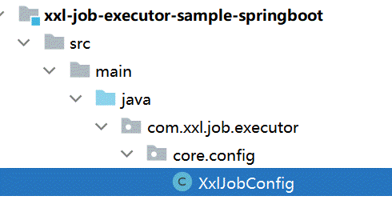

# 一、Session总结

session机制是一种服务器端的机制，服务器使用一种类似于散列表的结构（也可能就是使用散列表）来保存信息。

当程式需要为某个客户端的请求创建一个session的时候，服务器首先检查这个客户端的请求里是否已包含了一个session标识 - 称为session id，如果已包含一个session id则说明以前已为此客户端创建过session，服务器就按照session id把这个session检索出来使用（如果检索不到，可能会新建一个），如果客户端请求不包含session id，则为此客户端创建一个session并且生成一个和此session相关联的session id，session id的值应该是个既不会重复，session id将被在本次响应中返回给客户端保存。

按照我的理解，这只是一种变种的cookie

服务器是不会主动删除session的。但是为了避免浏览器直接关闭导致服务器端还没有收到删除session的行为，一般会给session设置一个过期时间。


具体可以参考：https://developer.aliyun.com/article/35461


# 二、前端id精度丢失问题

这是由于js本身对于long型数据的处理存在四舍五入的情况导致的

可以考虑在后端服务器中添加一个“转换器”来进行处理，将long型数据返回前端时转换为字符串，这样就可以避免精度的丢失

1. 首先添加一个转换器类

```java
JacksonObjectMapper类
    
    
    
import com.fasterxml.jackson.databind.DeserializationFeature;
import com.fasterxml.jackson.databind.ObjectMapper;
import com.fasterxml.jackson.databind.module.SimpleModule;
import com.fasterxml.jackson.databind.ser.std.ToStringSerializer;
import com.fasterxml.jackson.datatype.jsr310.deser.LocalDateDeserializer;
import com.fasterxml.jackson.datatype.jsr310.deser.LocalDateTimeDeserializer;
import com.fasterxml.jackson.datatype.jsr310.deser.LocalTimeDeserializer;
import com.fasterxml.jackson.datatype.jsr310.ser.LocalDateSerializer;
import com.fasterxml.jackson.datatype.jsr310.ser.LocalDateTimeSerializer;
import com.fasterxml.jackson.datatype.jsr310.ser.LocalTimeSerializer;
import java.math.BigInteger;
import java.time.LocalDate;
import java.time.LocalDateTime;
import java.time.LocalTime;
import java.time.format.DateTimeFormatter;
import static com.fasterxml.jackson.databind.DeserializationFeature.FAIL_ON_UNKNOWN_PROPERTIES;

/**
 * 对象映射器:基于jackson将Java对象转为json，或者将json转为Java对象
 * 将JSON解析为Java对象的过程称为 [从JSON反序列化Java对象]
 * 从Java对象生成JSON的过程称为 [序列化Java对象到JSON]
 */
public class JacksonObjectMapper extends ObjectMapper {

    public static final String DEFAULT_DATE_FORMAT = "yyyy-MM-dd";
    public static final String DEFAULT_DATE_TIME_FORMAT = "yyyy-MM-dd HH:mm:ss";
    public static final String DEFAULT_TIME_FORMAT = "HH:mm:ss";

    public JacksonObjectMapper() {
        super();
        //收到未知属性时不报异常
        this.configure(FAIL_ON_UNKNOWN_PROPERTIES, false);

        //反序列化时，属性不存在的兼容处理
        this.getDeserializationConfig().withoutFeatures(DeserializationFeature.FAIL_ON_UNKNOWN_PROPERTIES);


        SimpleModule simpleModule = new SimpleModule()
                .addDeserializer(LocalDateTime.class, new LocalDateTimeDeserializer(DateTimeFormatter.ofPattern(DEFAULT_DATE_TIME_FORMAT)))
                .addDeserializer(LocalDate.class, new LocalDateDeserializer(DateTimeFormatter.ofPattern(DEFAULT_DATE_FORMAT)))
                .addDeserializer(LocalTime.class, new LocalTimeDeserializer(DateTimeFormatter.ofPattern(DEFAULT_TIME_FORMAT)))

                .addSerializer(BigInteger.class, ToStringSerializer.instance)
                .addSerializer(Long.class, ToStringSerializer.instance)
                .addSerializer(LocalDateTime.class, new LocalDateTimeSerializer(DateTimeFormatter.ofPattern(DEFAULT_DATE_TIME_FORMAT)))
                .addSerializer(LocalDate.class, new LocalDateSerializer(DateTimeFormatter.ofPattern(DEFAULT_DATE_FORMAT)))
                .addSerializer(LocalTime.class, new LocalTimeSerializer(DateTimeFormatter.ofPattern(DEFAULT_TIME_FORMAT)));

        //注册功能模块 例如，可以添加自定义序列化器和反序列化器
        this.registerModule(simpleModule);
    }
}

```

2. 然后在WebMvcConfig类中将这个转换器添加进去，简单来说就是在这个类中重写一个方法，主要用于将这个转换器添加到转换器管理池子当中，并且注意要将这个转换器放到第一个位置，因为转换的过程是按照顺序来的，谁在前，谁优先级高

   ```java
       @Override
       protected void extendMessageConverters(List<HttpMessageConverter<?>> converters) {
           MappingJackson2HttpMessageConverter messageConverter = new MappingJackson2HttpMessageConverter();
           messageConverter.setObjectMapper(new JacksonObjectMapper());
           converters.add(0,messageConverter);
       }
   ```

# 三、Apache ECharts

Apache ECharts 是一款基于 Javascript 的数据可视化图表库，提供直观，生动，可交互，可个性化定制的数据可视化图表。

官网地址：https://echarts.apache.org/zh/index.html

# 四、Apache POI 

Apache POI 是一个处理Miscrosoft Office各种文件格式的开源项目。简单来说就是，我们可以使用 POI 在 Java 程序中对Miscrosoft Office各种文件进行读写操作

Apache POI的maven坐标：

```yaml
<dependency>
    <groupId>org.apache.poi</groupId>
    <artifactId>poi</artifactId>
    <version>3.16</version>
</dependency>
<dependency>
    <groupId>org.apache.poi</groupId>
    <artifactId>poi-ooxml</artifactId>
    <version>3.16</version>
</dependency>

```


# 五、视频断点续传

使用分布式文件系统minio

需要在项目中引入依赖

```xml
<dependency>
    <groupId>io.minio</groupId>
    <artifactId>minio</artifactId>
    <version>8.4.3</version>
</dependency>
<dependency>
    <groupId>com.squareup.okhttp3</groupId>
    <artifactId>okhttp</artifactId>
    <version>4.8.1</version>
</dependency>

```


1. 首先要求前端进行分块

2. 检查这个文件在数据库和文件系统中是否存在，这里用到的是分布式文件系统minio

   ```java
   public RestResponse<Boolean> checkFile(String fileMd5) {
           String chunkFileFolderPath = getChunkFileFolderPath(fileMd5);
           //检查数据库是否存在
           MediaFiles mediaFiles = mediaFilesMapper.selectById(fileMd5);
           if (mediaFiles != null) {//证明在数据库中存在
               String bucket = mediaFiles.getBucket();
               String filePath = mediaFiles.getFilePath();
               GetObjectResponse response = null;
               try {
                   //检查minio是否存在
                   GetObjectArgs getObjectArgs = GetObjectArgs.builder().bucket(bucket).object(filePath).build();
                   response = minioClient.getObject(getObjectArgs);
                   if (response != null) {
                       return RestResponse.success(true);
                   } else {
                       log.info("文件在minio中不存在！");
                   }
               } catch (Exception e) {
                   e.printStackTrace();
                   log.info("检查过程出现意外错误！");
               } finally {
                   if (response != null) {
                       try {
                           response.close();
                       } catch (IOException e) {
                           e.printStackTrace();
                           log.info("response没有正常关闭！");
                       }
                   }
               }
           }
           //todo 如果在数据库中没有，但是在minio中存在又要怎么判断，这个时候应该将什么信息添加到我们的数据库中
   
           return RestResponse.success(false);
       }
   ```

   

3. 然后传递到暂存区。这个时候如果需要进行断点续传，肯定是要求要分块，检查分块在minio的暂存文件夹内是否存在

   ```java
    public RestResponse<Boolean> checkChunk(String fileMd5, int chunkIndex) {
           //得到分块文件目录
           String chunkFileFolderPath = getChunkFileFolderPath(fileMd5);
           //得到分块文件的路径
           String chunkFilePath = chunkFileFolderPath + chunkIndex;
           //文件流
           InputStream fileInputStream = null;
           try {
               fileInputStream = minioClient.getObject(
                       GetObjectArgs.builder()
                               .bucket(video)
                               .object(chunkFilePath)
                               .build());
   
               if (fileInputStream != null) {
                   //分块已存在
                   return RestResponse.success(true);
               } else {
                   log.info("分块不存在");
               }
           } catch (Exception e) {
               e.printStackTrace();
               log.info("检查过程出现意外错误！");
           } finally {
               if (fileInputStream != null) {
                   try {
                       fileInputStream.close();
                   } catch (Exception e) {
                       e.printStackTrace();
                       log.info("fileInputStream没有正确关闭");
                   }
               }
           }
           //分块未存在
           return RestResponse.success(false);
       }
   ```

   

4. 将暂存区写入磁盘下，此时还是分块，并没有合并

   ```java
   @Override
       public RestResponse uploadChunk(String fileMd5, int chunk, String localFilePath) {
   
   //        //分块文件的路径
   //        String chunkFilePath = getChunkFileFolderPath(fileMd5) + chunk;
   //        //获取mimeType
   //        String mimeType = getMimeType(null);
   //        //将分块文件上传到minio
   //        boolean b = addMediaFilesToMinIO(localFilePath, mimeType, video, chunkFilePath);
   //        if(!b){
   //            return RestResponse.validfail(false,"上传分块文件失败");
   //        }
   //        //上传成功
   //        return RestResponse.success(true);
   
           String chunkFileFolderPath = getChunkFileFolderPath(fileMd5);
           //得到分块文件的路径
           String chunkFilePath = chunkFileFolderPath + chunk;
   
           //获取文件类型
           String mimeType = getMimeType(null);
   
           try {
               //将文件存储至minIO
               boolean tag = addMediaFilesToMinIO(localFilePath, mimeType, video, chunkFilePath);
               if (!tag) {
                   return RestResponse.validfail(false, "上传分块失败");
               }
               return RestResponse.success(true);
           } catch (Exception ex) {
               ex.printStackTrace();
               log.debug("上传分块文件:{},失败:{}", chunkFilePath, ex.getMessage());
           }
           return RestResponse.validfail(false, "上传分块失败");
   
       }
   ```

   

5. 将分块进行合并

   ​	
   
   

## spring boot对于大文件上传也有限制

需要改变参数，将大小限制提高

```yaml
spring:
    servlet:
        multipart:
           enabled: true #是否启用http上传处理
           max-file-size: 10MB #设置单个文件最大长度
           max-request-size: 100MB #最大请求文件的大小

```


## nginx对于大文件上传有限制

需要加入大文件上传的参数

```
 # 设置大文件上传的参数
        client_max_body_size     10m;
        client_header_timeout    5m;
        client_body_timeout      5m;
        proxy_connect_timeout     6000s;
        proxy_read_timeout      5m;
        proxy_send_timeout      5m;
```

记得加载server的server_name的下面。不要放在http的下面

```nginx
server {
        listen       80;
        server_name  www.51xuecheng.cn localhost;

        # 设置大文件上传的参数
        client_max_body_size     10m;
        client_header_timeout    5m;
        client_body_timeout      5m;
        proxy_connect_timeout     6000s;
        proxy_read_timeout      5m;
        proxy_send_timeout      5m;

        #rewrite ^(.*) https://$server_name$1 permanent;
        #charset koi8-r;
        ssi on;
        ssi_silent_errors on;
        #access_log  logs/host.access.log  main;

       

        location / { 
            alias   D:/Project/GiteeProject/xuechengzaixian/xc-ui-pc-static-portal/;
            index  index.html index.htm;
        }
        #api
        location /api/ {
                proxy_pass http://gatewayserver/;
        } 
        #openapi
        location /open/content/ {
                proxy_pass http://gatewayserver/content/open/;
        } 
        location /open/media/ {
                proxy_pass http://gatewayserver/media/open/;
        } 

}
```


## 视频转码

有的时候需要考虑将视频从avi模式转为MP4模式，这个时候一版会用到任务调度的中间件xxl-job

此时，对于多并发编程，可以考虑抓换文件的时候，采用线程池，用多个线程完成操作。下面的代码是使用了xxl-job的注解，让中间件可以每个一段时间执行一次。用到了多线程，每个线程完成一个任务，并且还有分布式锁控制了任务的重复执行。	

```java
@XxlJob("videoJobHandler")
    public void videoJobHandler() throws Exception {

        // 分片参数
        int shardIndex = XxlJobHelper.getShardIndex();
        int shardTotal = XxlJobHelper.getShardTotal();
        int size = 0;
        List<MediaProcess> mediaProcessList = null;
        //确定线程池的数量，自身的cpu核数
        try {
            int processors = Runtime.getRuntime().availableProcessors();//获取cpu核心数
            //查询处理的任务
            mediaProcessList = mediaFileProcessService.getMediaProcessList(shardIndex, shardTotal, processors);
            size = mediaProcessList.size();
            log.debug("取出待处理视频任务{}条", size);
            if (size < 0) {
                return;
            }

        } catch (Exception e) {
            e.printStackTrace();
            return;
        }

        ExecutorService threadPool = Executors.newFixedThreadPool(size);
        CountDownLatch countDownLatch = new CountDownLatch(size);

        mediaProcessList.forEach(mediaProcess -> {
            threadPool.execute(() -> {
                File file = null;
                File local_temp_mp4 = null;
                try {
                    Long id = mediaProcess.getId();
                    boolean startTask = mediaFileProcessService.startTask(id);
                    if (!startTask) {
                        log.error("抢占任务失败{}",id);
                        return;
                    }
                    String bucket = mediaProcess.getBucket();
                    String objectName = mediaProcess.getFilePath();
                    String fileId = mediaProcess.getFileId();
                    //下载minio到本地的临时文件
                    file = mediaFileService.downloadFileFromMinIO(bucket, objectName);
                    //如果下载失败
                    if (file == null) {
                        log.error("视频下载出错，任务id：{}，bucket：{}，objectName:{}", id, bucket, objectName);
                        //保存失败的结果
                        mediaFileProcessService.saveProcessFinishStatus(id,"3",fileId,null,"视频下载出错");
                        return;
                    }
                    //拿到临时源文件的绝对路径
                    String video_path_temp = file.getAbsolutePath();


                    //转换后的mp4文件名称
                    String mp4_name = fileId + ".mp4";
                    local_temp_mp4 = null;
                    //创建一个转换后文件要存储的本例临时地址
                    try {
                        local_temp_mp4 = File.createTempFile("minio",".mp4");
                    } catch (IOException e) {
                        e.printStackTrace();
                        log.error("创建临时文件失败",e.getMessage());
                        mediaFileProcessService.saveProcessFinishStatus(id,"3",fileId,null,"创建临时文件失败");
                        return;
                    }
                    String mp4_path = local_temp_mp4.getAbsolutePath();

                    Mp4VideoUtil videoUtil = new Mp4VideoUtil(ffmpegPath, video_path_temp, mp4_name, mp4_path);
                    String result = videoUtil.generateMp4();//转换后的结果
                    if (!result .equals("success") ) {
                        log.error("视频转换失败，原因：{}",result);
                        mediaFileProcessService.saveProcessFinishStatus(id,"3",fileId,null,"视频转换失败");
                        return;
                    }
                    String url = getFilePathByMd5(fileId, ".mp4");
                    //将本地的转换后的临时文件上传到minio
                    boolean b = mediaFileService.addMediaFilesToMinIO(mp4_path, "video/mp4", bucket, url);
                    if(!b){
                        log.error("视频mp4上传失败，taskid：{}",id);
                        mediaFileProcessService.saveProcessFinishStatus(id,"3",fileId,null,"视频mp4上传失败");
                        return;
                    }
                    //获取url

                    mediaFileProcessService.saveProcessFinishStatus(id,"2",fileId,url,"保存任务成功");
                } catch (Exception e) {
                    e.printStackTrace();
                } finally {
                    //删除本地的临时文件
                    if(local_temp_mp4 != null){
                        local_temp_mp4.delete();
                    }
                    if (file != null) {
                        file.delete();
                    }
                    countDownLatch.countDown();
                }
            });
        });
        countDownLatch.await(30,TimeUnit.MINUTES);
        //关闭当前开启的线程池
        threadPool.shutdown();
    }

    private String getFilePathByMd5(String fileMd5, String fileExt) {
        return fileMd5.substring(0, 1) + "/" + fileMd5.substring(1, 2) + "/" + fileMd5 + "/" + fileMd5 + fileExt;
    }

```


# 六、分布式任务调度中间件xxl-job

这是一个spring boot程序，有时间可以研究一下源码

首先下载XXL-JOB

GitHub：https://github.com/xuxueli/xxl-job

码云：https://gitee.com/xuxueli0323/xxl-job

项目使用2.3.1版本： https://github.com/xuxueli/xxl-job/releases/tag/2.3.1

## 安装


使用IDEA打开解压后的目录


xxl-job-admin：调度中心

xxl-job-core：公共依赖

xxl-job-executor-samples：执行器Sample示例（选择合适的版本执行器，可直接使用）

  ：xxl-job-executor-sample-springboot：Springboot版本，通过Springboot管理执行器，推荐这种方式；

  ：xxl-job-executor-sample-frameless：无框架版本；

doc :文档资料，包含数据库脚本

根据里面的sql文件，执行相关的数据库脚本，在自己的数据库里面建立相关的表，因为xxl-job需要用到数据库的这些内容

完成后，也可以考虑docker镜像安装运行

```dockerfile
docker run --name xxl-job -e PARAMS="--spring.datasource.url=jdbc:mysql://mysql:3306/xxl_job_2.3.1?Unicode=true&characterEncoding=UTF-8&useSSL=true --spring.datasource.username=root --spring.datasource.password=mysql --xxl.admin.login=false" -p 8088:8080 --link mysql:mysql  -d xuxueli/xxl-job-admin:2.3.1

```

如下图：


访问：http://192.168.101.65:8088/xxl-job-admin/

账号和密码：admin/123456

如果无法使用虚拟机运行xxl-job可以在本机idea运行xxl-job调度中心。

## 使用

### **配置执行器**

下边配置执行器，执行器负责与调度中心通信接收调度中心发起的任务调度请求。

1、下边进入调度中心添加执行器


 

点击新增，填写执行器信息，appname是前边在nacos中配置xxl信息时指定的执行器的应用名。


添加成功：


 

2、首先在媒资管理模块的service工程添加依赖，在项目的父工程已约定了版本2.3.1

 

```xml
  <dependency>
    <groupId>com.xuxueli</groupId>
    <artifactId>xxl-job-core</artifactId>
</dependency>

```

3、在nacos下的media-service-dev.yaml下配置xxl-job

这一步是为了让自身的java执行器注册到xxl-job的调度中心去

 

```yaml
xxl:
  job:
    admin: 
      addresses: http://192.168.101.65:8088/xxl-job-admin
    executor:
      appname: media-process-service
      address: 
      ip: 
      port: 9999 #是执行器的端口，不一定是这个工程的端口。如果在一个机器上测试，一定要用不同的端口
      logpath: /data/applogs/xxl-job/jobhandler
      logretentiondays: 30
    accessToken: default_token

```

注意配置中的appname这是执行器的应用名，port是执行器启动的端口，如果本地启动多个执行器注意端口不能重复。

但是记住，我们的执行器开没有开始写呢，也就是即使调度了，但是我们要执行的逻辑还没有写呢！

4、配置xxl-job的执行器

将xxl-job示例工程下配置类拷贝到媒资管理的service工程下



拷贝至自己的执行器工程的配置类中；


 

到此完成媒资管理模块service工程配置xxl-job执行器，在xxl-job调度中心添加执行器，下边准备测试执行器与调度中心是否正常通信，因为接口工程依赖了service工程，所以启动媒资管理模块的接口工程。

启动后观察日志，出现下边的日志表示执行器在调度中心注册成功


同时观察调度中心中的执行器界面


在线机器地址处已显示1个执行器。


### 编写执行任务逻辑代码，执行任务

下边编写任务，参考示例工程中任务类的编写方法，如下图：


 这里面给出了我们编写时用到的注解，下面给出一个执行任务的例子：

```java
/**
 * @description 测试执行器
 * @author Mr.M
 * @date 2022/9/13 20:32
 * @version 1.0
 */
 @Component
 @Slf4j
public class SampleJob {

 /**
  * 1、简单任务示例（Bean模式）
  */
 @XxlJob("testJob")//这个注解就是制定了本次任务的名称，后面注册用得到
 public void testJob() throws Exception {
  log.info("开始执行.....");

 }

}

```

下边在调度中心添加任务，进入任务管理


点击新增，填写任务信息


然后就可以运行起来。

# 七、引入spring security

引入依赖

```xml
<dependency>
    <groupId>org.springframework.cloud</groupId>
    <artifactId>spring-cloud-starter-security</artifactId>
</dependency>
<dependency>
    <groupId>org.springframework.cloud</groupId>
    <artifactId>spring-cloud-starter-oauth2</artifactId>
</dependency>

```

```

```

​	

# 八、一些nginx的配置问题

这个问题来源于自己配置微信登录服务的时候产生的。微信服务要求给出一个重定向地址，我一直以为重定向地址是由微信服务自己进行调用，其实应该也不算是，至少不是微信的服务器调用重定向地址。微信服务会携带code和state返回原来的客户端请求地址，客户端会自动重定向到我们指定的重定向地址当中。

这个微信服务的重定向地址是谁调用的没有说明白真的给我带来了很大的困扰。

```nginx
 #配置前端微信二维码的转发设置
    server {
    listen       80;
    server_name  tjxt-user-t.itheima.net; 
    #charset koi8-r;
    ssi on;
    ssi_silent_errors on;
    #access_log  logs/host.access.log  main;
    location /xuecheng/{
        proxy_pass http://localhost:63070/;
        
    }
    # 下面的配置也是正确的
#     location /xuecheng/auth/wxLogin {
#         proxy_pass http://localhost:63070/auth/wxLogin;
#         proxy_set_header Host $host;
#         proxy_set_header X-Real-IP $remote_addr;
#         proxy_set_header X-Forwarded-For $proxy_add_x_forwarded_for;
#     }
}

```

首先举例，对于请求

```
http://tjxt-user-t.itheima.net/xuecheng/auth/wxLogin?code=0419fn000SbpSR1Tg73004bSag39fn0w&state=checkcode:61bf897bb8f04d76ad3845da29072bcb
```

首先这个tjxt-user-t.itheima.net回去本地的host文件寻找到这个ip地址，但是找到ip地址并不会将tjxt-user-t.itheima.net替换为ip地址，依旧保持原来的请求路径，只是知道了要去转发给那个ip而已。

之后这个请求就到达了nginx，对于server_name  tjxt-user-t.itheima.net; 指明了当前的服务器名称为tjxt-user-t.itheima.net也就匹配上了。

接下来就是nginx的内部路径匹配。

注意，对于路径匹配，如果仅仅只是对于路径中的部分进行匹配，比如/xuecheng/，一定记得有最后的`/`

没有这个符号是匹配不上的。并且转发的地址最后也要带上`/`

但是对于整个路径的匹配，比如/xuecheng/auth/wxLogin，最后的`/`才可以不带

如果对于 tjxt-user-t.itheima.net是在哪里匹配的有疑惑，解释一下，这个是指定了我们niginx服务器域名名称，是与nginx的服务器域名名称进行了匹配。

同一个nginx服务中，可以指定对各nginx服务器域名匹配。


# 九、针对打包问题的一些解决

如果想要打包的项目，比如说api项目依赖于service，但是service中是没有main方法的。这个时候你需要添加一段插件配置。本意就是让这个插件直接跳过对于service的main方法进行寻找。

```xml
    <build>
        <plugins>
            <plugin>
                <groupId>org.springframework.boot</groupId>
                <artifactId>spring-boot-maven-plugin</artifactId>
                <configuration>
                    <skip>true</skip>  
                </configuration>
            </plugin>
        </plugins>
    </build>
```

但是你要打包的文件是api，所以在api的pom文件当中需要添加下面的代码，需要指明的是，如果说有一个项目parent，他有好几个子微服务，比如checkcode、system、content；这几个微服务本身也有自己的api和service，下面的这段代码可以加入到api当中，也可以加入到这几个子微服务当中。但是一定别忘了没有main方法service的要加入上面的配置。对于parent，只需要指明自己的子微服务有那些就可以了，不需要配置build打包插件。

```xml
    <build>
        <finalName>${project.artifactId}-${project.version}</finalName>
        <plugins>
            <plugin>
                <groupId>org.springframework.boot</groupId>
                <artifactId>spring-boot-maven-plugin</artifactId>
                <version>${spring-boot.version}</version>
                <executions>
                    <execution>
                        <goals>
                            <goal>repackage</goal>
                        </goals>
                    </execution>
                </executions>
            </plugin>
        </plugins>
    </build>
```

对于parent需要指出自己的子模块有那些，也就是聚合一下。就像下面的代码一样

```xml
    <modules>
        <module>../xuecheng-plus-base</module>
        <module>../xuecheng-plus-checkcode</module>
        <module>../xuecheng-plus-gateway</module>
        <module>../xuecheng-plus-auth</module>
        <module>../xuecheng-plus-content</module>
        <module>../xuecheng-plus-learning</module>
        <module>../xuecheng-plus-media</module>
        <module>../xuecheng-plus-orders</module>
        <module>../xuecheng-plus-message-sdk</module>
        <module>../xuecheng-plus-search</module>
        <module>../xuecheng-plus-system</module>
    </modules>
```


# 十、蓝屏后虚拟机的端口外部无法访问的问题

主要是针对的centos的操作系统，我的宿主机windows每次蓝屏后，发现windows再也无法访问虚拟机的具体端口，除了22端口，也能互相ping通，但就是具体的其他端口无法访问。

解决方案：

1. 关闭防火墙

   ```
   查案状态
   systemctl status firewalld.service
   关闭防火墙
   systemctl stop firewalld.service
   永久关闭防火墙
   “systemctl disable firewalld.service”
   ```

   


2. 关闭SELinux机制，这个真的才是我虚拟机的问题所在。

```
要关闭 CentOS 上的 SELinux 机制，可以按照以下步骤进行操作：
先查看状态
sestatus


以 root 用户身份登录到 CentOS 系统。

打开 SELinux 配置文件 /etc/selinux/config，使用文本编辑器进行编辑，比如使用 vi 命令：

sudo vi /etc/selinux/config
在打开的文件中找到 SELINUX= 行，该行用于设置 SELinux 的模式。默认情况下，它可能设置为 enforcing（强制模式）或 permissive（宽容模式）。

将 SELINUX= 行的值修改为 disabled，表示禁用 SELinux。修改后的行应该如下所示：

SELINUX=disabled
保存文件并退出编辑器。

重新启动系统，以使 SELinux 的更改生效：


sudo reboot
系统重启后，SELinux 将被禁用。
请注意，禁用 SELinux 可能会降低系统的安全性。在禁用 SELinux 前，建议了解 SELinux 的工作原理和作用，确保你的系统在其他方面有适当的安全措施。
```

最好是配置完毕后进行重启。也可以采取不重启的办法`sudo setenforce 0`，输入这个命令，但应该没有用，因为我自己用的时候还是没有用，只能重启才能解决问题。

# 十一、部署

对于打包完成后的文件，可以验证。找到一个有main方法的jar文件，然后执行下面的命令

```
java -Dfile.encoding=utf-8  -jar xuecheng-plus-checkcode-0.0.1-SNAPSHOT.jar 
```

后买的jar文件可以更换。这里的Dfile.encoding=utf-8是为了防止中文乱码。


## 在linux上用docker运行java程序

用一个docker-compose来将jar打包成镜像。

1、编写Dockerfile文件

```dockerfile
FROM java:8u20
MAINTAINER docker_maven docker_maven@email.com
WORKDIR /ROOT
ADD xuecheng-plus-checkcode-0.0.1-SNAPSHOT.jar xuecheng-plus-checkcode.jar
CMD ["java", "-version"]
ENTRYPOINT ["java", "-Dfile.encoding=utf-8","-jar", "xuecheng-plus-checkcode.jar"]
EXPOSE 63075

```

2、创建镜像

  别忘了最后有一个`.`  代表的是dockerfile所在的目录；checkcode是镜像的名称，1.0是我们指定的版本号

```
JavaScript   docker build -t checkcode:1.0 .  
```

3、创建容器

```
docker run --name xuecheng-plus-checkcode -p 63075:63075 -idt checkcode:1.0
```


# 十二、优化接口

使用的是jmeter。

1. 日志的级别从debug改为info可以提升性能。
2. 对于开放接口可以考虑不使用网关中转。


# 十三、分布式锁redisson

引入依赖

```
<dependency>
    <groupId>org.redisson</groupId>
    <artifactId>redisson-spring-boot-starter</artifactId>
    <version>3.11.2</version>
</dependency>


```

他还有一个配置文件需要添加进去。singleServerConfig.yaml  在我们的文件夹下存在的有<a href="./singleServerConfig.yaml">点击查看</a>,如果redis存在密码别忘记了进行匹配

```
spring:
  redis:
    redisson:
      #配置文件目录
      config: classpath:singleServerConfig.yaml  
      #config: classpath:clusterServersConfig.yaml

```

需要注意的是，这个锁的续期是需要我们jvm在运行时才会续期，你如果debug挂起是看不到续期的，可以用Thread.sleep方法将我们的线程阻塞一下，这样也是可以续期的，如果就是在debug，长时间不动就不会续期了。

 


# 十四、JSR303校验

## 依赖

```xml
<dependency>
    <groupId>org.springframework.boot</groupId>
    <artifactId>spring-boot-starter-validation</artifactId>
</dependency>

```


上面是常用的注解，不过这种注解一般标在vo po等模型类的成员变量上面，会在进入controller层的时候被校验。之后还需要开启校验

## 开启校验

在controller方法中添加@Validated注解。除了这个注解用来开启，一般有可能根据新增或者修改，成员变量会有不同的要求，所以我们可以根据这些要求进行分组，

看下面的代码：@Validated就是开启检测注解，ValidationGroups.Inster.class指的是需要校验在新增情况下的各种成员变量需要满足参数要求。

```java
public CourseBaseInfoDto createCourseBase(@RequestBody @Validated({ValidationGroups.Inster.class}) AddCourseDto addCourseDto) 
```

```java
@Data
@ApiModel(value="AddCourseDto", description="新增课程基本信息")
public class AddCourseDto {

 @NotEmpty(message = "课程名称不能为空",groups = ValidationGroups.Inster.class)
 @NotEmpty(groups = {ValidationGroups.Update.class},message = "修改课程名称不能为空")
 @ApiModelProperty(value = "课程名称", required = true)
 private String name;

 @NotEmpty(message = "适用人群不能为空")
 @Size(message = "适用人群内容过少",min = 10)
 @ApiModelProperty(value = "适用人群", required = true)
 private String users;
}
```

根据上面的这个类，可以看到@NotEmpty就是校验的一些要求，可以根据注解进行变换，groups = ValidationGroups.Inster.class就是知名当前这个校验的条件是在那个分组下面，总共有下面三个分组：


 
