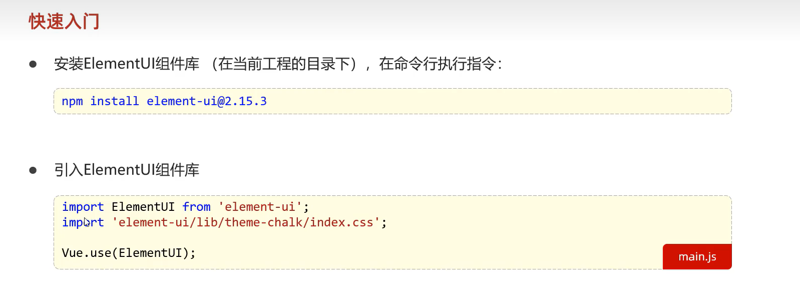

# VUE

1. 标签绑定数据v-bind，表单绑定数据v-model
2. 绑定事件v-on    v-on：click=“函数名”
3. v-if v-else-if v-else 判定条件
4. v-for便遍历渲染

## 生命周期


## 各部分文件夹及文件的含义


# 原生Ajax

这种繁琐的方式已经不再使用


现在主要使用Axios


# 下载饿了么组件库



# 路由


redirect：”/emp“   这个元素就是重定向，访问该地址的将会重新访问/emp地址

# Maven


## 安装maven


## 生命周期


# Springboot

在resultmap中<id column="id" property="id" />中column是数据库字段，property是当前字段，

```java
<resultMap id="UserMap" type="com.example.todoSpringboot.User">
        <id column="id" property="id" />
       
        <result column="name" property="name" />
        <result column="password" property="password" />
    </resultMap>
```


## 请求


**简单参数的接收**

在controller中，对于请求传过来的参数，有以下的形式可以得到：

比如传递的参数是

```json
{
	"name":"tom",
	"age":10
}
```

当参数名不一致时用这个@RequestParam注解，注意将传过来时的参数名放到name=“传过来参数名”中，这样springboot会自动将name映射到username。如果参数名一致时，可以省略注解


**针对实体对象**

只需要将请求的参数名和实体对象的属性名保持一致即可，会自动接收封装。不过我们在端程序的接收参数中直接指明类即可。


**针对复选框的请求**

1.使用数组方式


2.使用集合方式


小结


**日期参数的请求**

需要在注解中指定参数的格式


**json格式参数请求**


而且键名和属性名要保持一致

**路径参数请求**

既可以携带一个参数，也可以携带多个参数

## 响应


在企业项目的开发中，一般需要统一一下返回的格式


## 后端的三层架构


## 分层解耦

1. 基本概念

   

2. 入门

   

   这里注意两个注解，@Component （将该类交给容器管理）和@Autowired （自动注入）这两个就是对应着ioc和di，

3.  @Component 的衍生注解

   

4. IOC详解

   

   一般是默认的，最好根据规范来写，不要随便更改配置

5. DI详解

   有多个相同类型的包被控制反转，那么选择那个包注入呢

   

   容器管理这些实现类时，不显式指定名称是，默认的名称为实现类首字母小写。

   

   

# http

## 请求协议格式


## 响应协议格式


## 状态码


# TomCat


# Mybatis


## lombok依赖库


**如何在添加一条数据后拿到他的主键值**：使用@Options注解，useGeneratedKeys指明拿到主键值，keyProperty指明拿到的主键封装到对象的那个属性。


在进行查询操作时，模糊查询 '%#{name}%'其中#不应该出现在引号内，我们将#换为$符号，更改为 '%${name}%'

也可以使用sql语句中的concat函数进行字符串拼接，更改为concat('%',#{name},'%'),这就可以进行预编译了

## @param注解


**application中各种杂项**


## xml映射文件


## 动态SQL语句查询

有的时候我们指定的查询条件也许并没有全部指定，比如有时候根据账号密码进行查询，但是我们有时候又仅仅需要根据账号进行查询

主要是通过条件判断标签

1. 有一个<where></where>标签：判断后面的条件，如果有多余的and或者or就去掉多余的东西,如果全部条件都不成立，那么不会生成where语句。下面给出了if语句和where作用的实例

   <set></set>标签会自动去掉一些不合理的逗号

   

2. <foreach>标签

   

3. sql  include标签

   

   


# 文件上传

主要使用OSS对象进行，这是阿里云提供的


# 配置文件优化

yaml或者ym配置文件

下面是简化引入配置的操作


# JWT令牌

登录校验所需要的token由此产生


## JWT令牌使用步骤


解析令牌


# 统一拦截

## 1.过滤器Filter

### 快速入门

这个是javaweb提供的，并不属于spring项目，所以需要引入

Filter是javax.servlet下的

在springboot项目中还要加入一个注解@ServletComponentScan


### 拦截路径配置


### 过滤器链


### 手动将对象转为json格式

1. 引入阿里巴巴fastjson工具包

   

2. 调用方法JSONObject.toJSONString(object);

   

   将这个json文件通过响应返回，调用resp.getWriter().Writer()进行返回

   

## 2.拦截器Interceptor

这个是spring框架提供的

token的手动添加和过滤器手动将对象转为json格式是一致的

### 步骤


### 拦截路径


## 3.过滤器和拦截器同时存在


## 4.区别


# 异常处理

使用全局异常处理器


