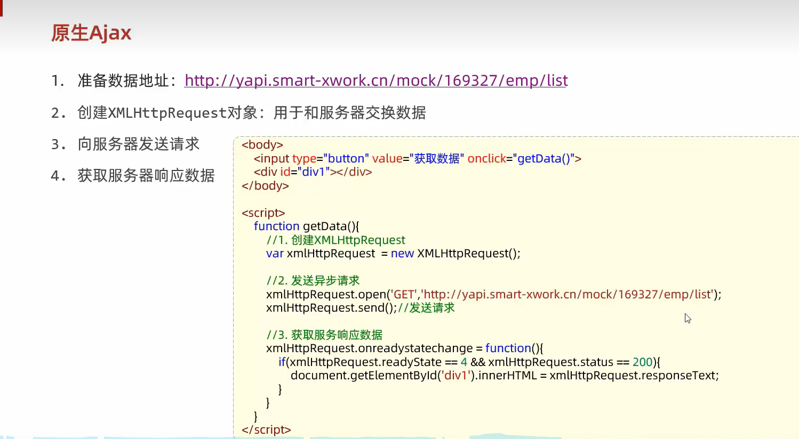

# VUE

1. 标签绑定数据v-bind，表单绑定数据v-model
2. 绑定事件v-on    v-on：click=“函数名”
3. v-if v-else-if v-else 判定条件
4. v-for便遍历渲染

## 生命周期


## 各部分文件夹及文件的含义


# 原生Ajax

这种繁琐的方式已经不再使用



现在主要使用Axios


# 下载饿了么组件库


# 路由


redirect：”/emp“   这个元素就是重定向，访问该地址的将会重新访问/emp地址

# Maven


## 安装maven


## 生命周期


## 坐标


# Maven高级

### 1. 分模块开发

就是这个工程也可以将另一个工程加入依赖


### 2. 继承与聚合

#### 1. 继承


**步骤**


1. 补充

   

2. 

3. 

#### 版本锁定功能


这里的dependencyManagement标签和dependencies标签是不一样的，是可以在pom中同时存在的，dependencyManagement指明是要管理那些依赖，dependencies指明加入那些依赖，是同级的关系。dependencyManagement仅仅只是管理版本，依旧需要在子工程加入dependencies指明需要的依赖，只是不需要指明版本号了

#### 2. 聚合

学习之前，我们平时打包，对于依赖的父工程或者自己建立的第三方工程，都是需要先将这些工程install到本地仓库下，否则会打包失败，但是这些工程可能有很多，那么就需要用到聚合。


###  3. 私服


#### 私服配置说明


访问私服：http://192.168.150.101:8081

访问密码：admin/admin


使用私服，需要在maven的settings.xml配置文件中，做如下配置：

1. 需要在 **servers** 标签中，配置访问私服的个人凭证(访问的用户名和密码)

   ```xml
   <server>
       <id>maven-releases</id>
       <username>admin</username>
       <password>admin</password>
   </server>
       
   <server>
       <id>maven-snapshots</id>
       <username>admin</username>
       <password>admin</password>
   </server>
   ```

   

2. 在 **mirrors** 中只配置我们自己私服的连接地址(如果之前配置过阿里云，需要直接替换掉)

   ```xml
   <mirror>
       <id>maven-public</id>
       <mirrorOf>*</mirrorOf>
       <url>http://192.168.150.101:8081/repository/maven-public/</url>
   </mirror>
   ```

   

3. 需要在 **profiles** 中，增加如下配置，来指定snapshot快照版本的依赖，依然允许使用

   ```xml
   <profile>
       <id>allow-snapshots</id>
           <activation>
           	<activeByDefault>true</activeByDefault>
           </activation>
       <repositories>
           <repository>
               <id>maven-public</id>
               <url>http://192.168.150.101:8081/repository/maven-public/</url>
               <releases>
               	<enabled>true</enabled>
               </releases>
               <snapshots>
               	<enabled>true</enabled>
               </snapshots>
           </repository>
       </repositories>
   </profile>
   ```

   

4. 如果需要上传自己的项目到私服上，需要在项目的pom.xml文件中，增加如下配置，来配置项目发布的地址(也就是私服的地址)

   ```xml
   <distributionManagement>
       <!-- release版本的发布地址 -->
       <repository>
           <id>maven-releases</id>
           <url>http://192.168.150.101:8081/repository/maven-releases/</url>
       </repository>
       
       <!-- snapshot版本的发布地址 -->
       <snapshotRepository>
           <id>maven-snapshots</id>
           <url>http://192.168.150.101:8081/repository/maven-snapshots/</url>
       </snapshotRepository>
   </distributionManagement>
   ```

   

5. 发布项目，直接运行 deploy 生命周期即可 (发布时，建议跳过单元测试)

 

#### 启动本地私服

1. 解压： apache-maven-nexus.zip

2. 进入目录： apache-maven-nexus\nexus-3.39.0-01\bin

3. 启动服务：双击 start.bat 
4. 访问服务：localhost:8081
5. 私服配置说明：将上述配置私服信息的 192.168.150.101 改为 localhost 


# Springboot

在resultmap中<id column="id" property="id" />中column是数据库字段，property是当前字段，

```java
<resultMap id="UserMap" type="com.example.todoSpringboot.User">
        <id column="id" property="id" />
       
        <result column="name" property="name" />
        <result column="password" property="password" />
    </resultMap>
```


## 请求


**简单参数的接收**


在controller中，对于请求传过来的参数，有以下的形式可以得到：

比如传递的参数是

这并不是json格式，在发送请求时会作为url的参数值加入进去

```json
{
	"name":"tom",
	"age":10
}
```

当参数名不一致时用这个@RequestParam注解，注意将传过来时的参数名放到name=“传过来参数名”中，这样springboot会自动将name映射到username。如果参数名一致时，可以省略注解。当我们省略时，有一种情况：当用get请求方式时，我们后端给出的接口为page(int page, int pageSize, String name),其实其中某些字段的值前端没有传回来也是可以的，并不是必须的，当你加入@RequestParam注解时，这个字段默认就是必须的，需要改为false才行


**针对实体对象**

只需要将请求的参数名和实体对象的属性名保持一致即可，会自动接收封装。不过我们在后端程序的接收参数中直接指明类即可。


**针对复选框的请求**

1.使用数组方式


2.使用集合方式


小结


**日期参数的请求**

需要在注解中指定参数的格式


**json格式参数请求**


而且键名和属性名要保持一致

注意：还有一种方式，就是使用map封装，例如下面的代码

```
{
	"name":"tom",
	"age":10
}
```

当这种json传递给后端，可以使用参数

```
public void post(@RequestBody Map map)
```

来进行封装，这个时候在map中就已经存在上面的json数据了，其中key值是name、age ；value值是tom、10

**路径参数请求**

既可以携带一个参数，也可以携带多个参数

## 响应


在企业项目的开发中，一般需要统一一下返回的格式


## 后端的三层架构


## 分层解耦

1. 基本概念

   

2. 入门

   

   这里注意两个注解，@Component （将该类交给容器管理）和@Autowired （自动注入）这两个就是对应着ioc和di，

3.  @Component 的衍生注解

   

4. IOC详解

   

   一般是默认的，最好根据规范来写，不要随便更改配置

5. DI详解

   有多个相同类型的包被控制反转，那么选择那个包注入呢

   

   容器管理这些实现类时，不显式指定名称是，默认的名称为实现类首字母小写。

   

   

# Bean管理

## 获取Bean对象

除了之前自动注入的方式，我们也可以手动获取Bean对象


## Bean作用域


设置作用域需要借助一个注解@Scope，如果想要延迟到第一次使用时才初始或bean对象，就需要添加一个注解@Lazy来进行设置


## 第三方Bean的注册和注入其他Bean


**如果在这个第三方Bean中需要注入其他的Bean对象，那么就需要以形参的方式**

```java
1. 首先定义一个普通的类
public calss User{
	private string name,age;
}

2.

@Configuration
public class CommonConfig{
	@Bean
	public SAXReader saxreader(User user ){
		return new SAXReader();;
	}
}

此时这个saxreader就已经注入了user这个Bean对象，大部分的Bean对象都是单例模式
```


### @Configuration注解

这个就是为了声明配置类，跟上面的第三方Bean联系起来的。当然Bean不仅仅针对第三方，我们自己定义的类也可以使用这种方式

@Configuration 详解
#### 1. 场景
新建两个 bean：user 和 pet。

若要将这两个 bean 的实例注入到容器之中，在曾经 spring 阶段我们的做法是使用 xml 进行配置。

在项目的 resource 文件夹下新建 bean.xml 并进行配置，配置内容如下：

```
<bean id="user01" class="xt.naru.learn.bean.User">  
    <property name="name" value="naru"></property>  
    <property name="age" value="21"></property>  
</bean>  

<bean id="cat" class="xt.naru.learn.bean.Pet">  
    <property name="name" value="tomcat"></property>  
</bean>
```

当项目需求越来越大时，我们时常会陷入 xml 配置地狱，因此为了解决这一问题， springboot 可以通过注解的方式进行实例注入而无需编写 xml。

#### 2. 使用

在 springboot 中我们不再使用 xml 进行配置。
修改为 新建配置类，并将配置类加上 Configuration 注解，在配置类中进行 bean 实例的注入。

代码如下：

```
@Configuration  
public class myconfig {  

    @Bean  
    public User user01(){  
        return new User("naru",21);  
    }  
    
    @Bean  
    public Pet tomcat(){  
        return new Pet("tomcat");  
    }  

}


```

这样就简化了操作，但是呢不好更改，因为每次修改这段代码中的数据都需要重新编译


## @Conditional注解


## 自定义starter


# http

## 请求协议格式


## 响应协议格式


## 状态码


# TomCat


# Mybatis


## lombok依赖库


**如何在添加一条数据后拿到他的主键值**：使用@Options注解，useGeneratedKeys指明拿到主键值，keyProperty指明拿到的主键封装到对象的那个属性。


在进行查询操作时，模糊查询 '%#{name}%'其中#不应该出现在引号内，我们将#换为$符号，更改为 '%${name}%'

也可以使用sql语句中的concat函数进行字符串拼接，更改为concat('%',#{name},'%'),这就可以进行预编译了

## @param注解


## application中各种杂项**


## xml映射文件


## 动态SQL语句查询

有的时候我们指定的查询条件也许并没有全部指定，比如有时候根据账号密码进行查询，但是我们有时候又仅仅需要根据账号进行查询

主要是通过条件判断标签

1. 有一个<where></where>标签：判断后面的条件，如果有多余的and或者or就去掉多余的东西,如果全部条件都不成立，那么不会生成where语句。下面给出了if语句和where作用的实例

   <set></set>标签会自动去掉一些不合理的逗号

   

2. <foreach>标签

   

3. sql  include标签

   

   


# 文件上传

主要使用OSS对象进行，这是阿里云提供的


# 配置文件优化

yaml或者ym配置文件

配置会被执行的优先级 properties > yml > yaml

下面是简化引入配置的操作


除了上面的三种配置文件进行配置，我们还有下面的几种配置方法


对于Java系统属性和命令行参数这两种方式进行配置，后者的优先级更高

当项目打包上线如何更改简单配置呢？可以通过下面的那种命令行方式进行简单的配置， 注意通过命令行可以同时指定Java系统属性和命令行参数，但是产生冲突时，依旧是按照上面所说的优先级进行执行


那么对于上面三种配置文件和下面两种系统命令行参数配置来说，优先级为配置文件低于参数配置

# JWT令牌

登录校验所需要的token由此产生


## JWT令牌使用步骤


解析令牌


# 统一拦截

## 1.过滤器Filter

### 快速入门

这个是javaweb提供的，并不属于spring项目，所以需要引入

Filter是javax.servlet下的

在springboot项目中还要加入一个注解@ServletComponentScan


### 拦截路径配置


### 过滤器链


### 手动将对象转为json格式

1. 引入阿里巴巴fastjson工具包

   

2. 调用方法JSONObject.toJSONString(object);

   

   将这个json文件通过响应返回，调用resp.getWriter().Writer()进行返回

   

## 2.拦截器Interceptor

这个是spring框架提供的

token的手动添加和过滤器手动将对象转为json格式是一致的

### 步骤


### 拦截路径


## 3.过滤器和拦截器同时存在


## 4.区别


# 异常处理

使用全局异常处理器


# 事务管理

主要是使用@Transactional注解


关于这个注解有一个日志开关，开启事务管理日志，在配置文件中配置


## 细节

### rollbackFor属性


### propagation属性


 

# AOP

## 快速入门


## 核心概念


## 执行流程


代理对象就是为了增强原来函数的功能，简单来说代理对象也只是增加了起始时间和结束时间的记录而已


## 通知类型


### 抽取切入点表达式


## 通知的执行顺序


## 切入点表达式


### 1. execution表达式


注意例子中的impl不可以省略，前面的总结没有写，这里指定表达式的时候是不可以省略的，表明是实现类


### annoation表达式

这是一种注解匹配表达式，是按照注解进行匹配的，要求原来的方法是要有标记的注解，还需要自己自创注解，个人感觉一般不要使用，比较麻烦


## 连接点


